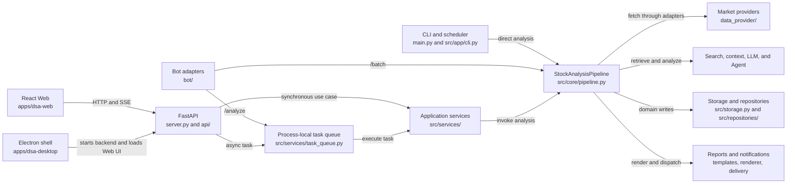
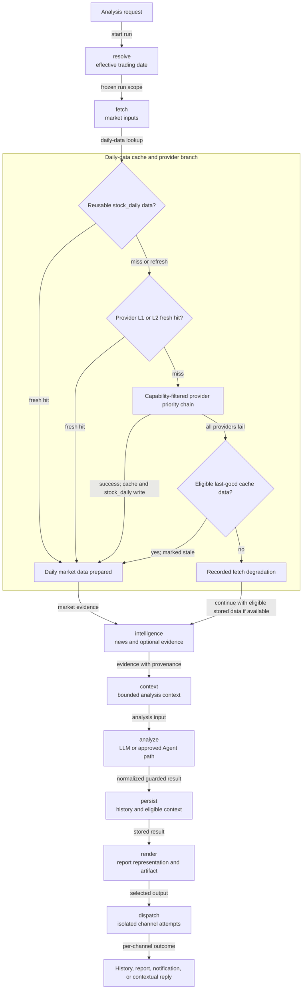

# StockPulse Architecture Overview

- Status: `Living`
- Last verified: 2026-07-21
- Scope: current technical component boundaries, process entrypoints, and analysis data flow

This document is the technical view of the current implementation. For
stakeholder capabilities and value flow, start with the
[business architecture](business-architecture.md). This document is not an API
specification or a product roadmap. Durable design rationale belongs in the
[ADR registry](adr/README.md); focused contracts remain authoritative for their
specific mechanics.

## View Boundary

| View | Answers | Includes |
| --- | --- | --- |
| [Business architecture](business-architecture.md) | Who receives value, what capabilities participate, and how an intent becomes an outcome | Stakeholders, capabilities, and the business value flow |
| Technical architecture (this document) | How the current repository executes and connects those capabilities | Entrypoints, module ownership, process modes, data paths, persistence, and runtime constraints |

Reliability mechanisms such as runtime guards, cache layers, provider health,
and circuit control belong in this technical view or a focused technical
contract. They are represented in the business view only by the outcome they
protect, not as business capabilities.

## Technical System At A Glance



Edges in this component view mean caller to dependency; they do not add a
second arrow for the return value. The directional stage and fallback flow is
shown below.

The canonical pipeline stage vocabulary is:

```text
resolve -> fetch -> intelligence -> context -> analyze -> persist -> render -> dispatch
```

## Entrypoints And Process Modes

| Entrypoint | Responsibility | Important boundary |
| --- | --- | --- |
| `main.py` | Process bootstrap, analysis and scheduling coordination, optional API serving, Bot stream startup, and compatibility exports | Runtime helpers and direct analysis remain here; parsing and mode dispatch are rebound from `src/app/cli.py` to preserve the existing import surface. |
| `src/app/cli.py` | CLI argument parsing and mode dispatch | Dispatches through `main.py` runtime helpers; it does not own a second analysis or service lifecycle. |
| `server.py` | Direct ASGI/uvicorn entry | Installs `ApplicationServices` and exports the FastAPI application; it does not start Bot stream clients. |
| `api/app.py` | FastAPI factory and lifespan | Owns auth/CORS/errors, routes, static Web hosting, `RuntimeSchedulerService`, and app-scoped `SystemConfigService`. |
| `bot/` | Platform adapters, dispatcher, and commands | Bot `/analyze` submits to the shared process-local queue. Stream clients are started by `main.py`; Bot webhooks are not FastAPI routes. |
| `apps/dsa-web/` | React/Vite product client | Calls `/api/v1` and observes analysis state through polling and task SSE. The production build is served by FastAPI. |
| `apps/dsa-desktop/` | Electron packaging and desktop process coordination | Starts the packaged or local Python backend, waits for `/api/health`, then loads the FastAPI-hosted Web UI. |

## Ownership Boundaries

| Area | Owns | Does not own |
| --- | --- | --- |
| `src/application_services.py` | Lazy access to Config, DatabaseManager, SearchService, and AnalysisTaskQueue plus explicit injection | Full dependency injection for every caller; adoption is currently incremental. |
| `src/services/` | Application use cases, task queue adapter, scheduling, analysis, history, portfolio, alerts, intelligence, and rendering services | HTTP transport schemas or provider-specific normalization. |
| `src/core/pipeline.py` and `src/core/stages/` | Analysis orchestration, typed stage outcomes, analysis stages, rendering, and dispatch sequencing | Transport lifecycle or persistent query APIs. |
| `data_provider/` | Market/provider adapters, capability routing, normalization, layered daily caching, priority fallback, health, and circuit control | Product task lifecycle or report presentation. |
| `src/search_service.py` and intelligence/context services | News and intelligence retrieval, context assembly, and source diagnostics | Market-price provider ownership or HTTP presentation. |
| `src/agent/` and `src/llm/` | Native Agent execution, tools, skills, conversation/runtime contracts, and model invocation adapters | Provider configuration source of truth, task lifecycle, or public report persistence. |
| `src/schemas/` | Internal analysis and domain contracts | HTTP request/response DTOs, which live in `api/v1/schemas/`. |
| `src/storage.py`, `src/repositories/`, `src/migrations/` | ORM/database lifecycle, domain persistence adapters, and ordered schema migrations | Pipeline sequencing or transport behavior. |
| `api/` | HTTP routing, middleware, lifespan, transport schemas, SSE and static asset delivery | A second business lifecycle or task status authority. |
| Report and notification paths | `src/schemas/report_schema.py`, `src/services/report_renderer.py`, `templates/`, `src/core/stages/delivery.py`, and notification modules | A `src/reports/` package; no such package exists in the current tree. |

## Analysis Execution Paths

### CLI And Scheduler

```text
main.py
  -> StockAnalysisPipeline.run()
  -> per-stock processing and pipeline stages
```

CLI and scheduled work can use the pipeline's own bounded per-stock concurrency.
This lane is distinct from the API/Bot task lifecycle.

### API And Bot Queue

```text
API POST /api/v1/analysis/analyze with async_mode=true or Bot /analyze
  -> AnalysisTaskQueue
  -> TaskCommand / TaskRunContext
  -> AnalysisService.analyze_stock()
  -> StockAnalysisPipeline.process_single_stock()
  -> polling, SSE, history, or contextual Bot notification
```

The queue is a singleton authority inside one process. The API's synchronous
mode calls `AnalysisService` directly, and Bot `/batch` creates a pipeline in a
background thread; neither path participates in the queue lifecycle. The queue
is not an external broker, durable scheduler, or multi-worker coordination
service. See
[ADR-004](adr/ADR-004-process-local-task-execution-authority.md) and the
[task execution contract](task-execution-contract.md).

### Direct API Services

Some synchronous endpoints call focused application services directly. The queue
is used for background analysis lifecycle, not as a universal service bus.

## Canonical Analysis Data Flow



The diagram uses one-way, labeled edges. A cache hit bypasses provider calls;
a cache miss enters the configured provider chain; an eligible stale candidate
from the memory or persistent cache is considered only after every provider
fails. With no eligible stale entry, the
`fetch` stage records a typed degradation and the Pipeline may continue with
eligible data already in storage; later stages still surface insufficient data
rather than manufacturing evidence. Provider capability, priority, health,
circuit, cache freshness, and stale-window rules are defined in
[data-source stability](data-source-stability.md) and
[ADR-005](adr/ADR-005-provider-fallback-and-circuit-control.md).

| Stage | Current responsibility | Primary owners |
| --- | --- | --- |
| `resolve` | Resolve and freeze the effective trading date used by resume and history lookup for one stock run. | `src/core/pipeline.py`, market-time and history services |
| `fetch` | Prepare daily, realtime, chip, fundamental, market-phase, and market-structure inputs through database/cache/provider paths. | `data_provider/`, `src/storage.py`, market services |
| `intelligence` | Retrieve fresh or persisted news, social sentiment, and other optional intelligence evidence. | search and intelligence services |
| `context` | Assemble bounded historical, request, and prompt context with provenance and quality state. | analysis context services and schemas |
| `analyze` | Execute normal LLM analysis or the approved Agent path, then normalize and guard the result. | `src/analyzer.py`, `src/analyzer_parts/`, `src/llm/`, `src/agent/` |
| `persist` | Store analysis history and its eligible context snapshot. | `src/repositories/`, `src/storage.py` |
| `render` | Generate the selected report representation and persist local report artifacts. | report schema, renderer, templates, delivery stage |
| `dispatch` | Isolate notification and contextual-reply attempts across configured delivery channels. | delivery stage and notification modules |

## Runtime Constraints

- The [composition root](adr/ADR-003-application-services-composition-root.md)
  is a compatibility-preserving seam, not proof that every dependency is already
  injected through one object.
- The task authority is process-local. Durable recovery or multi-worker state
  requires a new decision and implementation.
- Agent production assembly is Native-only. PydanticAI is an optional Single RUN
  test/evidence POC with no config, environment, API, Web, Desktop, or Bot
  selector and no runtime fallback. See [ADR-001](architecture/ADR-001-agent-runtime.md)
  and [ADR-002](architecture/ADR-002-pydanticai-runtime-reinstatement.md).
- Database schema changes run through the ordered migration registry. Startup
  compatibility work must not create a second schema-mutation path.
- Provider fallback keeps configured priority and market capability boundaries;
  health and circuit state are process-local observations. See
  [ADR-005](adr/ADR-005-provider-fallback-and-circuit-control.md).

## Focused Documentation

- [Business architecture](business-architecture.md)
- [Foundation pipeline and product layer](foundation-product-architecture.md)
- [ADR registry and process](adr/README.md)
- [Task execution contract](task-execution-contract.md)
- [Data-source stability and fallback](data-source-stability.md)
- [Analysis Context Pack](analysis-context-pack.md)
- [Agent stream events](agent-stream-events.md)
- [Database migrations](database-migrations.md)
- [Notification capabilities](notifications.md)
- [Bot commands and integration](bot-command_EN.md)
- [Desktop packaging](desktop-package.md)
- [Web UI foundation](web-ui-foundation.md)
- [API specification artifact](architecture/api_spec.json)
- [Behavior-preserving decomposition method](adr/ADR-006-behavior-preserving-module-decomposition.md)

## Keeping This Overview Current

Update this document when an entrypoint, ownership boundary, pipeline stage name,
data path, or process constraint changes. Update the business architecture when
a stakeholder, capability, outcome, or value-flow relationship changes. Use an
ADR when the reason or durable policy changes; use the focused living contract
when only detailed mechanics change.
