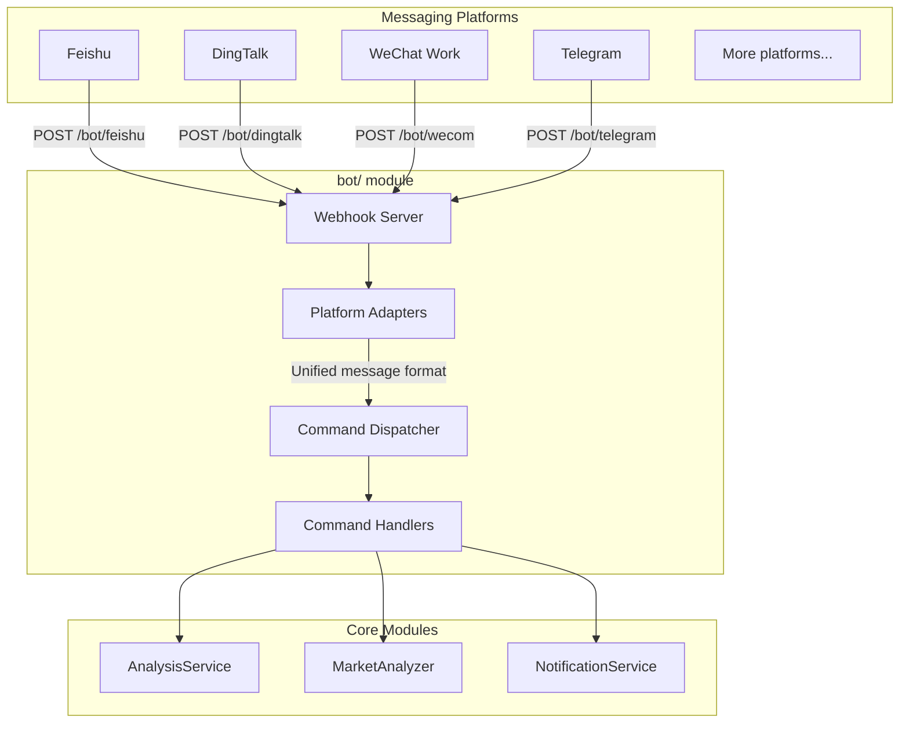

# Bot Integration Guide

This document covers the bot module architecture, supported commands, webhook routes, and how to configure platform integrations.

> **Glossary:** "Enterprise bot" in this context means a chatbot that receives commands via webhook from a messaging platform (Feishu / DingTalk / WeChat Work / Telegram) and calls the analysis pipeline to reply inline.

---

## 1. Architecture Overview



---

## 2. Directory Structure

```
bot/
├── __init__.py             # Module entry, exports main classes
├── models.py               # Unified message/response models
├── dispatcher.py           # Command dispatcher (core)
├── handler.py              # Webhook handler functions (one per platform)
├── commands/               # Command handlers
│   ├── __init__.py
│   ├── base.py             # Abstract base class for commands
│   ├── analyze.py          # /analyze — stock analysis
│   ├── ask.py              # /ask — single-turn question
│   ├── batch.py            # /batch — batch watchlist analysis
│   ├── chat.py             # /chat — multi-turn strategy chat
│   ├── market.py           # /market — market review
│   ├── help.py             # /help — help text
│   └── status.py           # /status — system status
└── platforms/              # Platform adapters
    ├── __init__.py
    ├── base.py             # Abstract base class for platforms
    ├── dingtalk.py         # DingTalk bot
    ├── dingtalk_stream.py  # DingTalk Stream bot
    └── feishu_stream.py    # Feishu (Lark) Stream bot
```

---

## 3. Core Abstractions

### 3.1 Unified Message Model (`bot/models.py`)

```python
@dataclass
class BotMessage:
    platform: str       # Platform ID: feishu / dingtalk / wecom / telegram
    user_id: str        # Sender ID
    user_name: str      # Sender display name
    chat_id: str        # Conversation ID (group or DM)
    chat_type: str      # Conversation type: group / private
    content: str        # Message text
    raw_data: Dict      # Raw request data (platform-specific)
    timestamp: datetime
    mentioned: bool = False  # Whether the bot was @-mentioned

@dataclass
class BotResponse:
    text: str
    markdown: bool = False  # Whether the response is Markdown
    at_user: bool = True    # Whether to @-mention the sender
```

### 3.2 Platform Adapter Base (`bot/platforms/base.py`)

```python
class BotPlatform(ABC):
    @property
    @abstractmethod
    def platform_name(self) -> str: ...

    @abstractmethod
    def verify_request(self, headers: Dict, body: bytes) -> bool:
        """Verify request signature (security check)"""
        ...

    @abstractmethod
    def parse_message(self, data: Dict) -> Optional[BotMessage]:
        """Parse platform message into unified format"""
        ...

    @abstractmethod
    def format_response(self, response: BotResponse, message: BotMessage) -> WebhookResponse:
        """Convert unified response to platform format"""
        ...
```

### 3.3 Command Base Class (`bot/commands/base.py`)

```python
class BotCommand(ABC):
    @property
    @abstractmethod
    def name(self) -> str: ...          # e.g. 'analyze'

    @property
    @abstractmethod
    def aliases(self) -> List[str]: ... # e.g. ['a', 'analyse']

    @property
    @abstractmethod
    def description(self) -> str: ...

    @property
    @abstractmethod
    def usage(self) -> str: ...

    @abstractmethod
    def execute(self, message: BotMessage, args: List[str]) -> BotResponse: ...
```

---

## 4. Supported Commands

| Command | Description | Example |
|---------|-------------|---------|
| `/analyze` | Analyze an A-share, Hong Kong, or US stock | `/analyze 600519`, `/analyze HK00700`, or `/analyze AAPL` |
| `/ask` | Analyze one or more stocks with Agent skills | `/ask HK00700` or `/ask 600519,AAPL trend` |
| `/batch` | Batch-analyze your configured watchlist | `/batch` |
| `/chat` | Multi-turn strategy chat (maintains conversation context) | `/chat` |
| `/market` | Market review (A-shares / US stocks) | `/market` |
| `/help` | Show help text | `/help` |
| `/status` | Show system status | `/status` |

> **Stock code formats:** A-shares accept 6-digit codes and common exchange forms (for example `600519` or `SH600519`). Hong Kong stocks accept a 5-digit code, an `HK` prefix, or a `.HK` suffix (for example `00700`, `HK00700`, or `00700.HK`) and are routed as canonical `HK00700`. US stocks use ticker symbols such as `AAPL` or `BRK.B`. `/analyze` and `/ask` return bilingual, actionable format guidance when a symbol is invalid or belongs to a market that these Bot commands do not currently support.

`/analyze` continues to submit through the shared `AnalysisTaskQueue`; market normalization does not create a separate Bot task lifecycle or change Task IDs, in-flight deduplication, statuses, or notification reply targets.

`/chat` detects A-share, Hong Kong, and US symbols in the first message and canonicalizes `00700.HK` / `hk00700` as `HK00700`. Follow-up questions in the same Bot conversation restore the active symbol; explicit phrases such as `switch to AAPL` change it, while comparison questions scope tools only to the symbols named in that turn. Agent prompts include the applicable market rules, quote currency, timezone, and market-specific fields. Missing provider or tool coverage is reported explicitly instead of being filled with A-share defaults.

---

## 5. `/status` and LLM configuration diagnostics

### Configuration precedence for readiness in `/status`

- The AI availability displayed by `/status` follows runtime precedence:
  - `LITELLM_CONFIG` (LiteLLM YAML)
  - `LLM_CHANNELS`
  - legacy provider keys (`GEMINI_API_KEY` / `OPENAI_API_KEY` / `ANTHROPIC_API_KEY` / `DEEPSEEK_API_KEY`)
- If the primary model (`LITELLM_MODEL` or `AGENT_LITELLM_MODEL`) has no configured source in the active layer, `/status` shows `AI 服务未配置` and keeps the explicit reason line.
- Runtime dependency constraint in this repository is `litellm>=1.80.10,!=1.82.7,!=1.82.8,<2.0.0`; current status semantics are aligned with this constraint.
- This diagnostic follows the same readiness rules as `GET /api/v1/system/config/setup/status` for LLM checks: channels/yaml are active higher priority than legacy keys, and no silent migration is performed when toggling modes.

### Fallback and migration boundary

- When `LITELLM_CONFIG` or `LLM_CHANNELS` is active, lower-priority legacy provider keys are ignored as the active source for that run (no silent downgrade).
- This change only improves diagnosis and does not perform automatic migration: legacy configuration values are not deleted or rewritten during startup or status collection.

### Official compatibility references (for triage)

- LiteLLM docs: https://docs.litellm.ai/
- LiteLLM OpenAI-compatible provider: https://docs.litellm.ai/docs/providers/openai_compatible
- OpenAI Chat API: https://platform.openai.com/docs/api-reference/chat
- DeepSeek API docs: https://api-docs.deepseek.com/
- Kimi Moonshot compatibility: https://platform.moonshot.ai/docs/guide/compatibility
- Gemini OpenAI compatibility: https://ai.google.dev/gemini-api/docs/openai
- Ollama API docs: https://github.com/ollama/ollama/blob/main/docs/api.md

## 6. Webhook Routes

Handler functions for each platform live in `bot/handler.py`.
These routes are **not yet wired** into the FastAPI application — you must mount them manually.

| Route | Method | Status | Notes |
|-------|--------|--------|-------|
| `/bot/dingtalk` | POST | **Ready** | `DingtalkPlatform` is registered in `ALL_PLATFORMS` |
| `/bot/feishu` | POST | Stream only | Use `feishu_stream.py`; no Webhook adapter in `ALL_PLATFORMS` |
| `/bot/wecom` | POST | Not implemented | Handler exists but no platform adapter |
| `/bot/telegram` | POST | Not implemented | Handler exists but no platform adapter |

To mount the DingTalk webhook in your FastAPI app:

```python
from bot.handler import handle_dingtalk_webhook

@app.post("/bot/dingtalk")
async def dingtalk_webhook(request: Request):
    headers = dict(request.headers)
    body = await request.body()
    return handle_dingtalk_webhook(headers, body)
```

---

## 7. Configuration

Add the following to your `.env`. Some of these bot-specific keys are already listed in `.env.example` (for example the DingTalk and Feishu app credentials), while others are not, so treat this section as a consolidated reference for bot setup:

```dotenv
# --- Bot general ---
BOT_ENABLED=false
BOT_COMMAND_PREFIX=/

# --- Feishu (Lark) bot ---
FEISHU_APP_ID=
FEISHU_APP_SECRET=
FEISHU_VERIFICATION_TOKEN=    # Event verification token
FEISHU_ENCRYPT_KEY=           # Encryption key (optional)

# --- DingTalk bot ---
DINGTALK_APP_KEY=
DINGTALK_APP_SECRET=

# --- WeChat Work bot (in development) ---
WECOM_TOKEN=
WECOM_ENCODING_AES_KEY=

# --- Telegram bot ---
TELEGRAM_BOT_TOKEN=           # Get from @BotFather
TELEGRAM_WEBHOOK_SECRET=      # Webhook secret token
```

---

## 7. Extending the Bot

### Adding a new platform adapter

1. Create a new file in `bot/platforms/`.
2. Subclass `BotPlatform` and implement `verify_request`, `parse_message`, `format_response`.
3. Mount the webhook route directly in your FastAPI app (for example in `api/app.py`) instead of `api/v1/router.py`, so the callback path stays `/bot/<platform>` rather than `/api/v1/bot/<platform>`.

### Adding a new command

1. Create a new file in `bot/commands/`.
2. Subclass `BotCommand` and implement the `execute` method.
3. Register the command in the dispatcher startup code.
