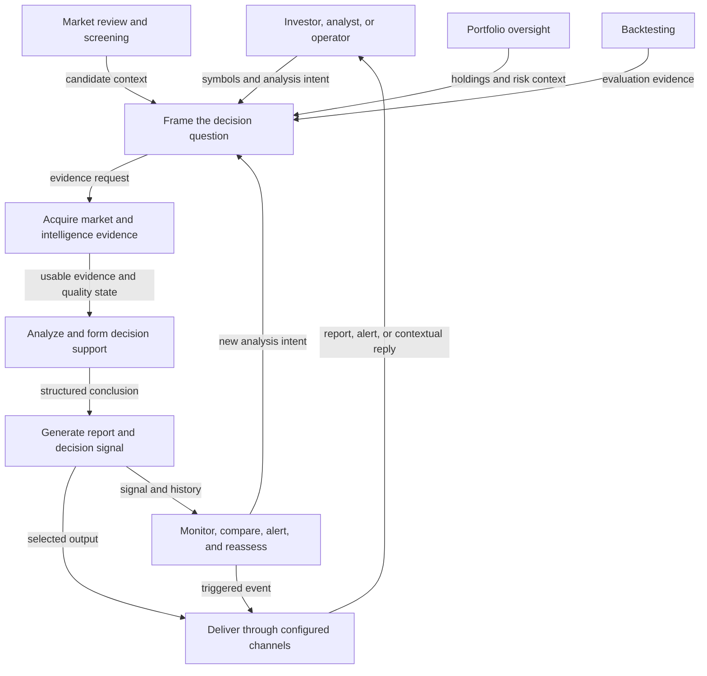

# StockPulse Business Architecture

- Status: `Living`
- Last verified: 2026-07-21
- Scope: stakeholder roles, business capabilities, outcomes, and value flow

This document is the business view of StockPulse. It explains who receives
value, which capabilities participate, and how an analysis request becomes a
decision-support outcome. It intentionally omits module paths, process
lifecycles, caches, circuit breakers, runtime guards, and deployment details.

## Choose The Right View

| View | Primary audience | Answers | Deliberately leaves out |
| --- | --- | --- | --- |
| Business architecture (this document) | Product, domain, operations, and business stakeholders | Who uses StockPulse, what they can accomplish, and how value moves between capabilities | Module ownership, runtime topology, cache layers, provider health, and deployment |
| [Technical architecture](architecture-overview.md) | Maintainers and contributors | Which entrypoints, services, modules, data paths, and runtime constraints implement the system | Product prioritization and a target-state roadmap |
| [Foundation pipeline and product layer](foundation-product-architecture.md) | Contributors and reviewers | Where a change belongs and which contract direction it must preserve | A user journey or a second runtime architecture |

All three views describe the current repository from different perspectives.
They are not separate systems, release tracks, or claims that every current
dependency is already isolated.

## Stakeholders And Outcomes

| Stakeholder | Starts with | Receives |
| --- | --- | --- |
| Investor or analyst | Symbols, markets, analysis intent, optional holdings context, and analysis preferences | Evidence-backed reports, decision signals, risks, and follow-up context |
| Portfolio operator | Holdings, account context, alerts, and reassessment intent | Portfolio visibility, risk cues, and traceable analysis history |
| System operator | Scheduling and delivery policy | Scheduled analysis outcomes, channel-level delivery status, and diagnostics |
| Contributor | A capability or contract change | The technical ownership and decision records needed to evolve it safely |

## Business Value Flow



Read every arrow as a forward handoff of the label shown. The reassessment edge
creates a new request; it is not a bidirectional call. The primary analysis
chain is therefore explicit:

```text
evidence acquisition -> analysis -> report and decision signal -> notification
```

Cache hits, provider fallback, stale-data degradation, persistence, rendering,
and per-channel failure isolation are implementation concerns. They are shown
in the [canonical technical data flow](architecture-overview.md#canonical-analysis-data-flow)
and detailed in [data-source stability](data-source-stability.md), rather than
being mixed into this business view.

## Capability Responsibilities

| Capability | Business responsibility | Relationship to the primary chain |
| --- | --- | --- |
| Analysis initiation | Capture a symbol set, market, mode, schedule, or conversational intent through the available product channels | Starts a new analysis request |
| Market and intelligence evidence | Supply price, fundamental, structure, news, sentiment, and other eligible evidence with quality context | Feeds analysis; unavailable optional evidence may degrade without stopping every run |
| Analysis and decision support | Combine technical, intelligence, model, and approved Agent paths into a guarded conclusion | Transforms evidence into a structured result |
| Reports and history | Render the conclusion for people and retain eligible analysis history | Produces the durable and readable outcome |
| Notifications and contextual replies | Deliver selected outcomes and expose channel-level attempts without making one channel the authority for the analysis | Distributes reports and alerts |
| Alerts and decision signals | Monitor eligible conditions, surface decision evidence, and support reassessment | Consumes results and can trigger delivery or a new intent |
| Portfolio management | Maintain holdings context and expose portfolio-level risk and decision support | Supplies context and consumes analysis outcomes |
| Backtesting | Evaluate strategy behavior against historical evidence | Supplies evaluation evidence; it is not a mandatory stage of every analysis run |
| Market review and screening | Summarize the market and identify candidate symbols | Supplies candidate context; it is not a hidden provider fallback path |

## View Boundary

This business view uses capability names and user-visible outcomes. Technical
mechanisms appear here only as a concise business guarantee, such as "usable
evidence and quality state" or "configured channels." Their implementation
belongs in the technical view and focused contracts:

- provider priority, fresh/stale caches, circuit state, and health scoring:
  [data-source stability](data-source-stability.md) and
  [ADR-005](adr/ADR-005-provider-fallback-and-circuit-control.md);
- task submission, observation, cancellation, and process-local authority:
  [task execution contract](task-execution-contract.md) and
  [ADR-004](adr/ADR-004-process-local-task-execution-authority.md);
- component ownership and the eight executable stages:
  [technical architecture](architecture-overview.md);
- contribution placement and evolution boundaries:
  [foundation pipeline and product layer](foundation-product-architecture.md).

## Keeping This View Current

Update this document when a stakeholder, business capability, outcome, or
value-flow relationship changes. Update the technical architecture when an
entrypoint, module owner, execution path, stage, or runtime constraint changes.
Use the ADR process when a durable boundary or policy changes.
