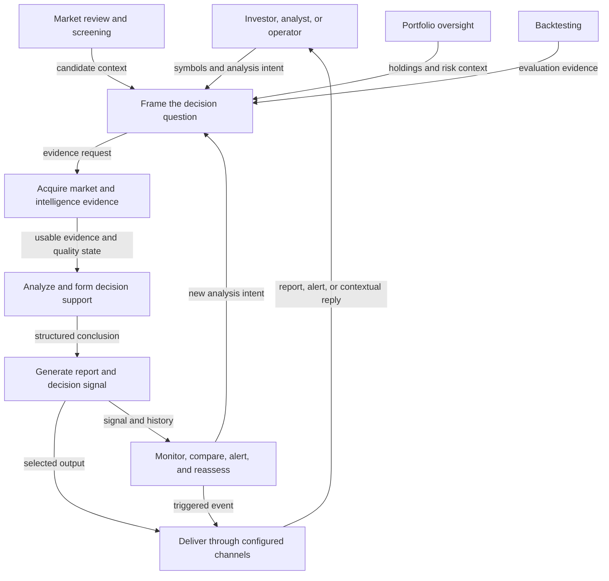
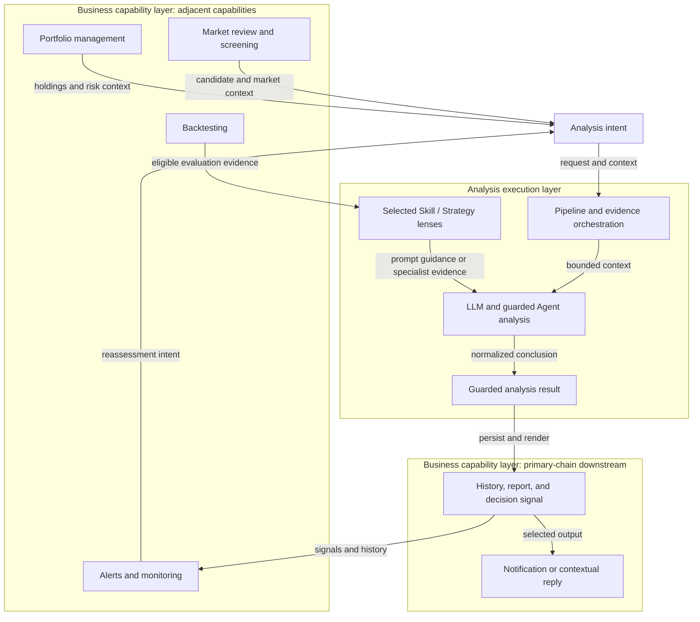

# StockPulse Business Architecture

- Status: `Living`
- Last verified: 2026-07-21
- Scope: stakeholder roles, business capabilities, outcomes, and value flow

This document is the business view of StockPulse. It explains who receives
value, which capabilities participate, and how an analysis request becomes a
decision-support outcome. It intentionally omits module paths, process
lifecycles, caches, circuit breakers, runtime guards, and deployment details.

## Choose The Right View

| View | Primary audience | Answers | Deliberately leaves out |
| --- | --- | --- | --- |
| Business architecture (this document) | Product, domain, operations, and business stakeholders | Who uses StockPulse, what they can accomplish, and how value moves between capabilities | Module ownership, runtime topology, cache layers, provider health, and deployment |
| [Technical architecture](architecture-overview.md) | Maintainers and contributors | Which entrypoints, services, modules, data paths, and runtime constraints implement the system | Product prioritization and a target-state roadmap |
| [Foundation pipeline and product layer](foundation-product-architecture.md) | Contributors and reviewers | Where a change belongs and which contract direction it must preserve | A user journey or a second runtime architecture |

All three views describe the current repository from different perspectives.
They are not separate systems, release tracks, or claims that every current
dependency is already isolated.

## Stakeholders And Outcomes

| Stakeholder | Starts with | Receives |
| --- | --- | --- |
| Investor or analyst | Symbols, markets, analysis intent, optional holdings context, and analysis preferences | Evidence-backed reports, decision signals, risks, and follow-up context |
| Portfolio operator | Holdings, account context, alerts, and reassessment intent | Portfolio visibility, risk cues, and traceable analysis history |
| System operator | Scheduling and delivery policy | Scheduled analysis outcomes, channel-level delivery status, and diagnostics |
| Contributor | A capability or contract change | The technical ownership and decision records needed to evolve it safely |

## Business Value Flow



Read every arrow as a forward handoff of the label shown. The reassessment edge
creates a new request; it is not a bidirectional call. The primary analysis
chain is therefore explicit:

```text
evidence acquisition -> analysis -> report and decision signal -> notification
```

Cache hits, provider fallback, stale-data degradation, persistence, rendering,
and per-channel failure isolation are implementation concerns. They are shown
in the [canonical technical data flow](architecture-overview.md#canonical-analysis-data-flow)
and detailed in [data-source stability](data-source-stability.md), rather than
being mixed into this business view.

## Responsibility Layers

The value flow can also be read through two responsibility lenses: analysis
execution and business capabilities, with the latter split between primary-chain
downstream and adjacent capabilities. These are responsibility and flow labels,
not claims of separate packages, services, deployables, or release units.



| Responsibility layer | Includes | Relationship to the primary chain | Boundary note |
| --- | --- | --- | --- |
| Analysis execution layer | Evidence and stage orchestration, normal LLM or approved Agent execution, and selected Skill/Strategy guidance or specialist evidence | Transforms an intent and evidence into a guarded analysis result | A runtime responsibility, not a new package or deployment boundary |
| Business capability layer: primary-chain downstream | Analysis history, report generation, decision-signal extraction, notification, and contextual replies | Consumes the analysis result through the current persist, render, and dispatch flow | The current Pipeline still composes these stages; the diagram does not claim they are already decoupled services |
| Business capability layer: adjacent | Backtesting, Portfolio, Alerts, Market Review, and screening | Supplies context or evaluation evidence, consumes results, or creates a new intent | These capabilities can interact with analysis but are not all direct Pipeline outputs or mandatory stages |

Skill/Strategy is therefore part of analysis execution, not a peer report or
notification product. An active skill can guide a normal analysis prompt; the
optional Multi-Agent specialist path can also produce skill opinions for the
decision evidence chain. The concrete loading, routing, execution, and synthesis
paths are shown in the
[technical Skill/Strategy flow](architecture-overview.md#product-skill-and-strategy-execution).

## Capability Responsibilities

| Capability | Business responsibility | Relationship to the primary chain |
| --- | --- | --- |
| Analysis initiation | Capture a symbol set, market, mode, schedule, or conversational intent through the available product channels | Starts a new analysis request |
| Market and intelligence evidence | Supply price, fundamental, structure, news, sentiment, and other eligible evidence with quality context | Feeds analysis; unavailable optional evidence may degrade without stopping every run |
| Analysis and decision support | Combine technical, intelligence, model, and approved Agent paths into a guarded conclusion | Transforms evidence into a structured result |
| Reports, history, and decision signals | Retain eligible analysis history, render the conclusion for people, and extract structured decision evidence | Produces durable and readable downstream outcomes |
| Notifications and contextual replies | Deliver selected outcomes and expose channel-level attempts without making one channel the authority for the analysis | Distributes reports and alerts |
| Alerts and monitoring | Monitor eligible conditions and support reassessment | Consumes signals or other eligible state and can trigger delivery or a new intent; it is adjacent to the primary chain |
| Portfolio management | Maintain holdings context and expose portfolio-level risk and decision support | Supplies context and consumes analysis outcomes as an adjacent capability |
| Backtesting | Evaluate strategy behavior against historical evidence | Can supply evaluation or weighting evidence; it is an adjacent capability, not a mandatory analysis stage |
| Market review and screening | Summarize the market and identify candidate symbols | Supplies candidate or market context as an adjacent capability; it is not a hidden provider fallback path |

## View Boundary

This business view uses capability names and user-visible outcomes. Technical
mechanisms appear here only as a concise business guarantee, such as "usable
evidence and quality state" or "configured channels." Their implementation
belongs in the technical view and focused contracts:

- provider priority, fresh/stale caches, circuit state, and health scoring:
  [data-source stability](data-source-stability.md) and
  [ADR-005](adr/ADR-005-provider-fallback-and-circuit-control.md);
- task submission, observation, cancellation, and process-local authority:
  [task execution contract](task-execution-contract.md) and
  [ADR-004](adr/ADR-004-process-local-task-execution-authority.md);
- component ownership and the eight executable stages:
  [technical architecture](architecture-overview.md);
- product Skill/Strategy loading, routing, evidence, and compatibility boundaries:
  [technical Skill/Strategy flow](architecture-overview.md#product-skill-and-strategy-execution);
- contribution placement and evolution boundaries:
  [foundation pipeline and product layer](foundation-product-architecture.md).

## Keeping This View Current

Update this document when a stakeholder, business capability, outcome, or
value-flow relationship changes. Update the technical architecture when an
entrypoint, module owner, execution path, stage, or runtime constraint changes.
Use the ADR process when a durable boundary or policy changes.
