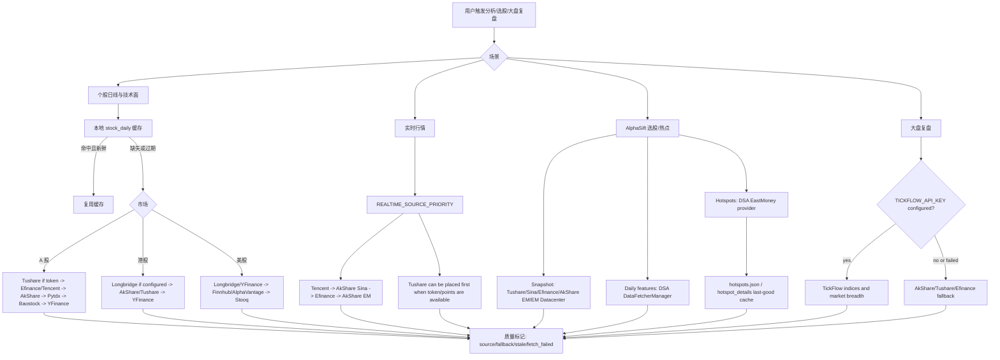
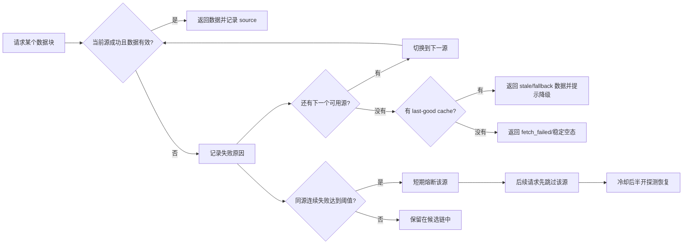
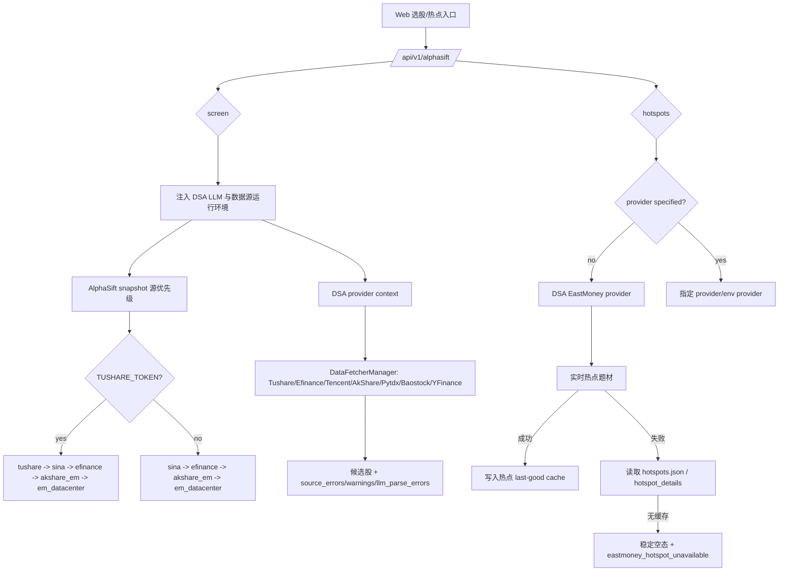

# 数据源稳定性与故障处理图示

本文面向用户、部署者和维护者，说明 DSA 已接入的数据源如何参与分析、选股和大盘复盘，以及当数据源失败时系统会怎么降级。

核心原则：先用项目已经接入并验证过的数据源，把失败路径讲清楚；新增外部数据源应放在第二阶段，避免先扩大维护面。

架构决策见 [ADR-005：保留优先级 fallback 与按市场隔离的熔断控制](adr/ADR-005-provider-fallback-and-circuit-control.md)。

## 一句话答复用户

如果遇到“数据源失败”，通常不是系统只能用一个源，而是免费源被限流、上游接口临时变更、网络抖动或当前市场/标的不支持。DSA 已经内置多数据源 fallback，会按场景自动尝试下一个源；如果你希望更稳定，建议至少配置一个 token 型稳定源：

- A 股个股与 AlphaSift：优先配置 `TUSHARE_TOKEN`，并保留 AkShare / Efinance / Tencent / Baostock / YFinance 兜底。
- A 股大盘复盘：配置 `TICKFLOW_API_KEY` 后，指数和市场宽度会优先尝试 TickFlow，失败后回退现有免费源。
- 港股 / 美股：配置 `LONGBRIDGE_*` 后优先使用 Longbridge，YFinance、Finnhub、AlphaVantage 继续兜底。
- 热点题材：AlphaSift 热点默认走 DSA EastMoney provider，并使用本地 last-good cache 降低实时接口失败影响。

## 已接入数据源矩阵

| 场景 | 已接入源 | 默认使用方式 | 失败处理 |
| --- | --- | --- | --- |
| A 股日线 / 技术面 | Efinance、Tencent、AkShare、Tushare、Pytdx、Baostock、YFinance | `DataFetcherManager` 按优先级尝试；配置 `TUSHARE_TOKEN` 后 Tushare 自动进入候选源 | 单源失败后尝试下一个源；连续失败会短期熔断该源 |
| A 股实时行情 | Tencent、AkShare Sina、Efinance、AkShare EM、Tushare | `REALTIME_SOURCE_PRIORITY` 控制顺序，默认偏向 Tencent / Sina 这类轻量源 | 失败源记录 `fallback_from`，成功源继续返回 |
| A 股大盘复盘 | TickFlow、AkShare、Tushare、Efinance | 配置 `TICKFLOW_API_KEY` 后，主指数和市场宽度优先尝试 TickFlow | TickFlow 权限不足或失败时回退 AkShare / Tushare / Efinance 链路 |
| AlphaSift 选股快照 | Tushare、Sina、Efinance、AkShare EM、EastMoney Datacenter | 有 `TUSHARE_TOKEN` 时自动把 `tushare` 放入快照优先级；否则使用免费源链路 | AlphaSift 维护 source health；DSA 状态接口透出 snapshot/daily health |
| AlphaSift 日线补特征 | DSA `DataFetcherManager` | AlphaSift 调用 DSA provider context，优先复用 DSA 日线与缓存链路 | DSA 链路失败后才回到 AlphaSift 原始日线源 |
| AlphaSift 热点题材 | DSA EastMoney provider、AlphaSift hotspot、last-good cache | 未指定 provider 时默认使用 DSA EastMoney provider | 实时失败时回退热点缓存；无缓存时返回稳定空态和可读错误 |
| 港股 / 美股 | Longbridge、YFinance、AkShare、Tushare、Finnhub、AlphaVantage、Stooq | 配置 Longbridge 凭证后参与港美股日线/实时兜底；YFinance 保持基础兜底 | Longbridge 冷却或失败时回退 YFinance / 其他可用源 |

## 总体链路图



## 失败与降级图



当前日线源熔断策略默认在连续失败 3 次后冷却 300 秒。冷却结束后只允许一个半开探测；探测成功会恢复正常，失败则重新进入冷却。它的目的不是永久禁用数据源，而是避免一个短时间不可用的源拖慢整批分析。

### 日线 provider 健康与熔断配置

所有配置均有默认值，不配置即可运行。配置从进程环境读取，因此本地、Docker 和 GitHub Actions 可使用同一组语义：

| 配置 | 默认值 | 说明 |
| --- | ---: | --- |
| `PROVIDER_CIRCUIT_BREAKER_ENABLED` | `true` | 是否根据连续失败跳过处于冷却期的日线源；关闭后仍记录健康采样 |
| `PROVIDER_CIRCUIT_FAILURE_THRESHOLD` | `3` | 打开熔断前允许的连续异常次数，最小为 1 |
| `PROVIDER_CIRCUIT_COOLDOWN_SECONDS` | `300` | 打开熔断后的冷却秒数；可设为 0 以立即进入半开探测 |
| `PROVIDER_HEALTH_WINDOW_SIZE` | `20` | 每个 `数据类型 + 市场 + provider` 保留的近期结果数量，最小为 1 |
| `PROVIDER_ADAPTIVE_PRIORITY_ENABLED` | `true` | 是否依据近期健康在同一静态优先级内重排日线源；关闭后严格恢复静态顺序 |
| `PROVIDER_ADAPTIVE_PRIORITY_MIN_SAMPLES` | `3` | 每个 provider 参与自适应重排前所需的最小近期样本数，最小为 1 |

非法或越界值会回退到默认值，不会阻止应用启动。市场能力过滤仍先于健康策略执行，熔断不会让 provider 越过其确定的市场支持边界。

### 健康分数与诊断元数据

日线 provider 健康按 `daily_data:<market>:<provider>` 隔离，避免一个市场的失败污染另一个市场。进程内快照包含：

- `success_rate` / `error_rate`：近期有界窗口内的成功和失败比例；
- `average_latency_ms`：窗口内有延迟记录的平均值；
- `recent_failure_count` / `consecutive_failures`：近期失败总数和当前连续失败数；
- `state` / `cooldown_remaining_seconds`：`closed`、`open`、`half_open` 与剩余冷却时间；
- `health_score`：成功率占 70%、延迟占 20%、连续失败恢复度占 10% 的 0-100 分。

provider 在 `closed` 状态返回空表或 `None` 时，本次结果会计入健康窗口的质量失败，确保 `error_rate` 与 fallback 诊断一致；它会清零连续异常次数且不会打开熔断，保持既有“空结果仍可在下一请求重试”的语义。如果半开探测返回空表或 `None`，则不视为恢复：provider 会保留此前的连续异常次数并重新进入 `open` 冷却，只有成功探测才恢复正常。延迟只统计拿到 provider 专属锁后的真实调用时间，不把本地并发排队时间误算为上游耗时。

维护者可在进程内调用 `DataFetcherManager.get_daily_source_health_snapshot()` 读取脱敏快照。单源异常、下一实际可尝试的 `fallback_to`、熔断跳过和最终成功源同时写入既有 `provider_runs` 诊断；报告摘要因此会把“前置源失败但替代源成功”标为 degraded，而不会中断整轮分析。快照和 circuit 日志只记录稳定 provider/market/error code，不保存第三方异常原文、token 或连接凭据；provider 异常摘要在写日志、聚合错误和运行诊断前统一经过中央脱敏工具。

### 自适应优先级与健康导出

日线自适应排序默认启用，并直接复用上述进程内健康窗口，不维护第二份学习状态。排序边界如下：

1. 先应用确定的市场支持矩阵和 request-time capability 过滤，不支持当前市场或当前请求不可用的 provider 不参与排序。
2. 数值 `priority` 是人工配置的硬边界；只有相同 `priority` 的 provider 才可能互换位置。美股指数固定首选、Longbridge 配置偏好及美股显式 fallback 链不会被跨越。
3. 同一优先级内，参与互换的 provider 必须处于 `closed`，且都至少达到 `PROVIDER_ADAPTIVE_PRIORITY_MIN_SAMPLES`，然后才按近期 `health_score`、成功率和平均延迟排序。样本不足或正在 `open` / `half_open` 的 provider 固定在原位置，既避免冷启动振荡，也保留冷却结束后的静态位置恢复探测。
4. 分数相同会回到原静态顺序。设置 `PROVIDER_ADAPTIVE_PRIORITY_ENABLED=false` 可一键恢复完全静态的 provider 顺序，健康采样与熔断仍继续工作。

发生实际重排时，日志会写入 `provider_priority event=adaptive_reorder`，包含 market、静态顺序、选中顺序、最小样本数及脱敏健康摘要。运维可通过以下进程内入口查询或导出完整快照：

```python
manager.get_daily_provider_health_report("cn")
manager.log_daily_provider_health_report("cn")  # 写 provider_health event=snapshot 结构化日志
DataFetcherManager.reset_daily_source_health()   # 重置学习、熔断和近期健康状态
```

报告 schema 为 `provider_daily_health_v1`，包含静态优先级、声明的市场能力、成功率、错误率、平均延迟、样本数、健康分数、熔断状态和冷却剩余时间。`provider_count=0` 表示当前进程尚无该市场的观测，不表示 provider 永久不可用。时间戳是当前进程的观测时间；状态不会跨进程或重启持久化。

## AlphaSift 选股与热点链路



## 推荐配置档

### 免费模式

适合个人试用，依赖免费源自动 fallback。优点是不需要 token；缺点是更容易遇到上游限流或临时接口变化。

```env
REALTIME_SOURCE_PRIORITY=tencent,akshare_sina,efinance,akshare_em
ENABLE_EASTMONEY_PATCH=true
```

### A 股稳定模式

适合经常跑选股、批量分析或对外服务。Tushare 用于增强 A 股日线与快照稳定性；TickFlow 可增强 A 股日 K、实时行情和大盘复盘（实时行情需显式加入 `REALTIME_SOURCE_PRIORITY`）；免费源继续作为兜底。

```env
TUSHARE_TOKEN=your_tushare_token
TICKFLOW_API_KEY=your_tickflow_key

REALTIME_SOURCE_PRIORITY=tickflow,tushare,tencent,akshare_sina,efinance,akshare_em
SNAPSHOT_SOURCE_PRIORITY=tushare,sina,efinance,akshare_em,em_datacenter

# AlphaSift 选股运行期默认值；显式配置时会保留你的值
DAILY_FETCH_RETRIES=3
DAILY_FETCH_MAX_WORKERS=1
```

注意：TickFlow 能力按套餐权限分层；权限不足或请求失败时会 fail-open 回退到现有免费源，不建议把它当成所有市场行情的唯一来源。

### 港股 / 美股稳定模式

适合港美股组合、持仓和个股分析。Longbridge 配置后优先参与港美股链路；YFinance、Finnhub、AlphaVantage 作为兜底。

```env
LONGBRIDGE_OAUTH_CLIENT_ID=your_client_id
LONGBRIDGE_OAUTH_TOKEN_CACHE_B64=your_token_cache_base64

FINNHUB_API_KEY=your_finnhub_key
ALPHAVANTAGE_API_KEY=your_alphavantage_key
```

如果仍使用 Legacy Longbridge 凭证，也可以继续配置：

```env
LONGBRIDGE_APP_KEY=your_app_key
LONGBRIDGE_APP_SECRET=your_app_secret
LONGBRIDGE_ACCESS_TOKEN=your_access_token
```

## 日线多层缓存与 stale 降级

`DataFetcherManager.get_daily_data()` 在现有 provider fallback 外增加了两层日线缓存，不替换 Pipeline 已有的
`stock_daily` 数据库缓存：

1. L1 是当前 manager 进程内的有界内存缓存，默认 fresh TTL 为 60 秒。
2. L2 是本地 JSON-table 持久缓存，默认 fresh TTL 为 3600 秒，默认目录为
   `data/provider_cache/daily`（相对进程工作目录）。写入使用同目录临时文件和原子替换；不会反序列化 pickle。
3. key 包含规范化股票代码、实际开始/结束日期和 `days`，不同查询窗口不会互相覆盖。只缓存非空的成功结果。
4. fresh 命中会直接返回；未命中时仍按原有 provider 优先级、市场能力和熔断策略请求。
5. provider 链全部失败后，才允许读取超过 L2 fresh TTL 的 last-good 数据。默认额外 stale 窗口为
   86400 秒；超过该窗口仍按原有方式抛出数据获取错误。

默认配置如下；不配置时缓存已启用。TTL 或 stale 窗口设为 `0` 可分别关闭对应 fresh 层或 stale 降级，
`PROVIDER_DAILY_CACHE_ENABLED=false` 可整体关闭：

```env
PROVIDER_DAILY_CACHE_ENABLED=true
PROVIDER_DAILY_CACHE_DIR=data/provider_cache/daily
PROVIDER_DAILY_CACHE_MEMORY_TTL_SECONDS=60
PROVIDER_DAILY_CACHE_PERSISTENT_TTL_SECONDS=3600
PROVIDER_DAILY_CACHE_STALE_IF_ERROR_SECONDS=86400
PROVIDER_DAILY_CACHE_MEMORY_MAX_ENTRIES=256
```

下游可从 `DataFrame.attrs["provider_cache"]` 读取 `cache_hit`、`layer`、`is_stale`、
`stale_seconds`、`stored_at` 和 `source`。正常 provider 返回会标记 `layer=provider`、
`cache_hit=false`；stale 降级会明确标记 `is_stale=true`。任务诊断中的 `ProviderRun` 同步记录
`cache_hit` 与 `stale_seconds`，结构化日志 `provider_cache event=...` 会输出进程内累计
`hits`、`misses`、`stale_hits`、`writes` 和 `invalidations`，不记录缓存内容。计数作用域为当前
manager 实例；常规应用运行期使用单例 manager。

运维或测试代码可以显式查询和失效：

```python
manager.get_daily_cache_stats()
manager.invalidate_daily_cache("600519")  # 同时失效该代码的 L1/L2 条目
manager.invalidate_daily_cache()          # 失效全部日线缓存
```

## 用户可见提示建议

对外沟通时建议区分三类情况：

| 情况 | 建议提示 |
| --- | --- |
| 单个源失败但 fallback 成功 | 本次使用了降级数据源，分析仍可继续；报告中会标记实际成功源。 |
| 多个源失败但有缓存 | 实时源不可用，本次使用上一次成功缓存；结论会降低置信度。 |
| 全部源失败且无缓存 | 当前数据不可用，请稍后重试，或配置 Tushare / TickFlow / Longbridge 等 token 型数据源。 |

## 后续可做的产品化增强

1. 数据源 Doctor 页面：展示每个源最近成功时间、失败原因、熔断状态和下一次恢复探测时间。
2. 一键推荐配置：根据市场选择生成 `.env` 片段，例如“A 股稳定模式”“港美股稳定模式”“免费模式”。
3. AlphaSift 状态面板：直接展示 snapshot/daily source health，让用户知道是 Sina、Efinance、AkShare 还是 Tushare 出问题。
4. 批量任务限速策略：对免费源自动降低并发，优先复用本地日线缓存，减少触发上游限流。
5. 可选商业源接入：只有在现有 Tushare / TickFlow / Longbridge / Finnhub / AlphaVantage 仍不能覆盖需求时，再考虑新增 Twelve Data、Massive/Polygon、Nasdaq Data Link 等源。

## 官方资料

- Tushare: https://tushare.pro/document/2
- TickFlow: https://tickflow.org/
- AkShare: https://akshare.akfamily.xyz/
- Longbridge OpenAPI: https://open.longportapp.com/
- Finnhub API: https://finnhub.io/docs/api
- Alpha Vantage API: https://www.alphavantage.co/documentation/
