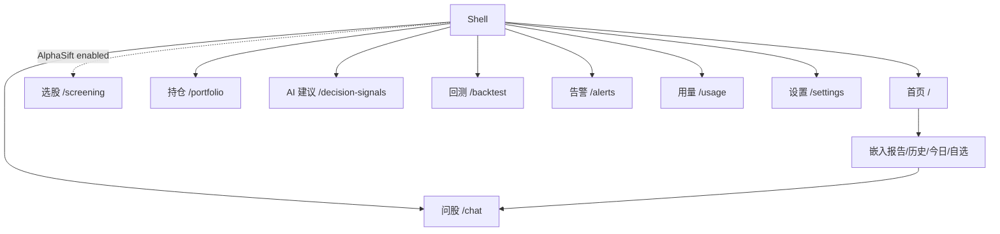
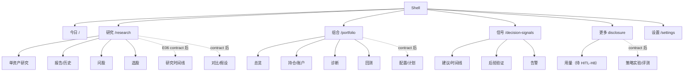

# StockPulse UI 信息架构审计与 HITL 提案（UI-01）

> 状态：**Ready for HITL review, not approved**
> 审计日期：2026-07-16
> 审计基线：`ed729c1b579fcf7c4f11f6e7beddc7230b71302b`
> 建议 IA：`今日 / 研究 / 组合 / 信号 / 更多 / 设置`
> 范围：只读审计与候选契约收敛；不包含 UI-02 及之后的生产代码修改。

## 1. Baseline、方法、环境和限制

### 1.1 Git 与运行基线

| 项目 | 结论 |
| --- | --- |
| C-01～C-09 handoff | 固定审计对象为 `fix/c01-c09-contract-convergence` 的 commit `ed729c1b`。本审计据此执行。 |
| 审计执行 | 从 `ed729c1b` 的隔离 checkout 运行 fixture、页面走查和初次自动检查；临时 artifact 保持 gitignored，审计期间未修改 runtime tree。 |
| 与目标分支关系 | `ed729c1b` 是固定 handoff，不代表持续移动的最新目标分支；合入或实施前必须重新计算与当前目标 ref 的差异并复核受影响契约。 |
| 交付边界 | UI-01 只交付本文件与 `apps/dsa-web/DESIGN_GUIDE.md`；不修改生产 UI、route、API、数据库、配置、依赖、测试或 workflow。 |

### 1.2 方法与证据层级

1. 代码事实：读取路由、Shell、Sidebar、公共 Overlay、全部页面、Settings IA、i18n、URL hooks、API clients、单元测试与 Playwright specs。
2. 运行事实：使用仓库 `run-backend-fixture.py` 启动隔离真实后端、临时 SQLite、Vite 与本地 fake provider；未读取用户数据库或 ambient provider credentials。
3. 视口事实：对 10 个 authenticated Shell route state（含 404，不含独立 `/login`）记录
   `1440x900`、`1024x768`、`390x844`、`320x720` 结构化观察；标准 route screenshot
   为 `38/40`，另有 desktop Settings theme 图。`/login` 只有一份 desktop 证据，详见 §19。
4. 自动验证：ESLint、Vitest、生产构建、Playwright smoke 与定向响应式验收。
5. 外部参考：未使用 Figma MCP，未读取或猜测 Coinstax exact variables/styles；本文件只评估执行 prompt 已确认的布局模式。

除非明确标注另一个稳定 ref，代码行号均指固定审计基线 `ed729c1b`；不得把后续工作树行号
与审计基线混作同一份证据。

### 1.3 产品与领域契约核对

以下六份产品/领域文档与 UI-01 prompt 是用户明确提供的外部规划输入。它们不在审计基线
的 committed refs 中，但审计时已按提供版本完整读取。引用只使用逻辑文件名；文档头部状态、
工作跟踪器和代码事实共同决定“现有 / 规划 / 待批准”，不能因章节写得详细就视为已批准。
核对版本为 tracker v0.1、feature catalog v0.3、product overview（2026-07-15 Draft）、
enhancement PRD v0.4、multi-asset PRD v0.4、domain decisions v0.2、UI-01 prompt v0.3。

| 来源文档 | 相关章节 / 决策 | 与当前 IA 是否一致 | 冲突或缺口 | 处理方式 | 是否需要 HITL |
| --- | --- | --- | --- | --- | --- |
| `stockpulse-work-tracker.md` | §1、§5、§8；UI-01=`Next`，UI-02～UI-07=`Planned` | **任务身份已对齐**：UI-02/03/04/06 保持 tracker 的完整父任务定义；当前能力前置工作另记为 UI-02A、UI-03A～F、UI-04A 与 UI-06A/B/C1/C2/D/E/F/G | 旧稿曾用父任务 ID 指 current-only 工作，造成同一 ID 跨文档含义漂移；tracker 也尚未登记这些候选子任务 | tracker 继续作为工作状态唯一索引；HITL 后先原子登记父子范围与状态，再允许分配子任务；UI-01 不直接修改外部 tracker | **是**：批准 UI-01、子任务登记和执行顺序；不是由审计自行改 tracker 状态 |
| `stockpulse-work-tracker.md` | §6 Agent Framework；AR-01～AR-08 | **Runtime 边界一致，Usage 导航未获批准**：Ask Stock 是 Research 用户任务，Agent 行为/运行诊断归 Settings；tracker 没有决定 Usage 是一级还是 More | 当前正式体系是 Single/Multi/Deep Research；Technical/Intel/Risk/Decision/Portfolio/Skill 是角色，不是独立 Runtime。外部 Runtime 仍为 Planned/POC | 不为 CrewAI/CAMEL/Hermes 等建产品导航或平行配置；`/usage` 页面身份保持，导航归属由 HITL-H8 单独审批 | **是**：仅 Usage/More 导航归属；AR-01/Runtime lifecycle 是独立架构 gate |
| `stockpulse-feature-catalog.md` | §§2～5；F01～F16 现有，F17～F38 规划，F39 增强 | **一致**：当前路由能力保留，数字资产/配置/时间线/对比等只在 target/backlog | 原 IA 对完整 Today、Research timeline 的 API readiness 过于乐观 | 以 catalog 状态为 capability 基线；planned 能力不得进入可点击 production nav | capability 状态本身**不需要**；目标归属随主 IA 一并批准 |
| `stockpulse-product-overview.md` | §5 当前页面；§10.1 全局导航建议 | **大体一致** | §10.1 用“持仓”，增强 PRD §27 与本审计用“组合”；overview 为 Draft、不是契约 | 当前页面清单用于交叉检查；一级术语交给 HITL，不把 overview 建议写成批准事实 | **是**：`持仓` 与 `组合` 的 canonical term |
| `stockpulse-product-enhancement-prd.md` | 头部、§6.1、§27 | **方向一致**：同为“今日 / 研究 / 组合 / 信号 / 更多 / 设置” | 状态是 `Draft / Program Review Required` 且明确未批准；§27 是推荐，不是既成导航权威 | 作为主推荐的产品依据；在维护者批准前继续保持 candidate | **是**：六项导航、二级归属与 canonical route |
| `stockpulse-product-enhancement-prd.md` | E04 今日工作台 | **部分一致** | 完整 E04 需要 Today aggregation、服务端 P0～P4 排序原因、区块级错误、已读/处理与个性化状态；现有 API 只能支持 current Home 重排 | UI-02 保持完整 E04 父任务；UI-02A 只做现有数据层级/响应式前置稳定化，不代表 UI-02 完成 | **是**：批准 UI-02A 与父任务的边界；完整 E04 仍 blocked |
| `stockpulse-product-enhancement-prd.md` | E06 研究时间线 | **位置一致，能力未就绪** | 稳定 ResearchEvent ID、发生/入库时间、去重、游标和 tombstone 尚为规划 | UI-03 保持 timeline/report/signal/Evidence 完整父任务；UI-03A～F 只准备当前能力，timeline 不显示空壳入口 | 位置随 Research IA **是**；数据契约不由 UI-01 决定 |
| `stockpulse-product-enhancement-prd.md` | E08 股票横向对比 | **一致**：标为 `DEFER` | 2～5 股、统一币种/期间、保存对比均无当前 API | 只保留 target IA 位置；不得把 query 名当成已实现 contract | **否**（是否开发由 tracker/PRD 审批）；Research 归属随主 IA 决定 |
| `stockpulse-product-enhancement-prd.md` | E10 观察清单分组与标签 | **部分一致** | 当前只有默认 watchlist；多清单、标签、批量预览与稳定 ID 均为规划 | UI-02A 只复用当前 watchlist，不承诺多清单；旧 API 兼容要求留给 E10 薄规格 | **否**；不阻塞 current Home 修复，阻塞多清单 UI |
| `stockpulse-product-enhancement-prd.md` | E12 使用模式与配置模板 | **一致**：Settings 保持单一草稿/保存/字段归属 | 模式、模板和 diff preview 尚未实现 | 未来仍进入现有 Settings；禁止第二套配置、Provider 清单或自由文本模型入口 | **否**；不属于 UI-01 IA 未决项 |
| `stockpulse-product-enhancement-prd.md` | E18 一致空状态与降级体验 | **一致**：UI-05 是增强而非重建 | 现有公共状态组件是基础，但缺跨页词汇、source/as-of/quality 的完整 API 映射 | UI-05 先做 additive primitive 与单页 pilot；缺字段时显式列依赖，不用 broad fallback | **否**（方向已由 current code + PRD 约束）；执行仍受 UI-01 gate 阻断 |
| `stockpulse-multi-asset-prd.md` | 头部、§6.1 MVP 决策 | **边界一致** | PRD 自称 development baseline，但头部仍是 Product + Architecture + Compliance Review Required；D-01～D-09 也未批准 | 不替维护者化解内部状态冲突；资产身份、Decimal、账本、secret、Job 只作未来硬前置 | **是**：D-01～D-09/合规批准；不阻塞当前股票 UI bugfix |
| `stockpulse-multi-asset-prd.md` | §9.1 新增一级页面 | **冲突** | 提议“数字资产 / 总资产 / 资产配置 / 再平衡 / 情景分析”五个新增一级页；增强 PRD §27 与本审计要求有限六项主导航 | 推荐在达到 Beta 后按 Research/Portfolio 二级归组；备选是批准专用一级页。UI-01 不自行裁决 | **是**：实质性跨 PRD 冲突，影响完整 UI-03/UI-04、UI-06 与未来多资产 |
| `stockpulse-multi-asset-prd.md` | §9.2、§10 核心交互 | **大体一致** | “Token 用量、设置和系统诊断保持独立”可表示 route 独立，也可能表示一级入口独立；与 More/Settings 分组存在解释空间 | 保留现有 paths；分组不合并数据/权限语义。未来数字资产用独立 7×24/venue/chain contract | **是**：只确认导航归属；首次流程、Preview 非交易语义不改写 |
| `stockpulse-domain-decisions.md` | D-01～D-09、§11 待批准决策 | **边界一致** | 全文状态为 `Draft / Architecture Review Required`，tracker X-04=`Blocked`；不能称为 Approved | UI 只记录依赖：单工作区、账本真源、Asset/Instrument、Decimal、secret、Job、Evidence/event、合规 | **是**：按审批者批准；影响完整 UI-03 timeline/Evidence 和 UI-04 allocation，不阻塞 UI-02A/UI-03A～F/UI-04A 的现有能力修复 |
| `stockpulse-ui01-information-architecture-audit-prompt.md` | §§4、9、12、16 | **一致**：不可回退能力、候选六项 IA、未来边界和 HITL gate 均保留 | §9 明确是“待验证目标方向”，不能把执行 prompt 本身误读为产品批准 | prompt 是本次审计范围/完成标准的权威，不是目标 IA 的批准记录 | **是**：UI-02～UI-07 在明确批准前继续 blocked |

核对后的结论分层：

- **当前事实，不再列为待定**：现有 route/capability 状态；Settings 两级 IA、Provider Catalog、
  统一 Overlay、双主题/i18n 等不可回退能力；planned 功能不得伪装为 Existing；UI-01 完成后必须
  等待 HITL，UI-02～UI-07 当前均为 Planned/blocked。
- **候选，仍未批准**：六项一级导航、`/research`、问股/选股/告警/回测/用量的目标归属、
  Today 的迁移边界、multi-asset 五个一级页与有限导航的冲突、旧 URL 兼容期和 slice 顺序。
- **不由 UI-01 决定**：D-01～D-09、E04/E06/E08/E10/E12 的新数据/API/合规契约；UI-01
  只能记录依赖、非目标与不可提前暴露规则。

### 1.4 证据限制

审计环境没有可用的应用内 Browser backend；实际页面走查改用仓库自带 Playwright
和隔离 fixture。未执行真实读屏器会话或浏览器原生 200% zoom；以 ARIA snapshot、系统化
Tab/Escape、`320px` 窄布局和 `prefers-reduced-motion` 作为替代证据。PNG 按仓库 gate
属于不可扫描媒体，只做人工脱敏检查；两份 JSON 证据通过现有 artifact scanner。

`/login` 的视觉证据仅有 `login-deep-link-settings.png`：`1440x900`、dark、中文、返回管理员
登录。没有 `1024x768`、`390x844`、`320x720`、light、英文或首次设密截图；
`ui01-observations.json` 的 `firstRunBefore` 虽为 desktop viewport，但 DOM 采集为空，不能补足
该缺口。Login 多视口、双主题/双语和首次设密布局继续列入 UI-06/UI-07 验收。

## 2. 用户角色与最高频任务

当前系统只有可选的单管理员会话，不存在多用户 RBAC。以下是按行为划分的 task personas，不代表权限角色。

| Persona | 最高频目标 | 成功判据 |
| --- | --- | --- |
| 日常研究用户 | 看今日待办、自选状态，分析股票，读报告，从报告追问 | 当前股票、报告、任务与返回位置不丢失；降级数据可见 |
| 持仓管理用户 | 管账户/持仓/流水/导入，看快照、诊断与风险 | 写操作幂等；结果可追踪；账户与 Tab 可恢复 |
| 信号与风险复核者 | 从信号回到证据报告，查看后验结果，建立告警 | 信号、来源报告、告警和筛选上下文形成闭环 |
| 系统管理员 / 部署者 | 首次配置，管理模型、数据源、通知、调度、认证、用量与诊断 | 单一配置权威、原子保存、冲突可恢复、敏感信息不泄漏 |

最高频任务按审计优先级记录为：

1. 今日状态 -> 选择股票 -> 分析/继续任务 -> 阅读报告。
2. 报告 -> 问股 -> 返回报告，保持当前股票与会话。
3. 自选/历史 -> 切换股票/报告 -> Back/Forward 恢复。
4. 持仓 -> 诊断/风险 -> 来源信号或报告 -> 返回原工作区。
5. 信号 -> 来源报告 -> 告警 -> 返回原筛选。
6. 首次配置 / 设置深链 -> 保存或处理冲突 -> 回到发起任务。

## 3. 当前路由、导航、页面和 Overlay 清单

### 3.1 一级导航事实

`App.tsx` 始终注册 11 个页面路由；`SidebarNav.tsx` 定义 9 个产品入口，但 `/screening` 仅在 AlphaSift 状态 API 返回 enabled 时出现。审计 fixture 中实际显示 8 项：`首页 / 问股 / 持仓 / AI 建议 / 回测 / 告警 / 用量 / 设置`。

| 路由 | 当前用户目标与主要任务 | 入口 / 返回 | 主要、次要、危险操作 | URL、状态与 API | 响应式 / a11y | 当前主决定 |
| --- | --- | --- | --- | --- | --- | --- |
| `/` | 分析、大盘复盘、历史/自选/今日、报告、追问、运行流 | Home；筛选结果可带 `location.state` 返回 | 分析；大盘复盘、追问、趋势、完整报告；删除历史 | `recordId/runFlow/runFlowRecordId/runFlowTaskId` 可刷新与 Back/Forward；工作区 Tab 与策略仍本地 | Desktop 三列；移动端历史 Drawer；1024 出现内容裁切 | `REFACTOR` 为“今日” |
| `/chat` | 多轮问股、会话、策略、SSE、停止/重试、导出/通知 | Sidebar 或报告“追问 AI” | 发送/停止；新会话、策略、导出、通知；删除会话 | `session` 可分享；报告带来的 `stock/name/recordId` 会被消费后从 URL 清理 | Desktop 会话 rail；移动会话 Drawer；IME 已处理 | `MERGE` 到研究 |
| `/portfolio` | 账户、快照、持仓、信号、风险、交易/资金/公司行动/CSV/流水 | Sidebar；无跨页 return contract | 添加账户/分析；交易/资金/公司行动/导入；删除账户/流水 | 无 URL 状态；多个 Portfolio API；分析仅显示 task id | Desktop 长工作台；移动单列；6 Modal + 2 Confirm | `REFACTOR` |
| `/decision-signals` | 列表、统计、当前股票、时间线、重评估、详情/反馈/状态 | Sidebar；Portfolio 有弱关联 | 筛选/刷新；重评估/反馈；关闭/归档 | 多个 query，但主要直接 `history.replaceState`；`signal` 只查已加载集合 | Mobile 先展示完整筛选表，主结果被推到首屏后 | `REFACTOR` 为“信号”主入口 |
| `/screening` | AlphaSift 状态、热点、策略参数、异步任务与候选 | 条件式 Sidebar 或直达；候选跳 Home | 运行选股；热点/策略；启用 AlphaSift | `strategy/market/count` mount-only；任务在 `sessionStorage`；结果本地 | 页面很长；disabled 状态重复说明；无 Modal | `MERGE` 到研究 |
| `/backtest` | 参数、运行、表现、结果与分页 | Sidebar | 运行；筛选/1 日验证/强制重跑 | `code/window/from/to/phase/page` mount-only；运行结果不持久 | 无页面级 H1；320 工具栏可用但很高；宽表横滚 | `DEMOTE` 到组合 |
| `/alerts` | 规则、dry-run、触发历史、通知尝试 | Sidebar；设置中有通知入口 | 创建规则；筛选/测试/启停；删除规则 | 无 URL 状态；三块 API 失败边界分开 | Mobile 首屏被筛选与空规则占满；三张宽表横滚 | `MERGE` 到信号 |
| `/usage` | 时段、KPI、模型/调用类型、最近调用 | Sidebar | 刷新；时段切换 | period 为本地状态；usage dashboard API | Mobile KPI 单列；error/retry 清楚 | `DEMOTE` 到 More 是候选，待 HITL-H8；route identity 保持 |
| `/settings` | 11 section，AI/Data Sources 二级 view，导入、调度、认证 | Sidebar；Home setup CTA；深链 | 分组自动保存、向导、测试；导入/重置；危险配置操作 | Router 驱动 `section/view`，legacy migration、409、leave guard | Desktop 左 rail；mobile section select；`overview/readiness` 在 390/320 内容区横向裁切 | `KEEP`（保留 IA，不代表响应式无缺陷） |
| `/login` | 首次设密与登录 | 认证深链 | 登录/设密；语言/密码显示 | `redirect` 只接受站内路径；代码存在两个 post-auth navigation owner 的竞态风险，运行证据需重测 | 独立页面；代码有 label；仅有 1440 dark/zh 截图，移动布局未验证 | `KEEP`，先收敛深链 owner |
| `*` / 404 | 解释错误并返回首页 | 任意失效 URL | 返回首页 | 保留原 URL 直到点击 | Desktop/mobile 可读 | `KEEP` |

### 3.2 Overlay 与浮层

| 类型 | 当前实例 | 决策 |
| --- | --- | --- |
| Shared Drawer | 移动导航、Home 历史、Chat 会话、信号详情、报告 Markdown、运行流 | 保留并复用；不得新增页面私有 Drawer primitive |
| Shared Modal | 告警创建、Portfolio 写操作、首次向导、模型 Connection | Desktop 居中、mobile bottom sheet；保持同一组件 |
| ConfirmDialog | 删除、退出、状态变更、设置离开/导入/重置 | 保持最高 z-index；危险动作应使用 danger 语义 |
| Popover / menu | autocomplete、Select、SearchableSelect、Theme、Home 策略、LLM 更多菜单 | 收敛为公共 Menu/Popover；Theme 与 LLM menu 补键盘模型 |
| Tooltip | 公共 Tooltip、Recharts tooltip | 辅助信息，不承载唯一操作或关键事实 |

`overlayZ.ts` 已统一 `pageDrawer=40` 到 `confirm=200` 的层级。Shared Drawer/Modal/Confirm 已覆盖 portal、焦点进入/陷阱/恢复、Escape、背景 inert 和 scroll lock，是不可回退基线。

### 3.3 按页面的 Overlay / 浮层实例

| 页面 | Drawer | Modal / Confirm | Popover / 其它 | 当前边界 |
| --- | --- | --- | --- | --- |
| Home | mobile 历史、完整报告、Run Flow | 删除历史 Confirm | 股票 autocomplete、策略 menu、Tooltip | report/run identity 已部分进 URL；mobile nav 与历史 opener 名称需区分 |
| Chat | mobile session list | 删除会话 Confirm | 策略 disclosure、Tooltip | disclosure 不冒充 ARIA menu；session/source context 见 P1-07 |
| Portfolio | 无共享详情 Drawer | 交易、资金、公司行动、导入等 6 个 Modal；账户/流水 2 个 Confirm | chart Tooltip | 写操作使用既有 Modal/Confirm；分析 task 目前无可恢复 overlay |
| Decision Signals | signal detail Drawer | stock selector Modal、status Confirm | 固定处理提示 | `?signal=` 应按 ID 读取；关闭恢复列表 trigger/filter |
| Screening | 无 | 无 | 无 | 长任务/结果当前在页面内，不应新增 transient Modal 代替可恢复 route |
| Backtest | 无 | 无 | Recharts Tooltip | 结果和 filter 属页面/URL，不放 Drawer |
| Alerts | 无 | create rule Modal、delete Confirm | table row actions | 规则、触发、投递未来用 page tabs；不嵌套 Modal |
| Usage | 无 | 无 | chart Tooltip（如有数据） | error/retry 保持页面区块，不用 blocking Modal |
| Settings | 无 page Drawer | FirstRunWizard 与 connection 相关 Modal；leave/import/reset 等 Confirm | Select/SearchableSelect、LLM more menu | 保留统一 z-index/focus；UI-06E/F 不另建 overlay system |
| Login / 404 | 无 | 无 | password visibility / language controls | 独立页面；不把 auth redirect error 放 transient overlay |

### 3.4 当前页面状态覆盖与缺口

下表区分“代码/运行中已有表达”和“仍需 UI-05 contract”。`—` 表示该状态对当前页面不适用，
不是已通过验收；“部分”表示领域自有文案存在，但尚未统一到 §9.2。

| 页面 | loading / running | empty | partial / degraded / stale | error / retry | permission / unsupported | UI-05 主要缺口 |
| --- | --- | --- | --- | --- | --- | --- |
| Home | 股票、报告、task/run flow | 无股票/无历史/无今日结果 | 报告数据块有部分质量语义；全页 stale 不统一 | 分析/历史局部错误，重试路径不一 | setup missing CTA；市场 unsupported 主要运行后出现 | 区块级 as-of/source、Today 聚合不可由前端猜 |
| Chat | session load、SSE running/cancelling | 无会话/无消息 | source context 与模型 fallback 未统一展示 | send/stream retry，停止生成已实现 | 未配置模型可阻断；tool unsupported 表达分散 | source report、actual route、partial response 状态 |
| Portfolio | account/holding/snapshot API；分析 task 只显示 ID | 无账户/持仓/流水 | valuation/risk partial 语义分散，stale 未统一 | 多区块/写操作错误；任务无恢复 | 当前单管理员，无 RBAC；跨市场能力差异弱 | 无法估值、source/as-of、task terminal state |
| Decision Signals | list/stats/timeline/reassess | 无 signal | expired/status 存在，degraded/stale 与 data freshness 未统一 | API 错误；任意 ID not-found 不明确 | 无独立 permission state | source report/alert/outcome link 与列表独立失败 |
| Screening | status、job running | 无 hotspot/result | AlphaSift disabled/unavailable 存在；结果 freshness 不持久 | status/job error | disabled 与 health error 会导致入口消失 | enabled/degraded/unavailable 分离、task/result 恢复 |
| Backtest | run/loading | 无历史/结果 | 缺样本/口径限制有领域文案，stale 不统一 | run/list error | unsupported market/phase 不完整 | 样本口径、task/result persist、局部失败 |
| Alerts | rules/triggers/deliveries 独立 loading | 三个集合各自 empty | notification failure 可局部存在；stale 未统一 | 三块 API error 隔离，retry 不完全一致 | channel unconfigured 主要跳 Settings | rule/trigger/delivery tabs、as-of 与 degraded delivery |
| Usage | dashboard loading | 无调用 | period 数据 freshness 未显式 | 已有 error + retry 运行证据 | — | as-of/unknown cost 与 stale 区分 |
| Settings | page/catalog/setup/save states | 无配置项/目录 | stale model selection、restart-required、source 状态已有 | page summary、field jump、409/retry 已较完整 | unconfigured/unsupported/read-only diagnostic | 保持既有 contract；补 responsive 与跨 view 词汇一致性 |
| Login | auth/setup loading | — | — | credential/setup error | unauthenticated 是页面前置，不等同 403 | 四视口/双主题/双语/first-run 证据与单一 navigation owner |
| 404 | — | — | — | route not found + Home action | unsupported route | 保留原 URL；不要自动吞掉到 Home |

## 4. 当前 IA 图与目标 IA 图

### 4.1 当前 IA



当前结构按功能模块平铺，不按用户任务组织；报告没有独立信息归属，信号、告警、后验与回测分散，Usage 与高频研究并列。

### 4.2 主推荐目标 IA



主推荐结论：

- 首页演进为“今日”，保留 `/`；HomeStockWorkspace 的“今日/自选”进入今日工作台，“历史/报告详情”迁入研究。
- 问股不再作为一级项；它同时是研究二级视图和报告/股票上下文命令。
- 选股属于研究；报告、历史、时间线、未来对比与假设也属于研究。
- Portfolio 更名为“组合”；当前账户/持仓/诊断保留，回测降为组合二级入口。资产配置与计划只进入 backlog。
- 决策信号、后验验证与告警归入“信号”；任何合并只改入口，不删除能力。
- 推荐用量进入“更多”，但必须由 HITL-H8 单独批准；`/usage` route/page identity 不变。运行诊断与数据源健康归设置，报告级数据质量归研究报告。
- Desktop 侧栏和 mobile Drawer 使用同一分组树、同一名称、同一 canonical link builder。

## 5. 关键任务流 current / target 对照

| # | 任务流 | Current（约步骤 / 丢失点） | Target | 验收重点 |
| --- | --- | --- | --- | --- |
| 1 | 首次进入 -> 配置 -> 可运行 | `4+`：登录 -> Home 缺口提示 -> Settings 检查 -> 配置/向导；不是直接向导，fixture 也可能因本地 CLI 被判 ready | 登录后回原 URL；Today 显示单一 setup CTA；向导完成回发起任务 | 无第二 Provider；失败留在向导；ready 状态可复核 |
| 2 | 搜索 -> 分析 -> 状态 -> 报告 | `4-5`，Home 内完成；任务/报告 URL 已部分恢复 | Today 提交，任务摘要持续可见；结果进入 Research report | pending 到 terminal 全状态；刷新不等于取消 |
| 3 | 自选 -> 切股 -> 历史 -> 返回 | `4`，Home Tab 不在 URL；报告有 `recordId` | Today 保存 watchlist view；Research URL 保存 stock/report/view | Back/Forward 恢复股票、Tab、报告与滚动锚点 |
| 4 | 报告 -> 问股 -> 停止 -> 返回 | `4-6`；报告参数被消费后 URL 只剩 session，发送前刷新有丢上下文风险 | Research report 的 Ask 命令创建带来源的 session；Back 返回原 report | session、stock、record 来源可验证；停止不删除部分回复 |
| 5 | 信号 -> 报告 -> 告警 -> 返回 | 当前无直接来源报告/创建告警入口，需全局导航与重新筛选，`6+` | 信号详情提供“来源报告”“基于此信号建告警”，带 return URL | 返回保留 filters/page/signal；旧 URL 不变 |
| 6 | Portfolio -> 账户/持仓/快照/诊断 | 单长页、无 URL Tab；刷新回默认；分析只给 task id | `/portfolio?view=...&account=...`；任务摘要与结果可返回 | 写操作幂等；partial/stale 可见；mobile 单列 |
| 7 | 回测 -> 参数 -> 运行 -> 结果 -> 历史 | 同页完成，但运行结果不持久、无独立历史 view | 组合 > 回测；filters 在 URL，task/result 可恢复 | run 与 filter 分开；phase 只筛结果的语义不回退 |
| 8 | 告警规则 -> 触发 -> 通知 | 当前一页三段，规则/触发/通知无 URL view | 信号导航以原生链接进入 `/alerts`；从规则回到触发/通知保留 rule | empty 不等于 error；通知失败不阻断规则 |
| 9 | Settings 深链 -> 修改 -> 冲突 | 已较完整；`section/view`、autosave、409、leave guard 已实现 | 保持现有行为，仅统一入口/return URL | 不恢复 global Save；字段定位与 retry 可见 |
| 10 | Mobile nav -> 页面 -> Overlay | Drawer focus/escape 可用；Home/Chat 又有第二个相似汉堡按钮 | 全局汉堡固定；页内历史用明确 History 图标/标签 | 320/390 无歧义；取消/Escape 回 opener，选中 route 后 ready 的目标页聚焦 H1 |
| 11 | 认证深链 -> 登录 -> 原 URL | **代码风险，运行结论待确认**：`AppLayout` 与 `LoginPage` 都可能在 auth transition 后导航；现有 JSON 被先前 Home URL 污染，不能证明最终目标 | 登录事务只有一个 navigation owner，原 path/query/hash 原样恢复 | 独立上下文下三类非 Home 深链集成测试，2.5s 后断言最终 URL |
| 12 | 刷新 / Back / Forward / 直达 | Home/Settings 完整；Signals/Screening/Backtest mount-only；Portfolio/Alerts/Usage 无 URL 状态 | 所有业务状态经 Router 管理；无效参数 replace 规范化 | push/replace 语义逐页测试 |

## 6. Findings（P0～P3）

### P0

未发现 P0。没有证据表明当前页面会直接造成数据破坏、配置误写或完全阻断所有用户的核心任务。

### P1

| ID | page / flow / evidence | current behavior / user impact / root cause | recommended IA decision / dependency / acceptance evidence |
| --- | --- | --- | --- |
| `UI01-P1-01` | Auth deep link。代码：`App.tsx:61-75`、`LoginPage.tsx:23-26,63-65`、`AuthContext.tsx:70-78`；`auth-deep-link-recheck.json` 仅作非结论性记录 | AppLayout 与 LoginPage 同时拥有 auth transition 后导航，存在目标 route 被后续 Home navigation 覆盖的竞态风险。现有 JSON 受先前 `/?recordId=1` 状态污染，不能作为可重复 runtime failure；实际影响待隔离复测。 | UI-06A 只保留一个 post-auth navigation owner；原 path/query/hash 与站内 redirect 校验不变。依赖：无新 API。验收：全新 browser context 下设置、信号、报告三个未登录深链分别登录，等待 2.5s 后仍为目标 URL，并覆盖 Back/Forward。兼容/回滚：不放宽外域 redirect；correctness/security 默认 forward-fix，紧急回退时 owner 实现与新 deep-link tests 同一单元。 |
| `UI01-P1-02` | Home / 1024。截图：`tablet-1024x768-home.png`；代码：`Shell.tsx:58-88`、`HomePage.tsx:1540-1543` | 1024 同时显示 220px 全局侧栏、272px Home rail 和右侧指标列，市场情绪仪表被裁切。document 无横向 overflow，现有测试因此漏报。 | 1024 使用 collapsed global rail 或隐藏 Home rail；报告区域最多两列。依赖：UI-02A/UI-06B。验收：1024、200% 等价布局中图表完整、无内容 occlusion。 |
| `UI01-P1-03` | Signals -> report -> alert。`DecisionSignalDisplay.tsx:279,373` | 来源报告仅为文本，详情无“打开来源报告”或“创建告警”；用户必须离开并重新搜索，返回筛选也丢失。根因是模块按页面实现，没有 contextual link contract。 | 信号详情加入来源报告和告警命令，统一 return URL。依赖：现有 history/alerts API 足够。验收：完整往返保留 filters/page/signal。 |
| `UI01-P1-04` | Signal deep link。`DecisionSignalsPage.tsx:490`、`api/decisionSignals.ts:275` | `?signal=` 只在当前加载集合查找；不在第一页时静默不打开，尽管已有 get-by-id API。 | 详情深链按 ID 直接读取；列表只是背景上下文。验收：任意有效 ID 直达/刷新打开 Drawer；404 显式反馈并清参数。 |
| `UI01-P1-05` | Portfolio analysis。`PortfolioPage.tsx:595` | 提交分析只展示 task id，没有轮询、TaskPanel、Run Flow、结果或返回路径。离开页面后任务等同失联。 | 组合复用 `useTaskStream/TaskPanel/RunFlowPanel`，结果链接到 Research。依赖：现有 task API。验收：离开、刷新、返回后任务仍可追踪。 |
| `UI01-P1-06` | Screening -> Home。`StockScreeningPage.tsx:739-754` | 候选研究依赖 `location.state` 携带股票与 auto-analyze 意图；刷新或复制 URL 即丢。 | 进入 `/research?stock=...` 或 Today 的显式 query；自动执行必须二次确认，不放瞬态 state。验收：刷新/新标签页仍保持候选上下文。 |
| `UI01-P1-07` | Report -> Chat。`ChatPage.tsx:602-650`；运行 report-to-chat URL 证据在 `ui01-observations.json` | `stock/name/recordId` 在 session 建立/发送前从 URL 删除；窗口在消费与持久化之间刷新可丢待发送上下文。 | session URL 保留来源或后端原子持久化 source context 后再 replace。依赖：确认 chat session contract。验收：导航后立即刷新仍显示正确股票与来源报告。 |
| `UI01-P1-08` | Shared Pagination / 320。`Pagination.tsx:61`、`Shell.tsx:88` | 最多 9 个 44px 按钮且不 wrap/scroll；Shell 隐藏横向 overflow，Signals/Backtest/Alerts 高页数时可裁首尾操作。 | 扩展公共 Pagination 的 compact 模式，保留首/尾/当前/前后。验收：320px、999 pages 下全部关键动作可达且读屏顺序正确。 |
| `UI01-P1-09` | Settings `?section=overview&view=readiness`。`ui01-observations.json`、`mobile-390x844-settings.png`、`mobile-320x720-settings.png`；`SettingsPage.tsx:425-559,2443-2516`、`Shell.tsx:88` | 390px 下内容区 `clientWidth=364` / `scrollWidth=442`，320px 下为 `294/442`，分别有 78px/148px 内部内容不可见；document 本身报告无 overflow，Shell 又不提供横向访问。该采样 view 的 `tableCount=0` 可排除宽表；`formCount=0` 只表示没有 `<form>` 元素，不能排除 input/button 等控件。证据尚不足以锁定 card、控件、动态长文本或内容容器中的具体 descendant，根因待 DOM overflow 诊断确认。 | Settings 仍 `KEEP`，UI-06F 修复 responsive composition，不改 `section/view`、配置草稿或 API。依赖：无新 API，先记录最宽 descendant/computed style。验收：390/320 与 1440@200% 等价布局下内容区 `scrollWidth <= clientWidth`，长模型名/路径/connection/中英文、11 section / 15 section-view 组合和主操作可见；兼容/回滚：layout 与 overflow tests 同一 correctness unit，URL/config tests 因不依赖布局而保留。 |

### P2

#### `UI01-P2-01` 功能平铺导航与实验入口静默消失

- **页面 / 任务流**：全局 Sidebar 与 mobile navigation；用户从任意页面进入选股或建立任务心智模型。
- **证据**：`SidebarNav.tsx:31-40,54-83`；`flow-mobile-navigation.png`、
  `flow-mobile-navigation-320.png`；§1.3 的增强 PRD §27 / 多资产 PRD §9 冲突。
- **当前行为**：8～9 个功能入口平铺；AlphaSift status API 失败时“选股”入口完全消失，
  但 `/screening` 仍可直达并能说明 unavailable。
- **用户影响**：导航不表达 Today/Research/Portfolio/Signals 的任务关系；服务健康问题被误解为
  功能不存在，用户难以恢复或定位设置。
- **根因**：当前 route descriptor 按功能模块构建，并把“入口是否存在”和“实验服务是否健康”
  绑定在同一条件；目标六项 IA 尚未获批。
- **推荐决策**：HITL 通过后采用有限任务导航；实验页在 Research 内保留稳定入口并显示
  enabled/degraded/unavailable，不因健康查询失败静默消失。
- **依赖**：HITL-H1/H2；UI-06B 的共享 navigation descriptor；UI-03A 的 Research route 决定。
- **验收证据**：真实 `ALPHASIFT_ENABLED` capability 的 enabled/disabled/error 三态 desktop/mobile screenshot、
  keyboard/ARIA snapshot；直达 `/screening` 和导航入口表达同一状态。
- **实施归属**：`UI-06B` 独占 `Shell/SidebarNav/navigation descriptors`；Research 页面内容由
  `UI-03C` 后续接入，不并行修改 Sidebar。
- **兼容 / 回滚**：不删除任何 route；仓库没有统一 UI flag。Navigation descriptor/labels 与其
  tree/discovery tests 为一个机制 5 单元，responsive/brand fix 与其 tests 为另一单元；旧 route/capability
  tests 因不依赖新树可保留。只有维护者要求 audience/percentage rollout 时才转机制 6 并保持 blocked。

#### `UI01-P2-02` URL 与 Back/Forward 契约不一致

- **页面 / 任务流**：Signals、Screening、Backtest、Portfolio、Alerts、Usage 的分享、刷新和浏览器返回。
- **证据**：`DecisionSignalsPage.tsx:229`、`StockScreeningPage.tsx:90`、
  `BacktestPage.tsx:61`；Home/Settings 的 Router-driven 对照；§5 flow 6～12。
- **当前行为**：前三页直接调用 `history.replaceState` 且主要只在 mount 解析；后三页关键 view/filter
  仍是 local state。相同用户动作在不同页面有不同 history 语义。
- **用户影响**：复制链接、刷新或 Back/Forward 后筛选、对象、页码或 Tab 丢失，跨页 return URL 不可靠。
- **根因**：各页面独立增补 URL 能力，没有共享 parser/normalizer 和 push/replace contract。
- **推荐决策**：先由 `UI-03A` 建立 additive Router helper 与 invalid-param 规范，再由领域页面 owner
  顺序接入；identity/filter/view 进入 query，轮询与规范化只用 replace。
- **依赖**：HITL-H2/H6；不需要新 API，但 source-context 原子性另见 `UI01-P1-07`。
- **验收证据**：每页 direct/refresh/share/Back/Forward/invalid-ID table test；canonical 与 legacy URL
  同时跑，且无关 query/hash 不被清除。
- **实施归属**：`UI-03A` 独占共享 route contract 与 `App.tsx`；`UI-04A` 在其后接 Portfolio/Backtest，
  Alerts/Signals 由 `UI-03E` 接入，避免并行改共享 helper。
- **兼容 / 回滚**：新 query additive；旧页忽略未知参数仍能运行。领域 consumer 可 revert 自身接入，
  parser 继续接受已发布 URL；不得用 rollback 吞掉新链接。

#### `UI01-P2-03` 移动端筛选压过主要结果

- **页面 / 任务流**：320/390 下查看 Signals、Alerts、Backtest 的首屏结果与主操作。
- **证据**：`mobile-320x720-decision-signals.png`、`mobile-320x720-alerts.png`、
  `mobile-320x720-backtest.png` 及对应 390 图；`BacktestPage.tsx:529,638`。
- **当前行为**：Signals 首屏几乎只有筛选；Alerts 先展示规则空态；Backtest 无页面 H1，控件语义
  部分依赖 placeholder。任务仍可完成，但必须长距离滚动才看到结果或下一步。
- **用户影响**：高频扫描与复核变慢，空态可能被误读为整个告警中心无数据，读屏缺少页面定位。
- **根因**：desktop filter composition 直接堆叠为单列，没有 active-filter summary 或移动优先顺序。
- **推荐决策**：移动端先展示页面标题、active summary、结果/主操作；高级筛选进入明确 disclosure
  或 Drawer。Backtest 使用公共 PageHeader 与分区，不改变其领域计算。
- **依赖**：UI-06C1 的 landmark/PageHeader contract；全路由完成度由 UI-06C2 gate；Signals/Alerts 等目标归属需要 HITL-H5。
- **验收证据**：320/390、200% zoom 等价布局截图；首个结果/主操作可在一次合理滚动内到达；
  filters 展开/关闭恢复焦点，active filters 可读。
- **实施归属**：Signals/Alerts composition 由 `UI-03E`；Backtest composition 由 `UI-04A`，两者只消费
  已完成的 UI-06C1 primitive，并把各自 route 计入 UI-06C2 gate。
- **兼容 / 回滚**：API/filter keys 不变；每页 responsive composition 与其新行为测试同 commit 回退，
  已发布 URL parser/筛选兼容层 durable。

#### `UI01-P2-04` Landmark、label 与 ARIA menu 行为不完整

- **页面 / 任务流**：全站读屏 landmark；Home/Backtest 标题；Backtest 输入；Theme 与 LLM 更多菜单。
- **证据**：`AppPage.tsx:11`、`BacktestPage.tsx:529,638`、`ThemeToggle.tsx:111-114`、
  审计基线 `ed729c1b` 的 `LLMChannelEditor.tsx:847-875`；结构化 headings/buttons 与 keyboard 观察。
- **当前行为**：Shell `<main>` 内再次创建 `<main>`；Home/Backtest 无页面级 H1；部分 input 无关联
  label；声明 `menu` role 的浮层缺 Up/Down/Home/End/Escape 与焦点返回模型。
- **用户影响**：读屏 landmark 树含歧义，表单目的和菜单状态不易理解，键盘用户可能必须 Tab 穿越
  全菜单或无法按预期关闭。
- **根因**：公共容器错误拥有 page landmark；多个页面私有菜单分别模拟 ARIA role，没有共享行为原语。
- **推荐决策**：拆成 UI-06C1 public landmark contract、UI-06C2 route adoption gate 与 UI-06E Menu/Popover；Pagination 由
  `UI01-P1-08` 对应的 UI-06D 单独处理；
  每页一个 H1，role 与键盘模型同时实现。
- **依赖**：无新 API；LLM 文件存在并发 Provider 工作时须等该工作合并后再接入，不覆盖用户改动。
- **验收证据**：axe/ARIA snapshot + 人工 Tab/Shift+Tab/Enter/Space/方向键/Escape；每页恰有一个 main/H1，
  menu 关闭后 focus 返回 opener。
- **实施归属**：`UI-06C1/D/E` 分别独占对应 public primitive；page owner 在 UI-06C2 顺序消费，
  不与页面 composition owner 并发编辑同一文件。
- **兼容 / 回滚**：公共 props additive；每 route consumer 与 semantic/label/focus tests 同单元回退。
  公共 API 在仍有 consumer 时 durable；correctness 问题优先 forward-fix。

#### `UI01-P2-05` 视觉权威、Token 快照与 tracking 规则漂移

- **页面 / 任务流**：所有视觉实现和后续 UI slice 的设计依据。
- **证据**：修正前 `DESIGN_GUIDE.md:1-74`；审计基线 `index.css:28-72,314-350`；§1.3 契约表。
- **当前行为**：旧指南曾把外部 Coinstax exact values 当权威、合并不同的 secondary/muted token、
  记录不存在的固定状态底/边色，并把未批准 UI-01 指向为交互权威。
- **用户影响**：实现 Agent 可能复制错误颜色、建立第二套状态样式或提前执行候选 IA，产生跨主题与契约漂移。
- **根因**：外部参考语言遗留、token 表未按 runtime 复核、视觉施工规则和产品 IA authority 未分层。
- **推荐决策**：文档权威关系定义为：`index.css`/公共组件是 executable facts，指南是已采纳视觉规则权威，
  UI-01 仅 candidate；所有颜色以 baseline HSL 分行记录，tracking 规则为 `letter-spacing: 0`。
- **依赖**：文档修正无代码依赖；runtime 中仍不一致的 tracking 声明需要未来获批视觉 slice，UI-01 不改 CSS。
- **验收证据**：逐 token 对照 `:root/.dark`；搜索不再出现已禁 tracking guidance；Coinstax 边界与
  `Ready for HITL review, not approved` 同时可见。
- **实施归属**：UI-01 docs 关闭 authority/token finding；runtime typography alignment 由维护者另批视觉
  slice，UI-07 只负责回归证据。
- **兼容 / 回滚**：该 finding 只修改文档权威边界；按 §20.4 回滚文档会重新引入已知错误权威，不应与未来 IA runtime 变更绑定回退。

#### `UI01-P2-06` Runtime 图表与时间线使用 raw hex

- **页面 / 任务流**：报告图表、Decision Signal timeline 在 light/dark 和状态语义下的辨识。
- **证据**：`types/analysis.ts:651-655`、`utils/decisionSignalTimeline.ts:63-66`；现有 design guard scope。
- **当前行为**：9 个图表/时间线颜色 hex 位于 `index.css` 之外；guard 未覆盖 types/utils。
- **用户影响**：颜色无法随主题/token 修正同步，状态可能只靠颜色或与中国市场涨跌语义串色。
- **根因**：颜色由数据 helper 返回 raw presentation value，semantic color ownership 穿透到类型/工具层。
- **推荐决策**：数据层返回 semantic key，渲染层解析现有 chart/sentiment token；扩展 guard 到 types/utils，
  不从 Coinstax 增加 raw value。
- **依赖**：先确认现有 token 是否足够；缺口需单独更新 DESIGN_GUIDE + `index.css` 并获视觉批准。
- **验收证据**：light/dark、涨/跌/中性/风险截图与非颜色 label；源码扫描只允许 token 定义和合法 fixture。
- **实施归属**：未来 semantic-chart slice 独占相关 type/helper/renderers；`UI-07` 增加 guard 与视觉证据，
  不在测试中偷偷改业务映射。
- **兼容 / 回滚**：保留 semantic enum/key 的兼容映射；renderer 与拒绝 raw hex 的新 guard/tests 同一
  rollback unit，不能回退 renderer 却保留会拒绝旧渲染的断言。

#### `UI01-P2-07` 用户可见术语不稳定

- **页面 / 任务流**：Sidebar、page title、breadcrumbs/return links、zh/en 文档与状态提示。
- **证据**：当前 Sidebar/page titles；`stockpulse-product-overview.md` §10.1 的“持仓”与增强 PRD §27 的
  “组合”；页面中“AI 建议 / 决策信号 / 信号”的并存。
- **当前行为**：一级对象、领域实体和页面动作混用同义词；同一目的地在不同入口显示不同名称。
- **用户影响**：用户难以判断“AI 建议”是否等同 DecisionSignal、“持仓”是否包含账户/回测/未来配置。
- **根因**：历史页面按模块命名，目标任务术语尚未 HITL；文档之间也存在 `持仓/组合` 冲突。
- **推荐决策**：推荐一级使用“信号 / 组合”，领域实体保留“决策信号 / 账户 / 持仓”；英文分别使用
  `Signals / Portfolio`。最终以 HITL-H1/H3 为准。
- **依赖**：HITL-H1/H3；typed locale key 与插值同步；不更名 API entity 或 route。
- **验收证据**：zh/en nav/page/return-link terminology matrix；i18n tests；旧 deep link screenshot 仍到同一实体。
- **实施归属**：`UI-06B` 统一 Shell labels，领域页 title 由 `UI-03E/UI-04A` 顺序接入。
- **兼容 / 回滚**：只改展示词与 locale，不改 ID/path/schema；可 revert 对应 label commit，领域术语保持稳定。

### P3

#### `UI01-P3-01` 危险确认仍使用品牌主操作视觉

- **页面 / 任务流**：删除历史/账户/规则、退出或状态变更的 ConfirmDialog。
- **证据**：`ConfirmDialog.tsx:92`；desktop danger confirmation 的公共组件代码路径。
- **当前行为**：`isDanger` 影响文案/语义，但确认按钮仍使用 primary variant。
- **用户影响**：危险与普通确认的视觉层级不稳定，增加快速操作时的误判概率；当前未观察到数据误删。
- **根因**：ConfirmDialog 暴露 danger state，但 Button variant mapping 没有消费该 state。
- **推荐决策**：公共 ConfirmDialog 将 danger state 映射到现有 destructive/danger semantic variant，
  文本与 icon 同时表达，不仅依赖红色。
- **依赖**：DESIGN_GUIDE §2.2 状态源色；无需 API。
- **验收证据**：light/dark、zh/en、键盘 focus、普通/危险并列 component test 与 screenshot。
- **实施归属**：UI-05 public state/action primitive；独占 `ConfirmDialog/Button` 相关文件。
- **兼容 / 回滚**：props 与 callback 不变；danger variant/accessible behavior 与其测试同一 correctness
  unit，默认 forward-fix，不能恢复旧视觉却保留只在新实现通过的断言。

#### `UI01-P3-02` 展开 Sidebar 截断产品名

- **页面 / 任务流**：desktop 展开全局 Sidebar，识别应用与折叠导航。
- **证据**：desktop route screenshots；`Shell.tsx` / `SidebarNav.tsx` 的 220px expanded layout。
- **当前行为**：展开侧栏品牌名显示为 `StockPul...`；collapsed 状态与内容区功能不受影响。
- **用户影响**：品牌识别和成品感下降，长 locale/系统字号下截断更明显，但不阻断导航。
- **根因**：品牌容器、toggle 与固定 rail 宽度之间的空间预算未为完整名称建立稳定约束。
- **推荐决策**：expanded 模式保证完整名称；空间不足时采用明确的 icon-only collapsed rail，不能在“展开”态
  显示不稳定省略名。
- **依赖**：UI-06B Shell responsive contract；与六项 IA label 决策无数据依赖。
- **验收证据**：1440/1024、200% zoom、zh/en、system font scaling；toggle 不引发布局跳动或遮挡。
- **实施归属**：`UI-06B` 与 Shell/Sidebar 同一独占窗口完成。
- **兼容 / 回滚**：route/nav state 不变；responsive layout 与完整品牌尺寸 test 同一 rollback unit；
  回到旧 layout 时该新行为断言同退，current route/nav smoke 仍可保留。

#### `UI01-P3-03` Settings 二级视图注释与实际结构漂移

- **页面 / 任务流**：维护者扩展 Settings section/view；Chat 的上下文压缩快捷控制回到统一设置。
- **证据**：`settingsInformationArchitecture.ts:49-79` 同时存在“只有 AI 多视图”的注释和 Data Sources
  的 `sources/providers` 两视图；`settingsFieldPlacement.ts:68`、
  审计基线 `ChatPage.tsx:49,456-467,483-523,1391-1439`（同一 config key、读取、更新请求与快捷开关）。
- **当前行为**：运行结构正确，但注释会误导后续实现；Chat 快捷控制容易被误解为第二套配置入口。
- **用户影响**：当前用户行为不受阻；维护者可能新增平行 view/配置状态，长期造成 IA 漂移。
- **根因**：Data Sources 扩展后注释未同步，context command 与配置权威边界未在同处说明。
- **推荐决策**：修正注释并明确 Chat 只操作同一 context-compression config key；Settings 仍是配置权威。
- **依赖**：无 API/产品决策；需由 Provider/Settings owner 释放相关文件并取得独占窗口后处理。
- **验收证据**：Settings IA unit test 覆盖 AI/Data Sources views；Chat 与 Settings 读取/写入同一 key 的 contract test。
- **实施归属**：后续 Settings maintenance slice，不纳入 UI-01 docs diff。
- **兼容 / 回滚**：注释/测试修正不改 runtime；若 Chat 快捷 UI 调整，旧 config key 与值保持。

## 7. 页面处置矩阵

| 现有 / 规划页面 | 建议 canonical route | 决定 | 保留与调整 | 数据/API 前置 | URL 兼容 / rollout | Desktop / mobile | 后续任务 |
| --- | --- | --- | --- | --- | --- | --- | --- |
| Home | `/` | `REFACTOR` | 保留搜索、今日、自选、任务；报告详情迁研究 | 现有 API 仅足够 current-data phase；完整 E04 等 Today contract | `/` 永久保留；UI-02A 以可 revert commit 稳定当前 composition | Desktop 2 列；mobile 单主任务 | UI-02A；完整 E04 仍属 UI-02 |
| Embedded report/history | `/research?view=report&reportId=...&stock=...` | `MERGE` | 保留报告、诊断、趋势、Markdown、Run Flow | 现有 history API | `/?recordId=` 至少跨两个 minor release；先双向 link | 报告主列 + contextual rail；mobile page | UI-03A～F；timeline/Evidence 仍属 UI-03 |
| Chat | `/research?view=chat&session=...` | `MERGE` | 保留会话、SSE、技能、停止、导出 | 需确认 session source-context 原子性 | `/chat` 保留兼容；迁移期不强制 redirect | Desktop optional session rail；mobile Drawer | UI-03A～F |
| Screening | `/research?view=screening` | `MERGE` | 保留 AlphaSift、热点、任务、候选 | 现有 API；实验状态显式 | `/screening` 保留；真实 `ALPHASIFT_ENABLED` 只控制领域能力，不隐藏 route identity | Advanced filters 可折叠 | UI-03A～F/UI-05 |
| Portfolio | `/portfolio`（current canonical）；`?view=overview\|positions\|diagnostics\|activity` 仅为 additive candidate | `REFACTOR` | 保留所有账户/账本/导入/风险能力，等价抽取工作区 | 现有 API；任务追踪复用 | UI-04A 全程保持无 query 的 current composition；未来 canonical cutover 归完整父任务 UI-04，不在本计划藏未登记 slice | Desktop route navigation；mobile 原生 select；不使用 tab role | UI-04A；配置/再平衡与 future cutover 仍属 UI-04 |
| Backtest | `/backtest`（current canonical）；`/portfolio?view=backtest` 仅为 additive candidate | `DEMOTE` | 不删功能；作为组合验证工具 | 现有 backtest API | `/backtest` 保持直达；candidate 只作 link，不 redirect current route | Route link；filters compact；table row-detail | UI-04A/UI-05 |
| Decision Signals | `/decision-signals` | `REFACTOR` | 成为“信号”入口，含列表/详情/后验 | get-by-id 已有 | 现 path 永久；只增加 UI-03E 拥有的 `signal/filters/page/returnTo` query | 首屏 summary；mobile filters Drawer | UI-03E/UI-05 |
| Alerts | `/alerts` | `MERGE`（仅导航分组） | 保留规则、触发、通知结果与独立 page identity | 现有 alerts API | `/alerts` 保持 current canonical；不承诺未被 slice 拥有的 Signals-hosted Alerts alias | Route navigation；mobile list/row detail；不使用 tab role | HITL-H5 + UI-03E/UI-05/UI-06B |
| Usage | `/usage`（推荐 More，待 H8） | `DEMOTE` 候选 | 保留独立 dashboard/page identity，不并入 Settings | 现有 API | path、权限和收藏保持；More 只改变发现方式 | Desktop Sidebar / mobile Drawer disclosure | HITL-H8 + UI-06B/C2/G/UI-07 |
| Settings | `/settings?section=&view=` | `KEEP` | 两级 IA、autosave、409、Provider Catalog 全保留；修复已证实的 mobile 内容裁切 | 无新 API；具体 overflow descendant 待确认 | legacy category/sub replace migration 保留 | 保留 nav 模式；UI-06F 覆盖 320/390/200% | UI-06F + UI-07 evidence |
| Login | `/login?redirect=` | `KEEP` | 设密、登录、双语 | 收敛 navigation owner 并确定性复测 | 不接受外域 redirect | 仅 desktop 已取证；其余 viewport 待验 | UI-06A/C2/G/UI-07 |
| 404 | `*` | `KEEP` | 明确错误和返回 | 无 | 不自动吞掉原 URL | 当前模式 | UI-06C2/G |
| Research hub | `/research`（候选；当前 paths 仍 canonical） | `DEFER` | 可先组合现有单资产、报告、问股、选股；时间线只作 future 归属 | 现有页面/API 足够做 shell；E06 timeline 需 ResearchEvent/游标 contract | additive route，不进入默认导航；不预建空 timeline | Desktop workspace/mobile page | UI-03A～F；完整能力仍属 UI-03 |
| Compare / hypothesis | `/research?view=compare\|hypothesis` | `DEFER` | 只进 target IA/backlog | 需要 comparison/hypothesis contract | 不显示生产入口 | 待设计 | 后续 PRD |
| Allocation / plan | `/portfolio?view=allocation\|plan` | `DEFER` | 只进 target IA/backlog | 资产身份、Decimal、许可、API | 不显示生产入口 | 待设计 | 后续 PRD |
| Digital assets | Research + Portfolio 的 asset scope | `DEFER` | 不复制股票语义 | 交易对、链/平台、7x24 freshness、许可 | contract 与 rollout ADR 批准前无可点击入口 | 待设计 | 后续 multi-asset PRD |
| Data Source Doctor | `/settings?section=data_sources&view=health` | `DEFER` | 全局数据源健康归设置 | health API 尚未产品化 | 不显示空壳入口 | status table/mobile details | 后续 PRD |

## 8. 推荐一级/二级导航与 canonical route

### 8.1 一级导航 HITL 候选建议

| 顺序 | 一级项 | 图标语义 | 默认 route | 二级内容 | 当前迁移策略 |
| --- | --- | --- | --- | --- | --- |
| 1 | 今日 / Today | calendar/check 或 home | `/` | 今日、待处理任务、自选摘要、最近结果 | UI-02A 先稳定当前数据 composition；完整 UI-02 等 E04 contract；`/` 不变 |
| 2 | 研究 / Research | search/chart | `/research` | 单资产、报告、历史、时间线、问股、选股 | UI-03A/C 建 additive hub；此前 `/chat`、`/screening`、Home report 保持；timeline/Evidence 仍属父任务 UI-03 |
| 3 | 组合 / Portfolio | briefcase/pie chart | `/portfolio` | 总览、持仓、诊断、活动、回测；未来配置/计划 | `/portfolio` 保持；Backtest 降级入口 |
| 4 | 信号 / Signals | activity/wave | `/decision-signals` | 建议、后验验证、告警 | `/decision-signals` 与 `/alerts` 保持 sibling current canonical；H5 批准后仅由 UI-06B 分组导航入口 |
| 5 | 更多 / More | ellipsis/menu | 无页面，打开 disclosure | 推荐放用量；未来评测/实验 | 待 HITL-H8；若选 H8 备选，本行由一级 Usage 替换，不显示空 More；`/usage` 始终保持 |
| 6 | 设置 / Settings | settings | `/settings` | 当前 11 section / 二级 view | 完全保留现有 IA |

### 8.2 canonical 与 compatibility 规则

- UI-02～UI-07 期间：所有现有路由仍是各自 current canonical；禁止先做 redirect 再补目标页面。
- 若 HITL 批准 `/research`：它先是 additive route 且不进入默认导航，只组合现有能力；`/chat`、`/screening`、
  `/?recordId=` 继续直接渲染，不自动 replace。是否提升 `/research` 为 canonical 由兼容使用证据和
  后续 HITL 决定。
- `/portfolio`、`/decision-signals`、`/usage`、`/settings` 保持稳定，不因导航分组改路径。
- 未来获批的 compatibility redirect 必须保留 query/hash，使用 `replace`，且不得清除无关参数；
  UI-01 不预先批准 redirect。
- 任何 planned 页面在数据/API contract 完成前不得进入 production nav、搜索建议或可点击空状态。

## 9. URL、状态、上下文、Overlay 与长任务契约

### 9.1 URL 状态

必须进入 path/query：

- 当前 instrument identity（现阶段 stock code）、report ID、chat session、signal ID、account、主要 view/Tab。
- 用户期望分享或 Back/Forward 恢复的筛选、排序、分页、对比对象。
- task/run-flow identity、设置 `section/view`、从其他页面进入时的受控 return URL。

只属于瞬态组件或 history-entry 状态：hover、tooltip、未确认 popover、纯视觉 collapse、toast、
未提交 Modal draft、触发导航的 focus-return metadata。它们不进入业务 URL；未保存配置 draft
继续由 Settings draft/leave guard 管理。

统一规则：

1. 使用 React Router，不直接调用 `window.history.replaceState`。
2. 用户显式选择对象/Tab/筛选使用 `push`；规范化无效参数、轮询刷新和 transient cleanup 使用 `replace`。
3. 无效参数显示本地化提示后只删除无效字段；不回退到一个看似成功但不同的对象。
4. 当前股票由 route + 当前资源派生，不新增第二个全局 store 真源。跨页只传 identity，目标页自行读取权威实体。
5. report -> chat 创建 session 时，source report 和 stock context 必须先原子持久化，再缩短 URL。

### 9.2 页面状态词汇

| 状态 | 统一含义 | 页面行为 |
| --- | --- | --- |
| `initial` | 尚未请求或等待用户输入 | 显示任务入口，不伪装 empty |
| `loading` | 首次请求中 | 保持稳定布局与可感知 loading label |
| `success` | 权威结果已到达 | 显示 as-of/source |
| `empty` | 请求成功但集合为空 | 解释如何产生数据；不显示 retry |
| `partial/degraded` | 部分区块失败或 fallback | 成功区块继续；标出缺口、来源和影响 |
| `stale` | 有旧值但 freshness 超阈值 | 保留数据并显式 stale；不得冒充实时 |
| `error` | 当前请求失败且无可用结果 | 错误边界局部化；保留用户输入 |
| `retrying` | 用户或系统重试中 | 保留旧结果，禁重复提交 |
| `permission/unsupported` | 权限或市场/能力不支持 | 解释边界，不用 empty 文案 |

页面级 shell/auth/route 失败可阻断整页；领域区块失败只阻断该区块。单一通知、数据源、统计或图表失败不得拖垮报告、组合或信号主页面。

### 9.3 Overlay 决策

| 场景 | 容器 |
| --- | --- |
| 可分享、有历史、承担主任务 | 页面或子路由 |
| 查看上下文详情且关闭后回原对象 | Drawer；mobile 可转 full-height sheet |
| 短、原子、必须完成/取消的写操作 | Modal；mobile bottom sheet |
| 单一轻量选择或说明 | Popover/Menu/Tooltip |
| 危险确认 | ConfirmDialog，始终为最上层 |

禁止卡片套卡片式页面分区、无限 Drawer 嵌套，或在 Modal 内再打开同层 Modal。每个 Overlay 都必须声明 opener、initial focus、Escape、背景 inert、scroll lock 和 focus return。

### 9.4 长任务

统一状态为 `pending / running / cancelling / succeeded / failed / cancelled`。提交后立即生成稳定 task identity；前端断开不等于后端取消。离开、刷新和返回后从 task API 恢复；重试生成新 attempt 或明确复用幂等 operation ID。结果归属领域页面（报告 -> Research、portfolio snapshot -> Portfolio、screening -> Research、backtest -> Portfolio），全局 TaskPanel 只做摘要与跳转。

## 10. Desktop / tablet / 390px / 320px 响应式策略

| 宽度 | Shell | 页面布局 | 关键约束 |
| --- | --- | --- | --- |
| `>=1280` | 展开 Sidebar | 最多主内容 + 1 contextual rail | 侧栏品牌完整；表格可横滚但主操作固定可见 |
| `1024-1279` | 默认 collapsed rail，允许展开 | 最多两列；Home history rail 与指标 rail 不同时出现 | 修复 `UI01-P1-02`；图表不得靠 document overflow 检查替代 occlusion 检查 |
| `768-1023` | navigation Drawer | 单主列 + 可选 Drawer | 不保留桌面左 rail；Filters 可折叠 |
| `390x844` | Drawer | 单列，44px touch target | 全局 nav 与页内历史使用不同图标/名称 |
| `320x720` | Drawer | 单列，compact pagination、无固定宽控件 | 长单词/英文换行；Overlay 全高可滚；所有 primary action 可达 |

200% zoom 按等价窄布局验收：在 1440 CSS viewport 下启用原生 200% zoom，行为至少不差于 720px breakpoint；必须补一次人工浏览器 zoom 检查。`prefers-reduced-motion` 下取消非必要 transition/animation，但 loading 必须仍有文本或 ARIA 状态。

## 11. 键盘、焦点、读屏和颜色非唯一语义

### 11.1 键盘与焦点

- 每页只能有一个 `main` landmark 和一个页面级 H1；Shell 已提供 `main` 时，`AppPage` 使用 `div/section`。
- Tab/Shift+Tab 顺序遵循视觉任务顺序：全局导航 -> 页面主操作 -> filters -> result -> contextual actions；
  页面 H1 使用 `tabIndex={-1}`，可被程序化聚焦但不进入普通 Tab 顺序。
- Button 使用 Enter/Space；link 使用 Enter；Select/Menu 支持 Up/Down/Home/End/Escape；不得只模拟 ARIA role 而缺键盘模型。
- 普通 Router Link（含 Desktop Link 与 mobile Drawer Link）激活或 mobile select change 触发同窗口
  完整页面导航时，route/page owner 等待目标主要内容 ready，先更新最终本地化 H1 与
  `document.title`，再聚焦 H1；navigation primitive 不直接调用 `focus()`。
- Cmd/Ctrl-click、中键和“在新标签打开”不得触发当前文档移焦；direct load、hard refresh 和新标签页
  使用页面正常初始焦点。Back/Forward 优先恢复该 history entry 的触发点，节点不可用时才在 ready 后聚焦 H1。
- Drawer/Modal/Confirm 保留现有焦点陷阱、Escape、inert 与 scroll lock；取消、Escape 或无导航关闭时
  回 opener，成功跨页导航时由目标 page owner 按上述规则聚焦 H1；嵌套时只关闭 topmost overlay。
- 长任务状态使用 `aria-live=polite`；错误汇总和提交失败使用可感知 alert，但不重复朗读整页。
- 图表提供同等文本摘要或 table；Tooltip 不是唯一信息源。

### 11.2 表单与名称

- 股票代码、评估窗口、日期、筛选和 switch 必须有关联 `label` / `aria-label`，不能只靠 placeholder。
- 图标按钮使用公共 Tooltip + accessible name；相邻两个 hamburger 禁止共享相同语义。
- 分页读屏名称包含当前页与总页数；compact 视觉不能减少键盘可达页首/页尾能力。
- zh/en 是当前全部 UI 语言；英文长文案在 320px 必须自然换行，不通过 viewport 字号缩放。

### 11.3 颜色

- 中国市场“红涨绿跌”与品牌绿色继续分离，必须同时使用文本、图标、方向或 sign，不让颜色成为唯一语义。
- success/warning/error/partial/stale 都使用现有 semantic token + 文本 label。
- 图表、时间线和 Gauge 不再返回 raw hex；token 缺口先修改设计规则和 `index.css`，不得从外部截图吸色。

## 12. Settings 与 Provider Catalog 不可回退基线

以下能力已经实现，UI-02～UI-07 不得重做或回退：

- Settings 两级 IA；`section/view` 深链、legacy migration、刷新与 Back/Forward。
- 按配置组统一 draft、自动/原子保存、页面错误汇总、字段定位、restart-required、来源说明。
- 409 显示本地/远端版本，用户选择保留本地或刷新；离开保护覆盖失败 draft。
- Provider Catalog 是 Provider identity、capability 和 field contract 的唯一权威。
- Connection、Available Models、Report/Agent/Vision task routing 和 fallback 使用稳定 ModelRef；历史 stale selection 保留并显式标记。
- 首次向导复用同一 Connection contract 与保存事务；不新增页面内自由文本 Provider 凭据表。
- 正常 AI views 不暴露 raw config key；developer diagnostics 保持折叠和二级。
- Modal/Drawer、主题和语言继续复用公共实现。

`KEEP` 只表示上述信息架构、配置权威和保存/冲突契约不可回退，不代表当前 responsive implementation
无缺陷。`UI01-P1-09` 已证明 `overview/readiness` 的 mobile content region 在 390/320 下宽于
可视区域；UI-06F 必须修复横向裁切，同时保持所有 `section/view` URL、draft、原子保存、409、
leave guard 和 Provider Catalog 行为不变。

分界：

- 报告本次数据质量属于 Research report。
- 单个数据源配置与全局健康属于 Settings > Data Sources。
- runtime scheduler/auth/log/update 属于 Settings > System & Security。
- Usage 必须保持独立 route/page identity，不与 Provider credential 或系统诊断混在同一页；Sidebar 归 More 还是继续一级由 HITL-H8 决定。

## 13. 多资产、数字资产与资产配置的未来位置

目标 IA 为未来能力预留位置，但当前不暴露入口：

| 未来能力 | 目标位置 | 必须先完成的 contract | 禁止套用的股票假设 |
| --- | --- | --- | --- |
| 数字资产单资产研究 | 研究 > 资产研究 | canonical asset identity、交易对、venue/chain、Decimal、freshness、许可 | 交易日、收盘价、A 股涨跌颜色、股票代码 |
| 数字资产持仓 | 组合 > 持仓 | account/venue identity、Decimal、估值货币、7x24 price source | 单一券商账户、日终快照 |
| 统一 Portfolio | 组合 > 总览/持仓/诊断 | 跨市场 valuation、FX、partial/stale contract | 将 partial 当完整、将缺失 FX 当 0 |
| 资产配置 | 组合 > 配置 | target allocation、约束、rebalance proposal API | 把建议直接当订单 |
| 计划 | 组合 > 计划 | approval/status/audit contract | 在无执行边界时显示“可执行” |
| 跨资产对比/假设 | 研究 > 对比/假设 | comparable metric、scenario、provenance contract | 混用不同时间/币种/freshness |

当前 JP/KR/TW Portfolio 仍有 FX、成本、行业和风险口径 partial 边界（`docs/market-support.md:37-44,116-138`）。这证明现有系统不是 crypto-ready；多资产页面只能在目标 IA 与 backlog 中出现。

## 14. Coinstax 外部模式采用、适配和拒绝矩阵

UI-01 审计没有使用 Figma MCP，故不声明 exact styles/variables/variants。`0:1` 与 `117:279` 只来自执行 prompt 提供的外部节点标识。

| external page/node | visual/component pattern | StockPulse use case | existing semantic token | existing public component | 决定 | 理由 | future owner |
| --- | --- | --- | --- | --- | --- | --- | --- |
| Design `0:1` | light/dark 对称、紧凑 sidebar | 全局 Shell | `background/card/foreground/border/primary` | `Shell/SidebarNav/ThemeToggle` | `reuse` | 复用现有 Shell/主题；只参考层级，不取外部值或扩展第二套组件 | UI-06B |
| Style Guide `117:279` | Button/Card/Badge/Modal variants | 公共操作与状态 | 现有 status/button tokens | `Button/Card/Badge/Modal/Drawer` | `reuse` | StockPulse 已有公共组件，不建平行 kit | UI-05/06 |
| Dashboard（node 未核验） | 数据密集工作台 | Today summary | dashboard/home tokens | `DashboardStateBlock/StatCard` | `reuse` | 复用当前状态/统计组件并重排；任务语义由 StockPulse 定义 | UI-02A；完整 E04 属 UI-02 |
| Markets / Currency Details（node 未核验） | 列表到详情、context rail | Research asset/report | semantic tokens | report/history components | `reuse` | 用现有 report/history 组件组合 master-detail，不复制 crypto entity 或新 kit | UI-03C |
| Portfolio / Empty State（node 未核验） | 总览与空状态 | Portfolio overview | status/surface tokens | `EmptyState/Card/StatCard` | `reuse` | 当前组件已覆盖；需要 IA 拆分而非新视觉 kit | UI-04A；配置/再平衡属 UI-04 |
| Settings（node 未核验） | 二级设置导航 | Settings | settings tokens | `SettingsNavigation` + field components | `reuse` | 当前两级 IA 是不可回退基线 | regression only |
| Transactions / wallet / transfer / exchange | Web3 交易工作流 | 无已批准场景 | n/a | n/a | `reject` | 未批准产品能力，不能从参考反推需求 | n/a |
| 外部 raw color/shadow/spacing | exact values | 任何页面 | 项目现有 tokens | n/a | `reject` | Coinstax 不是项目设计源；禁止复制魔法值 | design owner |
| 大量独立卡片/嵌套卡片 | decorative grouping | data pages | surface tokens | `Card/SectionCard` | `reject` | 页面分区应无框，避免卡片套卡片和信息碎片化 | all UI slices |

## 15. 公共组件复用、扩展与禁止重复实现

### 15.1 必须直接复用

| 领域 | 组件 / 模块 |
| --- | --- |
| Shell/navigation | `Shell`, `SidebarNav`, `ThemeToggle`, `UiLanguageToggle` |
| 基础 controls | `Button`, `Input`, `Select`, `SearchableSelect`, `Checkbox`, `Pagination`, `Tooltip` |
| 状态 | `EmptyState`, `Loading`, `InlineAlert`, `ApiErrorAlert`, `DashboardStateBlock`, `StatusDot` |
| 容器 | `AppPage`, `PageHeader`, `Card`, `SectionCard`, `Toolbar`, `ScrollArea` |
| Overlay | `Drawer`, `Modal`, `ConfirmDialog`, `useDialogA11y`, `overlayZ` |
| 领域 | report components、history components、`TaskPanel`、Run Flow components、Settings IA/field placement |

### 15.2 允许扩展

- `AppPage`：允许配置 element/landmark，避免 nested main。
- `Pagination`：增加 compact/wrap 模式，不另建 MobilePagination。
- Workspace route navigation：当前 sibling pages 使用视觉可分段的 `<nav>` + Router `<Link>`；只有同一页面、同一 H1 下持续挂载的互斥 panel 才可使用完整 `tablist/tab/tabpanel`，不得因 query 名为 `view` 就伪装成 tabs。
- ContextLink / return URL helper：集中编码 stock/report/signal/account context 和兼容 redirect。
- Task summary：基于 `TaskPanel/useTaskStream/RunFlowPanel` 统一，不另建 Portfolio polling。
- State composition：组合 `initial/loading/empty/partial/stale/error/retrying`，不强迫所有页面使用一张万能卡。
- Responsive data view：同一数据模型支持 desktop table 与 mobile row-detail，不复制 API/state logic。
- Menu/Popover：收敛 Theme、Home 和 LLM 菜单的键盘/focus 行为。

### 15.3 禁止

- 第二套 Provider Catalog、Settings IA、Theme、Modal/Drawer/Button/Card 或全局当前股票 store。
- 每页私有 status vocabulary、error parser、pagination、toast 或 task polling。
- 用 `location.state`、组件 local state 或 sessionStorage 承担应刷新恢复的业务 identity。
- 因导航合并删除功能、吞掉旧 URL、把 planned 功能伪装成 disabled production item。

## 16. 数据/API 依赖与阻塞矩阵

| UI 项 | 当前 contract | 是否可立即实施 | 阻塞 / owner |
| --- | --- | --- | --- |
| 六项导航分组、label、mobile tree | routes + i18n 已有 | HITL 后可做 | HITL 批准名称/顺序；UI-06B |
| Current Home hierarchy、1024 修复 | Home/history/task APIs 已有 | HITL + tracker 登记后可做 | UI-02A；只是完整 UI-02/E04 的前置稳定化 |
| 完整 E04 Today | Today aggregation/sorting/preferences API 未实现 | 否 | 父任务 UI-02；E04 薄规格、服务端排序、区块错误/已读处理 contract |
| Research shell、现有报告/问股/选股归组 | history/chat/AlphaSift APIs 已有 | HITL + tracker 登记后可做兼容层 | UI-03A～D；只是完整 UI-03 的 current-capability preparation |
| E06 Research timeline / Evidence | 稳定 event/link/cursor/Evidence API 未实现 | 否 | 父任务 UI-03；D-08 批准 + E06/P-02 薄规格；不得显示空壳入口 |
| Signal get-by-id、来源报告 link | API 已有 | HITL + tracker 登记后可做 | UI-03E |
| Signal -> create alert | alerts create contract 已有 | HITL + tracker 登记后可做，需定义 prefill mapping | UI-03E |
| Portfolio view URL、task tracking | Portfolio + task APIs 已有 | HITL + tracker 登记后可做 | UI-04A；不代表完整 UI-04 完成 |
| Portfolio 配置/再平衡 | identity/Decimal/allocation/rebalance contract 未批准 | 否 | 父任务 UI-04；D-01～D-09、M-04～M-11、合规门禁 |
| State vocabulary、responsive Pagination/Menu/Landmark | 无新 API | HITL + tracker 登记后可做 | UI-05、UI-06C1/C2/D/E/F |
| 四阶段每日研究独立结果 UI | 只有 runtime 摘要，无独立 API/持久化 | 否 | approved product/data thin spec |
| Data Source Doctor | E16 只有 Draft Program PRD | 否 | health API + low-sensitive metrics/privacy contract |
| Compare / hypothesis | E08/E09 只有 Draft Program contract，无批准薄规格/API | 否 | product/data contract |
| Allocation / plan | 多资产 PRD/API 仍 Draft，D-01～D-09 未批准 | 否 | portfolio domain/Decimal/migration/compliance/API |
| Digital assets | asset identity/Decimal/许可/freshness 缺失 | 否 | multi-asset PRD/data/API |
| 多用户/角色化 IA | 仅单管理员 auth | 否 | auth/RBAC PRD |

目标分支可能在 handoff 后继续演进 decision-signal reassess persistence；实施前必须针对当前目标 ref
重跑 UI-01 contract diff，避免把 preview-only 或 persisted result 写错。

## 17. UI-02～UI-07 父任务、子任务与 rollout

### 17.1 任务身份与 tracker 登记门禁

`stockpulse-work-tracker.md` 是任务身份和状态的唯一索引。本节只能提出待登记子任务，不能缩小
tracker 已定义的父任务，也不能用子任务完成状态替代父任务完成状态。

| Tracker 父任务 | 完整目标 / 完成条件 | 当前可执行候选子任务 | 子任务完成后仍未完成的父任务范围 |
| --- | --- | --- | --- |
| `UI-02` | 完整 E04 确定性排序 Today 工作台；区块独立失败，风险/变化排序原因可解释 | `UI-02A` Current-data Home stabilization | Today aggregation、服务端 P0～P4 排序原因、区块错误、已读/处理与个性化状态 |
| `UI-03` | 单资产 Research timeline、Report、Signal、Evidence 统一入口；可追溯 Report -> Signal -> Evidence | `UI-03A～F` Current-capability Research preparation | E06 timeline、Evidence/version/provenance 与完整追溯能力 |
| `UI-04` | Portfolio 总览、诊断、配置与再平衡；当前/目标/偏离清晰，Preview 不伪装已执行 | `UI-04A` Current Portfolio workspace stabilization | 配置、目标/偏离、Preview、再平衡和多资产 contract |
| `UI-06` | 收敛页面级响应式、移动导航与无障碍；320/390/desktop、键盘、焦点和读屏均通过 | `UI-06A/B/C1/C2/D/E/F/G` | 任一子任务完成都不能代表 UI-06 Done；必须全部完成并由 C2/G/07 总 gate 证明 current route matrix |

> HITL 批准后，必须在开始实现前原子更新 `stockpulse-work-tracker.md`，登记 UI-02A、
> UI-03A～F、UI-04A 与 UI-06A/B/C1/C2/D/E/F/G 的父子范围、状态、依赖和执行顺序。
> 在 tracker 更新前，上述任何候选子任务都不得分配给执行 Agent。UI-01 不直接修改外部 tracker。

### 17.2 Rollout 机制审计与唯一真源

只读代码审计结论：仓库**没有统一 feature flag / rollout 系统**。

- Web route 在 `App.tsx:82-119` 静态注册；`import.meta.env` 只用于 `main.tsx:8` 的 `DEV` 与
  `utils/constants.ts:1-11` 的 `VITE_API_URL`，没有 flag provider、catalog、evaluator 或 unknown-flag policy。
- `src/core/config_registry.py` 与 System Config API 是 `.env` 产品/运行配置字段、校验和设置 UI 的真源，
  没有 audience、percentage、lifecycle、precedence、组合或跨客户端 rollout contract；未知 key 也没有
  fail-closed 语义。不得把 UI rollout 塞进 Settings、Provider Catalog 或第二套前端常量。
- `ALPHASIFT_ENABLED` 是默认关闭且带专用状态 API 的领域 capability switch，只控制 AlphaSift，
  不是可复用的通用发布机制。其它 `*_ENABLED` 也有环境特定默认值，不能推导统一 rollout 优先级。
- Desktop 只把 `.env`/进程变量传给后端并加载同一 Web；Docker 在静态 Web build 后向容器后端注入
  `.env`；Actions 没有 UI flag build/runtime matrix。三者不存在共同 flag client 或诊断入口。

因此机制 1“复用统一 flag”当前不可用。旧稿全部未注册的 `*_v1` / `*_v2` UI flag 名称已删除；
不新增环境变量、配置字段或本地 flag。只有确需 audience/percentage rollout 的高风险变更才使用
机制 6：先写独立 rollout ADR，当前 slice 保持 blocked。

统一回滚规则：

1. 新行为实现与只有该行为存在时才能通过的 regression、E2E、ARIA 或 snapshot test 属于同一
   rollback unit；不得回退实现却保留必然失败的新行为断言。
2. legacy/security/compatibility test 只有在旧实现下仍能通过时才可保留，并须说明其验证的旧路径、
   安全边界或兼容 fallback 没有依赖被回退行为。
3. 已向用户发布的 URL/parser/schema、已写入持久数据及其兼容层必须独立提交；发布后成为 durable
   assets，不随页面 composition 或 navigation exposure 回退。
4. correctness/security 修复默认 forward-fix；只有出现更严重阻断时才可紧急 revert，且实现与其
   新行为测试必须作为同一单元回退。
5. evidence test 或 artifact 只能因证据本身错误而修正；不能删除或改写来为仍受支持的旧错误行为背书。
6. 公共 API/primitive 只有在所有 consumer 退出后才能连同 contract tests 删除；aggregate gate 必须
   准确显示未完成范围，不能在 consumer 回退后继续宣称通过。

| Slice | 是否需要运行时 Flag | 采用机制 | 唯一真源 | 默认行为 | Web/API/Desktop 影响 | 组合关系 | 回滚单元 / durable assets |
| --- | --- | --- | --- | --- | --- | --- | --- |
| UI-02A Current-data Home | 否 | 5. Scoped PR/commit revert | 合入的 Home implementation、route/visual tests 与 Git history | 合入后 `/` 使用新 current-data hierarchy；无用户可选旧模式 | Web composition；API 不变；Desktop 加载同一 Web | UI-06C1 后，在 UI-06C2 的 Home 窗口接入 | URL parser/legacy tests 与 Home composition/1024 fix/行为测试分单元；composition 回退时 1024 与 hierarchy tests 同退。已发布 parser durable；旧 `/` 与 legacy tests 因旧页面仍支持这些路径可保留 |
| UI-03A Research routing | 否 | 2. Additive route，不进入默认导航 | `App.tsx` route table、共享 parser 与 route tests | `/chat`、`/screening`、Home report 仍 canonical；`/research` 只可深链 | Web route；API 不变；Desktop 同 Web | UI-03C 可用后 UI-06B 才能暴露入口 | 未发布前 route/parser/tests 可整体回退；发布后 handler/parser/fallback 与 tests durable，只回退页面/导航曝光。legacy direct 与 returnTo security tests 在旧 canonical routes 下仍通过 |
| UI-03B WorkspaceNavigation | 否 | 3. 公共组件逐 consumer 接入 | public component API/ARIA tests | 未接入 consumer 行为不变 | Web component；API/Desktop wrapper 不变 | UI-03C 首个 consumer；未来 UI-04A 顺序消费 | 每个 consumer adapter 与其 navigation/focus/mobile tests 同单元；public API/unit tests 在仍有 consumer 时 durable，最后一个 consumer 退出后才可一起删除。current-route tests 不依赖该 primitive，可保留 |
| UI-03C Research composition | 否 | 2. Additive deep-link route，不进入默认导航 | `ResearchPage` composition、UI-03A parser/tests | current routes 保持默认入口；planned view 不渲染 | Web composition；复用现 API；Desktop 同 Web | 依赖 UI-03A/B；验收后才交 UI-06B | `ResearchPage`/adapter/B consumer 与四 view 行为测试同单元；已发布 A handler/parser/fallback durable。current-route smoke 与 alias-to-canonical fallback tests 在页面回退后仍通过 |
| UI-03D Research context | 否 | 3. ContextLink 逐 report/chat/screening consumer 接入 | context helper contract 与各 consumer tests | 未迁 consumer 保持当前入口 | Web links/session context；API 只在确认 source contract 后使用；Desktop 同 Web | 先 helper，再 report/chat，最后 screening | report/chat/screening consumer 分别连同行为测试回退；helper 仅在全部 consumer 退出后删除。已持久化 metadata/schema、已发布 parser 与 returnTo validation durable；legacy route/session/security tests 仍通过 |
| UI-03E Signal/report/alert | 否 | 3. Additive command 逐 consumer 接入 | signal/alert mapping、Router contract/tests | 原 Signals/Alerts routes 和命令保持 | Web commands；现 API payload 不变；Desktop 同 Web | source report 与 alert command 可分 PR，但无 runtime 组合 flag | source-report link、alert-prefill command 各自连同行为测试回退；get-by-id correctness 默认 forward-fix。用户规则、current routes/API payload、已发布 query/parser durable；current CRUD/direct/security tests 仍通过 |
| UI-03F Compatibility evidence | 否 | 5. PR/test gate | current/additive route journeys 与 artifact index | 无运行时行为 | 测试/证据；API/Desktop runtime 不变 | 汇总 UI-03A～E，保留 current-route smoke | 行为断言归对应 A～E rollback unit；F 只因证据错误修正。current/legacy smoke、已发布 alias fallback/security tests、harness 与历史 artifact durable；不得删测试掩盖仍支持 contract 的失败 |
| UI-04A Current Portfolio | 否 | 2. Additive query/view，不进默认导航 | Portfolio parser、route/task tests | 无 query 的 `/portfolio` 与 `/backtest` 在本 slice 始终 current canonical | Web composition；API/payload 不变；Desktop 同 Web | 共享 URL helper 后接入；canonical cutover 留给完整父任务 UI-04 | parser/fallback 与 composition consumer 分单元；发布后 parser、canonical routes、账户/任务/写入数据 durable。current-route、safe-fallback、mutation/API tests 在旧 composition 下仍通过；view/select tests 随 consumer 回退 |
| UI-05 Shared states | 否 | 3. 公共 primitive 逐页面接入 | public state API、领域 state tests | 未迁页面保持现状 | Web component；API contract 不扩写；Desktop 同 Web | 先 primitive，再由页面 owner 迁移 | 每页 state consumer 与新状态测试同单元；primitive/API tests 在仍有 consumer 时 durable。后端 error/schema/parser 与 legacy page smoke 不依赖新呈现，可保留 |
| UI-06A Auth deep link | 否 | 4. 普通 correctness/security bugfix | auth Router contract 与 integration tests | 修复始终生效 | Web auth；现 API/Desktop 不变 | 完成后释放 `App.tsx` 给 UI-03A | 默认 forward-fix；仅更严重 auth 阻断允许把 owner fix 与新 deep-link tests 同单元紧急回退。独立 redirect validation durable；旧实现仍通过的 external-rejection 与 login/session smoke 可保留 |
| UI-06B Shell/Sidebar | 否 | 5. 原子 PR/commit revert；若需 audience rollout 则机制 6 并 blocked | navigation descriptor、Shell/Sidebar tests、Git history | 获批 nav destination 已存在并通过 direct-route smoke 后新树随合入成为默认；不等待 C2 全路由完成，旧 paths 全保留 | Web desktop/mobile nav；API 不变；Desktop 同 Web | 依赖 HITL-H1～H8 与 UI-03A/C；无 flag precedence | descriptor/labels 与 tree tests 为一单元；responsive/brand layout 与 overflow/brand tests 为独立 correctness 单元。routes/parser 与 current page smoke durable；新树或新布局断言不在旧状态保留 |
| UI-06C1 Landmark primitive | 否 | 3. Additive public API | `AppPage/PageHeader` API 与 component/ARIA tests | `AppPage` 保持现有默认 `<main>`；只有显式 opt-in consumer 改语义，未迁页面不变 | Web component；API/Desktop wrapper 不变 | 必须先于 C2 | 未消费时 API 与 API tests 可整体回退；有 consumer 时 API durable，须先退出全部 C2 consumers。默认 `<main>` compatibility fixture 在旧状态仍通过；opt-in tests 随实现/consumer 回退 |
| UI-06C2 Route adoption | 否 | 3. 按 route consumer 顺序接入 | C1 contract、route DOM/axe/keyboard gate | 每个已迁 route 使用新 landmark；未全迁不得标记完成 | Web pages；API 不变；Desktop 同 Web | 与各 page owner 的独占窗口串行 | 每 route adoption 与 DOM/axe/focus tests 同单元；C1 在仍有 consumer 时 durable。aggregate gate 保留但标记该 route 未完成；不得保留被回退 route 或全路由完成断言 |
| UI-06D Pagination | 否 | 3. Additive props、逐 consumer opt-in | Pagination API/fixtures 与 page URL tests | 旧 props 行为不变 | Web component；API/Desktop wrapper 不变 | primitive 后由 UI-03E/UI-04A 顺序接入 | 每 consumer opt-in 与页面 compact tests 同单元；primitive/API tests 在仍有 consumer 时 durable。page URL/parser 与旧 props tests 在旧状态仍通过；窄屏 default 另立单元 |
| UI-06E Menu/Popover | 否 | 3. Public primitive、逐 consumer 接入 | Menu/Popover API/keyboard tests | Theme pilot 之外行为不变 | Web component；API/Desktop wrapper 不变 | Theme pilot；Provider work 后才接 LLM menu | Theme migration 与 Theme keyboard tests 同单元；primitive/generic tests 在其它 consumer 存在时 durable。theme storage/value 与 persistence tests 不依赖 selector，可保留 |
| UI-06F Settings overflow | 否 | 4. 普通 responsive bugfix | 已诊断 layout code 与 320/390/200% regression tests | fixed layout 始终生效 | Web + Desktop-hosted Web；API/schema/config draft 不变 | 等 Provider/Settings ownership window | 默认 forward-fix；紧急回退时 layout 与 320/390/200% bounds tests 同单元。`section/view`、normalization、draft/autosave/409/config tests 不依赖布局，可保留 |
| UI-06G Accessibility evidence | 否 | 5. PR/test gate | current/additive route a11y matrix 与 artifact index | 无运行时行为 | 测试/证据；API/Desktop runtime 不变 | 汇总 UI-06A/B/C1/C2/D/E/F | A～F 行为 tests 归各 owner 单元；G 只聚合并因证据错误修正。harness、current/published-route compatibility、安全 tests 与历史 artifact durable；不保留已回退行为断言 |
| UI-07 Visual/interaction evidence | 否 | 5. PR/test gate | Playwright journeys、snapshots、artifact scanner | 无运行时行为 | 测试/证据；API/Desktop runtime 不变 | 汇总全部已合入 slice；不构造 flag matrix | journey/snapshot 跟随 owner rollback unit；UI-07 只保留 scanner/harness、legacy smoke 与不可改写历史 evidence。不得更新 snapshot 接受已知错误；未发布行为撤销时 snapshot 与实现同退 |

### UI-02（父任务）：完整 E04 确定性排序 Today 工作台

父任务保持 tracker 定义；UI-02A 只是前置稳定化。UI-02A 完成不得把 UI-02 标记为 Done。

#### UI-02A Current-data Home stabilization

| 字段 | 定义 |
| --- | --- |
| 用户可见结果 | 打开 `/` 先看到现有数据能可靠表达的今日覆盖、运行任务、自选摘要与最近结果；1024 不再裁切 gauge。 |
| 范围 | 重排当前 Home/history/watchlist/task/setup 数据、恢复 view query、修 1024 composition；不新增 PRD planned section。 |
| 非目标 | 不伪造 E04 的持仓风险/事件/昨日表现/失败聚合，不在前端复制 P0～P4 排序，不实现多观察清单。 |
| 依赖 | 现有 history/watchlist/tasks/setup status；完整 E04 等 Today API、服务端排序原因、区块错误与已读/处理 contract。 |
| 主要文件 | `HomePage.tsx`, `components/watchlist/HomeStockWorkspace.tsx`, `components/dashboard/*`, `useHome*`, Home locales。 |
| URL/状态 | `/` 保留；把工作区 view 放 query；继续兼容 `recordId/runFlow*`。 |
| 测试/截图 | 1440/1024/390/320，empty/partial/stale/task；1024 gauge occlusion regression；light/dark zh/en。 |
| rollout/兼容 | 机制 5：先独立提交安全 URL parser/legacy compatibility tests，再提交 Home composition、1024 fix 与其行为测试；两者都不使用运行时 flag。 |
| 回滚 | parser 尚未发布时可连同 tests 回退；发布后 parser durable。Home composition、1024 fix、hierarchy/occlusion tests 同单元回退；`/`、`recordId/runFlow*` legacy tests 因旧页面仍支持而保留。 |
| 前置 / 后置 | 前置：HITL-H1/H4、tracker 登记、UI-06C1；在 UI-06C2 的 Home 独占窗口接入。后置：E04 薄规格/API 完成后继续父任务 UI-02；UI-03D helper 必须先稳定，再由 UI-02A 消费 Home context link。 |

### UI-03（父任务）：单资产 Research timeline、Report、Signal 与 Evidence 入口

父任务保持 tracker 定义。UI-03A～F 只是 Current-capability Research preparation；完成 A～F 不得把
UI-03 标记为 Done。完整 E06 timeline、Evidence、E08 compare、E09 hypothesis 等待各自薄规格、
D-08/NF-09 和数据/API contract，不能通过空入口预告为已实现。

#### UI-03A Routing 与 compatibility contract

| 字段 | 定义 |
| --- | --- |
| 用户可见结果 | 现有 `/chat`、`/screening`、`/?recordId=` 始终可直达；若 HITL 批准 `/research`，它只作为 additive route 且不进入默认导航，并能恢复同一 identity/view。 |
| 范围 | React Router route/parser/normalizer、受控 return URL、legacy-to-candidate mapping、invalid param 反馈。 |
| 非目标 | 不移动页面内容、不实现 timeline/compare/hypothesis、不 redirect 掉当前 canonical path。 |
| 文件所有权 | `App.tsx`，新增 `routing/researchRouteContract.ts`（最终目录按现有 convention），对应 unit tests；本 slice 独占这些文件。 |
| API/数据依赖 | 无新 API；需要 HITL-H2/H6 决定是否创建 `/research` 及兼容策略。 |
| URL/状态 | identity 使用 `stock/reportId/session/signal/view/returnTo`；用户动作 push，invalid normalization replace；query/hash 透传白名单化。 |
| rollout/兼容 | 机制 2：先提交 handler/parser/fallback 与 contract tests，再发布 additive `/research` deep link；不进入默认导航，当前 paths 仍 canonical，无运行时 flag。 |
| 验收测试 | direct/refresh/share/Back/Forward；合法/非法 return URL；legacy 与 additive candidate 语义等价；默认导航不暴露未验收 route。 |
| 回滚 | 未发布前 handler/parser/tests 可整体回退；发布后 handler/parser/fallback 与 candidate-to-canonical tests durable，只回退页面或导航曝光。legacy direct/refresh 与 returnTo security tests 在 current canonical routes 下仍通过。 |
| 前置 / 后置 | 前置：UI-06A 完成并释放 `App.tsx`；后置：UI-03C/D/E。若 HITL 不批 `/research`，本 slice 缩为共享 URL helper。 |

#### UI-03B 公共 workspace route navigation primitive

**ARIA 决定：使用 navigation/link，不使用 tabs。** `App.tsx` 当前把 Home、Chat、Screening、
Signals、Alerts 注册为 sibling page routes；Chat/Screening 各自拥有完整页面标题、URL identity 和异步
生命周期，UI-03A/C 又要求旧 route 保持 canonical 且不重写其业务页面。候选
`/research?view=...` 只是 additive routing alias，不是同一 H1 下持续挂载的互斥 panel。
现有 Settings tabs 也缺完整 tabpanel/roving contract，不能作为先例。未来若产品另批“同页持续挂载
panel”重构，才应重新评估完整 tab semantics。

| 字段 | 定义 |
| --- | --- |
| 用户可见结果 | Desktop Router Link 支持直达、收藏、复制链接、上下文菜单和新标签；mobile 原生 select 只做同窗口紧凑导航，但目标 URL 仍可刷新、分享和恢复。 |
| 范围 | `nav > ul > li > Link` 与 mobile labelled `<select>` 的公共 responsive presentation、active contract 和 tests。当前 Report/Chat/Screening 是 sibling page routes，因此禁止伪装成同页 panel。 |
| DOM/ARIA | Desktop `<nav aria-label>` 内使用 React Router `<Link>`，当前项唯一 `aria-current="page"`；禁止 `tablist/tab/tabpanel`、`aria-selected`、`aria-controls`。组件不拥有 panel。 |
| 键盘 | 保留原生 link 模型：Tab/Shift+Tab 逐链接，Enter 激活；Cmd/Ctrl-click、中键、context menu/new-tab 有效且不触发当前文档移焦。不得拦截方向键、Home/End/Space，不做 roving tabindex 或 manual tab activation。普通同窗口激活后的 H1 聚焦由 route/page owner 按下行契约完成。 |
| URL/状态 | URL 是唯一真源；consumer 从完整 URL 解析 `current`。显式导航用 Router `push`，missing/invalid normalization 用 `replace`；UI-03A helper 按 view 白名单构造 `to` 并携带对应 identity，禁止盲拷贝 query。 |
| 焦点 / 标题 | 同窗口导航成功且目标主要内容 ready 后，page owner 先提交最终本地化 H1 与 `document.title`，再聚焦带 `tabIndex={-1}` 的 H1。Direct load/hard refresh/new-tab 不触发 transition focus；Back/Forward 优先恢复该 history entry 的触发点，无法恢复时聚焦 ready 的 H1。 |
| Mobile | 有可访问 label 的原生 `<select>`；option value 与 desktop item `id` 相同。change 只把 item 交给 consumer，由 consumer 使用同一 `to` 做同窗口导航；不添加自定义 keydown。Select 不提供新标签、上下文菜单或逐目标复制链接；未来若需要这些能力，必须改用真实 Link 列表。 |
| Component API | `WorkspaceNavItem<V> { id, label, to }`；props 至少含 `ariaLabel/current/items/onCompactNavigate/className?`。组件不读 location/API、不生成 URL、不持有 local active state、不接受 panel children、不显示 planned/blocked item。 |
| Consumer 职责 | UI-03A 负责 parse/normalize/buildTo/legacy/returnTo；UI-03C 提供 labels/order/current，只 mount 当前目标，并由 route/page owner 判定 navigation type、ready、title 与 H1 focus；WorkspaceNavigation 不读 Router 或直接操作 DOM focus。Chat adapter 修正 candidate route classification；UI-03E 不把 Signals/Alerts 塞进 Research navigation model。 |
| 文件所有权 | 新增 `components/common/WorkspaceNavigation.tsx` 及 tests/exports；不修改 `App.tsx`、Shell 或领域页面。 |
| API/数据依赖 | 无；使用现有 semantic tokens/public controls。token 缺口先停下更新视觉规则。 |
| rollout/兼容 | 机制 3：additive public primitive，UI-03C 首个 consumer；未来 UI-04A 只能顺序消费。无运行时 flag。 |
| 验收测试 | unit：navigation/list/link href、唯一 `aria-current`、零 tab role、全部 links tabbable、Desktop 原生 link/new-tab 语义、mobile options/current/callback 与“仅同窗口”边界、长 zh/en；Router/Playwright：四个 view direct/refresh/share/push、invalid replace、legacy/candidate 等价；同窗口 ready 后 title/H1 先更新再聚焦，H1 不进普通 Tab；modifier/new-tab 不移当前页焦点，direct load 不强制移焦，Back/Forward 恢复触发点或 fallback H1；Chat candidate 不误亮 completion badge。 |
| 回滚 | 每个 consumer adapter 与其 navigation/focus/mobile tests 同单元回退；public export/unit tests 在仍有 consumer 时 durable，最后一个 consumer 退出后才可一起删除。current-route compatibility tests 不依赖该 primitive，可保留。 |
| 前置 / 后置 | 前置：UI-05 common ownership window 结束、UI-03A URL helper；后置：UI-03C，未来 UI-04A 可消费但不并行改此文件。 |

#### UI-03C Research page composition 与二级导航

| 字段 | 定义 |
| --- | --- |
| 用户可见结果 | 通过 additive Research destination 在当前已实现的资产概览、报告/历史、问股、选股页面间导航；planned view 不出现，现有 canonical routes 仍可直接使用。 |
| 范围 | 新 Research route/page composition、现有页面 adapter、route navigation 配置、loading/unsupported 边界；同一时刻只 mount 当前目标页面，不构造持续挂载 tabpanel。 |
| 非目标 | 不重写 Chat/Screening 业务逻辑，不实现 E06/E08/E09，不处理 Signal 报告/告警 loop。 |
| 文件所有权 | 新 `pages/ResearchPage.tsx`、`components/research/*`、Research locales/tests；消费 UI-03A/B，不再修改 `App.tsx`。 |
| API/数据依赖 | 现有 history/report/chat/AlphaSift API；AlphaSift unavailable 必须显式，不隐藏整个 Research。 |
| URL/状态 | candidate `view=asset\|report\|chat\|screening` + identity；当前 `/chat`/`/screening` 仍直接工作。 |
| rollout/兼容 | 机制 2：additive deep-link route，未验收前不进默认导航；无运行时 flag。 |
| 验收测试 | 每个现有 view 的 direct/refresh/Back/Forward；同窗口导航 ready 后 title/H1/focus 时序、direct load 正常初始焦点与 Back/Forward restore/fallback；AlphaSift 三态；1440/1024/390/320、light/dark、zh/en、keyboard。 |
| 回滚 | `ResearchPage` composition、adapter、UI-03B consumer 与四 view 行为测试同单元回退；不删除已发布 UI-03A handler/parser/fallback。current-route smoke 与 alias-to-canonical tests 在旧页面下仍通过。 |
| 前置 / 后置 | 前置：UI-03A/B；后置：UI-03D/E 与 UI-06B nav entry。 |

#### UI-03D Research context connections

| 字段 | 定义 |
| --- | --- |
| 用户可见结果 | 报告 -> 问股 -> 返回报告、Screening candidate -> Research/analysis 都保留股票、来源与返回筛选；立即刷新不丢上下文。 |
| 范围 | contextual-link helper、report/chat source context、Screening transition 与 focus/return behavior。 |
| 非目标 | 不修改 Home/Portfolio（由 UI-02A/UI-04A 后续消费 helper），不处理 Signal loop，不改变 Chat generation。 |
| 文件所有权 | `ChatPage.tsx`、`StockScreeningPage.tsx`、必要 report/history components、新 `components/research/ContextLink.tsx` 及 tests。 |
| API/数据依赖 | 确认 chat session 是否能原子保存 `source_report_id/stock`；若不能，URL 保留 source 到后端确认持久化后再 replace。 |
| URL/状态 | returnTo 使用站内白名单；source identity 可刷新；`location.state` 只承载纯瞬态 UI，不承载 auto-analyze。 |
| rollout/兼容 | 机制 3：先稳定 helper，再按 report/chat、screening consumer 分 commit 接入；无运行时 flag。 |
| 验收测试 | 导航后 `0ms` 只断言 context identity；刷新/真实 Link 新标签/Back/Forward 保持 identity；同窗口导航等待主要内容 ready 且最终 title/H1 已提交后再聚焦，新标签不移动原文档焦点；停止生成后返回；invalid/deleted report；IME 不回归。 |
| 回滚 | report/chat/screening consumer 分别连同 refresh/back/context tests 回退；helper 仅在全部 consumer 退出后删除。已持久化 source metadata/schema、已发布 parser 与 returnTo validation durable；legacy route/session/security tests 仍通过。 |
| 前置 / 后置 | 前置：UI-03A/C；先完成 helper 与 report/chat/screening 接入。后置：UI-02A/UI-04A 只消费稳定 helper，UI-03F 汇总证据。 |

#### UI-03E Signals 来源报告与告警闭环

| 字段 | 定义 |
| --- | --- |
| 用户可见结果 | 任意有效 `signal` ID 可直达详情；详情能打开来源报告、预填告警并返回原 filters/page/signal；Signals 与 Alerts 继续以各自 current route 直达。 |
| 范围 | get-by-id fallback、source-report command、alert prefill mapping、`/alerts` 原生 route link、return URL、局部 error/not-found，以及 C2 的 Signals/Alerts landmark adoption。 |
| 非目标 | 不合并 Signals/Alerts 数据模型、不创建 Signals-hosted Alerts alias、不实现完整 E05/E06 生命周期、不改变 reassess persistence。 |
| 文件所有权 | `DecisionSignalsPage.tsx`、`AlertsPage.tsx`、`components/decision-signals/*`、Alerts prefill consumer、对应 API/type/tests；不改 Shell/App。 |
| API/数据依赖 | 现有 signal get-by-id/history detail/alerts create；需薄 mapping 说明 signal fields 如何预填 rule，未知字段不猜。 |
| URL/状态 | `/decision-signals` 与 `/alerts` 保持 sibling current canonical；`signal/filters/page/returnTo` Router-driven；Alert prefill 是显式 draft，取消返回 Signal；404 只清 invalid signal。 |
| rollout/兼容 | 机制 3：source-report link、alert-prefill command 与 get-by-id correctness 分独立 consumer/correctness commit 接入；无运行时 flag。 |
| 验收测试 | 不在第一页的 signal direct/refresh；source report deleted；`/alerts` direct/refresh/new-tab；create/cancel alert；Back 恢复完整筛选；320 Drawer focus；不存在未拥有的 alias。 |
| 回滚 | source-report link 与 alert-prefill command 分别连同行为测试回退；get-by-id correctness 默认 forward-fix。用户规则、current routes/API payload、已发布 query/parser durable；CRUD/direct/security tests 在旧 command UI 下仍通过。 |
| 前置 / 后置 | 前置：UI-03A；若消费 Research candidate route 则等待 UI-03C，否则先链接现有 report URL。后置：UI-03F。 |

#### UI-03F Research/Signals compatibility evidence

| 字段 | 定义 |
| --- | --- |
| 用户可见结果 | 无新增行为；提供可复验的 current/candidate route 与跨页闭环证据。 |
| 范围 | contract/unit/integration/Playwright journeys、截图索引、artifact hygiene、current/additive route matrix。 |
| 非目标 | 不在 fixture 中重写业务页面，不用 mock 绕过 Router/chat/signal/alert 的真实风险层。 |
| 文件所有权 | Research/Signals 专用 `e2e/*` 与 test fixtures；生产文件在 A～E 完成后冻结。 |
| API/数据依赖 | 隔离真实 backend/Vite/fake provider；稳定脱敏 report/signal/alert fixture。 |
| URL/状态 | 覆盖 current canonical、additive candidate、invalid、Back/Forward、refresh、returnTo 安全边界，以及同窗口/new-tab/direct-load 的 focus 事件分类。 |
| rollout/兼容 | 机制 5：无独立 runtime rollout；CI 同时跑 current canonical compatibility smoke 与 additive route journey，旧 path gate 保留到 HITL 定义的退出条件。 |
| 验收测试 | report-chat-back、screening-context、signal-report-alert-back、任意 signal ID；同窗口 ready 后 H1 focus、modifier/new-tab 排除、direct load 正常初始焦点、Back/Forward restore/fallback；四视口、zh/en、light/dark。 |
| 回滚 | A～E 行为断言跟随各 owner rollback unit；F 只修正错误证据。current/legacy smoke、已发布 alias fallback/security tests、harness 与历史 artifact durable；不得删除测试掩盖仍支持 contract 的失败。 |
| 前置 / 后置 | 前置：UI-03A～E；后置：UI-07 汇总 visual/real-interaction evidence。 |

### UI-04（父任务）：Portfolio 总览、诊断、配置与再平衡工作区

父任务保持 tracker 定义。UI-04A 只稳定当前股票 Portfolio/Backtest/URL/任务跟踪；完成 UI-04A
不得把 UI-04 标记为 Done。配置、目标/偏离、Preview 与再平衡仍受 D-01～D-09、M-04～M-11
和合规门禁阻塞。

#### UI-04A Current Portfolio workspace stabilization

| 字段 | 定义 |
| --- | --- |
| 用户行为 | 在当前已实现的总览、持仓、诊断、活动、回测之间切换；Desktop Link 保留浏览器链接能力，mobile select 只做同窗口导航；账户与任务可恢复。 |
| 范围 | 先等价抽取现有 1923 行单页组件并增加 additive `view/account` deep link、任务摘要和 responsive data view；无 query 的当前 composition 不在同一 commit 切换。 |
| 非目标 | 不实现资产配置/计划/多资产，不把 UI-04A 当作完整 UI-04，不在 additive parser commit 中夹带默认页面切换。 |
| 依赖 | 现有 Portfolio/DecisionSignal/task/backtest API。完整 tracker UI-04（M-04～M-11）仍等待 D-01～D-09、稳定 identity、Decimal、migration 和 Approved allocation rules。 |
| 主要文件 | `PortfolioPage.tsx`, `BacktestPage.tsx`, portfolio API/types/utils, `TaskPanel`, Run Flow components。 |
| URL/状态 | `/portfolio?view=&account=` 是 additive candidate；无 query 的 `/portfolio` 与 `/backtest` 是 current canonical；URL 是 current view 真源。Desktop 用 Link navigation；mobile 用同 value model 的原生 select，仅同窗口导航，不使用 tab role 或模拟新标签能力。 |
| 测试/截图 | 幂等写操作、timeout-after-commit、partial/stale、任务离开/返回、320 modal/table；同窗口 ready 后 H1 focus、Desktop modifier/new-tab 不移动原文档焦点与 mobile select 能力边界。 |
| rollout/兼容 | 机制 2：先提交 `view/account` parser/fallback 与 tests，再逐 composition consumer 发布 deep link；不进入默认导航，无 query 的 `/portfolio` 和 `/backtest` 始终 current canonical。未来 canonical cutover 归完整 UI-04。 |
| 回滚 | 未发布 parser 可连 tests 回退；发布后 parser/fallback durable。Composition consumer 与 view/mobile-select tests 同单元回退；canonical route、safe fallback、mutation/idempotency/API tests 在旧 composition 下仍通过，账户/任务/写入数据不删除。 |
| 前置 / 后置 | 前置：HITL-H3/H5/H6/H7、tracker 登记、UI-03A URL helper、UI-06C1；在 UI-06C2 的 Portfolio/Backtest 独占窗口接入。后置：完整 UI-04 等领域/合规/API contract。 |

### UI-05 状态体系统一

| 字段 | 定义 |
| --- | --- |
| 用户行为 | 用户能区分 loading、empty、degraded、stale、error 和 retrying，并在区块失败时继续其它任务。 |
| 范围 | 状态词汇、公共 composition、error boundary、retry；不改变领域 API fallback，不修改 landmark/PageHeader。 |
| 依赖 | 需要各 API 提供/保留 source、as-of、quality/limitations；缺字段只在事实充分时局部映射，否则标记 dependency，不用 broad fallback。 |
| 主要文件 | `EmptyState/Loading/InlineAlert/ApiErrorAlert/DashboardStateBlock` 等状态 primitive 及 tests；完成后释放 common ownership 给 UI-03B/UI-06C1/D/E，C2 再随页面 owner 接入。 |
| URL/状态 | retry 不污染历史；invalid identity 清理遵循 §9。 |
| 测试/截图 | 每页 state matrix；区块失败不阻断页；长内容、light/dark、zh/en。 |
| rollout/兼容 | 机制 3：公共组件 props additive，按页面 consumer 渐进接入；无运行时 flag。 |
| 回滚 | 每页 state consumer 与 degraded/stale/retry 呈现测试同单元回退；公共 primitive/API tests 在仍有 consumer 时 durable，最后一个 consumer 退出后才可删除。后端 error/schema/parser 与 legacy page smoke 不依赖新呈现，可保留。 |
| 前置/后置 | HITL-H7 + tracker 登记后先执行；后置 UI-06C1/C2/D/E 与各 page pilot。完整 capability-aware state 等 E01/E16 contract。 |

### UI-06 移动导航和无障碍

该任务拆成以下独立 slice。共享文件按 `UI-06A -> UI-03A -> UI-06B` 顺序移交；C1/D/E/F
各自独占不同 primitive/page，C2 按领域 owner 的文件窗口顺序接入，G 在生产文件冻结后取证。
不得让两个 Agent 同时编辑同一核心文件。A/B/C1/C2/D/E/F/G 都是待 tracker 登记的 UI-06
子任务身份，不是可在父任务名下绕过登记直接分配的内部阶段。

#### UI-06A Post-auth deep-link restoration

| 字段 | 定义 |
| --- | --- |
| 用户可见结果 | 未登录打开 Settings/Signal/Report 深链，登录或首次设密后稳定回到原 path/query/hash，不再有双 owner 竞态。 |
| 范围 | 收敛 auth transition navigation owner、站内 redirect validation、loading transition 与确定性 tests。 |
| 非目标 | 不改变主导航、不新增 `/research`、不放宽 `//`/外域 URL、不重构认证后端。 |
| 文件所有权 | `App.tsx`、`LoginPage.tsx`、必要 `AuthContext.tsx` 与 auth/login tests；本 slice 完成后释放 `App.tsx` 给 UI-03A。 |
| API/数据依赖 | 现有 session/status/password API；无需新 contract。现有 `auth-deep-link-recheck.json` 非结论性，必须新 context 重测。 |
| URL/状态 | redirect 保留 path/query/hash；login transient state 不写业务 URL；Back 不重复提交登录。 |
| rollout/兼容 | 机制 4：redirect validation 先作为独立 durable security unit；navigation-owner fix 与 deep-link integration tests 同一 correctness unit，不使用运行时 flag。 |
| 验收测试 | 全新 browser context，Settings/Signal/Report + invalid external redirect；登录后等待 2.5s、refresh、Back/Forward；首次设密和 returning-admin。 |
| 回滚 | 默认 forward-fix；仅更严重 auth 阻断允许将 owner fix 与 Settings/Signal/Report restoration tests 同单元紧急回退。独立 redirect validation durable；external-rejection 与既有 login/session/API smoke 仅因旧实现仍通过而保留。 |
| 前置 / 后置 | 前置：不需要额外产品或 API 决策，但仍受全局 HITL-H1～H8 批准/记录与 tracker 原子登记门禁约束；后置：UI-03A 才能编辑 `App.tsx`，UI-06G 补全四视口证据。 |

#### UI-06B Shell / Sidebar responsive navigation

| 字段 | 定义 |
| --- | --- |
| 用户可见结果 | HITL 批准后 desktop/mobile 使用同一有限导航树；1024 使用稳定 rail/Drawer，expanded brand 完整，页面内容不被双 rail 裁切。 |
| 范围 | Shell breakpoint、Sidebar/Drawer route descriptors、brand/active/unavailable state、mobile opener；取消/Escape 回 opener，成功 route navigation 的目标焦点交给 page owner，C2 只负责验证。 |
| 非目标 | 不修改领域页面 composition、不实现 planned nav item、不修改 Login/App route parser。 |
| 文件所有权 | `Shell.tsx`、`SidebarNav.tsx`、新 navigation descriptor、Shell/nav locales/tests；独占窗口。 |
| API/数据依赖 | HITL-H1/H2/H3/H5/H8；AlphaSift status 只影响 capability state，不删除 route descriptor。若 `/research` 获批，依赖 UI-03A/C 已可用。 |
| URL/状态 | navigation target 由 descriptor 提供；collapsed/open 只属 UI state；当前 business query 不因跨 breakpoint 清除。 |
| rollout/兼容 | 机制 5：获批 destination 通过 direct/refresh smoke 后，先提交 navigation descriptor/labels，再独立提交 responsive/brand correctness；不以 UI-06C2 全路由完成为前置。若要求分受众 rollout，先写 ADR，本 slice 保持 blocked。 |
| 验收测试 | 1440/1024/768/390/320、1440@200%、zh/en、light/dark、reduced motion；Drawer 取消/Escape/inert 回 opener，选中 route 后由 C2 验证 ready H1 focus；Home gauge 无 occlusion。 |
| 回滚 | descriptor/labels 与 tree/discovery tests 为一单元；responsive/brand layout 与 overflow/brand tests 为另一 correctness 单元。routes/parser 与 current-page smoke durable；回到旧树或旧布局时，对应新行为 tests 同退。 |
| 前置 / 后置 | 前置：HITL-H1～H8、tracker 登记和（如采用 `/research`）UI-03A/C；后置：UI-06G compatibility evidence。 |

#### UI-06C1 Public landmark and PageHeader contract

| 字段 | 定义 |
| --- | --- |
| 用户可见结果 | 公共页面容器和标题拥有稳定、可逐页采用的 semantic/label contract；本 slice 不宣称所有 route 已修复。 |
| 范围 | 为 `AppPage` 增加显式 additive semantic-element prop（如 `as`），保留现有默认 `<main>`；`PageHeader` 提供稳定 H1、ref 与 `tabIndex={-1}` 能力、additive props、component/ARIA fixtures 与 exports。 |
| 非目标 | 不修改任何领域页面，不改变 `AppPage` 未 opt-in consumer 的默认 DOM，不重排业务内容，不改 API/filter value，不以“每个 route 已完成”作为验收。 |
| 文件所有权 | `components/common/AppPage.tsx`、`PageHeader.tsx` 及其 tests/exports；C1 独占这些文件。 |
| API/数据依赖 | 无；遵循现有 typed locale 和 DESIGN_GUIDE。公共 API 必须 additive，consumer 可逐步迁移。 |
| URL/状态 | 无 URL change；primitive 不读 Router、不判定 navigation type/ready、不更新 title，也不直接调用 `focus()`。 |
| rollout/兼容 | 机制 3：additive public API；`AppPage` 默认仍渲染现有 `<main>`，C2 consumer 在 Shell `<main>` 下显式 opt in 非-main 容器；完成 C1 后才允许接入，无运行时 flag。 |
| 验收测试 | compatibility fixture 证明默认仍为 `<main>`；Shell `<main>` 内显式 opt-in variant 不产生 nested `main`；`PageHeader` 提供稳定 H1/ref/`tabIndex={-1}` 且不自行移焦；label、长 zh/en、semantic DOM/ARIA snapshot 与 axe 通过。 |
| 回滚 | 未消费时 API 与 API tests 可整体回退；有 consumer 时 API durable，必须先逐页退出全部 C2 consumers。默认 `<main>` compatibility fixture 在旧状态仍通过；opt-in nested-main/H1 tests 随对应实现/consumer 回退。 |
| 前置 / 后置 | 前置：UI-05 common ownership 完成、tracker 登记；后置：UI-06C2 与各 page owner。 |

#### UI-06C2 Route-by-route landmark adoption and gate

| 字段 | 定义 |
| --- | --- |
| 用户可见结果 | 每个 current route 恰有一个 `main` 和可访问 H1；同窗口导航 ready 后焦点落在目标 H1，direct/new-tab/Back/Forward 遵循唯一恢复契约；表单控件不只依赖 placeholder。 |
| 范围 | 按 owner 独占窗口顺序迁移 Home、Chat、Screening、Portfolio、Signals、Backtest、Alerts、Usage、Settings、Login、404；现有 `AppPage` consumer 在 Shell 下显式采用 C1 的非-main variant；C2 为 route boundary 建 title/H1/ready/focus 验收 gate，行为由各 page owner 实现；若 HITL-H2 批准 `/research`，再加入 Research candidate route。 |
| 非目标 | 不在 C2 重做页面 composition/API/业务状态，不让 C2 Agent 与页面 owner 并发编辑同一文件，不以 candidate `/research` 替代遗漏的 `/chat` 或 `/screening`。 |
| 文件所有权 | Login=`UI-06A`；Research=`UI-03C`；Chat/Screening=`UI-03D`；Home=`UI-02A`；Signals/Alerts=`UI-03E`；Portfolio/Backtest=`UI-04A`；Settings=`UI-06F`；`TokenUsagePage`/`NotFoundPage` 由 C2 取得各自隔离窗口。各 page owner 实现 ready/title/H1 focus；C2 维护总 gate/fixtures，不抢占 owner 文件。 |
| API/数据依赖 | 无新 API；依赖 C1 contract 与页面 owner 的稳定 composition。 |
| URL/状态 | 不改变业务 route/query、filters 或 task。同窗口导航在目标主要内容 ready 且最终 title/H1 已提交后，聚焦 `tabIndex={-1}` H1；modifier/new-tab 不移当前文档焦点；direct load 使用正常初始焦点；Back/Forward 优先恢复触发点，失败时 fallback H1。 |
| rollout/兼容 | 机制 3：逐 route consumer 接入，无运行时 flag；任何 route 未完成时 C2 状态保持未完成。 |
| 验收测试 | 每个 route 恰有一个 `main`/H1，控件有 label；同窗口 ready、title/H1 时序、H1 不进普通 Tab、modifier/new-tab 排除、direct load、Back/Forward restore/fallback 全矩阵；zh/en、320/390/desktop、原生 200% zoom；ARIA snapshot/axe + 人工键盘；Research 仅在获批时加入。 |
| 回滚 | 每 route adoption 与其 DOM/axe/focus tests 同单元回退；C1 在仍有 consumer 时 durable。Aggregate gate 保留但必须把该 route 标记未完成；不得保留被回退 route 或“全路由完成”的通过断言。 |
| 前置 / 后置 | 前置：UI-06C1；与 UI-06A、UI-03C/D/E、UI-02A、UI-04A、UI-06F 的文件窗口串行。全部 route 通过后才释放 UI-06G/UI-07 最终证据。 |

#### UI-06D Compact Pagination primitive

| 字段 | 定义 |
| --- | --- |
| 用户可见结果 | 320px、999 pages 下页首/页尾/当前/前后操作均可见、可触达、可读屏，不被 Shell 裁掉。 |
| 范围 | 公共 Pagination compact/wrap algorithm、stable dimensions、accessible labels、tests。 |
| 非目标 | 不修改 Signals/Backtest/Alerts data fetching 或 page query parser，不新建 MobilePagination。 |
| 文件所有权 | `components/common/Pagination.tsx` 及 unit/component fixture tests；领域 consumers 只传 additive props。 |
| API/数据依赖 | 无；总页数/当前页沿用现有 contract。 |
| URL/状态 | component 只发 `onPageChange`；page owner 决定 Router push，compact 不能改变 page identity。 |
| rollout/兼容 | 机制 3：additive `compact/responsive` props，consumer 逐页 opt-in；升级为窄屏 default 必须另立 commit/rollback unit，无运行时 flag。 |
| 验收测试 | 1/2/9/999 pages、320/390/200%、keyboard order、触控 target、RTL 非目标明确；无 layout shift。 |
| 回滚 | 每 consumer opt-in 与对应 320/999-page tests 同单元回退；primitive/API tests 在仍有 consumer 时 durable。page URL/parser 与旧 props functional tests 在旧状态仍通过；窄屏 default 单元独立回退。 |
| 前置 / 后置 | 前置：UI-05 common ownership 完成；后置：UI-03E/UI-04A consumer adoption，UI-06G visual evidence。 |

#### UI-06E Public Menu / Popover primitive

| 字段 | 定义 |
| --- | --- |
| 用户可见结果 | Theme menu 先使用完整键盘模型；后续 Home strategy 与 LLM more menu 复用同一 primitive，Escape 后回 opener。 |
| 范围 | 公共 Menu/Popover、position/focus/outside-click/keyboard behavior；ThemeToggle 作为唯一 pilot consumer。 |
| 非目标 | 首片不修改仍由 Provider/Settings owner 管理的 `LLMChannelEditor.tsx`，不把 disclosure 强行声明为 menu。 |
| 文件所有权 | 新 `components/common/Menu.tsx`/`Popover.tsx`（按既有 convention）、`ThemeToggle.tsx`、tests；consumer migration 后续顺序执行。 |
| API/数据依赖 | 无；overlay z-index/focus contract 复用现有公共 helper，不另建 overlay stack。 |
| URL/状态 | open/highlight 属 transient state，不进 URL；选择 theme 继续写现有 theme storage。 |
| rollout/兼容 | 机制 3：additive primitive；Theme pilot 后逐 consumer 接入，不创建组件级 flag。 |
| 验收测试 | Up/Down/Home/End/Enter/Space/Escape/Tab/outside-click、nested overlay、320/desktop、reduced motion、focus return。 |
| 回滚 | Theme migration 与 Theme keyboard tests 同单元回退；primitive/generic tests 在其它 consumer 存在时 durable，全部退出后才删除。theme storage key/value 与 persistence tests 不依赖 selector，可保留。 |
| 前置 / 后置 | 前置：UI-05 common ownership；后置：Provider/Settings owner 释放文件窗口后单独迁 LLM menu，UI-02A 完成后迁 Home strategy menu。 |

#### UI-06F Settings mobile overflow

| 字段 | 定义 |
| --- | --- |
| 用户可见结果 | Settings 所有 section/view 在 320/390 和 200% zoom 下无隐藏横向裁切；长 model/path/connection 与操作可换行或局部受控滚动。 |
| 范围 | 先用最宽-descendant/computed-style 诊断定位，再修 Settings content/card/import responsive constraints 和回归测试。 |
| 非目标 | 不改变 Settings IA、`section/view`、draft/autosave/409/leave guard、Provider Catalog 或任何 config value。 |
| 文件所有权 | `SettingsPage.tsx`、`SettingsSectionCard.tsx`、必要 `IntelligentImport.tsx` 与 Settings responsive tests；必须取得独占文件窗口，不与 Provider/Settings work 并行编辑。 |
| API/数据依赖 | 无新 API；当前证据只覆盖 15 个组合中的 `overview/readiness` 1 个，具体 overflow descendant 根因待确认。 |
| URL/状态 | 原样保持 `section/view`、legacy normalization、Back/Forward 与 focus-to-error。 |
| rollout/兼容 | 机制 4：responsive correctness 默认 forward-fix，layout 与 320/390/200% bounds tests 同一单元，不使用运行时 flag。若必须分受众发布，改用机制 6 并在独立 ADR 前保持 blocked。 |
| 验收测试 | 枚举 11 section / 15 section-view；320/390/1024/1440@200%，zh/en、light/dark、long path/model/connection、document/main width 和 actionable bounds 断言。 |
| 回滚 | 默认 forward-fix；更严重阻断才可将 layout 与新增 overflow/bounds tests 同单元紧急回退。`section/view`、legacy normalization、draft/autosave/409/leave-guard/config tests 不依赖布局，在旧状态仍通过并保留。 |
| 前置 / 后置 | 前置：Provider/Settings owner 释放相关文件并取得独占窗口；后置：UI-06G + UI-07 evidence。 |

#### UI-06G Accessibility / responsive compatibility evidence

| 字段 | 定义 |
| --- | --- |
| 用户可见结果 | 无新增行为；提供 Shell、Login、Settings 与公共 primitive 的可复验证据和剩余人工风险。 |
| 范围 | Playwright/ARIA/axe/visual evidence、四视口、200% zoom、reduced motion、人工读屏 checklist、route-boundary focus 事件矩阵与 artifact hygiene。 |
| 非目标 | 不用 test-only CSS 掩盖 overflow，不 mock 掉 auth/router/overlay 风险，不把空 DOM 当 Login 证据。 |
| 文件所有权 | UI-06 专用 `e2e/*`、accessibility fixtures 与 artifact index；A～F production files 冻结。 |
| API/数据依赖 | 隔离 backend/Vite/fake provider；脱敏 auth/setup fixture；不读取开发者 credentials。 |
| URL/状态 | 当前 routes + approved additive candidate；Login redirect、Back/Forward 与 invalid params。 |
| rollout/兼容 | 机制 5：无独立 runtime rollout；CI 跑 current canonical 与 additive candidate compatibility matrix；bugfix 路径始终跑。 |
| 验收测试 | `/login` 补 1440/1024/390/320、light/dark、zh/en、first-run/returning-admin、keyboard/reduced-motion/200%；Settings 15 views；执行 same-window/direct/new-tab/Back/Forward focus 事件矩阵；人工读屏结果单列。 |
| 回滚 | A～F 行为 tests 跟随各 owner rollback unit；G 只聚合并因证据错误修正。harness、current/published-route compatibility、安全 tests 与历史 artifact durable；不保留已回退 auth/layout/landmark 行为断言。一次性 PNG 留 PR/artifact，不入仓库。 |
| 前置 / 后置 | 前置：UI-06A/B/C1/C2/D/E/F；后置：UI-07 汇总跨 slice visual gate。 |

### UI-07 视觉回归与真实交互证据

| 字段 | 定义 |
| --- | --- |
| 用户行为 | 无新增产品行为；证明已获批的 UI-02A、UI-03A～F、UI-04A、UI-05 与 UI-06 slices 在真实后端/fixture 下可完成；不冒充完整 UI-02/03/04 已交付。 |
| 范围 | Playwright journeys、visual snapshots、contrast/occlusion、artifact hygiene；不在测试中重做业务实现。 |
| 依赖 | 稳定脱敏 fixture、四视口、fake provider、最终 routes 与 §17.2 rollout contract。 |
| 主要文件 | `e2e/*`, `playwright.config.ts`, test fixtures, artifact scanner；一次性图片不入库。 |
| URL/状态 | 覆盖 canonical + legacy + invalid + Back/Forward，以及 same-window/direct/new-tab 的 focus event 分类。 |
| 测试/截图 | 12 条关键流程、全状态、light/dark zh/en、长内容、读屏人工记录；包含 ready H1 focus、modifier/new-tab 排除、direct load 正常初始焦点和 Back/Forward restore/fallback；PR 附前后对比。 |
| rollout/兼容 | 机制 5：同时跑 current canonical 与 additive candidate compatibility smoke；不构造 flag matrix。 |
| 回滚 | Journey/snapshot 跟随 owner rollback unit；UI-07 只保留 scanner/harness、legacy smoke 与不可改写历史 evidence。不得更新 snapshot 接受已知错误；未发布行为撤销时 snapshot 与实现同退。 |

文件所有权总门禁：UI-05 先完成 common state ownership；`App.tsx` 严格按 UI-06A -> UI-03A
移交；UI-06C1 独占 `AppPage/PageHeader`，UI-06C2 只维护总 gate 并按 owner 窗口接入；UI-06B
独占 Shell/Sidebar；UI-02A 独占 Home；UI-03C/D/E 分别独占 Research composition、Chat/Screening
context、Signals/Alerts loop；UI-04A 独占 Portfolio/Backtest；UI-06F 在 Provider/Settings owner
释放相关文件后取得 Settings 独占窗口；TokenUsage/404 由 C2 分别取得隔离窗口。Evidence slice 在生产
文件冻结后运行。

## 18. 必须由维护者批准的 HITL 决策

已从 pending 清单移除：六份文档可读性、current/planned capability classification、Settings/
Provider/Overlay 不可回退基线、Coinstax 外部参考边界、DESIGN_GUIDE authority 修正、planned 页面
不提前暴露。这些已有明确输入或已由当前文档澄清，不再要求维护者重复批准。

| ID | 未决决定 | 推荐方案 | 备选方案 | 影响 | 阻塞 slice |
| --- | --- | --- | --- | --- | --- |
| `HITL-H1` | Shell 一级 IA 与 zh/en canonical terms | 批准六个槽位：`今日/Today · 研究/Research · 组合/Portfolio · 信号/Signals · [More 或 Usage，由 H8 决定] · 设置/Settings`；主推荐与 H8 推荐组合时第五项为 More | 保持当前 8～9 个功能入口平铺，先只修 bug | 决定用户任务模型、Sidebar/mobile tree、所有 page return labels；不改变 route 本身。H1 与 H8 必须作为一组批准，禁止同时显示一级 More 和一级 Usage | UI-02A label/entry、UI-03C、UI-04A label、UI-06B；UI-05 可设计但仍不得开工 |
| `HITL-H2` | 问股、选股与 Research hub | 问股作为 Research route navigation + report/asset contextual command，选股归 Research；当前 `/chat`、`/screening` 保持 canonical，`/research` 先作 additive route 且不进入默认导航 | 问股继续一级；只做 Sidebar 分组，不新增 `/research` | 推荐方案减少顶层项但需要 context/compat contract；备选迁移小但研究信息仍分散 | UI-03A～D、UI-06B |
| `HITL-H3` | “持仓”还是“组合”，以及多资产五页如何落位 | 一级用“组合”，当前 `/portfolio`/`/backtest` 为二级；未来总资产/配置/再平衡/情景归完整 UI-04，数字资产研究归 UI-03，达到 Beta 后再显示 | 一级继续“持仓”；或按多资产 PRD §9.1 增加五个 Shell 项 | 推荐保持有限导航和单一 Portfolio；备选更直达但产生 10+ 一级入口及更大迁移/认知成本 | UI-04A label、完整 UI-04、UI-06B；未来 multi-asset UI |
| `HITL-H4` | 父任务 UI-02 与前置子任务 UI-02A 的边界 | UI-02A 先交付 current-data Home 层级、view URL 和 1024 修复；完整 UI-02 仍等待 E04 Today aggregation/排序/区块状态薄规格与 API | 不登记 UI-02A，整个 UI-02 等完整 E04 API 后一次上线 | 推荐可先关闭已证实缺陷且不伪造 planned data；UI-02A 完成绝不代表 UI-02 Done。备选减少阶段数但延后当前可用性修复 | UI-02A；UI-03D 的 Home consumer；完整 UI-02 |
| `HITL-H5` | Signals、Alerts 与后验/Backtest 的归属 | Signals 一级下放 Decision Signals、Alerts 和单 signal outcome；历史 AI 建议 Backtest 仍在 Portfolio 二级，所有现 path 保留 | Signals/Alerts/Backtest 继续各自一级；或把全部 Backtest 迁 Signals | 推荐区分“信号生命周期”和“组合/历史验证工具”；备选更少迁移但闭环继续分散，或使 Portfolio 验证入口消失 | UI-03E、UI-04A、UI-06B |
| `HITL-H6` | 新旧 Web path 策略与退出条件 | UI-02～UI-07 期间当前 paths 继续 canonical；新 path 只 additive alias，退出条件基于实际使用、兼容测试和另一次 HITL，不预先写死日期 | 立即把 `/research` 等设为 canonical，并 replace redirect legacy URL | 推荐风险最小、可回滚但双入口期更长；备选更快收敛 URL 但可能破坏书签/Desktop/通知链接 | UI-03A/F、UI-04A compatibility、UI-06B/G |
| `HITL-H7` | 执行顺序、rollout 与文件所有权 | 批准 §17 的父子身份、无虚构 flag 的 rollout 表、tracker 原子登记和独占顺序：UI-05 -> UI-06C1/D/E -> UI-06A -> UI-03A/B/C/D -> UI-06B -> UI-02A -> UI-03E -> UI-04A -> UI-06F -> close C2 -> evidence | 仍按 UI-02～UI-07 六个大任务逐项托管，或先建设未定义的通用 flag 系统 | 推荐可独立验收/回滚并避免同文件并发；备选容易造成任务身份漂移、patch 堆叠、共享文件冲突或第二套配置 | UI-02A、UI-03A～F、UI-04A、UI-05、UI-06A/B/C1/C2/D/E/F/G、UI-07 全部 |
| `HITL-H8` | Usage / More 归属 | `/usage` 继续是独立、可直达、可收藏 route；Desktop Sidebar 与 mobile Drawer 将它放在 More disclosure；不创建空 `/more`，不并入 Settings，不把 token usage 与 credential/runtime diagnostics 混合；API、权限和 Desktop deep link 不变 | Usage 直接占据 H1 的第五个一级槽位并替换 More；Desktop/mobile 均继续显示一级 Usage，禁止保留空 More | 推荐方案让用户多一次 disclosure 操作但不丢直达；URL 始终 `/usage`。Mobile 取消/Escape More 时回 opener，选择 Usage 后由目标 page owner 在 ready 后聚焦 H1；Back/Forward 按 C2 恢复契约。Desktop 显示 More active descendant。备选保持当前一级 Usage 行为。两者按 UI-06B descriptor/tests 同单元回退，route/API/auth/page identity 不变 | UI-06B；UI-06C2 仍独立完成 Usage landmark/label/focus gate |

以下是外部前置，不是 UI-01 应重复裁决的 IA 选择：

| 前置 | 状态 / 影响 |
| --- | --- |
| D-01～D-09 与合规/许可 | 仍是 Draft + tracker Blocked；阻塞 Evidence/event、multi-asset、allocation 等 planned capability，不阻塞当前 auth/overflow/landmark bugfix。 |
| E04/E06/E08/E10/E12/E18 薄规格/API | 分别按 §1.3 约束完整 Today、timeline、compare、多 watchlist、template 和 capability-aware state；UI 不得猜 contract。 |
| 实施基线 | 审计固定在 `ed729c1b`；正式实现前必须在不覆盖用户改动的前提下核对目标 branch 最新 ref 与 signal reassess 等 drift。 |
| Provider/Settings 文件所有权 | UI-06F 与 UI-06E 的 Settings consumer 开工前必须确认没有并发 Provider/Settings 工作并取得独占文件窗口。 |

在 `HITL-H1`～`HITL-H8` 明确记录批准/修改结论，且 tracker 原子登记新增子任务前，状态保持
`Ready for HITL review, not approved`；UI-02A、UI-03A～F、UI-04A 与
UI-06A/B/C1/C2/D/E/F/G 均不得分配，UI-02～UI-07 父任务也不得据此标记 In progress 或 Done。

## 19. 截图、录像与 artifact 索引

临时证据位于 `.context/ui01-artifacts/`，不加入 Git。共 49 个文件（47 PNG + 2 JSON），
约 4 MB，无录像。

| 证据 | 文件 | 说明 |
| --- | --- | --- |
| 结构化四视口 Shell routes | `ui01-observations.json` | 10 个 authenticated Shell route state（404 + 9 页面，不含 `/login`）× 4 viewport = 40 组观察 |
| 标准 route screenshot matrix | `{desktop,tablet,mobile}-<route>.png` | `38/40`：1440 与 1024 各 9/10，均缺标准 Settings；390 与 320 各 10/10。desktop Settings 另有 theme 图，tablet Settings 无 PNG |
| 1024 Home 裁切 | `tablet-1024x768-home.png` | 证明内容 occlusion，不只是 document overflow |
| 320 核心页面 | `mobile-320x720-home.png`, `...decision-signals.png`, `...backtest.png` | 任务层级与窄屏控件 |
| Settings mobile overflow | `mobile-390x844-settings.png`, `mobile-320x720-settings.png`, `ui01-observations.json` | 仅覆盖 `overview/readiness`（15 个 section-view 中 1 个）；main 分别为 `364/442` 与 `294/442` |
| 移动导航 | `flow-mobile-navigation.png`, `flow-mobile-navigation-320.png` | Drawer 完整、Escape 后 focus return |
| 主题 | `theme-light-home.png`, `theme-dark-home.png`, `theme-light-settings.png`, `theme-dark-settings.png` | 明暗对称；settings 使用二级安全页面 |
| Login rendering | `login-deep-link-settings.png` | 唯一可用登录图：1440x900、dark、中文、returning-admin；1024/390/320、light/en/first-run 均未取证 |
| Auth navigation recheck | `auth-deep-link-recheck.json` | 不含 cookie/password，但受先前 Home URL 污染，**非结论性**；不能证明成功恢复或稳定复现失败 |
| Error/retry | `state-usage-error-390.png` | 区分 error 与 empty，并显示 retry |
| 结构化清单 | `ui01-observations.json` | 路由标题、headings、controls、overflow、focus 和 flows；绝对路径已替换为 `<workspace>`；`login.firstRunBefore` DOM 为空，不能作 Login 证据 |

泄密处理：fixture 在 import 前清空 ambient product credentials，截图中无真实持仓/聊天/密钥；设置概览路径图已删除。两份 JSON 复制到 `.context/ui01-artifacts-text/` 后通过 `scripts/scan_playwright_artifacts.py`（2 files scanned）。PNG/JPEG/WebM 被该 scanner 按策略直接拒绝，不能声称“图片扫描通过”；图片只做人工检查，是本地临时审计材料，不构成当前 docs PR 的持久附件。后续 UI 实施 PR 必须重新生成并发布其自身的脱敏视觉证据，临时文件不得提交仓库。

## 20. 推荐实施顺序、验证、风险与回滚

### 20.1 推荐顺序

以下顺序只有在 `HITL-H1`～`HITL-H8` 批准/修改并记录，且 tracker 原子登记父子任务后才可启动：

1. `UI-05`：先定义 additive state vocabulary/public composition；缺 capability 字段只记录依赖。
2. `UI-06C1/D/E`：分别完成 landmark、Pagination、Menu/Popover public primitives，不接管领域页。
3. `UI-06A`：收敛 post-auth navigation owner，在 C2 的 Login 窗口验收后释放 `App.tsx`。
4. `UI-03A/B`：建立 route/compat helper 与 `<nav>` + Router Link 的 workspace navigation primitive。
5. `UI-03C`：建立 current-capability Research destination；若 H2 批准，在 C2 验收 Research route。
6. `UI-03D`：先稳定 ContextLink，再顺序接 Report/Chat/Screening，并完成相应 C2 route adoption；这必须早于 Home/Portfolio 消费 helper。
7. `UI-06B`：Research destination 可用且 H8 决定 Usage 后，再以 nav-only commit 接获批 Shell tree。
8. `UI-02A`：只做 current-data Home hierarchy、1024 修复与 C2 Home adoption；完整 E04 仍属父任务 UI-02。
9. `UI-03E`：关闭 signal/report/alert loop，并完成 C2 Signals/Alerts adoption；不实现 E06 timeline/Evidence。
10. `UI-04A`：只稳定当前股票 Portfolio/Backtest、URL、task tracking 与 C2 adoption；完整配置/再平衡仍属 UI-04。
11. `UI-06C2`：在隔离窗口完成 Usage 与 404；此前各领域 route 已随 owner 接入。
12. `UI-06F`：取得 Provider/Settings 文件独占窗口，修复 15 个 Settings view 并完成 C2 Settings adoption。
13. 关闭 `UI-06C2` 总 gate：逐项确认全部 current routes，Research 仅在 H2 批准时加入。
14. `UI-03F`、`UI-06G` 和 `UI-07`：汇总 current/additive/legacy、visual 与真实 a11y/interaction 证据。

### 20.2 固定基线审计与可复现文档检查

| 命令 / 检查 | 结果 |
| --- | --- |
| 固定基线 `ed729c1b`（cwd `apps/dsa-web`）：`npm ci` | 通过 |
| 固定基线 `ed729c1b`（cwd `apps/dsa-web`）：`npm run lint` | 通过；后续 docs-only 修正未重跑 |
| 固定基线 `ed729c1b`（cwd `apps/dsa-web`）：`npm test` | 132 test files passed；1428 passed、2 skipped；后续 docs-only 修正未重跑 |
| 固定基线 `ed729c1b`（cwd `apps/dsa-web`）：`npm run build` | 通过；3279 modules transformed；后续 docs-only 修正未重跑 |
| 固定基线 `ed729c1b`（cwd `apps/dsa-web`）：`npm run test:smoke -- e2e/smoke.spec.ts` | 8/8 passed，39.0s；后续 docs-only 修正未重跑 |
| `python3 scripts/check_ai_assets.py` | 通过，`[ai-assets] OK` |
| `pandoc --from=gfm --to=html --output=/dev/null docs/stockpulse-ui-information-architecture.md` | 通过 |

PR-scoped whitespace、base/head scope、diff stat 与 check 结果依赖当时 refs，不冻结在长期 IA；按 §21
使用当前 Git refs 重新计算并记录在 PR body。

### 20.3 未验证项与风险

- 未使用真实 provider、行情、用户数据库、真实持仓或通知；在线 timeout/retry 只依据现有 tests 和 code contract。
- 未完成真实屏幕阅读器、原生 200% zoom 和所有页面 Shift+Tab 全量人工会话；UI-06G/UI-07 必须补齐。
- `/login` 只有 1440 dark/zh returning-admin 渲染证据；1024/390/320、light/en、first-run、keyboard、reduced-motion 和 zoom 均未验证。
- Settings mobile overflow 只在 `overview/readiness`（15 个 section-view 中 1 个）被证明；具体最宽 descendant 与其余 14 views 待 UI-06F 验证。
- Auth deep-link 的双 navigation owner 是 code-level race risk；现有 JSON 被先前 Home URL 污染，既不能证明恢复成功，也不能作为稳定失败复现。
- 首次向导在 fixture 中因本地 CLI/default setup 被判 ready，未完整提交到“可运行”终态；组件与 E2E contract 已审阅。
- Signal 有数据、Portfolio 有真实长账本、Backtest 有宽结果表的视觉证据主要来自既有测试和代码，不是 UI-01 采集的空数据截图。
- handoff 与持续移动的目标分支可能产生 signal/domain drift；实施前必须针对当前目标 ref 重算差异。
- 六份外部产品/领域资料已核对，但增强 PRD、多资产 PRD 与 D-01～D-09 均为 Draft/未批准；不能用文档完整度绕过审批。
- 完整 E04/E06/E08/E10/E12 与 multi-asset 页面仍缺批准的薄规格或数据/API；本 IA 只记录候选归属，不证明可实现性。
- UI-02A、UI-03A～F、UI-04A 与 UI-06A/B/C1/C2/D/E/F/G 仍未登记到外部 tracker；HITL 后必须原子登记，登记前不能分配。
- 仓库没有跨 Web/API/Desktop 的统一 rollout flag；若 UI-06B 或其它 slice 必须按受众/比例分批发布，需另立 ADR 并保持 blocked，不能临时写环境变量。
- UI-03B 的 navigation/link 决定基于当前 sibling page route 与保留 legacy canonical 的范围；未来若另批同页持续挂载 panel 重构，必须重新定义完整 tabs contract，不能静默切 role。

### 20.4 回滚

Git history 是唯一回滚来源。合入前可以撤销 PR 分支上的文档修改；合入后使用正常 `git revert`
回退最终 docs commit 或整个 docs PR。该操作不需要恢复 route、API、数据库、配置或运行时数据。
未来 UI slice 必须按 §17.2 回退实现与其新行为测试；需要受众灰度时先立 rollout ADR，不共享
不可逆 migration。

## 21. PR 交付要求

推荐标题保持：

```text
docs: prepare StockPulse UI information architecture for HITL review
```

PR body 必须从 GitHub 与目标 refs 实时生成，不在本文件保存易漂移副本。至少包含：

- stacked base、当前 head、完整两文件 scope 与 retarget `main` 条件；commit SHA 和 diff stat 只放 PR body。
- `Ready for HITL review, not approved`，不得把绿色辅助 job 表述为维护者或 AI 批准。
- 初次 runtime audit 与当前 docs-only checks 的验证来源；完整 main CI 未触发时必须明确。
- §19 的证据覆盖和未验证项；一次性截图不提交，也不要求从本地路径上传。
- §17.2 的 rollback unit/durable assets、§18 的 HITL-H1～H8、tracker 原子登记门禁。
- 合入前撤销 PR 分支修改、合入后正常 `git revert` docs commit/PR 的回滚方式。

PR check 名称显示 success 只证明 job 完成；若 AI provider 不可用或报告为 `No publishable result`，
PR body 必须如实说明没有可发布 AI review 结论。远端 head、diff、checks、review 结论和最终 rollback
commit 均以 PR 页面为唯一真源。
