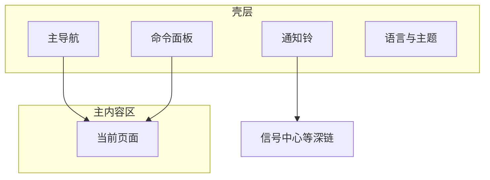

# 01 壳层：每一页外面那一圈，先认路

你好。打开 StockPulse 之后，中间的内容会换，但**外面那一圈**通常还在：左侧（或顶部）导航、通知铃、搜索/命令入口、语言和主题。

这一圈就叫 **壳层**。先把它认熟，后面换到分析、持仓、设置时，你就不会「找不到回去的路」。

> 💡 这一章不教你改配置文件，只教你：**去哪点、快捷键是什么、界面语言和报告语言有啥不一样**。

> ⚠️ 产品输出仅供研究学习，**不构成投资建议**。

---

## 你什么时候会用到壳层

| 场景 | 用壳层的哪一块 |
| --- | --- |
| 第一次打开，不知道功能在哪 | 主导航 |
| 想从任意页立刻去分析 | 命令面板 `Cmd/Ctrl + K` |
| 想知道有没有新提醒 | 通知铃 |
| 菜单想英文、报告想中文 | 界面语言（壳层）vs 报告语言（设置） |
| 晚上看屏幕刺眼 | 主题（浅色 / 深色） |
| 开启了登录保护 | `/login` 登录页 |

---

## 整体长什么样

宽屏时，常见是左侧导航 + 中间主内容 + 顶栏工具；窄屏时，导航可能收成汉堡菜单或顶栏抽屉——**功能还在，只是位置挤了**。

| 区域 | 常见位置 | 人话 |
| --- | --- | --- |
| 主导航 | 左侧 / 顶栏 | 目录：首页、研究、组合、Agent、设置 |
| 主内容区 | 中间 | 你正在用的功能页 |
| 通知铃 | 顶栏附近 | 有没有新信号/告警 |
| 命令面板 | 快捷键或搜索框 | 万能跳转 |

桌面客户端和 Web 的信息架构一致；个别桌面浮动窗以实际客户端为准。

---

## 主导航：五个一级域

当前产品把主入口收成五个域（文案以你屏幕为准）：

| 导航名 | 路由 | 里面有什么 | 手册 |
| --- | --- | --- | --- |
| **首页** | `/` | 今日焦点、待办、配置缺口 | [02](02-home.md) |
| **研究** | 组入口常到 `/research/market` | 见下表子菜单 | 03 / 04 / 09 / 12 |
| **组合** | `/portfolio` | 持仓记账（页面标题常写「持仓」） | [07](07-portfolio.md) |
| **Agent** | `/chat` | 问股多轮对话（页面标题常写「问股」） | [05](05-agent-chat.md) |
| **设置** | `/settings` | 模型、数据源、通知、安全 | [10](10-settings.md) |

### 「研究」里的子项

| 子项 | 路由 | 手册 |
| --- | --- | --- |
| 大盘复盘 | `/research/market` | [04](04-market-review.md) |
| 发现 | `/research/discover` | [12](12-discover.md) |
| 分析工作台 | `/research/analysis` | [03](03-analysis-workbench.md) |
| 回测 | `/research/backtest` | [09](09-backtest.md) |

### 侧栏里没有、但很重要的入口

| 去哪 | 怎么进 |
| --- | --- |
| **信号中心** `/signals` | 通知铃、命令面板、首页焦点行；见 [06](06-signals.md) |
| **个股工作区** `/stocks/代码` | 命令面板或外链；见 [13](13-stock-details.md) |
| **登录** `/login` | 开启管理员认证后；受保护页会带 `?redirect=` |

旧路径如 `/decision-signals`、`/alerts`、`/backtest`、`/screening` 一般会重定向到新地址。

---

## 命令面板：强烈建议学会

| 系统 | 快捷键 |
| --- | --- |
| macOS | `Cmd + K` |
| Windows / Linux | `Ctrl + K` |

| 你想做的事 | 可以试着输入 |
| --- | --- |
| 跳转页面 | `分析`、`持仓`、`信号`、`设置`、`首页` |
| 找股票 | `600519`、`AAPL` |
| 大盘相关 | `复盘`、`大盘` |

### 小练习：三步回到分析

1. 你正在设置页改模型。  
2. 按 `Cmd/Ctrl + K`，输入「分析」。  
3. 回车进入分析工作台——不必在侧栏里一层层点。

---

## 通知铃

铃铛汇总较新的信号与告警提醒。

- 点某条：常会深链到信号详情或历史。  
- **查看全部**：进入信号中心。  
- 一直是空的：若你还没跑过分析、也没建规则，**完全正常**。

---

## 界面语言、报告语言、主题

| 开关 | 改什么 | 不改什么 |
| --- | --- | --- |
| **界面语言** | 菜单、按钮、空状态 | 报告正文语言 |
| **报告语言** | 分析报告正文（多在设置 → 报告） | 菜单语言 |
| **主题** | 浅色 / 深色 | 业务逻辑 |

所以可以：**菜单英文 + 报告中文**。两者互不影响。

产品界面可能支持很多语言；本手册以简中 + 英文维护。

---

## 登录（若开启了认证）

1. 访问受保护页面时跳到 `/login`。  
2. 输入管理员密码登录。  
3. 成功后回到原来的 `redirect` 目标或首页。  
4. 改密码：设置 → 系统与安全 → 认证与安全。

未开启认证时，本地可能直接进业务页，以你的部署为准。

---

## 使用案例

**案例 A：迷路了**  
任意页 → `Cmd/Ctrl + K` → 输入「首页」→ 重新开始。

**案例 B：想看有没有推送**  
点铃铛 → 没有就去跑分析或建规则 → 有就点进去读。

**案例 C：菜单想换成英文**  
在壳层或设置切换界面语言为 English；报告语言保持中文即可。

---

## 术语

| 术语 | 人话 |
| --- | --- |
| 壳层 | 几乎每页都在的外框导航与工具 |
| 信息架构 IA | 菜单怎么分组、功能怎么摆 |
| 命令面板 | 快捷搜索跳转 |
| 深链 | 带参数的链接，直接打开某条信号/某段设置 |

---

## 相关

- [02 首页](02-home.md)  
- [06 信号中心](06-signals.md)  
- [10 设置](10-settings.md)  

上一篇：返回 [手册目录](README.md) · 下一篇：[02 首页](02-home.md)
