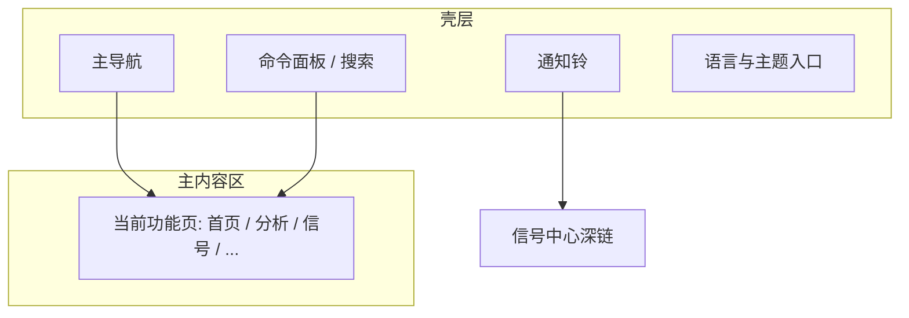

# 01 壳层与全局操作

「壳层」指你打开 StockPulse 后，**几乎每一页都还在的那一圈外框**：左侧（或顶部）导航、顶栏通知、搜索 / 命令入口、语言与主题。学会壳层，后面换页面就不会迷路。

> 💡 **这一章解决什么**  
> 不教你怎么写配置文件，只教你：**去哪点、快捷键是什么、界面语言和报告语言有何不同**。

## 适用场景

| 场景 | 你会用到壳层的哪部分 |
| --- | --- |
| 第一次打开，不知道功能在哪 | 主导航 + 命令面板 |
| 想从任意页立刻回分析 | `Cmd/Ctrl + K` 搜「分析」 |
| 想看有没有新提醒 | 通知铃 |
| 菜单是英文、报告想中文（或反过来） | 界面语言 vs 报告语言 |
| 晚上看屏幕刺眼 | 主题（浅色 / 深色） |

## 整体布局

| 区域 | 常见位置 | 作用 | 小白怎么记 |
| --- | --- | --- | --- |
| **主导航** | 宽屏在左侧；手机 / 窄屏常在顶部或抽屉 | 五个一级域：首页、研究、组合、Agent、设置 | 「目录」 |
| **主内容区** | 中央大块 | 当前功能页 | 「正文」 |
| **通知铃** | 顶栏或侧栏上方 | 最新**信号**与**告警**入口；也是进入**信号中心**的主路径之一 | 「有没有新消息」 |
| **搜索 / 命令入口** | 侧栏搜索框，或快捷键 | 跳转页面、搜股票、部分全局操作 | 「万能搜索」 |

桌面客户端与 Web 工作台的**信息架构**（Information Architecture，信息怎么分组、菜单怎么摆）一致；个别桌面浮动窗以实际客户端为准。

> ⚠️ **窄屏提示**  
> 手机或很窄的窗口里，左侧导航可能收成汉堡菜单或顶栏。找不到「设置」时，先点左上角菜单图标，或直接用命令面板。

## 主导航（与当前产品信息架构对齐）

一级导航固定为五个域；二级能力收在「研究」折叠组里。

| 导航名（界面常见文案） | 路由 | 大致包含 | 对应手册 |
| --- | --- | --- | --- |
| **首页** | `/` | 今日焦点、待办、配置缺口 | [02 首页](02-home.md) |
| **研究** | 组入口常落到 `/research/market` | 见下表子项 | 03 / 04 / 09 等 |
| **组合** | `/portfolio` | 持仓记账与风险（页面标题常为「持仓」） | [07 持仓](07-portfolio.md) |
| **Agent** | `/chat` | 问股多轮对话（页面标题常为「问股」） | [05 问股对话](05-agent-chat.md) |
| **设置** | `/settings` | 模型、数据源、通知、安全等 | [10 设置](10-settings.md) |

### 「研究」子导航

| 子项（界面常见文案） | 路由 | 手册 |
| --- | --- | --- |
| 大盘复盘 | `/research/market` | [04](04-market-review.md) |
| 发现 | `/research/discover` | [12 发现 / AlphaSift 选股](12-discover.md) |
| 分析工作台 | `/research/analysis` | [03](03-analysis-workbench.md) |
| 回测 | `/research/backtest` | [09](09-backtest.md) |

### 信号中心怎么进（不在一级侧栏）

| 方式 | 说明 |
| --- | --- |
| 通知铃 | 「查看全部」或点某条通知 |
| 命令面板 | 搜「信号」「信号中心」 |
| 直链 | `/signals`（可用 `tab` / `scope` 等参数，见 [06](06-signals.md)） |
| 组合页 | 持仓行 AI 建议相关链接 |

旧路径 `/decision-signals`、`/alerts`、`/backtest`、`/screening` 等会重定向到规范路由。

文案可能随版本微调；**以你屏幕上的标签为准**。产品改导航或路由时，应同步改本手册（贡献者见 README 维护说明）。

## 命令面板（强烈建议学会）

**快捷键**

| 系统 | 快捷键 |
| --- | --- |
| macOS | `Cmd + K` |
| Windows / Linux | `Ctrl + K` |

**能做什么**

| 输入意图 | 示例 | 结果 |
| --- | --- | --- |
| 跳转页面 | `分析`、`持仓`、`信号`、`设置` | 直接打开对应页 |
| 找股票 | `600519`、`AAPL` | 进入与该股相关的分析入口（以当前版本为准） |
| 全局操作 | 如「大盘复盘」 | 部分版本会列出可触发的操作 |

### 使用案例：三步回到分析

1. 你正在设置页改模型，想立刻看任务进度。  
2. 按 `Ctrl + K`（或 `Cmd + K`），输入「分析」。  
3. 回车进入分析工作台 → 打开「运行中任务」或「历史」。

> 💡 **为什么比点导航快**  
> 导航要先辨认分组再点二级菜单；命令面板是「打字即达」，适合键盘用户和页面很深的时候。

## 通知铃

通知铃聚合的是产品里的两类提醒（名称以界面为准）：

| 类型 | 含义 | 点进去通常到哪 |
| --- | --- | --- |
| **信号（Decision Signal）** | 从分析报告提炼出的结构化建议条目 | 信号中心某条记录 |
| **告警（Alert）** | 你设的规则被触发（如价格上破） | 信号中心告警 / 规则相关视图 |

**操作步骤**

1. 点击铃铛，查看最近条目。  
2. 点击某一条，**深链**（Deep link，带参数的直接跳转）到信号中心对应记录。  
3. 信号与告警的**未读状态**通常分开记；清理浏览器「站点数据」可能重置未读边界。  
4. 若某一通道加载失败，界面会提示「部分不可用」，可重试；**不要**在恢复后把新出现的条目误当成「已经读过」。

> ⚠️ **空铃铛不一定是坏了**  
> 若你还从未成功跑过个股分析、也没建告警规则，铃铛为空是正常现象。先完成 [03 分析工作台](03-analysis-workbench.md) 的第一份报告。

## 界面语言 vs 报告语言（最易混）

| 类型 | 影响范围 | 如何改 | 会不会互相带动 |
| --- | --- | --- | --- |
| **界面语言** | 导航、按钮、设置文案、空状态提示 | 登录前 / 登录后均可在界面切换（常见中 / 英） | **不会**自动改报告语言 |
| **报告语言** | 分析报告正文、部分通知里的报告文案 | 在 **设置** 中配置（常见 `zh` / `en` / `ko` 等） | **不会**自动改菜单语言 |

### 使用案例

- 你希望**菜单是英文**、**报告仍是中文**：只切界面语言，报告语言保持 `zh`。  
- 你希望**报告改英文**发给海外同事：只改设置里的报告语言，菜单可继续用中文。

> 💡 **术语**  
> - **UI（User Interface，用户界面）语言**：给人点的控件上的字。  
> - **报告语言**：模型写出来的长文、以及报告页上的固定说明文案。

## 主题（浅色 / 深色）

| 项目 | 说明 |
| --- | --- |
| 在哪切换 | 设置页，或顶栏入口（以界面为准） |
| 偏好存在哪 | 本机浏览器或桌面客户端本地，一般不跟服务器账号强绑定 |
| 建议 | 夜间长时间阅读可试深色，减轻刺眼；与分析结论无关 |

## 建议习惯（壳层级）

| 习惯 | 原因 |
| --- | --- |
| 改设置后点 **保存**，看到成功再离开 | 未保存 = 配置未生效；首页可能仍显示缺口 |
| 优先用命令面板做跨页跳转 | 减少在窄屏里找菜单的时间 |
| 分清「界面语言」和「报告语言」 | 避免以为切了菜单报告就会变 |
| 铃铛为空时先跑通分析 | 再排查「通知坏了」 |

## 与桌面客户端的关系

| 项目 | 说明 |
| --- | --- |
| 菜单结构 | 与 Web 对齐，便于一份手册两用 |
| 专属能力 | 如系统托盘、浮动助手等以客户端实际界面为准 |
| 安装与首次 Key | 见 [小白客户端安装与配置](../beginner-client-setup.md)，不属于壳层操作本身 |

## 相关

- [02 首页](02-home.md)
- [10 设置](10-settings.md)
- [06 信号中心](06-signals.md)（通知铃深链目标）

上一篇：[手册首页](README.md) · 下一篇：[02 首页](02-home.md)
