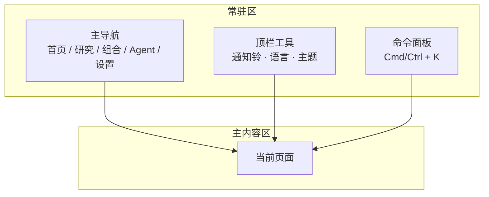
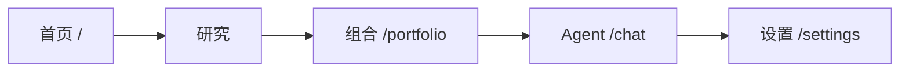
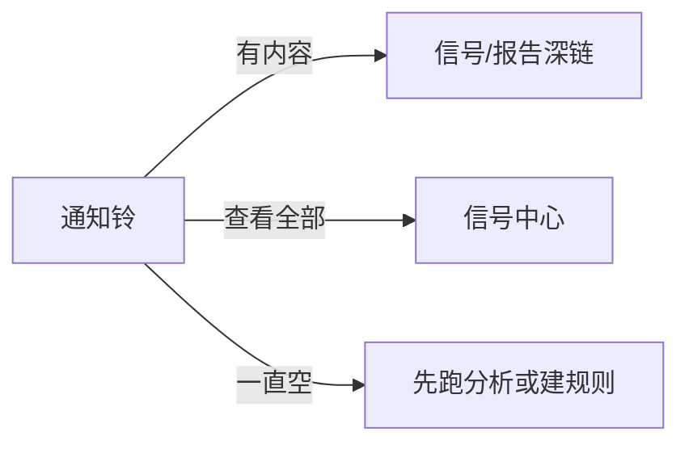
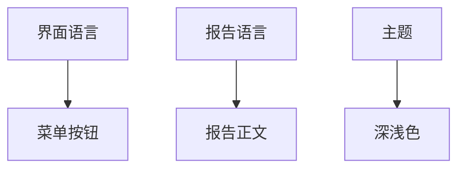

# 01 导航与顶栏

## 本章你会学会

1. 认清界面「常驻区」：侧栏/顶栏菜单、通知铃、命令面板、语言与主题  
2. 五个一级菜单各自通向哪里，以及**不在一级菜单里**的常用页怎么进  
3. 用命令面板在任意页快速跳转  
4. 分清「界面语言」和「报告语言」  
5. 开启登录后的跳转与改密入口  

> 📘 **本章范围**  
> 只讲界面全局入口与布局，**不讲** Docker、环境变量、服务器部署。  
> 安装与首次填 Key 见 [客户端安装](../beginner-client-setup.md)。

> ⚠️ **研究声明**  
> 产品输出仅供研究学习，**不构成投资建议**。

---

## 1. 先建立一张脑中地图

打开 StockPulse 后，**中间内容会随功能切换**，但四周的入口大多还在。  
可以把它想成一栋楼：电梯与门牌（导航）固定，房间（各业务页）在换。



| 区域 | 常见位置 | 你拿它做什么 |
| --- | --- | --- |
| **主导航** | 左侧栏；窄屏可能收到汉堡菜单 | 在五大业务域之间切换 |
| **主内容区** | 屏幕中央 | 真正干活：分析、读报告、记账… |
| **顶栏工具** | 上方 | 通知、语言、主题，有时还有用户/版本信息 |
| **命令面板** | 快捷键呼出的浮层 | 不想点菜单时，直接搜页面或代码 |

> 💡 **提示**  
> 桌面客户端与 Web 的**菜单结构一致**；窗口装饰（标题栏、系统菜单）以客户端为准，业务入口仍按本章理解即可。

---

## 2. 什么时候会用到本章

| 你的处境 | 用什么 |
| --- | --- |
| 第一次打开，不知道点哪 | 主导航五入口 + 下文「研究」子菜单表 |
| 在设置页里突然想去分析 | 命令面板 `Cmd/Ctrl + K` → 输入「分析」 |
| 想知道有没有新提醒 | 顶栏 **通知铃** |
| 菜单想用英文、报告想用中文 | 界面语言 vs 报告语言（见 §6） |
| 屏幕刺眼 / 夜间 | 主题：浅色 / 深色 |
| 部署开启了管理员登录 | `/login` 与设置里的认证区 |

---

## 3. 布局：宽屏与窄屏

> 🖼️ **配图占位** · `assets/shell-primary-nav-zh.png`  
> **应配内容**：宽屏：左侧五级导航（首页/研究/组合/Agent/设置）+ 顶栏通知铃与语言/主题；研究可展开子菜单。  
> **拍摄要点**：简体 UI；桌面宽屏；无 Key/Cookie；可淡标注「主导航」「顶栏」。  
> **状态**：待补图（清单：[assets/PLACEHOLDERS.md](assets/PLACEHOLDERS.md)）

### 3.1 宽屏（笔记本 / 外接显示器）

常见形态：

```text
┌────────┬──────────────────────────────┬─────────────┐
│ 主导航  │         主内容区              │  (可选)     │
│ 首页   │   当前功能页的表单/列表/报告   │  侧栏详情   │
│ 研究   │                              │             │
│ 组合   │                              │             │
│ Agent  │                              │             │
│ 设置   │                              │             │
└────────┴──────────────────────────────┴─────────────┘
              ↑ 顶栏：通知铃 · 语言 · 主题 …
```

### 3.2 手机或很窄的窗口

- 主导航可能收成 **左上角图标** 或 **顶栏抽屉**。  
- 功能**还在**，只是需要多点一次才能展开菜单。  
- 若找不到设置：先点菜单图标展开，再找「设置」。

> ✅ **推荐做法**  
> 首次配置与第一份报告，建议在宽度约 **≥1280px** 的窗口中完成，以便同时看到导航与主内容区。

---

## 4. 五个一级菜单（业务域）

主导航通常是这五个（文案以你屏幕为准）：



| 菜单 | 地址 | 手册 | 一句话 |
| --- | --- | --- | --- |
| **首页** | `/` | [02](02-home.md) | 今天看什么：焦点、待办、定时任务 |
| **研究** | 常先进 `/research/market` | 见下表 | 分析、复盘、发现、回测的文件夹 |
| **组合** | `/portfolio` | [07](07-portfolio.md) | 记账与风险；页面标题也常写「持仓」 |
| **Agent** | `/chat` | [05](05-agent-chat.md) | 多轮问股；页面标题也常写「问股」 |
| **设置** | `/settings` | [10](10-settings.md) | 模型、自选、通知、调度… |

> 📘 **名字不一致怎么办？**  
> 侧栏可能写「组合」，进页后标题写「持仓管理」——**同一功能**。  
> 侧栏写「Agent」，页内写「问股」——也是**同一入口**。以路由为准：`/portfolio`、`/chat`。

### 4.1 「研究」里的子菜单

| 子菜单 | 地址 | 手册 | 解决什么问题 |
| --- | --- | --- | --- |
| 大盘复盘 | `/research/market` | [04](04-market-review.md) | 市场整体气质 |
| 发现 | `/research/discover` | [12](12-discover.md) | 筛候选（实验能力） |
| 分析工作台 | `/research/analysis` | [03](03-analysis-workbench.md) | 个股 AI 报告主工厂 |
| 回测 | `/research/backtest` | [09](09-backtest.md) | 历史建议事后对照 |

### 4.2 一级菜单里没有、但很常用

| 页面 | 地址 | 怎么进 | 手册 |
| --- | --- | --- | --- |
| 信号中心 | `/signals` | 通知铃 / 命令面板 / 首页焦点 | [06](06-signals.md) |
| 个股行情 | `/stocks/代码` | 命令面板、链接、部分列表 | [13](13-stock-details.md) |
| 登录 | `/login` | 开启认证后访问受保护页 | 本节 §7 |

> ⚠️ **注意**  
> 信号中心**故意不在**五个一级导航里。找不到时优先：铃铛 → `Cmd/Ctrl+K` 搜「信号」→ 直接打开 `/signals`。

### 4.3 旧地址会跳转

| 旧地址（示例） | 通常去向 |
| --- | --- |
| `/decision-signals`、`/alerts` | 信号中心 |
| `/backtest` | 研究 → 回测 |
| `/screening` | 发现相关 |

书签若失效，改用上表新地址即可。

---

## 5. 命令面板（强烈建议学会）

> 🖼️ **配图占位** · `assets/shell-command-palette-zh.png`  
> **应配内容**：命令面板打开态：搜索框 + 至少一条跳转结果（示例关键词「分析」）。  
> **拍摄要点**：Cmd/Ctrl+K 呼出后截取浮层；保留半透明遮罩。  
> **状态**：待补图（清单：[assets/PLACEHOLDERS.md](assets/PLACEHOLDERS.md)）

### 5.1 怎么打开

| 系统 | 快捷键 |
| --- | --- |
| macOS | `Cmd + K` |
| Windows / Linux | `Ctrl + K` |

### 5.2 可以输入什么

| 目的 | 示例输入 |
| --- | --- |
| 跳转页面 | 可尝试：`分析`、`工作台`、`持仓`、`组合`、`信号`、`设置`、`首页`、`复盘`、`问股`（以当前版本检索结果为准） |
| 找股票 | 可尝试代码，如 `600519`、`hk00700`、`AAPL` |
| 英文界面 | 可尝试 `market`、`settings`、`portfolio` 等英文关键词 |

### 5.3 分步教程：从设置跳去分析

1. 任意时刻停留在设置页。  
2. 按下 `Cmd/Ctrl + K`。  
3. 输入「分析」或「工作台」。  
4. 用方向键选中 **分析工作台**，回车。  
5. 确认地址变为 `/research/analysis` 一带。

> ✅ **推荐做法**  
> 把命令面板当成「全局搜索」：迷路时先 `K`，再考虑点侧栏。

> ❌ **不推荐**  
> 为了找一个页面反复点返回；窄屏下可先展开菜单，或直接使用命令面板快捷键。

---

## 6. 通知铃

| 操作 | 常见结果 |
| --- | --- |
| 点某一条提醒 | 跳到对应信号、报告或相关上下文 |
| 点「查看全部」类入口 | 进入 [信号中心](06-signals.md) |
| 铃铛长期为空 | 若从未分析、也未建规则，**属于正常** |



> 💡 **提示**  
> 铃铛空 ≠ 产品坏了。它依赖「已有信号/告警事件」。先跑通 [03 分析工作台](03-analysis-workbench.md) 再回来看。

---

## 7. 界面语言、报告语言、主题

这三件事**互相独立**，是新手最容易混的配置之一。

| 设置 | 改什么 | **不**改什么 | 常见位置 |
| --- | --- | --- | --- |
| **界面语言** | 菜单、按钮、空状态、表单标签 | 分析报告正文语言 | 顶栏或设置 |
| **报告语言** | 个股/大盘等报告正文 | 菜单语言 | 设置 → 报告相关 |
| **主题** | 浅色 / 深色外观 | 业务逻辑与数据 | 顶栏或设置 |



> ✅ **推荐做法**  
> 菜单用 English、报告用 `zh`：很多人这样配。改完后**打开一份旧报告确认正文语言**，比只看设置开关更踏实。

产品 UI 可能支持简中 / 繁中 / 英 / 日 / 韩 / 德 / 西 / 法 / 马来 / 印尼等；**本手册**另有多语言包，见 [i18n/README.md](i18n/README.md)。界面语言与手册语言不必一致。

---

## 8. 登录（仅当部署开启认证）

### 8.1 典型流程

1. 访问受保护页面（如设置、分析）。  
2. 被重定向到 `/login?redirect=…`。  
3. 输入管理员密码（以你的部署配置为准）。  
4. 登录成功后回到 `redirect` 指向的页面，或首页。  
5. 修改密码：设置 → **系统与安全** → **认证与安全**（文案以界面为准）。

### 8.2 未开启认证时

本机/内网部署可能**直接进入业务页**，没有登录墙——这是配置选择，不是漏做了登录。

> ⚠️ **注意**  
> 不要在公共场合截图带有会话 Cookie 或密码的界面。改密后旧会话是否失效以产品实现为准，敏感环境建议改密后重登。

---

## 9. 使用案例（详细）

### 案例 A：完全迷路了

| 步 | 动作 |
| --- | --- |
| 1 | `Cmd/Ctrl + K` |
| 2 | 输入「首页」并回车 |
| 3 | 从首页再选「开始分析」或主导航「研究」 |

### 案例 B：想确认有没有推送/信号

1. 点通知铃。  
2. 若空：去工作台跑一只熟悉股票 → 完成后再看铃铛与 `/signals`。  
3. 若有条目：点进阅读失效条件，不要只看「买入」二字。

### 案例 C：团队演示要用英文菜单

1. 切换界面语言 → English。  
2. 报告语言保持中文（若受众读中文报告）。  
3. 打开任意报告确认正文仍是中文。

### 案例 D：手机上找不到设置

1. 点左上角或顶栏菜单图标展开导航。  
2. 点「设置」。  
3. 或能外接键盘时用命令面板搜 `settings`。

### 案例 E：书签还是旧的 `/alerts`

打开后应自动跳到信号中心；若没有，手动访问 `/signals` 并更新书签。

---

## 10. 自检清单

- [ ] 能说出五个一级菜单各自干什么  
- [ ] 知道信号中心**不在**一级菜单，会用铃铛或 `/signals`  
- [ ] 会用 `Cmd/Ctrl + K` 从任意页跳到分析或设置  
- [ ] 分得清界面语言 vs 报告语言  
- [ ] （若开启登录）知道 `/login` 与改密入口  

---

## 11. 术语

| 术语 | 含义 |
| --- | --- |
| 主导航 / 一级菜单 | 首页、研究、组合、Agent、设置 |
| 命令面板 | 快捷键呼出的全局搜索与跳转 |
| 深链 | 带查询参数的 URL，直接打开某状态（如某条信号、某段设置） |
| 顶栏 | 页面上方工具条区域 |
| redirect | 登录后要回到的原页面地址参数 |

---

## 12. 相关阅读

| 下一站 | 为什么 |
| --- | --- |
| [02 首页](02-home.md) | 每天第一眼看什么 |
| [06 信号中心](06-signals.md) | 铃铛背后的完整页面 |
| [10 设置](10-settings.md) | 语言、主题、认证的配置细节 |
| [11 日常工作流与应用场景](11-daily-workflows.md) | 把导航嵌进一天的用法 |

上一篇：返回 [手册目录](README.md) · 下一篇：[02 首页](02-home.md)
