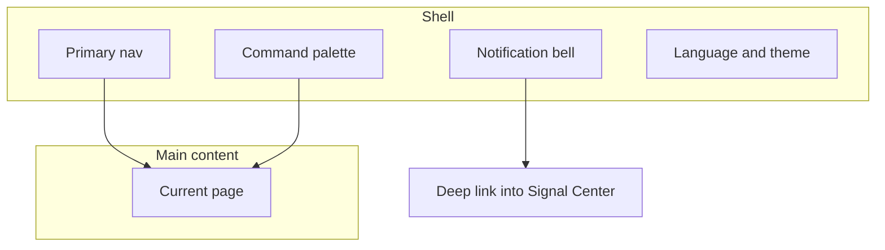

# 01 Shell and global actions

After you open StockPulse, the center content changes, but the **outer frame** usually stays: primary navigation (left or top), notification bell, search / command entry, language and theme.

That frame is the **shell**. Learn it once so you can reach analysis, portfolio, and settings without getting lost.

This chapter is UI navigation only — not config files or deployment.

> Research only — **not investment advice**.

---

## When you need the shell

| Scenario | Shell piece |
| --- | --- |
| First open — where is everything? | Primary nav |
| Jump to analysis from any page | Command palette `Cmd/Ctrl + K` |
| Any new alerts? | Notification bell |
| English menus, Chinese reports (or reverse) | UI language (shell) vs report language (Settings) |
| Screen glare at night | Theme (light / dark) |
| Login protection is on | `/login` |

---

## Layout

On wide screens: left nav + main content + top tools. On narrow screens the nav may collapse into a hamburger or top drawer — **features stay, placement tightens**.

| Region | Typical place | Meaning |
| --- | --- | --- |
| Primary nav | Left / top | Catalog: Home, Research, Agent, Signal Center, Portfolio, Settings |
| Main content | Center | The page you are using |
| Notification bell | Desktop sidebar footer, beside the profile entry | New signals / alerts |
| Command palette | Shortcut or search box | Universal jump |

Desktop and Web share the same information architecture; desktop-only windows follow the live client.

---

## Six primary domains

These six top-level items keep the core workspaces visible:

| Nav label | Route(s) | What is inside | Manual |
| --- | --- | --- | --- |
| **Home** | `/` | Today focus, todos, configuration gaps | [02](02-home_EN.md) |
| **Research** | `/research` | Overview and the tools in the table below | [03](03-analysis-workbench_EN.md) / [04](04-market-review_EN.md) / [09](09-backtest_EN.md) |
| **Agent** | `/chat` | Multi-turn chat (page title often **Ask stock**) | [05](05-agent-chat_EN.md) |
| **Signal Center** | `/signals` | AI signals, rules, trigger and notification history, review | [06](06-signals_EN.md) |
| **Portfolio** | `/portfolio` | Holdings bookkeeping (page title often **Holdings**) | [07](07-portfolio_EN.md) |
| **Settings** | `/settings` | Models, data sources, notifications, security | [10](10-settings_EN.md) |

On expanded desktop navigation and in the mobile drawer, the **Research** label
opens `/research`; the trailing arrow only expands or collapses the Research
tools, without a duplicate **Research overview** child. On the compact rail,
**Research** still opens a flyout whose first item is **Research overview**.

### Research pages

| Page | Route | Manual |
| --- | --- | --- |
| Research overview | `/research` | Entry cards for the four Research tools |
| Market review | `/research/market` | [04](04-market-review_EN.md) |
| Discover | `/research/discover` | No dedicated chapter yet; sidebar **Research → Discover** (legacy `/screening` redirects) |
| Analysis workbench | `/research/analysis` | [03](03-analysis-workbench_EN.md) |
| Backtest | `/research/backtest` | [09](09-backtest_EN.md) |

### Important surfaces **not** in the primary sidebar

| Surface | How to open |
| --- | --- |
| **Human approvals** `/approvals` | **Not** in the primary sidebar; open via the Home **Review human approvals** control when administrator sign-in is enabled (labels as in UI), or search the command palette; contract: `docs/human-approvals_EN.md` |
| **Notification Center** `/notifications` | Notification bell → View all, or search the command palette |
| **Event Alerts** `/event-alerts` | Event Calendar / Signal Center discovery entry, or search the command palette |
| **Report Compare** `/research/report-compare` | Stock workspace compare entry, or search the command palette |
| **Stock workspace** | Type a code in the palette, or open `/stocks/<code>` (example: `/stocks/600519`). The page shows per-field source, lag, staleness, and cross-provider conflicts; conflicts stay visible instead of silently picking one source as truth |
| **Login** `/login` | When admin auth is on; protected pages use `?redirect=` |

Legacy paths such as `/decision-signals`, `/alerts`, `/backtest`, and `/screening` usually redirect to the canonical routes above.

---

## Command palette

| OS | Shortcut |
| --- | --- |
| macOS | `Cmd + K` |
| Windows / Linux | `Ctrl + K` |

Useful queries include `analysis`, `portfolio`, `signals`, `settings`, `notification center`, `event-driven alerts`, `report version compare`, section labels such as `Model Sources`, skill names such as `chan theory`, pipeline presets such as `standard research`, a ticker such as `600519`, or at least three characters from a saved report's stock name, code, report type, date, trend, summary, or advice. Results are grouped into stocks, reports, skills, pipelines, settings, pages, and actions. Skill matches open Discover with the strategy deep link; pipeline presets and Settings sections use the canonical Settings section/view routes. Use `Up` / `Down` and `Enter` without leaving the search field; a report result opens its exact Analysis Workbench history record. If report search is temporarily unavailable, stock, page, and action search remain available. Personal Performance stays a paper-account contextual entry and is not indexed as a palette page.

---

## Notification bell

Opens recent signals and alerts and deep-links into Signal Center. An empty bell is normal if you have never analyzed and never created rules.

---

## UI language vs report language

| Setting | Changes | Does not change |
| --- | --- | --- |
| **UI language** | Menus, buttons, empty states | Report body language |
| **Report language** | Analysis report body (Settings) | Menu language |
| **Theme** | Light / dark chrome | Business logic |

They are independent: English menus + Chinese reports is a valid combination.

Theme and UI language use the same compact dropdown treatment in the Profile menu, with a neutral selected state. On wide screens, both menus open to the right of their setting; on narrow screens, they adapt their direction and height to stay within the viewport.

## Global error notifications

API and external-service failures appear in a compact, top-centered Toast overlay instead of entering the page content flow, so they do not resize tables, reports, or forms. Error Toasts remain until dismissed. When recovery is available, the retry action appears on the right.

---

## Login

When administrator auth is enabled, protected routes redirect to `/login` (often with a `redirect` query). Change the password under Settings → System & Security → Auth when that section is available.

---

## Related

- [02 Home](02-home_EN.md)
- [06 Signal center](06-signals_EN.md)
- [10 Settings](10-settings_EN.md)

Previous: [Manual index](README_EN.md) · Next: [02 Home](02-home_EN.md)
