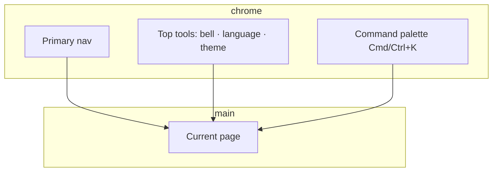

# 01 Navigation and top bar

## What you will learn

1. Recognize the **persistent chrome**: primary nav, bell, command palette, language, theme  
2. Know the five primary menus and how to reach pages **not** in that list  
3. Jump anywhere with the command palette  
4. Separate **UI language** from **report language**  
5. Use login when admin auth is enabled  

> 📘 **Scope**  
> UI navigation only—not Docker, env files, or server ops. Install: [beginner setup](../beginner-client-setup_EN.md).

> ⚠️ **Research only**  
> Output is for learning/research — **not investment advice**.

---

## 1. Mental map

| Area | Typical place | Job |
| --- | --- | --- |
| Primary nav | Left (or top) | Switch among five domains |
| Main content | Center | Actual work |
| Top tools | Top bar | Bell, language, theme |
| Command palette | Shortcut overlay | Search pages / symbols |

> 💡 **Tip**  
> Desktop and Web share the same business menu structure.

---

## 2. When this chapter matters

| Situation | Use |
| --- | --- |
| First open, lost | Primary nav + Research children table |
| In Settings, need analysis | `Cmd/Ctrl+K` → “analysis” |
| New alerts? | Notification bell |
| English menus, Chinese reports | UI vs report language |
| Dark mode | Theme |
| Auth enabled | `/login` |

---

## 3. Wide vs narrow layout

> 🖼️ **Figure placeholder** · `assets/shell-primary-nav-en.png`  
> **Capture**：Wide layout: five primary nav items + top bar bell/language/theme; Research expanded.  
> **Notes**：English UI; no secrets.  
> **Status**：pending — see [assets/PLACEHOLDERS.md](assets/PLACEHOLDERS.md)

Wide: left nav + main + optional detail.  
Narrow: nav collapses into a menu icon—same destinations, one extra tap.

> ✅ **Recommended**  
> Finish first setup on a ≥1280px window when possible.

---

## 4. Five primary menus

| Menu | Route | Manual | One-liner |
| --- | --- | --- | --- |
| **Home** | `/` | [02](02-home_EN.md) | What to look at today |
| **Research** | often `/research/market` | 03/04/09/12 | Analysis folder |
| **Portfolio** | `/portfolio` | [07](07-portfolio_EN.md) | Bookkeeping; title may say Holdings |
| **Agent** | `/chat` | [05](05-agent-chat_EN.md) | Multi-turn chat; title may say Ask stock |
| **Settings** | `/settings` | [10](10-settings_EN.md) | Models, watchlist, notify, schedule |

### Research children

| Child | Route | Manual |
| --- | --- | --- |
| Market review | `/research/market` | [04](04-market-review_EN.md) |
| Discover | `/research/discover` | [12](12-discover_EN.md) |
| Analysis workbench | `/research/analysis` | [03](03-analysis-workbench_EN.md) |
| Backtest | `/research/backtest` | [09](09-backtest_EN.md) |

### Not in primary nav (but common)

| Page | Route | How |
| --- | --- | --- |
| Signal Center | `/signals` | Bell / palette / Home focus |
| Stock quotes | `/stocks/{code}` | Palette / links |
| Login | `/login` | When auth is on |

> ⚠️ **Note**  
> Signal Center is **intentionally** off the primary five. Use the bell or `/signals`.

Legacy `/decision-signals`, `/alerts`, `/backtest`, `/screening` usually redirect.

---

## 5. Command palette

> 🖼️ **Figure placeholder** · `assets/shell-command-palette-en.png`  
> **Capture**：Command palette open with search box and at least one jump result.  
> **Notes**：Cmd/Ctrl+K; keep overlay.  
> **Status**：pending — see [assets/PLACEHOLDERS.md](assets/PLACEHOLDERS.md)

| OS | Shortcut |
| --- | --- |
| macOS | `Cmd+K` |
| Windows/Linux | `Ctrl+K` |

Try: analysis, portfolio, signals, settings, home, market, or a ticker (`600519`, `AAPL`).

> ✅ **Recommended**  
> When lost, press `K` before hunting the sidebar.

---

## 6. Notification bell

| Action | Result |
| --- | --- |
| Open an item | Deep-link to signal/report |
| View all | Signal Center |
| Always empty | Normal if you never analyzed and never created rules |

---

## 7. UI language vs report language vs theme

| Setting | Changes | Does **not** change |
| --- | --- | --- |
| UI language | Menus, buttons, empty states | Report body language |
| Report language | Analysis report body | Menus |
| Theme | Light/dark | Business logic |

English menus + Chinese reports is a valid combo—open a report to verify body language after changing.

---

## 8. Login (when enabled)

Protected routes → `/login?redirect=…` → password → return.  
Change password: Settings → System & Security → Auth.  
If auth is off, the app may open business pages directly.

---

## 9. Use cases

**Lost:** palette → “home”.  
**Check push/signals:** bell; if empty, run one analysis first.  
**Demo in English UI:** switch UI language; keep report language if needed.  
**Old `/alerts` bookmark:** should land on Signal Center; else open `/signals`.

---

## 10. Self-check

- [ ] Name the five primary menus  
- [ ] Open Signal Center without primary nav  
- [ ] Jump with `Cmd/Ctrl+K`  
- [ ] Explain UI language vs report language  

---

## Related

[02 Home](02-home_EN.md) · [06 Signals](06-signals_EN.md) · [10 Settings](10-settings_EN.md) · [11 Workflows](11-daily-workflows_EN.md)

Prev: [Index](README_EN.md) · Next: [02 Home](02-home_EN.md)
