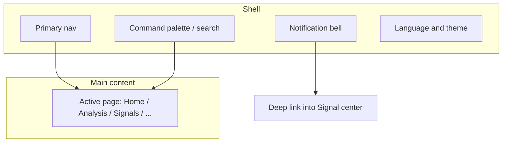

# 01 Shell and global actions

The **shell** is the frame that stays around almost every page: primary navigation, notification bell, search / command entry, language and theme. Once you know the shell, moving between features is much easier.

> 💡 **What this chapter is for**  
> Not server config files — only **where to click**, shortcuts, and how **UI language** differs from **report language**.

## When you use the shell

| Scenario | Shell piece |
| --- | --- |
| First open; where is everything? | Primary nav + command palette |
| Jump back to analysis from anywhere | `Cmd/Ctrl + K` → “analysis” |
| Check new reminders | Notification bell |
| English menus, Chinese reports (or the reverse) | UI language vs report language |
| Screen glare at night | Theme (light / dark) |

## Layout

| Area | Typical location | Purpose | Plain meaning |
| --- | --- | --- | --- |
| **Primary nav** | Left on wide screens; top or drawer on narrow | Five domains: Home, Research, Portfolio, Agent, Settings | The “table of contents” |
| **Main content** | Center | Active feature page | The “body” |
| **Notification bell** | Top or upper sidebar | Latest **signals** / **alerts**; also a main path into **Signal Center** | “Anything new?” |
| **Search / command** | Sidebar search or shortcut | Jump pages, find tickers, some global actions | “Universal search” |

Desktop and Web share the same **information architecture** (how features are grouped). Desktop-only windows follow the shipped client.

> ⚠️ **Narrow screens**  
> The left nav may collapse into a menu icon. If you cannot find Settings, open that menu or use the command palette.

## Primary navigation (matches current product IA)

Five top-level domains; secondary tools live under **Research**.

| Nav label (live UI) | Route | Contents | Manual |
| --- | --- | --- | --- |
| **Home** | `/` | Focus, todos, config gaps | [02 Home](02-home_EN.md) |
| **Research** | Group often opens `/research/market` | Children below | 03 / 04 / 09 |
| **Portfolio** | `/portfolio` | Holdings bookkeeping & risk (page title may say Holdings) | [07 Portfolio](07-portfolio_EN.md) |
| **Agent** | `/chat` | Multi-turn chat (page title may say Ask stock) | [05 Agent chat](05-agent-chat_EN.md) |
| **Settings** | `/settings` | Models, data, notifications, security | [10 Settings](10-settings_EN.md) |

### Research children

| Child label | Route | Manual |
| --- | --- | --- |
| Market review | `/research/market` | [04](04-market-review_EN.md) |
| Discover | `/research/discover` | [12 Discover / AlphaSift](12-discover_EN.md) |
| Analysis Workbench | `/research/analysis` | [03](03-analysis-workbench_EN.md) |
| Backtest | `/research/backtest` | [09](09-backtest_EN.md) |

### How to open Signal Center (not in primary sidebar)

| Method | Note |
| --- | --- |
| Notification bell | “View all” or open an item |
| Command palette | Search “signal” / “Signal Center” |
| Direct URL | `/signals` (see [06](06-signals_EN.md) for `tab` / `scope`) |
| Portfolio | AI suggestion links on holdings rows |

Legacy paths such as `/decision-signals`, `/alerts`, `/backtest`, `/screening` redirect to canonical routes.

### Login (when admin auth is enabled)

| Item | Note |
| --- | --- |
| Route | `/login`; protected routes add `?redirect=` |
| When | Auth / admin password enabled in Settings |
| After success | Redirect target or Home |
| Change password | **Settings → System & Security → Auth & Security** |

Without auth, local installs may open the app directly.

### Stock workspace

Quote page `/stocks/:code` — [13 Stock workspace](13-stock-details_EN.md). Not a primary sidebar item.

Labels may shift by version; **trust the live UI**. When product PRs change nav or routes, update this manual in the same release train.

## Command palette (worth learning)

| OS | Shortcut |
| --- | --- |
| macOS | `Cmd + K` |
| Windows / Linux | `Ctrl + K` |

| Intent | Example | Result |
| --- | --- | --- |
| Jump to a page | `analysis`, `portfolio`, `signals` | Opens that page |
| Find a stock | `600519`, `AAPL` | Related analysis entry (version-dependent) |
| Global action | e.g. market review | Listed when the build supports it |

### Example: three steps back to analysis

1. You are in Settings editing a model.  
2. Press `Ctrl + K` / `Cmd + K`, type “analysis”.  
3. Open Running tasks or History on the workbench.

> 💡 **Why it is faster**  
> Typing beats hunting nested menus, especially on small screens.

## Notification bell

| Type | Meaning | Typical landing |
| --- | --- | --- |
| **Decision signal** | Structured advice extracted from an analysis | A Signal center row |
| **Alert** | A rule you defined fired (e.g. price cross) | Alert / rules related view |

1. Open the bell.  
2. Click an item to **deep-link** into Signal center.  
3. Unread state for signals and alerts is usually separate; clearing site data may reset it.  
4. Partial channel failure shows a retryable warning — do not treat newly recovered items as already read.

> ⚠️ **Empty bell is often normal**  
> No successful single-stock analysis and no alert rules yet → empty is expected. Run your first report via [03 Analysis workbench](03-analysis-workbench_EN.md).

## UI language vs report language

| Type | Affects | How to change | Cross-linked? |
| --- | --- | --- | --- |
| **UI language** | Nav, buttons, settings chrome | In-app switch (often zh/en), including before login when available | **Does not** change report language |
| **Report language** | Report body and some notification report copy | **Settings** (often `zh` / `en` / `ko`) | **Does not** change menu language |

### Examples

- English **menus**, Chinese **reports**: switch UI language only; keep report language `zh`.  
- English **reports** for a colleague: change report language in Settings; menus can stay Chinese.

> 💡 **Terms**  
> - **UI (user interface) language**: labels on controls.  
> - **Report language**: long-form model output and fixed report chrome.

## Theme

| Item | Note |
| --- | --- |
| Where | Settings or top bar (follow live UI) |
| Storage | Local browser or desktop client |
| Tip | Dark theme is comfort only; it does not change analysis logic |

## Shell-level habits

| Habit | Why |
| --- | --- |
| **Save** settings and wait for success | Unsaved = not applied; Home may still show gaps |
| Prefer the command palette for cross-page jumps | Faster on narrow layouts |
| Keep UI language and report language distinct | Avoid false expectations |
| Empty bell → run analysis first | Before debugging “notifications broken” |

## Desktop client

| Item | Note |
| --- | --- |
| Menu structure | Aligned with Web so one manual covers both |
| Desktop-only features | Tray, floating assistant, etc. follow the shipped client |
| Install and first API key | [Beginner client setup](../beginner-client-setup.md) (Chinese); not part of shell clicks |

## Related

- [02 Home](02-home_EN.md)
- [10 Settings](10-settings_EN.md)
- [06 Signal center](06-signals_EN.md)

Previous: [Manual home](README_EN.md) · Next: [02 Home](02-home_EN.md)
