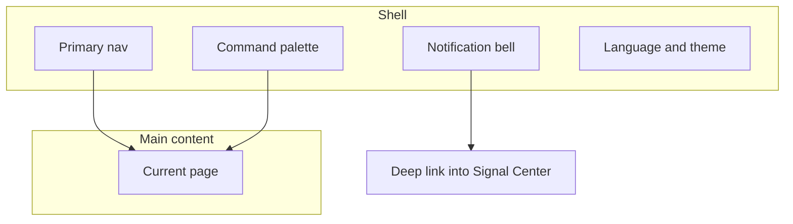

# 01 Shell and global actions

After you open StockPulse, the center content changes, but the **outer frame** usually stays: primary navigation (left or top), notification bell, search / command entry, language and theme.

That frame is the **shell**. Learn it once so you can reach analysis, portfolio, and settings without getting lost.

This chapter is UI navigation only — not config files or deployment.

> Research only — **not investment advice**.

---

## When you need the shell

| Scenario | Shell piece |
| --- | --- |
| First open — where is everything? | Primary nav |
| Jump to analysis from any page | Command palette `Cmd/Ctrl + K` |
| Any new alerts? | Notification bell |
| English menus, Chinese reports (or reverse) | UI language (shell) vs report language (Settings) |
| Screen glare at night | Theme (light / dark) |
| Login protection is on | `/login` |

---

## Layout

On wide screens: left nav + main content + top tools. On narrow screens the nav may collapse into a hamburger or top drawer — **features stay, placement tightens**.

| Region | Typical place | Meaning |
| --- | --- | --- |
| Primary nav | Left / top | Catalog: Home, Research, Portfolio, Agent, Settings |
| Main content | Center | The page you are using |
| Notification bell | Near top bar | New signals / alerts |
| Command palette | Shortcut or search box | Universal jump |

Desktop and Web share the same information architecture; desktop-only windows follow the live client.

---

## Five primary domains

These five top-level items match the product navigation:

| Nav label | Route(s) | What is inside | Manual |
| --- | --- | --- | --- |
| **Home** | `/` | Today focus, todos, configuration gaps | [02](02-home_EN.md) |
| **Research** | group often opens `/research/market` | Children in the table below | [03](03-analysis-workbench_EN.md) / [04](04-market-review_EN.md) / [09](09-backtest_EN.md) |
| **Portfolio** | `/portfolio` | Holdings bookkeeping (page title often **Holdings**) | [07](07-portfolio_EN.md) |
| **Agent** | `/chat` | Multi-turn chat (page title often **Ask stock**) | [05](05-agent-chat_EN.md) |
| **Settings** | `/settings` | Models, data sources, notifications, security | [10](10-settings_EN.md) |

### Research children

| Child | Route | Manual |
| --- | --- | --- |
| Market review | `/research/market` | [04](04-market-review_EN.md) |
| Discover | `/research/discover` | No dedicated chapter yet; sidebar **Research → Discover** (legacy `/screening` redirects) |
| Analysis workbench | `/research/analysis` | [03](03-analysis-workbench_EN.md) |
| Backtest | `/research/backtest` | [09](09-backtest_EN.md) |

### Important surfaces **not** in the primary sidebar

| Surface | How to open |
| --- | --- |
| **Signal Center** `/signals` | Notification bell, command palette, Home focus rows; see [06](06-signals_EN.md) |
| **Stock workspace** | Type a code in the palette, or open `/stocks/<code>` (example: `/stocks/600519`) |
| **Login** `/login` | When admin auth is on; protected pages use `?redirect=` |

Legacy paths such as `/decision-signals`, `/alerts`, `/backtest`, and `/screening` usually redirect to the canonical routes above.

---

## Command palette

| OS | Shortcut |
| --- | --- |
| macOS | `Cmd + K` |
| Windows / Linux | `Ctrl + K` |

Useful queries: `analysis`, `portfolio`, `signals`, `settings`, or a ticker such as `600519`.

---

## Notification bell

Opens recent signals and alerts and deep-links into Signal Center. An empty bell is normal if you have never analyzed and never created rules.

---

## UI language vs report language

| Setting | Changes | Does not change |
| --- | --- | --- |
| **UI language** | Menus, buttons, empty states | Report body language |
| **Report language** | Analysis report body (Settings) | Menu language |
| **Theme** | Light / dark chrome | Business logic |

They are independent: English menus + Chinese reports is a valid combination.

---

## Login

When administrator auth is enabled, protected routes redirect to `/login` (often with a `redirect` query). Change the password under Settings → System & Security → Auth when that section is available.

---

## Related

- [02 Home](02-home_EN.md)
- [06 Signal center](06-signals_EN.md)
- [10 Settings](10-settings_EN.md)

Previous: [Manual index](README_EN.md) · Next: [02 Home](02-home_EN.md)
