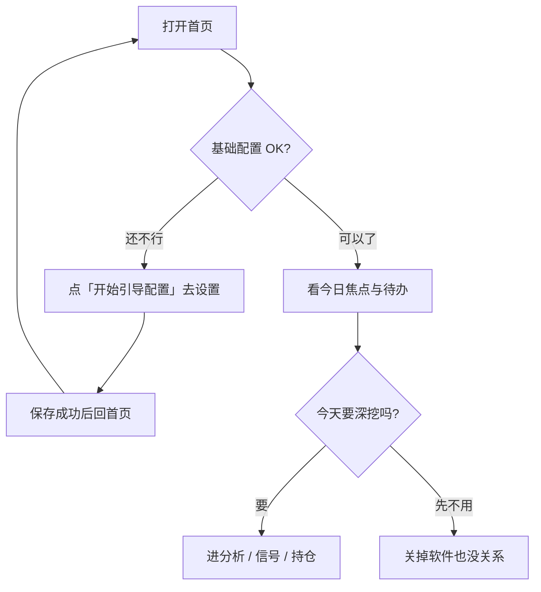

# 02 首页：打开软件后，先看这里

你好。如果你是第一次打开 StockPulse，首页可能会让人有点懵：这里没有一大篇报告，而是几块卡片和提示。别急——这是故意的。

首页的定位很简单：**帮你决定「今天先看什么」**，而不是一上来就把所有历史报告塞满屏幕。你可以把它当成「今日工作台的门口」，先扫一眼，再走进分析、信号或持仓。

> 💡 **第一次来？请先记住两件事**  
> 1. 至少配置好一个能测通的 **AI 模型**，并点过保存。  
> 2. 自选股里至少有 **1～3 个** 你认识的代码（例如 `600519`）。  
> 如果这两项没做好，首页会一直提醒「基础配置未完成」。这不是坏了，是系统在保护你：配置不齐就硬跑分析，多半只会失败、浪费额度。

> ⚠️ 首页上的摘要、信号只供学习与研究，**不构成投资建议**。是否交易、怎么仓位，请你自己判断。

---

## 怎么进入首页

| 方式 | 你怎么做 |
| --- | --- |
| 最常见 | 点左侧（或窄屏菜单里的）**首页** |
| 地址栏 | 打开 `/` |
| 命令面板 | `Cmd/Ctrl + K`，输入「首页」 |
| 配完设置后 | 保存成功后，再点回首页，看缺口提示有没有消失 |

---

## 首页适合干什么

| 你现在的情况 | 建议你怎么用首页 |
| --- | --- |
| 刚装好，还不会用 | 先看有没有黄色/警告条，跟着 **开始引导配置** 走 |
| 开盘前只有几分钟 | 扫「今日焦点」和「待办」，只点进真正关心的 1～2 只 |
| 已经跑过分析 | 从焦点进信号详情，或展开「最近分析」读报告 |
| 数据加载怪怪的 | 看「首页数据不完整」，点 **重试** |
| 只想马上分析一只票 | 焦点为空时点 **开始分析**，会进分析工作台 |

---

## 页面长什么样（用大白话说）

想象首页从上到下大致是这样：

1. **（可能有）配置未完成的提示条**——最重要，先处理它。  
2. **中间三块核心区**：今日焦点、待办、信号摘要。  
3. **可展开区域**：晨报（大盘）、最近分析——默认常常是收起来的，避免一屏太挤。

### 1. 「基础配置未完成」提示条

当你还没配好最小可用环境时，会出现类似 **基础配置未完成** 的提示，并列出还缺什么（例如模型、自选）。

- 点 **开始引导配置**：会跳到设置的「概览 / 就绪」一类页面，按检查项补齐即可。  
- 也可以点关闭先看界面，但**真正能跑分析之前**，还是建议把缺口补上。  
- 补完后务必 **保存**，再回首页。只改字不保存，提示不会消失。

### 2. 今日焦点

这里展示的是：系统认为你「最近值得看一眼」的 **有效信号（active）**，通常按时间优先。

每一行一般会看到股票名称/代码，以及一个方向标签（比如观望、持有、偏多之类——以界面为准）。

| 你看到的状态 | 通常表示 | 建议动作 |
| --- | --- | --- |
| 有若干行 | 已经有可展示的有效信号 | 点感兴趣的一行，进信号中心看详情 |
| **暂无需要关注的信号** | 还没跑出有效信号，或都被关掉了 | 点 **开始分析**，先完成第一份报告 |
| 加载失败 / 数据不完整 | 拉信号时出错 | 点重试；仍失败再查网络与后端是否在跑 |

点某一行后，通常会进入 **信号中心**，并带上这只股票的上下文，方便你继续筛选或建规则。

### 3. 待办

这里的「待办」**不是**生活类 To-Do 清单，而是偏研究用的提醒，例如：某些有效信号快过期了，或需要你再评估一下。

| 状态 | 怎么理解 |
| --- | --- |
| 有条目 | 系统在说：「这几条建议可能旧了，你抽空看一眼还成不成立。」 |
| **待办已清零** | 近期没有这类临期再评估事项，可以松一口气 |
| 说明里提到审批暂不显示 | 正常：目前重点是提醒你复看，不是完整审批流 |

### 4. 信号摘要

可以把它当成一块小仪表盘：有效信号大概有多少、告警有没有触发、再评估相关数字等。

它适合回答：**「我要不要打开信号中心好好看？」**  
它不适合替代：打开每一条详情、读完整报告。

### 5. 可展开区：晨报与最近分析

为了不让首页太吵，**晨报（最新大盘复盘入口）** 和 **最近分析** 常常默认折叠。

- 想看市场温度：展开晨报相关块，没有记录就去跑一次 [大盘复盘](04-market-review.md)。  
- 想接着昨天的报告：展开最近分析，点进某条继续读。  
- 系统完整历史请去 **研究 → 分析工作台 → 历史**，首页只放「最近几条」的快捷入口。

---

## 第一次从零跑通（跟着做）

下面这条路径，是我们最推荐给新手的：

1. 打开首页，若有配置提示，点 **开始引导配置**。  
2. 在设置里添加一个模型服务（如 Anspire / AIHubMix），粘贴 Key，**保存**，再 **测试连接** 直到成功。  
3. 在自选股里填例如 `600519`（多个用英文逗号），再 **保存**。  
4. 回到首页，确认黄色缺口提示减轻或消失。  
5. 点 **开始分析**（或导航到分析工作台），输入 `600519`，开始分析。  
6. 等任务完成后打开报告，按 [08 阅读报告](08-reading-reports.md) 先看结论与风险。  

若某一步失败，先不要连点十几次。停下来看错误提示，多半是 Key、额度或网络问题，到 [10 设置](10-settings.md) 排查更有效。

---

## 每天开盘前 3 分钟（示例习惯）

1. 打开首页，先看待办有没有「快过期」的信号。  
2. 今日焦点里最多点进 1～2 只你真正持有或盯着的票。  
3. 展开最近分析，确认昨天结论有没有被新信息推翻的感觉（只做直觉，不做冲动下单）。  
4. 需要市场背景时，再去大盘复盘；**不要**指望首页单独承担完整复盘正文。

---

## 链接与「跳转」的小说明

有时你点的是旧书签或别人分享的链接：

- 干净打开 `/`：应该停在首页，而不是偷偷打开某份旧报告。  
- 带 `recordId` 等分析参数的链接：可能被重定向到分析工作台历史——这是为了统一入口，不是丢书签。  
- 无效链接：会提示报告或运行流无效，换一份有效历史即可。

---

## 常见担心

**「首页空空的，是不是坏了？」**  
多半是还没成功跑过分析，或还没有 active 信号。先跑通一份报告再回来看。

**「提示配置未完成，但我明明填了 Key？」**  
检查有没有点 **保存**，以及测试连接是否成功。只填不存，系统仍认为你没配好。

**「信号中心在侧栏找不到？」**  
对，它不在五个一级菜单里。从首页焦点、信号摘要，或顶栏 **通知铃** 进入最省事。详见 [06 信号中心](06-signals.md)。

---

## 今日定时任务（若你的版本有）

部分未合入/较新版本会在首页增加 **今日定时任务** 只读区块：

- 看今天已经跑过或即将跑的任务（如股票分析、研究简报、风险检查）。  
- 状态可能包括：运行中、等待重试、已跳过等。  
- **不能**在这里改 cron 或新建调度；改调度仍去 **设置 → 系统与安全 → 调度**（或后台任务文档）。  
- 若显示「今日暂无定时任务」，表示今天没有相关任务，不一定是故障。

详见仓库 `docs/scheduled-tasks.md`（实现向）。

## 术语（白话）

| 说法 | 人话解释 |
| --- | --- |
| 注意力中枢 | 首页的职责：先帮你排序「今天看什么」 |
| 今日焦点 | 优先展示的有效 AI 建议摘要 |
| 待办 | 需要你再瞅一眼的研究提醒（常与信号临期有关） |
| 有效信号 active | 还没被关掉、作废、归档的结构化建议 |
| 引导配置 | 从首页跳进设置就绪检查的快捷按钮 |
| 晨报 | 首页语境下，多半是最新大盘复盘的入口，不是个股买卖单 |

---

## 相关阅读

- [01 壳层](01-shell.md)（导航、命令面板、通知铃）  
- [03 分析工作台](03-analysis-workbench.md)  
- [06 信号中心](06-signals.md)  
- [10 设置](10-settings.md)  
- [小白客户端安装](../beginner-client-setup.md)  

上一篇：[01 壳层](01-shell.md) · 下一篇：[03 分析工作台](03-analysis-workbench.md)
