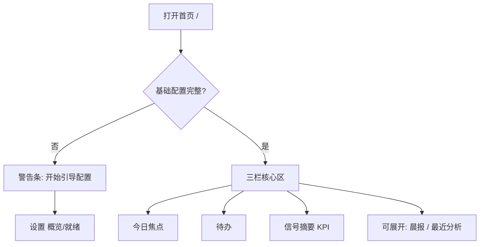

# 02 首页

## 页面入口与操作路径

| 方式 | 具体路径 |
| --- | --- |
| 主导航 | **首页** |
| 直链 | `/` |
| 命令面板 | 搜索「首页」「home」 |
| 设置返回 | 配置引导完成后回到 `/` |
| 带参链接 | 见下文「URL 与深链行为」 |

页面标题常见为 **StockPulse** / **首页**；路由说明文案多为「今日焦点、待办与信号摘要」。

首页是**注意力中枢**（Attention Hub）：帮你快速看到「今天该先看什么」，而不是一进门就塞满完整报告列表。

> 💡 **如果这是你第一次打开**  
> 先确认两件事已经保存成功：① **AI 模型** 能测通；② **自选股** 至少有 1～3 个代码。否则首页会提示「基础配置未完成」——这是正常保护，不是坏了。

> ⚠️ **研究免责**  
> 首页摘要仅供研究导航，**不构成投资建议**。

## 适用场景

| 场景 | 你会在首页做什么 |
| --- | --- |
| 开盘前 / 晚间复盘 | 扫「今日焦点」和待办，决定今天深入看哪几只 |
| 刚装完客户端 | 根据配置缺口点「开始引导配置」 |
| 已经跑过分析 | 从焦点跳进信号中心，或从可展开区打开最近报告 |
| 数据加载不完整 | 看「首页数据不完整」提示并点重试 |
| 只想开始分析 | 空焦点时的「开始分析」会进分析工作台 |

## 页面结构

| 区块（界面文案） | 作用 | 点击后通常去哪 |
| --- | --- | --- |
| **基础配置未完成**（条件显示） | 最小可分析路径还缺项 | **开始引导配置** → `/settings?section=overview&view=readiness` |
| **今日焦点** | 最新有效信号，按时间优先 | 单行 → 信号中心并带上该股（`/signals?...&stock=`） |
| **待办** | 临近过期、需再评估的 active 信号等 | 再评估相关入口 / 信号中心 |
| **信号摘要** | 有效信号数、已触发告警、再评估待办等 KPI | 查看再评估 / 信号中心 |
| **可展开区** | 晨报（最新大盘复盘）、最近分析 | 大盘复盘页 / 分析工作台历史 |
| **首页数据不完整** | 某一数据源拉取失败 | **重试** 刷新本页 |

> 💡 **可展开区默认收起**  
> 界面说明类似：「晨报与最近分析默认收起；只在需要时展开。」展开偏好可记在本机，避免首页过载。

## 首次进入（建议配置）

1. 若出现 **基础配置未完成**：  
   - 点 **开始引导配置**（不要急着点进高级设置）。  
   - 按就绪检查补齐模型、自选等「待处理」项。  
   - 每次改完 **保存**，看到成功后再回首页。  
2. 也可用命令面板进 **设置 → AI 与模型 → 模型接入** 手工配置。  
3. **新闻 / 搜索源** 建议配，但不是基础技术面分析的绝对阻塞条件。  
4. 回首页后：缺口条应消失或减轻 → 空焦点时可点 **开始分析**。

### 建议的最小自选（示例）

| 市场 | 示例代码 | 说明 |
| --- | --- | --- |
| A 股 | `600519` | 六位数字即可 |
| 港股 | `hk00700` | 需要 `hk` 前缀 |
| 美股 | `AAPL` | 大写字母代码 |

## 各区块怎么用

### 今日焦点

| 状态 | 含义 | 下一步 |
| --- | --- | --- |
| 有列表 | 有可展示的最新 **active** 信号 | 点行进入信号中心看该股上下文 |
| **暂无需要关注的信号** | 还没跑出有效信号 | **开始分析** → 工作台 |
| 局部错误 | 信号源加载失败 | 重试；仍失败查设置与网络 |

### 待办

| 状态 | 含义 |
| --- | --- |
| 有条目 | 如有效信号已过期或 24h 内将过期，需要人工再评估 |
| **待办已清零** | 当前没有临近过期的再评估事项 |
| 说明文案 | 「需要人工判断的再评估事项；审批入口暂不显示。」——不要期待完整审批流 |

### 信号摘要

常见会汇总：**有效信号**、告警触发、再评估相关计数。用它做「要不要进信号中心」的仪表，而不是替代详情阅读。

### 可展开：晨报与最近分析

| 子块 | 空状态 | 有数据时 |
| --- | --- | --- |
| 晨报 / 大盘 | 暂无晨报 → 去跑 [04 大盘复盘](04-market-review.md) | 打开最新复盘摘要或跳转复盘页 |
| 最近分析 | 暂无最近分析 | 打开最近个股报告（常落到工作台历史） |

## URL 与深链行为

| 行为 | 说明 |
| --- | --- |
| 干净打开 `/` | 应停在首页，不偷偷恢复旧报告 |
| 旧链接带 `recordId` 等分析参数 | 可能被**重定向**到分析工作台对应分段（统一入口） |
| 无效报告 / 运行流链接 | 可能提示「报告链接无效」「运行流链接无效」等 |
| `stock` / `workspace` 等 | 部分版本用于恢复工作区；以当前 `routes.ts` 与实现为准 |

首页**不是**完整历史数据库：要系统翻历史报告，请用 **研究 → 分析工作台 → 历史**。

## 术语表

| 术语 | 解释 |
| --- | --- |
| **注意力中枢** | 首页定位：先筛「今天看什么」，再进深页 |
| **今日焦点** | 优先展示的最新有效信号列表 |
| **待办** | 需人工跟进的再评估类事项（非通用待办 App） |
| **信号摘要** | 信号/告警相关 KPI 概览 |
| **基础配置 / 就绪** | 最小可分析检查：模型、自选等 |
| **晨报** | 首页语境下通常指最新一次大盘复盘摘要入口 |
| **引导配置** | 从首页跳进设置就绪向导的入口 |
| **active 信号** | 仍有效的 Decision Signal，见 [06](06-signals.md) |

## 使用案例

**案例 A：从零到第一份报告**  
1. 首页提示缺配置 → **开始引导配置**。  
2. 模型接入添加服务 → 保存 → 测试连接成功。  
3. 自选填 `600519` → 保存。  
4. 回首页，缺口消失 → **开始分析** → 工作台跑报告。  
5. 按 [08 阅读报告](08-reading-reports.md) 读结论与风险。

**案例 B：每天开盘前 3 分钟**  
1. 打开首页，先看待办是否有临期信号。  
2. 扫今日焦点 1～3 条，只点进真正关心的代码。  
3. 展开最近分析，确认昨天结论是否仍在。  
4. 需要市场温度时再去大盘复盘，而不是在首页硬找完整复盘正文。

**案例 C：焦点长期为空**  
1. 确认配置已完整。  
2. 至少成功完成 1 次个股分析且系统提取了信号。  
3. 仍空：到 `/signals?tab=feed` 看是否有 active；没有则问题在分析链路而非首页。

**案例 D：首页数据不完整**  
点重试；持续失败时检查后端是否启动、网络、以及设置里数据源是否异常。

## 常用跳转速查

| 目标 | 从首页怎么走 |
| --- | --- |
| 分析工作台 | 空焦点「开始分析」或导航 **研究 → 分析工作台** |
| 信号中心 | 焦点行 / 信号摘要 / 顶栏通知铃 |
| 大盘复盘 | 可展开晨报或 **研究 → 大盘复盘** |
| 持仓 | 侧栏 **组合** |
| 设置 | 引导配置按钮或侧栏 **设置** |

## 相关

- [01 壳层](01-shell.md)
- [03 分析工作台](03-analysis-workbench.md)
- [06 信号中心](06-signals.md)
- [10 设置](10-settings.md)
- [小白客户端安装](../beginner-client-setup.md)

上一篇：[01 壳层](01-shell.md) · 下一篇：[03 分析工作台](03-analysis-workbench.md)
