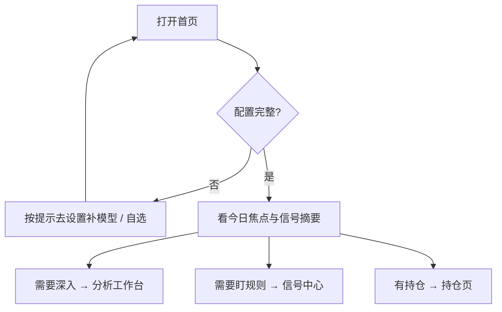

# 02 首页

首页是**注意力中枢**（Attention Hub）：帮你快速看到「今天该先看什么」，而不是一进门就塞满完整报告列表。

> 💡 **如果这是你第一次打开**  
> 先确认两件事已经保存成功：① **AI 模型** 能测通；② **自选股** 至少有 1～3 个代码。否则首页会一直提示配置缺口——这是正常保护，不是坏了。

## 适用场景

| 场景 | 你会在首页做什么 |
| --- | --- |
| 开盘前 / 晚间复盘 | 扫「今日焦点」和信号摘要，决定今天深入看哪几只 |
| 刚装完客户端 | 根据「待办 / 配置缺口」补模型与自选 |
| 已经跑过分析 | 从摘要跳进信号中心或分析工作台，而不是从零找菜单 |

## 常见区块

| 区块 | 作用 | 小白怎么理解 |
| --- | --- | --- |
| **今日焦点** | 需要优先关注的摘要 | 相当于「今日待办清单的标题区」 |
| **待办** | 配置缺口、未处理事项 | 缺 Key、缺自选时会出现在这里 |
| **信号摘要** | 近期 AI 建议 / 告警概览 | 点进去通常进入 **信号中心** |
| **可展开区** | 晨报、大盘、最近分析等 | 默认可能收起，避免首页过载；展开偏好可记在本机 |

## 首次进入（建议配置）

1. 若提示配置不完整，优先补齐：
   - **AI 模型**（至少一个可用渠道，并点「测试连接」）
   - **自选股**（例如 `600519,hk00700,AAPL`）
2. **新闻 / 搜索源** 建议配置，但不是绝对阻塞「基础技术面分析」的唯一条件。
3. 可选择「去设置」手动配置；若产品提供助手引导入口，可从首页主按钮进入。
4. 每次改设置后点击 **保存**，看到成功提示再回首页；缺口提示应减轻或消失。

> ⚠️ **请耐心一点**  
> 保存按钮在设置页底部或顶部工具条，切走页面前一定要等「保存成功」。只改输入框不点保存，首页仍会认为你还没配好。

### 建议的最小自选（示例）

| 市场 | 示例代码 | 说明 |
| --- | --- | --- |
| A 股 | `600519` | 六位数字即可 |
| 港股 | `hk00700` | 需要 `hk` 前缀 |
| 美股 | `AAPL` | 大写字母代码 |

## 常用操作

- 从首页进入 **研究 → 分析工作台** 开始第一份个股分析。
- 点击信号摘要跳转 **信号中心**。
- 用顶栏 **通知铃** 查看未读并深链到具体信号 / 告警。
- 用 `Cmd/Ctrl + K` 命令面板直接搜「分析」「持仓」。

## 今日焦点的数据口径

「今日焦点」只根据已有本地记录生成最多 5 条（接口上限 10 条）的优先摘要，不会为了填满列表而制造推荐。这里的“今天”是 `daily_brief_timezone` 配置时区内的自然日；未带时区的历史时间按 UTC 解释，缺少时间的记录不参与筛选。开盘前、休市日和周末也不会把前一交易日的旧证据顺延为今天。

当前可入选的依据只有：

- 今天状态为 `triggered` 的告警；
- 今天的重大公司事件（仅在运行时接入可信事件读取器时）；
- 最新分析发生在今天、上一条在最近 90 天内，且 `buy` / `sell` / `hold` 方向发生变化的分析结论。

自选代码与持仓缓存只用于确定候选范围，港股前缀/后缀等别名会先规范化。持仓的历史未实现盈亏不是“当日涨跌”，不会作为入选理由。读取今日焦点不会刷新行情、运行分析、重放持仓账本或写入快照；某个本地来源失败时，接口会返回 `degraded` 和具体来源，不会把失败伪装成正常空列表。

每条依据提供独立的 **查看依据** 链接：告警精确进入信号中心的触发记录，分析反转精确进入分析工作台的历史记录。点击股票本身仍是独立操作，不会与依据链接混在一个按钮里。

> 当前交付边界：仓库已提供严格的 `/api/v1/focus/today` 接口和独立 `TodaysFocusPanel` 组件；将其挂载到首页、接入首页刷新生命周期，以及生产级公司事件读取器仍属于后续集成工作。晨报和通知格式也不在本次范围内。

## 使用案例：从零到第一份报告

1. 首页提示缺模型 → 进入设置 → 添加 Anspire 或 AIHubMix → 保存并测试成功。
2. 设置里填写自选 `600519` → 保存。
3. 回首页，缺口消失 → 进入分析工作台 → 输入 `600519` → 开始分析。
4. 任务完成后打开历史报告，按 [08 阅读报告](08-reading-reports.md) 的顺序读结论与风险。

## 今日定时任务（当前 main 已提供）

首页有 **今日定时任务** 只读区块，展示今天已运行和即将运行的任务：

| 你看到的 | 含义 |
| --- | --- |
| 任务类型 | 股票分析 / 研究简报 / 风险检查 等（以界面标签为准） |
| 状态 | 待运行、运行中、成功、失败、跳过、等待重试等 |
| 空列表 | 今天没有已运行或即将运行的任务——正常 |

**请注意**：首页只读展示「今天」的发生情况，**不能**在此编辑调度时间表。标题与任务列表共用一个模块边框，标题本身不可点击；有任务时，标题区的 **管理定时定义** 会进入 **设置 → 系统与安全 / 调度与运行**，没有任务时，该入口显示在空状态框内。需要 **长运行** 的 Web / API / Desktop 进程才会按点执行。

若你的界面没有该区块，说明运行版本较旧，请升级到包含定时任务能力的构建。

实现与合同细节见仓库文档 `docs/scheduled-tasks.md`（偏工程，可选）。

## 注意

- 带旧报告参数的链接（例如带 `recordId`）可能被**重定向**到分析工作台对应分段，这是为了统一入口，不是丢书签。
- 无分析参数时，打开 `/` 应停留在首页，而不是偷偷恢复旧报告上下文。
- 首页不是「完整数据库」：要找历史报告请去分析工作台的 **历史** 分段。

## 相关

- [01 壳层](01-shell.md)
- [03 分析工作台](03-analysis-workbench.md)
- [10 设置](10-settings.md)
- [小白客户端安装](../beginner-client-setup.md)

上一篇：[01 壳层](01-shell.md) · 下一篇：[03 分析工作台](03-analysis-workbench.md)
