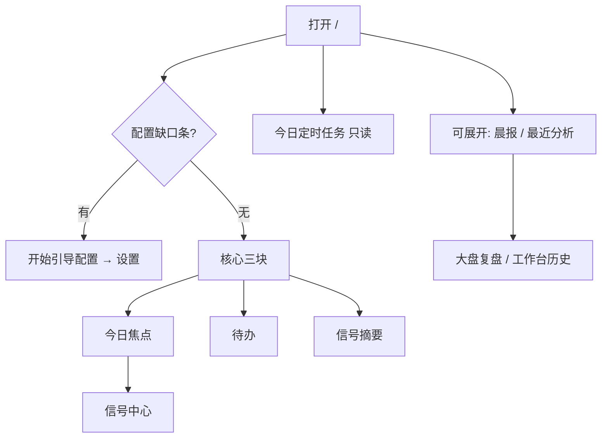
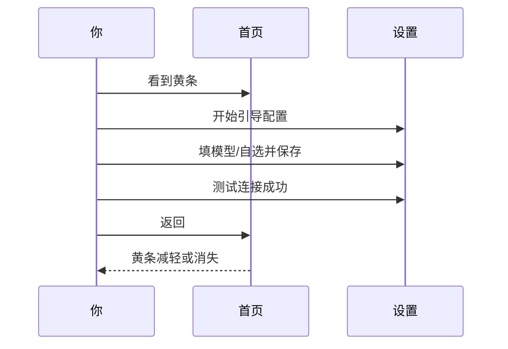

# 02 首页

## 本章你会学会

1. 理解首页是 **注意力中枢**，不是报告仓库  
2. 读懂配置缺口、今日焦点、待办、信号摘要、定时任务、晨报与最近分析  
3. 从零跑通「配置 → 第一份分析」  
4. 建立开盘前 3 分钟 / 收盘后 5 分钟的固定用法  
5. 处理空首页、黄条不消失、链接乱跳等常见情况  

> 📘 **一句话定位**  
> 首页帮你判断 **今天该看什么**，再进入分析、信号或持仓——而不是把历史报告全摊在第一屏。

> 💡 **开始前建议先完成**  
> 1. 至少一个能 **测试连接成功** 的 AI 模型，并已 **保存**。  
> 2. 自选股里有 **1～3 个** 你认识的代码（如 `600519`）。  
> 缺这两项时，首页会持续提示配置未完成；硬跑分析多半失败并浪费额度。

> ⚠️ **研究声明**  
> 首页摘要与信号仅供学习研究，**不构成投资建议**。

---

## 1. 脑中地图：首页信息架构

| 区块 | 回答的问题 | 不回答的问题 |
| --- | --- | --- |
| 配置缺口 | 最小可分析还差什么？ | 具体某字段怎么填（去设置） |
| 今日焦点 | 今天优先瞟哪几条有效信号？ | 完整报告叙事 |
| 待办 | 有没有临期要再看的研究提醒？ | 生活 To-Do、审批流 |
| 信号摘要 | 要不要打开信号中心深挖？ | 每条失效条件细节 |
| 今日定时任务 | 今天自动任务跑了没？ | 如何改调度规则（去设置） |
| 晨报入口 | 最近大盘复盘在哪？ | 个股买卖指令 |
| 最近分析 | 最近几份报告捷径？ | 完整历史库（在工作台历史） |

---

## 2. 怎么进入首页

| 方式 | 操作 | 备注 |
| --- | --- | --- |
| 主导航 | 点 **首页** | 最常见 |
| 地址栏 | 打开 `/` | 可收藏 |
| 命令面板 | `Cmd/Ctrl + K` →「首页」 | 任意页可回 |
| 配完设置后 | 保存成功 → 再回首页 | 核对黄条是否减轻 |

> 🧭 **入口口诀**  
> 迷路先回 `/`；深读再进研究/信号/组合。

---

## 3. 什么时候该打开首页

| 场景 | 建议用法 |
| --- | --- |
| 刚装好 | 跟黄条走引导配置，别先点一堆菜单 |
| 开盘前只有几分钟 | 待办 → 焦点 1～2 行 → 定时任务状态 |
| 已跑过分析 | 焦点进信号，或展开最近分析 |
| 数据加载异常 | 「数据不完整」→ **重试** |
| 只想马上分析 | 焦点空时 **开始分析** → 工作台 |
| 依赖自动化 | 先看今日定时任务，再决定是否手动补跑 |

---

## 4. 页面分区详解

### 4.1 配置未完成提示条（优先级最高）

> 🖼️ **配图占位** · `assets/home-config-gap-zh.png`  
> **应配内容**：首页配置未完成横幅 +「开始引导配置」主按钮；可见缺口项（模型/自选等）。  
> **拍摄要点**：用空配置复现；裁剪横幅与 CTA。  
> **状态**：待补图（清单：[assets/PLACEHOLDERS.md](assets/PLACEHOLDERS.md)）

出现类似 **基础配置未完成** 时，会列出缺口（模型、自选等）。

| 操作 | 说明 |
| --- | --- |
| **开始引导配置** | 跳进设置就绪/概览，按项补齐 |
| 关闭提示 | 可以先逛，但跑分析前仍应补齐 |
| 补完后 | 请 **保存**，再回首页核对 |

> ❌ **不推荐**  
> 只粘贴 Key 不点保存，然后反复刷新首页——缺口检查读的是**已保存**配置。

> ✅ **推荐做法**  
> 保存 → 测试连接 → 回首页 → 再开始分析。三步缺一，后面容易误判「坏了」。

### 4.2 今日焦点

> 🖼️ **配图占位** · `assets/home-core-blocks-zh.png`  
> **应配内容**：首页核心三块：今日焦点、待办、信号摘要的标题与布局（允许空状态）。  
> **拍摄要点**：宽屏；能分清三块；勿含敏感详情。  
> **状态**：待补图（清单：[assets/PLACEHOLDERS.md](assets/PLACEHOLDERS.md)）

展示系统认为值得先看的 **有效信号（active）**，通常偏时间优先。

| 你看到的状态 | 含义 | 建议动作 |
| --- | --- | --- |
| 有若干行 | 已有可展示的 active 信号 | 点真正相关的 1～2 行进信号中心 |
| **暂无需要关注的信号** | 尚无 active，或都已关闭 | **开始分析** 产出第一份报告 |
| 加载失败 / 不完整 | 拉取信号失败 | **重试**；仍失败查网络/后端 |

点某一行后，通常进入 **信号中心** 并带上该股上下文。

> ⚠️ **注意**  
> 焦点列表 **不是**「今日必买清单」。优先顺序建议：**持有的 > 真心盯的自选 > 其余**。

### 4.3 待办

研究向提醒（如信号临期、需要再评估），**不是**生活待办 App。

| 状态 | 理解 |
| --- | --- |
| 有条目 | 「这几条可能旧了，抽空看是否仍成立」 |
| **待办已清零** | 近期没有这类临期事项 |
| 提到审批暂不显示 | 正常：重点是复看提醒，不是完整审批流 |

### 4.4 信号摘要

小仪表盘：有效信号数量、告警、再评估相关计数等（以界面为准）。

| 适合 | 不适合 |
| --- | --- |
| 决定要不要打开信号中心 | 替代逐条读失效条件 |
| 快速感知「今天吵不吵」 | 当作仓位指令板 |

### 4.5 今日定时任务（只读）

> 🖼️ **配图占位** · `assets/home-scheduled-tasks-zh.png`  
> **应配内容**：「今日定时任务」：只读说明 + 任务行（类型与状态）或空状态文案。  
> **拍摄要点**：状态标签清晰；体现不可在此改调度规则。  
> **状态**：待补图（清单：[assets/PLACEHOLDERS.md](assets/PLACEHOLDERS.md)）

| 项目 | 说明 |
| --- | --- |
| 作用 | 只读查看**今天**已运行 / 将运行的调度任务 |
| 类型示例 | 股票分析、研究简报、风险检查；未知类型可能显示为「新版任务」类文案 |
| 状态示例 | 进行中、等待重试、已跳过、完成等 |
| **不能** | 在此新建或修改调度规则 |
| 要改规则 | **设置 → 系统与安全 → 调度** |
| 空列表 | 「今日暂无定时任务」多半正常，不是崩溃 |

> 📘 **概念**  
> 首页是调度结果的 **投影**；调度开关与时刻在设置里。实现细节见 `docs/scheduled-tasks.md`。

### 4.6 可展开区：晨报与最近分析

默认常折叠，避免首页过噪。

| 块 | 用途 | 完整能力在哪 |
| --- | --- | --- |
| 晨报 / 大盘入口 | 最近市场复盘捷径 | [04 大盘复盘](04-market-review.md) |
| 最近分析 | 最近几份个股报告捷径 | 工作台 **历史** 分段 |

> 💡 **提示**  
> 首页「最近」只是捷径。要对比同一只股票多次结论，请去 [03 分析工作台 → 历史](03-analysis-workbench.md)。

---

## 5. 教程：第一次从零跑通

> ✅ **目标**  
> 今晚得到 **一份** 能读完的报告，而不是配完美世界。

| 步 | 你做什么 | 成功标准 |
| --- | --- | --- |
| 1 | 打开首页，有黄条则 **开始引导配置** | 进入设置就绪 |
| 2 | 添加模型服务，粘贴 Key，**保存**，**测试连接** | 测试成功 |
| 3 | 自选填写如 `600519`，**保存** | 列表已保存 |
| 4 | 回首页 | 黄条减轻/消失 |
| 5 | **开始分析** 或进入工作台，提交该代码 | 任务进入排队/运行 |
| 6 | 完成后打开报告 | 按 [08](08-reading-reports.md) 读结论与风险 |

> ❌ **失败时**  
> 停手，读错误原文。优先查：未保存、Key 错、额度、网络、后端未启动。不要连点「开始分析」。

---

## 6. 教程：开盘前 3 分钟

| 分钟 | 动作 |
| --- | --- |
| 0:00–0:40 | 待办：有无临期信号 |
| 0:40–1:40 | 焦点：最多点 1～2 只**真正相关**的 |
| 1:40–2:20 | 今日定时任务：昨晚/今早是否成功 |
| 2:20–3:00 | （可选）展开最近分析或去大盘一眼 |

> ⚠️ **注意**  
> 三分钟流程的目标是 **筛选注意力**，不是完成深度研究。深读放到 A2 类 30～60 分钟流程（见 [11](11-daily-workflows.md)）。

---

## 7. 教程：收盘后 5 分钟

1. 首页确认定时任务是否覆盖了今日自选。  
2. 失败任务：记下代码，去工作台手动补跑（brief）。  
3. 焦点/摘要判断是否需要打开信号中心。  
4. 持仓用户：再花 2 分钟看 [组合](07-portfolio.md) 集中度（可选）。  
5. 需要市场叙事时去 [大盘复盘](04-market-review.md)，不要指望首页晨报入口承载全文。

---

## 8. 链接与跳转行为

| 链接形态 | 预期行为 |
| --- | --- |
| 干净 `/` | 停在首页 |
| 带 `recordId` 等分析参数 | 可能重定向到工作台历史（统一入口） |
| 无效记录链接 | 明确错误提示；换一份有效历史 |

> 💡 **提示**  
> 「点首页链接却进了报告」有时是深链参数导致，不是首页坏了。清掉查询参数再打开 `/`。

---

## 9. 使用案例（详细）

### 案例 A：黄条不消失

| 检查 | 动作 |
| --- | --- |
| 是否保存？ | 设置页点保存，看成功提示 |
| 是否测试通过？ | 测试连接至成功 |
| 自选是否为空？ | 至少 1 个合法代码 |
| 仍不行 | 看设置就绪项原文；重启前端/后端后再试 |

### 案例 B：上班族两分钟版

只做三件事：待办、焦点 1 行、定时任务状态。报告全文晚上再读。

### 案例 C：焦点太多

过滤原则：持仓 > 计划研究的自选 > 忽略噪声。不要横向点开超过 3 行。

### 案例 D：首页 → 规则闭环

焦点行 → 信号详情 → 规则 Tab → 价格条件 → 试运行 → 启用。  
完整组合技见 [11 · D 系列](11-daily-workflows.md)。

### 案例 E：定时「等待重试」

1. 不先改自选。  
2. 设置确认调度启用、进程长运行。  
3. 等自动重试或稍后手动 brief 补洞。  
4. 推送没到时再查通知渠道（别先删调度）。

### 案例 F：空空的首页

尚未成功分析、或无 active 信号时，空是常态。按 §5 跑通一份再回来。

---

## 10. 常见问题

| 问题 | 答复 |
| --- | --- |
| 是不是坏了？ | 多半是还没报告/信号；先跑分析 |
| 填了 Key 仍未完成？ | 保存 + 测试连接 |
| 信号中心侧栏没有？ | 不在一级菜单；铃铛 / 焦点 / `/signals` |
| 定时空列表？ | 今日无任务或未配置调度，先看设置 |
| 最近分析太少？ | 去工作台历史看全量 |

---

## 11. 自检清单

- [ ] 能解释首页为什么「看起来空」  
- [ ] 会处理配置黄条（保存 + 测试）  
- [ ] 分得清焦点 / 待办 / 摘要 / 定时任务  
- [ ] 知道定时任务只读、改规则去设置  
- [ ] 会走完从零到第一份报告六步  

---

## 12. 术语

| 说法 | 含义 |
| --- | --- |
| 注意力中枢 | 首页职责：排序今天该看什么 |
| 今日焦点 | 优先展示的 active 信号摘要 |
| 待办 | 研究向再确认提醒 |
| active | 仍有效的结构化建议 |
| 引导配置 | 跳进设置就绪检查 |
| 晨报 | 大盘复盘入口，非个股指令 |
| 今日定时任务 | 当日调度任务只读投影 |

---

## 13. 相关阅读

| 文档 | 关系 |
| --- | --- |
| [01 导航与顶栏](01-shell.md) | 怎么回首页、铃铛、命令面板 |
| [03 分析工作台](03-analysis-workbench.md) | 「开始分析」之后 |
| [06 信号中心](06-signals.md) | 焦点行点进去之后 |
| [10 设置](10-settings.md) | 黄条与调度的配置端 |
| [11 日常工作流与应用场景](11-daily-workflows.md) | 角色与组合技 |

上一篇：[01 导航与顶栏](01-shell.md) · 下一篇：[03 分析工作台](03-analysis-workbench.md)
