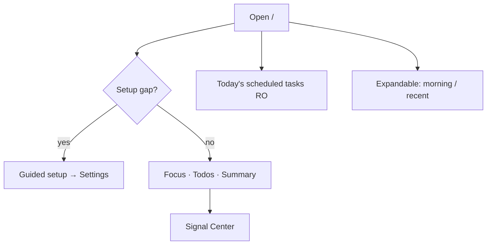
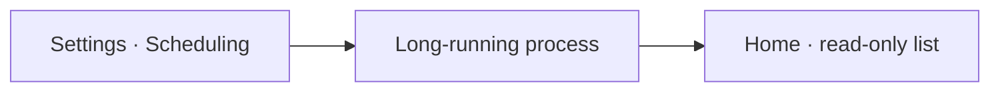

# 02 Home

## What you will learn

1. Treat Home as an **attention hub**, not a report dump  
2. Read the setup banner, focus, todos, signal summary, scheduled tasks, morning entry, recent analyses  
3. Complete “setup → first analysis” end-to-end  
4. Run a 3-minute pre-open habit  
5. Fix empty Home, sticky yellow banners, odd redirects  

> 📘 **One-liner**  
> Home answers **what to look at today**, then you drill into analysis, signals, or portfolio.

> 💡 **Before you rely on Home**  
> 1. At least one AI model that **tests green** and was **Saved**.  
> 2. Watchlist with **1–3** familiar codes (e.g. `600519`).  

> ⚠️ **Research only** — summaries and signals are **not investment advice**.

---

## 1. Information architecture

| Block | Question it answers | Not for |
| --- | --- | --- |
| Setup banner | What’s missing for a minimal run? | Full field help (Settings) |
| Today’s focus | Which active signals deserve a glance? | Full report narrative |
| Todos | Research re-check reminders? | Life todos |
| Signal summary | Open Signal Center or not? | Per-signal invalidation detail |
| Scheduled tasks | Did today’s automation run? | Editing schedules (Settings) |
| Morning entry | Latest market review shortcut | Single-name orders |
| Recent analyses | Last few reports | Full history (Workbench) |

---

## 2. How to open Home

| Method | Action |
| --- | --- |
| Nav | **Home** |
| URL | `/` |
| Palette | `Cmd/Ctrl+K` → home |
| After setup | Save → return → check banner |

---

## 3. Block details

### Setup-incomplete banner

> 🖼️ **Figure placeholder** · `assets/home-config-gap-en.png`  
> **Capture**：Home setup-incomplete banner + Start guided setup CTA.  
> **Notes**：Reproduce with missing model/watchlist; crop banner.  
> **Status**：pending — see [assets/PLACEHOLDERS.md](assets/PLACEHOLDERS.md)

Lists gaps (model, watchlist, …). **Start guided setup** → fix → **Save** → test connection → return.

> ❌ **Avoid**  
> Paste a key, never Save, refresh Home forever.

### Today’s focus

Active signals, usually time-ordered. Click a row → Signal Center with context.

> ⚠️ **Note**  
> Focus is **not** a must-buy list. Prefer: holdings → real watchlist → ignore noise.

### Todos

Research reminders (e.g. near-expiry signals), not a life planner.

### Signal summary

KPI strip: whether Signal Center is worth opening—not a substitute for reading items.

### Today’s scheduled tasks (read-only)

> 🖼️ **Figure placeholder** · `assets/home-scheduled-tasks-en.png`  
> **Capture**：Today’s scheduled tasks block: read-only copy + rows or empty state.  
> **Notes**：Show status labels; English UI.  
> **Status**：pending — see [assets/PLACEHOLDERS.md](assets/PLACEHOLDERS.md)

| Item | Detail |
| --- | --- |
| Role | Today’s runs only |
| Types | Stock analysis, research brief, risk check, … |
| Edit rules | **Settings → System & Security → Scheduling** |
| Empty list | Usually “none planned”, not a crash |

### Expandable: morning & recent

Collapsed by default. Full market review → [04](04-market-review_EN.md). Full history → Workbench history.

---

## 4. Tutorial: zero → first report

| Step | Action | Success |
| --- | --- | --- |
| 1 | Guided setup | Settings readiness |
| 2 | Model + Save + test | Connection OK |
| 3 | Watchlist + Save | Codes stored |
| 4 | Back to Home | Banner eases |
| 5 | Start analysis | Task runs |
| 6 | Read report | [08](08-reading-reports_EN.md) order |

Stop multi-clicking on errors—fix key, quota, network, backend.

---

## 5. Tutorial: 3-minute pre-open

1. Todos for near-expiry  
2. At most 1–2 focus rows you truly care about  
3. Scheduled tasks status  
4. Optional: recent analyses or market review  

---

## 6. Links & redirects

Clean `/` stays on Home. Links with `recordId` may redirect into Workbench history on purpose. Invalid links show a clear error.

---

## 7. Use cases

**Sticky yellow banner:** Save + test connection + non-empty watchlist.  
**Two minutes at work:** todos + one focus + scheduled status.  
**Too many focus rows:** holdings first.  
**Focus → rule:** Signal Center → Rules → price condition.  
**Waiting retry on schedule:** confirm schedule enabled + long-running process; don’t thrash watchlist first.  
**Empty Home:** run one analysis first.

More recipes: [11](11-daily-workflows_EN.md).

---

## 8. FAQ

| Q | A |
| --- | --- |
| Broken empty Home? | Usually no reports/active signals yet |
| Key typed, still incomplete? | Save + test |
| No Signals in sidebar? | Not primary; bell / focus / `/signals` |

---

## 9. Self-check

- [ ] Explain why Home can look empty  
- [ ] Clear a setup banner properly  
- [ ] Distinguish focus / todos / summary / scheduled tasks  
- [ ] Know schedules are edited in Settings  

---

## Glossary

| Term | Meaning |
| --- | --- |
| Attention hub | Home’s job |
| Active signal | Still-live Decision Signal |
| Guided setup | Jump into Settings readiness |
| Today’s scheduled tasks | Read-only projection of today’s runs |

## Related

[01](01-shell_EN.md) · [03](03-analysis-workbench_EN.md) · [06](06-signals_EN.md) · [10](10-settings_EN.md) · [11](11-daily-workflows_EN.md)

Prev: [01](01-shell_EN.md) · Next: [03](03-analysis-workbench_EN.md)
