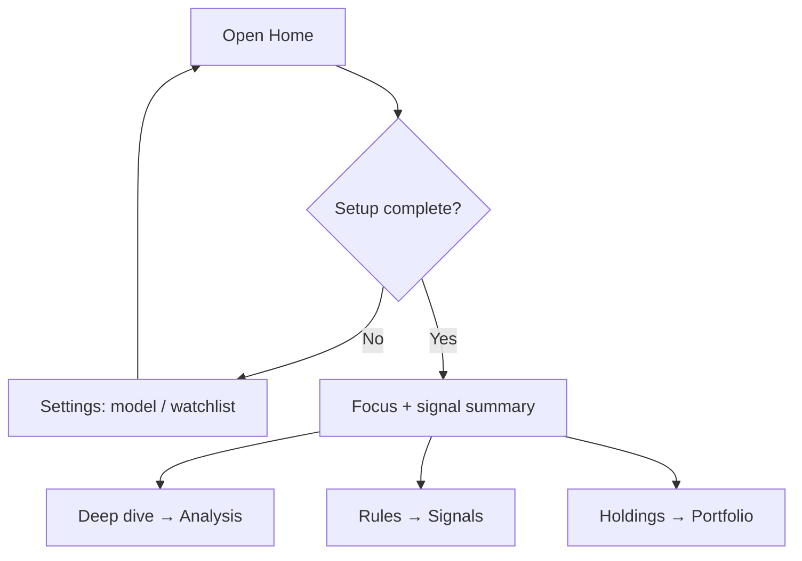

# 02 Home

Home is an **attention hub**: it answers “what should I look at first today?”, not a full report archive.

> 💡 **First open tip**  
> Make sure two things are saved: (1) an **AI model** channel that passes the connection test; (2) a **watchlist** with at least 1–3 tickers. Configuration gap banners are intentional, not a crash.

## When to use Home

| Scenario | What you do |
| --- | --- |
| Pre-market / evening review | Scan Today’s Focus and signal summary |
| Fresh install | Follow todos / gaps to finish model + watchlist |
| Already running analyses | Jump into Signal Center or Analysis workbench |

## Common blocks

| Block | Purpose | Plain meaning |
| --- | --- | --- |
| **Today’s Focus** | Priority summary | Your “headline todos” |
| **Todos** | Config gaps and unfinished items | Missing keys or empty watchlist land here |
| **Signal summary** | Recent AI advice / alerts | Usually deep-links to **Signal Center** |
| **Expandable area** | Morning brief, market review, recent analyses | Often collapsed to reduce overload; expand preference is local |

## First-run checklist (recommended)

1. Complete **AI model** (test connection succeeds).
2. Add a small **watchlist** (e.g. `600519,hk00700,AAPL`).
3. **News / search keys** are recommended but not the only path to basic technical analysis.
4. Always click **Save** and wait for success before returning Home.

> ⚠️ **Be patient**  
> Editing fields without Save leaves Home thinking setup is still incomplete.

## Common actions

- Open **Research → Analysis workbench** for the first single-stock run.
- Open **Signal Center** from the signal summary.
- Use the **notification bell** for unread items and deep links.
- Use `Cmd/Ctrl + K` to jump by name.

## Today's Focus data contract

Today's Focus uses existing local records to produce at most five priority rows (API hard limit: ten), and never invents rows to fill the list. “Today” is the natural calendar day in `daily_brief_timezone`. Persisted timestamps without an offset are interpreted as UTC, while records without a timestamp are excluded. Pre-market, weekend, and non-trading-day requests do not roll previous-day evidence forward.

The qualifying evidence is limited to:

- alerts whose status is `triggered` today;
- major corporate events observed today, when a trusted runtime event reader is configured;
- analysis conclusions whose latest record is from today, whose preceding record is within 90 days, and whose direction changes among `buy`, `sell`, and `hold`.

The watchlist and persisted active-position cache only define the candidate universe; market aliases such as Hong Kong prefix/suffix forms are canonicalized first. Lifetime unrealized P&L is not a daily move and cannot qualify a symbol. Reading Today's Focus does not refresh quotes, run analysis, replay the portfolio ledger, or write snapshots. If a local source fails, the API returns `degraded` with the affected source instead of presenting a false normal empty state.

Each row has a separate **View evidence** link. Alert evidence opens the exact Signal Center trigger, while analysis evidence opens the exact history record in the Analysis workbench. Stock selection remains a separate action.

> Current delivery boundary: the repository provides the strict `/api/v1/focus/today` endpoint and a standalone `TodaysFocusPanel`. Mounting it on Home, wiring the Home refresh lifecycle, and providing a production corporate-event reader remain follow-up integration work. Morning briefs and notification rendering are also out of scope here.

## Example: zero to first report

1. Home shows a model gap → Settings → add a provider → Save → test OK.  
2. Watchlist `600519` → Save.  
3. Home gaps clear → Analysis workbench → run `600519`.  
4. Open the history report and read it with [08 Reading reports](08-reading-reports_EN.md).

## Today's scheduled tasks (shipped on current main)

Home includes a read-only **Today's scheduled tasks** block for today's ran and upcoming items:

| You see | Meaning |
| --- | --- |
| Task type | Stock analysis / research brief / risk check (labels as in UI) |
| Status | Pending, running, completed, failed, skipped, retry wait, … |
| Empty list | No ran/upcoming items for today — normal |

Home is **read-only** for today's occurrences. The heading and task list share one module border, and the heading itself is not clickable. When tasks exist, **Manage schedules** appears in the block header; when the list is empty, it appears inside the empty state. It opens **Settings → System & security / Scheduling**. A **long-running** Web / API / Desktop process must stay up for on-time execution.

If your UI lacks this region, upgrade to a build that includes scheduled tasks.

Engineering contract: `docs/scheduled-tasks.md`.

## Notes

- Legacy links with `recordId` may redirect into the workbench segments on purpose.  
- Opening `/` without analysis params should stay on Home.  
- Full history lives under the workbench **History** segment, not Home.

Previous: [01 Shell](01-shell_EN.md) · Next: [03 Analysis workbench](03-analysis-workbench_EN.md)
