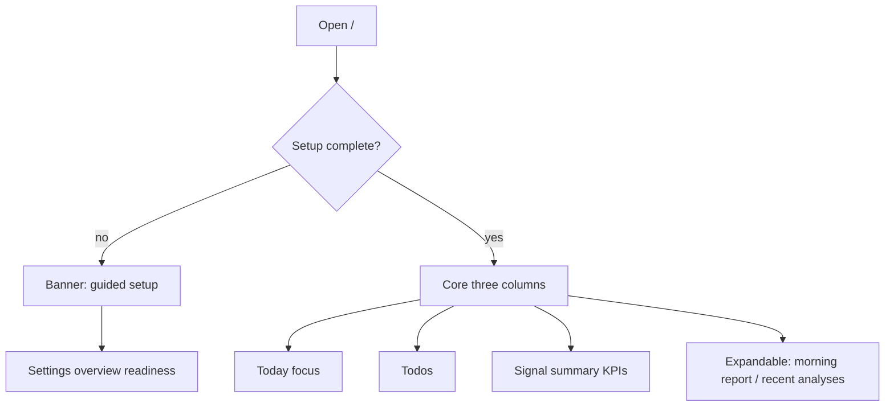

# 02 Home

## Entry points and paths

| Method | Path |
| --- | --- |
| Primary nav | **Home** |
| Route | `/` |
| Command palette | “home” |
| Guided setup return | After readiness flow, back to `/` |
| Query links | See “URL and deep links” |

Home is an **attention hub**: what to look at **today**, not a full report database.

> 💡 **First open**  
> Save a working **AI model** and at least **1–3 watchlist** codes. Incomplete setup shows “basic configuration incomplete” on purpose.

> ⚠️ Research only — **not investment advice**.

## When to use

| Scenario | What you do on Home |
| --- | --- |
| Pre-open / evening | Scan **Today’s focus** and todos |
| Fresh install | **Start guided setup** |
| After analyses | Jump into Signal Center or recent reports |
| Partial load | Retry when Home data is incomplete |
| Start analyzing | Empty focus CTA → Analysis Workbench |

## Layout

| Block (UI) | Role | Typical navigation |
| --- | --- | --- |
| **Setup incomplete** (conditional) | Minimum path missing items | **Start guided setup** → `/settings?section=overview&view=readiness` |
| **Today’s focus** | Latest **active** signals by time | Row → Signal Center with `stock=` |
| **Todos** | Active signals needing reassessment soon | Signal Center / review entry |
| **Signal summary** | Counts: active, alerts, review due | Signal Center |
| **Expandable area** | Morning report (latest market review), recent analyses | Market review / Workbench history |
| **Partial Home data** | One source failed | **Retry** |

> 💡 Morning report and recent analyses stay **collapsed by default** to reduce overload; expand preference may be local.

## First-run setup

1. If incomplete: **Start guided setup** → fix “needs action” items → **Save** each change.  
2. Or open **Settings → AI & Models → Model Access** manually.  
3. News keys are recommended, not always hard blockers for technical-only analysis.  
4. Return to Home; banner should clear → use **Start analysis** when focus is empty.

### Minimal watchlist examples

| Market | Example | Note |
| --- | --- | --- |
| A-shares | `600519` | Six digits |
| Hong Kong | `hk00700` | `hk` prefix |
| US | `AAPL` | Uppercase ticker |

## Using each block

### Today’s focus

| State | Meaning | Next |
| --- | --- | --- |
| List | Active signals to prioritize | Open Signal Center for that symbol |
| **No focus signals** | Nothing active yet | **Start analysis** |
| Error | Signal feed failed | Retry; check backend/network |

### Todos

| State | Meaning |
| --- | --- |
| Items | e.g. active signals expired or expiring within 24h |
| **Todos clear** | No near-term reassessment items |
| Copy | Reassessment items; approval UI may be hidden for now |

### Signal summary

KPI strip for active signals / alerts / review — a dashboard, not full detail.

### Expandable: morning report & recent analyses

| Sub-block | Empty | With data |
| --- | --- | --- |
| Morning / market | Run a [market review](04-market-review_EN.md) | Open latest review |
| Recent analyses | Run Workbench jobs | Open latest stock reports |

## URL and deep links

| Behavior | Note |
| --- | --- |
| Clean `/` | Stay on Home; do not silently restore old report context |
| Legacy `recordId` links | May **redirect** into Workbench history segment |
| Invalid report / run-flow links | Explicit error titles |
| `stock` / `workspace` | Version-dependent workspace restore |

Home is **not** the full history browser — use **Research → Analysis Workbench → History**.

## Glossary

| Term | Meaning |
| --- | --- |
| **Attention hub** | Home’s job: prioritize today |
| **Today’s focus** | Latest active signals |
| **Todos** | Reassessment-style follow-ups (not a generic todo app) |
| **Signal summary** | Signal/alert KPIs |
| **Readiness / setup** | Minimum model + watchlist path |
| **Morning report** | Home entry to latest market review summary |
| **Guided setup** | Jump into Settings readiness |
| **Active signal** | Live Decision Signal — [06](06-signals_EN.md) |

## Use cases

**A — Zero to first report**  
Guided setup → model + test → watchlist `600519` → Home clear → Start analysis → read via [08](08-reading-reports_EN.md).

**B — Three minutes pre-open**  
Todos → 1–3 focus rows → expand recent analyses → market review only if needed.

**C — Focus always empty**  
Setup OK? At least one successful analysis with extracted signals? Check `/signals?tab=feed`.

**D — Partial data**  
Retry; then backend, network, data sources.

## Jump map

| Goal | From Home |
| --- | --- |
| Workbench | Start analysis / Research → Analysis Workbench |
| Signal Center | Focus row / summary / notification bell |
| Market review | Expandable morning block / Research |
| Portfolio | Sidebar Portfolio |
| Settings | Guided setup / sidebar Settings |

## Related

- [01 Shell](01-shell_EN.md)
- [03 Analysis Workbench](03-analysis-workbench_EN.md)
- [06 Signal Center](06-signals_EN.md)
- [10 Settings](10-settings_EN.md)
- [Beginner client setup (EN)](../beginner-client-setup_EN.md)

Prev: [01 Shell](01-shell_EN.md) · Next: [03 Analysis Workbench](03-analysis-workbench_EN.md)
