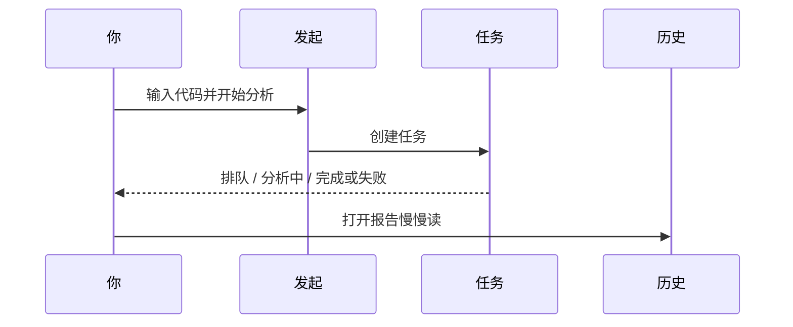

# 03 分析工作台

在这里，你输入股票代码、可选一个分析风格（策略 Skill），点开始，系统会去拉行情与资讯，再请大模型写出一份研究报告。你可以同时盯着任务进度，也可以之后在历史里把旧报告翻出来对比。

> 💡 **和「大盘复盘」差在哪？**  
> - **分析工作台**：研究「某一只股票」  
> - **大盘复盘**：研究「整个市场今天什么气质」  
> 大盘再强，也不等于你手里的那只一定强。个股结论请以个股报告为准。

> ⚠️ 报告只供研究学习，**不构成投资建议**。每跑一次通常都会消耗模型额度，先小批量试，再放大。

---

## 怎么走进这个房间

| 方式 | 路径 |
| --- | --- |
| 导航 | **研究** → **分析工作台** |
| 命令面板 | `Cmd/Ctrl + K`，搜「分析」「工作台」 |
| 地址 | `/research/analysis` |
| 从首页 | 焦点为空时的 **开始分析** |
| 从个股行情页 | `/stocks/代码` 上的 **分析** 按钮 |

地址栏里可能还有这些参数（收藏某一状态时有用）：

| 参数 | 含义 |
| --- | --- |
| `segment=launch` | 发起分析（默认常可省略） |
| `segment=tasks` | 运行中任务 |
| `segment=history` | 历史与对比 |
| `recordId=…` | 打开某一份历史报告 |
| `stock=…` | 预填股票代码 |

---

## 三个分段：你可以把它想成三条传送带

工作台通常分成三段。不用一次学完：日常只要记住 **发起 → 看任务 → 读历史**。

| 分段 | 你在干什么 | 什么时候点 |
| --- | --- | --- |
| **发起与批量** | 填代码、选策略、提交 | 想产生新报告时 |
| **运行中任务** | 看排队、进行中、失败原因 | 刚提交之后；卡住时 |
| **历史与对比** | 打开旧报告、对比趋势、删除 | 读结果、周末复盘时 |

---

## 发起分析：一步一步来（推荐新手照做）

### 第一次只分析 1 只

1. 进入 **发起** 分段。  
2. 在输入框填代码，例如：  
   - A 股：`600519`  
   - 港股：`hk00700`（记得 `hk`）  
   - 美股：`AAPL`  
3. **策略 Skill** 先不选，用系统默认，少一个变量。  
4. 若有 **新手模式** 或报告 **brief（简要）**，建议打开——先读懂骨架，再追求长文。  
5. 点 **开始分析**。  
6. 界面往往会把你带到 **运行中任务**；此时请耐心等，不要连点十几次「开始」。  
7. 看到完成后，点 **查看报告**，或到历史里打开。

### 代码格式小抄（真的很重要）

| 市场 | 推荐写法 | 容易错的地方 |
| --- | --- | --- |
| A 股 | `600519`、`300750` | 只写公司名不写代码 |
| 港股 | `hk00700` | 漏掉 `hk` |
| 美股 | `AAPL`、`BRK.B` | 大小写乱（建议大写） |
| 日股 / 韩股等 | `7203.T`、`005930.KS` | 漏交易所后缀 |

不确定代码时，优先用输入框的自动完成；或先到 [个股工作区](13-stock-details.md) 看行情是否对得上名称。

### 批量：什么时候用，怎么用才不头疼

当你自选已经稳定、模型也测通了，可以一次提交多只：

1. 从自选一键填入，或手动用逗号拼多个代码。  
2. 确认当前的新手/专业、策略设置，是你希望 **这一整批都沿用** 的。  
3. 提交后到任务列表，逐个看谁成功、谁失败。  
4. **部分失败很常见**：不要假设「点了就全部成功」。失败的单独重跑即可。

新手建议：一次 **3～10 只**。一次上百只，容易又贵又难读。

### 智能导入：截图和表格也能变成代码列表

界面提供从 **图片 / CSV / Excel / 剪贴板** 识别代码的能力时：

1. 选文件或粘贴。  
2. **一定先人工核对**识别结果：高置信可以默认勾选，中低置信请你自己点确认。  
3. 确认无误再合并到待分析列表并提交。

导入失败时，常见原因是：图太糊、文件太大、编码不是 UTF-8/GBK、表头没有「代码」列。改完再试一次通常就好。

---

## 运行中任务：进度条在说什么

| 你看到的状态 | 含义 | 你可以做什么 |
| --- | --- | --- |
| 排队 | 还在等轮到它 | 喝口水；避免重复提交同一只 |
| 分析中 / 运行中 | 正在拉数据 + 调用模型 | 可打开「运行流」看卡在哪一步（进阶） |
| 完成 | 报告 gener 好了 | 点查看报告 |
| 失败 | 中途出错 | 读错误原文；查 Key、额度、网络、数据源 |
| 列表空 | 当前没有任务 | 回发起分段 |

**运行流（Run Flow）** 是给愿意排障的人看的：把一次任务拆成若干阶段（例如取行情、取新闻、生成正文）。普通使用可以先忽略；只有「一直转圈」时再打开它，能少猜很多。

---

## 历史与对比：报告住在这里

分析完成后，报告会出现在 **历史** 分段：

1. 左侧（或列表区）点某一条记录。  
2. 右侧看摘要；需要全文时打开 Markdown 抽屉。  
3. 用 **历史趋势** 看同一只股票过去几次结论是否来回翻烧饼——这比单看今天一句「买入」更重要。  
4. 清理垃圾记录时可用多选删除；**删除不可恢复**，确认框请认真读。

收藏某一份报告：带上 `segment=history&recordId=数字` 的链接即可。

阅读顺序请跟 [08 阅读报告](08-reading-reports.md)：先结论与风险，再价位与资讯。

---

## 策略 Skill：要不要选？

**策略 / Skill** 是「分析时更看重什么」的风格包，例如更偏趋势、质量、事件等（列表以产品实际为准）。

| 选择 | 适合 |
| --- | --- |
| 不选（默认） | 第一次跑通、对比基线 |
| 选一个你理解的 | 你明确想用某种研究视角 |
| 频繁换来换去 | 不推荐；结论会更难纵向对比 |

策略 **不是**「稳赚开关」。它改变侧重点，不消灭风险。

---

## 费用与心态（说在前面）

- 每跑一次，通常都会调用大模型，也可能访问新闻接口。  
- **detailed（详细）+ 大批量 + 反复重跑** 最容易把额度烧掉。  
- 同一天对同一只股票无意义连跑，除了费钱，还容易在信号中心堆出一堆噪声。  

更稳的节奏是：想清楚问题 → 跑 1 次 → 认真读 → 有需要再问股追问。

---

## 使用案例

### 案例 A：人生第一份报告

配置好模型与自选 → 工作台只输入 `600519` → 新手 + brief → 开始 → 完成后只读「操作建议 + 风险三条」→ 觉得不够再开全文或换专业模式。

### 案例 B：周末批跑 8 只自选

确认 8 个代码格式 → brief + 默认策略 → 批量提交 → 任务列表盯进度 → 失败的 2 只单独重跑 → 历史里精读最重仓的 3 只 → 对需要盯价的 1 只去信号中心建规则。

### 案例 C：任务失败了

错误里写模型/401/余额 → 去设置测连接。  
写超时/网络 → 检查后端是否在跑、网络是否稳，再重试一次。  
写数据源 → 到设置数据源看 Key 与状态，必要时先无新闻跑技术面。

### 案例 D：从行情页跳过来

在 `/stocks/AAPL` 看完图，点 **分析** → 工作台应带上代码 → 直接开始，少一次手敲。

---

## 术语（白话）

| 术语 | 含义 |
| --- | --- |
| 分析工作台 | 生成个股 AI 报告的主页面 |
| 分段 segment | 发起 / 任务 / 历史 三块工作区 |
| 策略 Skill | 可选的分析风格包 |
| 运行流 | 单次任务内部阶段记录，用来排障 |
| recordId | 历史报告的编号，可写在链接里 |
| brief / detailed | 报告详略 |
| 批量 | 一次提交多只股票的任务 |

---

## 相关阅读

- [08 阅读报告](08-reading-reports.md)  
- [05 问股对话](05-agent-chat.md)  
- [06 信号中心](06-signals.md)  
- [13 个股工作区](13-stock-details.md)  
- [10 设置](10-settings.md)  

上一篇：[02 首页](02-home.md) · 下一篇：[04 大盘复盘](04-market-review.md)
