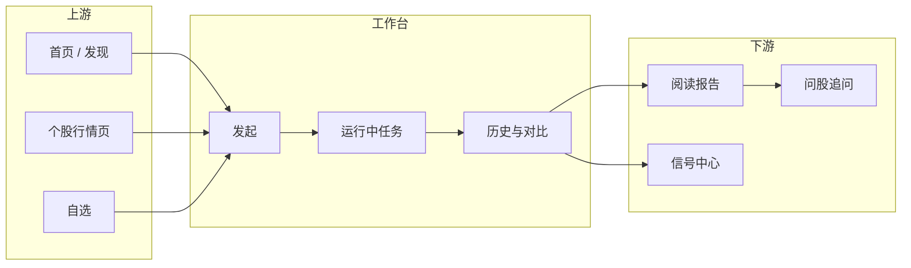
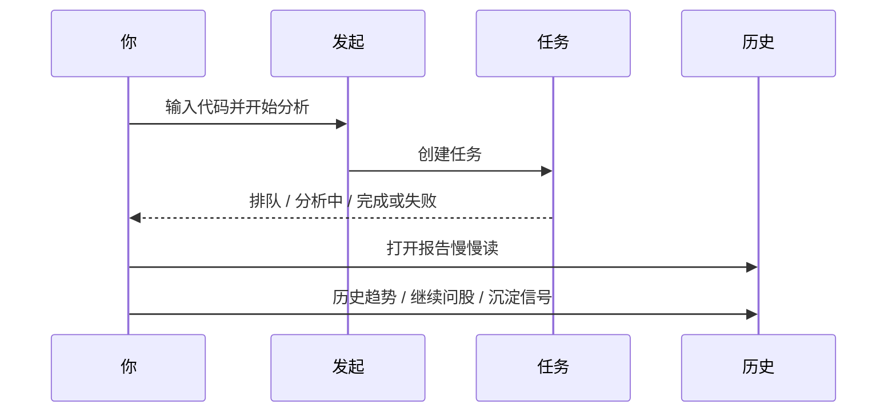
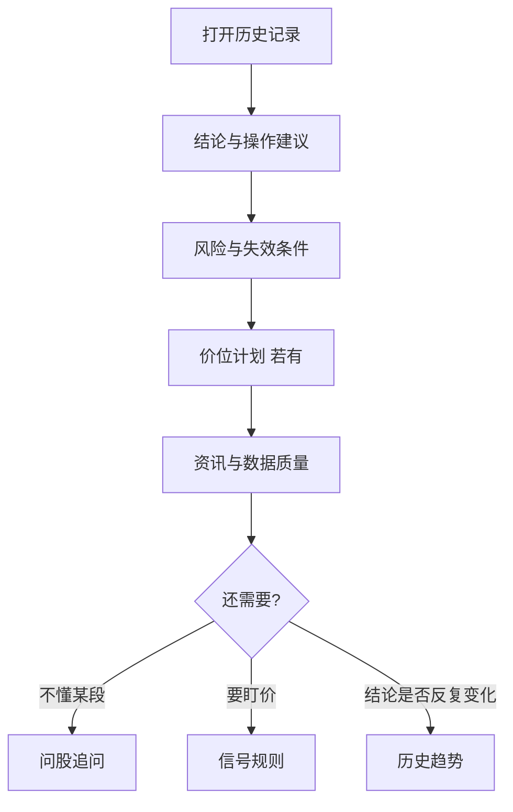

# 03 分析工作台

## 本章你会学会

1. 分清工作台与大盘复盘、发现、问股各自解决什么问题  
2. 从入口、URL 参数到「发起 → 任务 → 历史」三条分段完整跑通  
3. 正确填写 A 股 / 港股 / 美股等代码，并完成批量与智能导入  
4. 理解策略 Skill、brief/detailed、新手模式对输出与费用的影响  
5. 用运行流排障、用历史趋势做纵向对比，建立省额度的研究节奏  

> 📘 **一句话定位**  
> 分析工作台是 **生成个股 AI 研究报告的主工作区**：你提交代码，系统拉行情与资讯，再请大模型写出可回看、可对比、可沉淀为信号的研究输出。

> 💡 **和相邻页面差在哪？**  
> | 页面 | 研究单位 | 典型问题 |  
> | --- | --- | --- |  
> | **分析工作台** | 某一只（或你选定的一批）股票 | 这只票现在的证据与风险是什么？ |  
> | **大盘复盘** | 整个市场 | 今天市场什么气质？ |  
> | **发现** | 候选池筛选 | 有哪些值得进入工作台的代码？ |  
> | **问股** | 对话追问 | 报告里某段没看懂怎么办？ |  
> 大盘再强，也不等于你手里的那只一定强。**个股结论以个股报告为准。**

> ⚠️ **研究声明**  
> 报告只供研究学习，**不构成投资建议**。每跑一次通常都会消耗模型额度（也可能访问新闻等接口）。先小批量试通，再放大。

---

## 1. 脑中地图：工作台在整条研究链里的位置



日常最短路径可以记成：

```text
想清楚问题 → 发起 1 次 → 任务里等到完成 → 历史里按顺序读 → 必要时再问股或建规则
```

---

## 2. 入口与地址

> 🧭 **入口**

| 方式 | 路径 / 操作 |
| --- | --- |
| 主导航 | **研究** → **分析工作台** |
| 命令面板 | `Cmd/Ctrl + K`，搜「分析」「工作台」 |
| 地址栏 | `/research/analysis` |
| 从首页 | 焦点为空时的 **开始分析**（或相关待办） |
| 从个股行情页 | `/stocks/代码` 上的 **分析** 按钮（常预填代码） |

### 2.1 可收藏的 URL 参数

地址栏里可能出现这些查询参数（收藏某一状态时很有用）：

| 参数 | 含义 | 示例 |
| --- | --- | --- |
| `segment=launch` | 发起分析（默认常可省略） | `/research/analysis` |
| `segment=tasks` | 运行中任务 | `…?segment=tasks` |
| `segment=history` | 历史与对比 | `…?segment=history` |
| `recordId=数字` | 打开某一份历史报告 | `…?segment=history&recordId=42` |
| `stock=代码` | 预填股票代码 | `…?stock=600519` |
| `runFlow=task` + `runFlowTaskId=…` | 打开某任务的运行流（进阶） | 任务分段排障时 |
| `runFlow=history` + `runFlowRecordId=…` | 打开某历史记录的运行流（进阶） | 复盘失败阶段时 |

> ✅ **推荐做法**  
> 把「最常读的一只票的最新报告」收藏成带 `segment=history&recordId=…` 的链接；把「今晚要批跑的发起页」收藏成带 `stock=` 的预填链接。  
> ❌ **不推荐**  
> 把带一次性任务 ID 的运行流链接当长期书签——任务结束后链接可能失效或失去意义。

---

## 3. 三个分段

> 🖼️ **配图占位** · `assets/analysis-workbench-three-segments-zh.png`  
> **应配内容**：工作台三分段切换：发起 / 运行中任务 / 历史与对比。  
> **拍摄要点**：地址 `/research/analysis`；当前选中「发起」；简体 UI。  
> **状态**：待补图（清单：[assets/PLACEHOLDERS.md](assets/PLACEHOLDERS.md)）

工作台通常分成三段。不必一次学完：日常只要记住 **发起 → 看任务 → 读历史**。

| 分段 | 你在干什么 | 什么时候点 |
| --- | --- | --- |
| **发起与批量** | 填代码、选策略/详略、提交 | 想产生新报告时 |
| **运行中任务** | 看排队、进行中、失败原因；可选运行流 | 刚提交之后；卡住时 |
| **历史与对比** | 打开旧报告、对比趋势、删除 | 读结果、周末复盘时 |



> 💡 **提示**  
> 提交成功后，界面往往会自动把你带到 **运行中任务**。这是正常跳转，不是丢了表单。

---

## 4. 发起分析：逐步教程

> 🖼️ **配图占位** · `assets/analysis-workbench-launch-form-zh.png`  
> **应配内容**：发起区：代码输入（示例 600519）、策略/Skill、brief 或新手相关控件、开始分析。  
> **拍摄要点**：提交前状态；无真实 API Key。  
> **状态**：待补图（清单：[assets/PLACEHOLDERS.md](assets/PLACEHOLDERS.md)）

### 4.1 第一次只分析 1 只（强烈建议新手照做）

1. 进入 **发起** 分段（`segment=launch`）。  
2. 在输入框填代码（见 §5），例如 `600519`。  
3. **策略 Skill** 先不选，用系统默认——少一个变量，便于判断「是模型问题还是策略问题」。  
4. 若有 **新手模式** 或报告 **brief（简要）**，建议打开：先读懂骨架，再追求长文。  
5. 点 **开始分析**。  
6. 切到 **运行中任务** 后请耐心等，**不要连点十几次「开始」**。  
7. 看到完成后，点 **查看报告**，或到历史里打开。  
8. 按 [08 阅读报告](08-reading-reports.md) 的固定顺序读：结论 → 风险 → 价位 → 资讯。

> ✅ **推荐做法**  
> 第一周只固定：1 只熟悉股票 + brief + 默认策略。跑通、读通、失败能自救，再谈批量。  
> ❌ **不推荐**  
> 第一次就 detailed + 多只 + 频繁换 Skill，既贵又难定位问题。

### 4.2 提交前自检（30 秒）

| 检查项 | 通过标准 |
| --- | --- |
| 模型 | 设置里已保存，且 **测试连接** 成功 |
| 代码 | 格式正确；自动完成名称与预期一致 |
| 详略 | 明确是 brief 还是 detailed |
| 策略 | 默认或你真正理解的一个 Skill |
| 批量规模 | 新手 1 只；熟练后 3～10 只起步 |
| 重复提交 | 同一只今天是否刚跑过且无新问题 |

---

## 5. 代码格式：真的很重要

不确定代码时，优先用输入框的 **自动完成**；或先到 [个股工作区](13-stock-details.md) 看行情是否与名称对得上。

| 市场 | 推荐写法 | 示例 | 容易错的地方 |
| --- | --- | --- | --- |
| A 股 | 6 位数字代码 | `600519`、`300750`、`000001` | 只写公司名；漏前导零 |
| 港股 | 推荐 `hk` + 代码（常补齐位数）；界面也可能规范化其它写法 | `hk00700`（亦可能见到 `00700` / `00700.HK` 等，以规范化结果为准） | 格式不规范或与预期标的不一致 |
| 美股 | 大写 ticker | `AAPL`、`MSFT`、`BRK.B` | 大小写混乱；点号写错 |
| 日股等 | 代码 + 交易所后缀 | `7203.T` | 漏后缀 |
| 韩股等 | 代码 + 后缀 | `005930.KS` | 漏后缀或位数不对 |

> ⚠️ **注意**  
> 批量时常见失败原因是港股格式不规范（例如列表中的 `00700` 未被识别为预期标的）。提交前请核对自动完成名称，并扫一遍逗号分隔列表。

### 5.1 混市批量示例

```text
正确：600519,hk00700,AAPL
错误：600519,00700,aapl   （港股缺前缀；美股建议统一大写）
```

---

## 6. 批量分析：什么时候用、怎么用不头疼

当你 **模型已测通、自选已稳定、单票流程已跑通** 后，可以一次提交多只。

### 6.1 推荐步骤

1. 从自选一键填入，或手动用逗号拼多个代码。  
2. 确认当前的新手/专业、brief/detailed、策略，是你希望 **这一整批都沿用** 的。  
3. 提交后到任务列表，逐个看谁成功、谁失败。  
4. **部分失败很常见**：不要假设「点了就全部成功」。失败的单独重跑即可。  
5. 历史里优先精读 **仓位最重或问题最强** 的几只，而不是平均用力。

### 6.2 规模建议

| 阶段 | 建议批量 | 理由 |
| --- | --- | --- |
| 刚跑通 | 1 只 | 验证链路 |
| 日常维护 | 3～10 只 | 可读、可控费用 |
| 周末深挖 | 视额度而定，仍建议分批 | 避免一次失败全军覆没的挫败感 |
| 上百只 | 一般不推荐在 Web 手点 | 又贵又难读；考虑脚本/调度（进阶） |

> ❌ **不推荐**  
> 为了「把自选全部刷一遍」而无差别 detailed 全跑。信号中心会被噪声淹没，周末也读不完。

---

## 7. 智能导入：截图和表格变成代码列表

界面提供从 **图片 / CSV / Excel / 剪贴板** 识别代码的能力时，可以这样用：

1. 选择文件或粘贴内容。  
2. **一定先人工核对**识别结果：高置信可以默认勾选，中低置信请你自己点确认。  
3. 去掉明显误识别（例如把日期、序号当成代码）。  
4. 确认无误后合并到待分析列表。  
5. 先用 brief 试一批，再决定是否 detailed。

### 7.1 导入失败时先查这些

| 现象 | 常见原因 | 处理 |
| --- | --- | --- |
| 识别为空 | 图太糊、非表格截图 | 换清晰图或改 CSV |
| 乱码 | 编码不是 UTF-8/GBK | 另存编码后再导 |
| 列对不上 | 表头没有「代码」类字段 | 改表头或指定列 |
| 文件拒绝 | 文件过大 | 拆分后导入 |
| 混进杂质 | OCR 把文字当代码 | 人工取消勾选 |

> ✅ **推荐做法**  
> 导入 → 人工核对 → 只勾高置信 → brief 批量 → 失败单独重跑。  
> ❌ **不推荐**  
> 不看识别结果直接全选提交。

---

## 8. 策略 Skill：要不要选？

> 📘 **概念**  
> **策略 / Skill** 是「分析时更看重什么」的风格包（例如更偏趋势、质量、事件等，**列表以产品实际为准**）。它改变证据侧重与叙述角度，**不是**「稳赚开关」，也 **不能** 消灭风险。

| 选择 | 适合 | 备注 |
| --- | --- | --- |
| 不选（默认） | 第一次跑通、建立基线 | 最少变量 |
| 选一个你理解的 | 明确想用某种研究视角 | 先能向自己解释「它看重什么」 |
| 频繁换来换去 | — | **不推荐**；纵向对比会失真 |

> ✅ **推荐做法**  
> 同一只票：先默认策略出基线 → 再选一个 Skill 跑一次对比 → 选定后 **一段时间内固定**，便于历史趋势有意义。  
> ❌ **不推荐**  
> 每天换风格，却把结论差异全部归因于「行情变了」。

---

## 9. 新手模式与 brief / detailed

| 选项 | 读感 / 成本 | 适合 |
| --- | --- | --- |
| 新手 / Beginner | 更短、更保守、少堆字段 | 第一次读、只想抓重点 |
| 专业 | 结构更全、上下文更多 | 核对证据、数据质量、降级原因 |
| brief | 短报告，费用相对可控 | 日常、批量骨架 |
| detailed | 长文，更耗额度 | 重仓、重大事件、周末深挖 |

同一次分析记录，在不同展示模式下「看起来多少」可能不同，但底层结论通常同源。觉得新手太短时，可开专业模式或打开全文 Markdown，**不一定**是系统没分析完。

> 💡 **提示**  
> 省额度的经典组合：**brief 出骨架 → 问股只追问 1～2 个孔 → 仍不够再开一次 detailed**。比「上来就 detailed 连跑三次」稳得多。

---

## 10. 运行中任务：进度条在说什么

> 🖼️ **配图占位** · `assets/analysis-workbench-task-running-zh.png`  
> **应配内容**：运行中任务列表：至少一条处于排队或分析中。  
> **拍摄要点**：演示数据；状态文案可读；无密钥。  
> **状态**：待补图（清单：[assets/PLACEHOLDERS.md](assets/PLACEHOLDERS.md)）

| 你看到的状态 | 含义 | 你可以做什么 |
| --- | --- | --- |
| 排队 | 还在等轮到它 | 耐心等待；避免重复提交同一只 |
| 分析中 / 运行中 | 正在拉数据 + 调用模型 | 可打开运行流看卡在哪一步 |
| 完成 | 报告已生成 | 点查看报告 |
| 失败 | 中途出错 | 读错误原文；查 Key、额度、网络、数据源 |
| 列表空 | 当前没有活跃任务 | 回发起分段 |

### 10.1 运行流（Run Flow）

> 📘 **概念**  
> **运行流** 把一次任务拆成若干阶段（例如取行情、取新闻、生成正文等），用于 **排障与透明化**。普通使用可以先忽略；只有「一直转圈」或需要向他人说明卡点时再打开。

典型打开方式：

- 在任务行上进入运行流面板；或  
- URL：`segment=tasks` 且带 `runFlow=task` 与 `runFlowTaskId=…`（进阶）。

> ⚠️ **注意**  
> 运行流展示的是阶段事实，不是「又一份投资建议」。卡在数据源时，优先修 Key/网络；卡在模型时，优先测连接与额度。

### 10.2 失败排障顺序（请固定）

1. **读错误原文**（不要只看「失败」两个字）。  
2. 含 401 / 余额 / API Key → [设置](10-settings.md) 测模型连接与额度。  
3. 含超时 / 网络 / 连接拒绝 → 确认后端是否在跑、本机网络是否稳，再重试 **一次**。  
4. 含数据源 / 行情 / 新闻 → 设置里查数据源状态；必要时先接受「无新闻、仅技术面」的降级结果。  
5. 单票失败而批量其他成功 → 优先查该代码格式与标的是否存在。  
6. 仍失败 → 带着错误原文与 task 信息排查，而不是连点重试烧掉额度。

---

## 11. 历史与对比：报告住在这里

> 🖼️ **配图占位** · `assets/analysis-workbench-history-zh.png`  
> **应配内容**：历史列表 + 摘要/打开报告入口。  
> **拍摄要点**：1 条演示记录即可；标的 600519 或 AAPL。  
> **状态**：待补图（清单：[assets/PLACEHOLDERS.md](assets/PLACEHOLDERS.md)）

分析完成后，报告会出现在 **历史** 分段：

1. 左侧（或列表区）点某一条记录。  
2. 右侧看摘要；需要全文时打开 Markdown 抽屉。  
3. 用 **历史趋势** 看同一只股票过去几次结论是否前后结论反复变化——这比单看今天一句方向标签更重要。  
4. 清理垃圾记录时可用多选删除；**删除不可恢复**，确认框请认真读。  
5. 需要追问时，从报告进入 **继续问股**（见 [05 问股对话](05-agent-chat.md)）。  
6. 需要盯条件时，把关键失效价位沉淀到 [信号中心](06-signals.md) 规则或手工信号。

收藏某一份报告：带上 `segment=history&recordId=数字` 的链接即可。

阅读顺序请跟 [08 阅读报告](08-reading-reports.md)：先结论与风险，再价位与资讯。



---

## 12. 费用与心态

| 行为 | 费用与噪声倾向 | 建议 |
| --- | --- | --- |
| brief + 单票 | 低 | 默认起点 |
| detailed + 单票 | 中高 | 重仓/事件日 |
| brief + 小批量 | 中 | 周末维护 |
| detailed + 大批量 | 很高 | 谨慎；拆批 |
| 同日同票无意义连跑 | 浪费 + 污染信号 | 先读再决定是否重跑 |
| 长会话问股重写整章 | 可能比再跑报告还贵 | 单点追问 |

更稳的节奏是：

```text
想清楚问题 → 跑 1 次 → 认真读 → 有需要再问股 → 仍不够再 detailed 或换 Skill
```

> ⚠️ **注意**  
> 同一天对同一只股票无意义连跑，除了费钱，还容易在信号中心堆出一堆噪声，周末复盘时你会恨今天的自己。

---

## 13. 使用案例

### 案例 A：人生第一份报告

配置好模型与自选 → 工作台只输入 `600519` → 新手 + brief → 开始 → 完成后只读「操作建议 + 风险三条」→ 觉得不够再开全文或换专业模式。

### 案例 B：周末批跑 8 只自选

确认 8 个代码格式 → brief + 默认策略 → 批量提交 → 任务列表盯进度 → 失败的 2 只单独重跑 → 历史里精读最重仓的 3 只 → 对需要盯价的 1 只去信号中心建规则。

### 案例 C：任务失败了

错误里写模型/401/余额 → 去设置测连接。  
写超时/网络 → 检查后端是否在跑、网络是否稳，再重试一次。  
写数据源 → 到设置数据源看 Key 与状态，必要时先无新闻跑技术面。

### 案例 D：从行情页跳过来

在 `/stocks/AAPL` 看完图，点 **分析** → 工作台应带上代码 → 直接开始，少一次手敲。

### 案例 E：同一只票纵向「结论是否反复变化」

历史分段筛该代码 → 打开最近 3 次 → 用历史趋势看动作是否方向来回切换 → 再决定要不要问股或建规则。  
比「再跑第 4 次 detailed」更省钱。

### 案例 F：图片/表格导入一堆代码

导入 → **人工核对**识别结果 → 只勾高置信 → 合并后先 brief 批量 → 失败的单独重跑。图糊、无代码列时先改文件再导。

### 案例 G：想换分析风格但不想乱

先默认策略跑一只作基线 → 同一只再选一个你理解的 Skill 跑一次 → 历史对比差异 → 选定后一段时间内固定，避免天天换风格无法复盘。

### 案例 H：批量里混了 A/港/美

提交前扫一眼格式：`600519,hk00700,AAPL`，并确认每只代码的自动完成名称正确。

### 案例 I：运行流定位「卡在新闻」

任务长时间运行中 → 打开运行流 → 发现新闻阶段超时 → 检查新闻相关数据源/网络 → 修好后只重跑失败票，而不是整批再点一次。

### 案例 J：发现页筛完进工作台

[发现](12-discover.md) 留下 5 个候选 → 复制代码到工作台 → brief 批量 → 只对进入「重点观察」的 1～2 只开 detailed 或建规则。

更多「发现→批量→精读→规则」漏斗见 [11 日常工作流](11-daily-workflows.md)。

---

## 14. 常见问题（FAQ）

**Q1：点了开始，页面跳走了，是不是提交失败了？**  
多半是跳到 **运行中任务**。去任务列表看状态即可。

**Q2：任务一直排队？**  
可能有其他任务占用队列，或后端繁忙。先等一轮；确认没有自己重复提交。长期不动再查后端与调度。

**Q3：历史里找不到刚完成的报告？**  
刷新历史列表；确认没在筛选里排除了该代码/类型；确认任务状态确实是完成而非失败。

**Q4：港股总是失败？**  
先检查代码格式是否被正确识别（推荐 `hk00700` 一类写法），并确认自动完成显示的名称与预期一致。

**Q5：新手模式和 brief 是一回事吗？**  
不是。新手/专业偏 **展示与表述**；brief/detailed 偏 **生成详略与成本**。可组合使用。

**Q6：删除历史后还能恢复吗？**  
一般 **不可恢复**。删除前请确认。

**Q7：运行流必须看吗？**  
不必。顺利完成时可忽略；卡住或失败时再看。

**Q8：工作台报告和大盘复盘会混在一起吗？**  
产品侧会区分个股分析与 `market_review`。读的时候也不要混：指数结论 ≠ 个股操作标签。

---

## 15. 自检清单

### 开跑前

- [ ] 模型已保存且测试连接成功  
- [ ] 代码格式正确（港股含 `hk` 等）  
- [ ] 已选择合适的 brief/detailed 与是否新手模式  
- [ ] Skill 为默认或你理解的一个  
- [ ] 批量数量可控，且接受部分失败  

### 跑完后

- [ ] 任务列表中成功/失败已逐条确认  
- [ ] 失败票读过错误原文并决定是否重跑  
- [ ] 至少精读过最重要的报告的结论与风险  
- [ ] 需要盯盘的条件已记下或建成规则  
- [ ] 没有为了「安心」无意义连跑同一只  

### 周末

- [ ] 用历史趋势看重仓股结论是否反复变化  
- [ ] 清理确定无用的历史噪声（谨慎删除）  
- [ ] 复盘费用是否主要花在「读得完」的报告上  

---

## 16. 术语（白话）

| 术语 | 含义 |
| --- | --- |
| 分析工作台 | 生成个股 AI 报告的主页面（`/research/analysis`） |
| 分段 segment | 发起 / 任务 / 历史 三块工作区 |
| 策略 Skill | 可选的分析风格包 |
| 运行流 Run Flow | 单次任务内部阶段记录，用来排障 |
| recordId | 历史报告的编号，可写在链接里 |
| brief / detailed | 报告生成详略 |
| 新手 / 专业 | 展示与表述侧重 |
| 批量 | 一次提交多只股票的任务 |
| 历史趋势 | 同一标的多次分析结论的纵向对照 |
| 智能导入 | 从图片/表格/剪贴板识别代码列表 |

---

## 17. 相关阅读

- [08 阅读报告](08-reading-reports.md) — 读结论、风险、失效条件的固定顺序  
- [05 问股对话](05-agent-chat.md) — 报告之后的单点追问  
- [06 信号中心](06-signals.md) — 把关键条件变成可筛选记录与提醒  
- [04 大盘复盘](04-market-review.md) — 市场温度，不替代个股报告  
- [13 个股工作区](13-stock-details.md) — 行情核对与跳转分析  
- [12 发现](12-discover.md) — 候选筛选后再进工作台  
- [10 设置](10-settings.md) — 模型、数据源、额度相关  
- [11 日常工作流](11-daily-workflows.md) — 端到端菜谱  

上一篇：[02 首页](02-home.md) · 下一篇：[04 大盘复盘](04-market-review.md)
