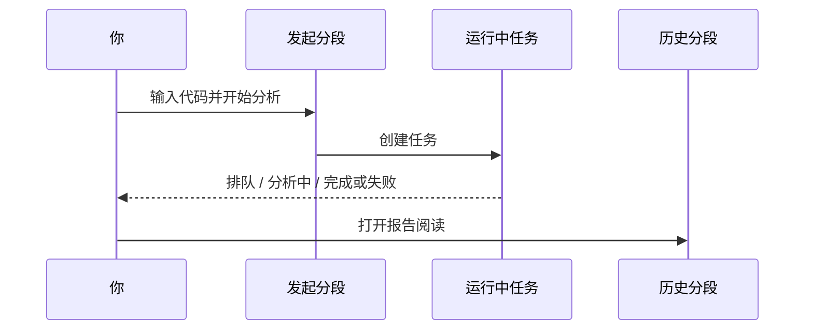

# 03 分析工作台

路径：

| 方式 | 具体路径 |
| --- | --- |
| 主导航 | **研究** → **分析工作台** |
| 命令面板 | 搜索「分析」「工作台」 |
| 直链 | `/research/analysis` |
| 分段 | `?segment=launch`（默认发起）/ `tasks`（运行中）/ `history`（历史）；历史还可带 `recordId` |

这里是生成**个股研究报告**的主战场。一次任务通常只服务一只（或一批）你指定的股票代码。

> 💡 **和「大盘复盘」的区别**  
> - **分析工作台**：研究「某一只股票」  
> - **大盘复盘**：研究「整个市场今天怎么样」  
> 不要用大盘结论直接当个股买卖指令。

## 三个分段

| 分段 | 用途 | 什么时候点 |
| --- | --- | --- |
| **发起与批量** | 输入股票、选策略、提交任务 | 每次想产生新报告 |
| **运行中任务** | 进度、失败原因 | 提交后立刻看；卡住时看错误 |
| **历史与对比** | 打开旧报告、趋势对比、删除 | 读结果、对比「上次怎么说」 |

URL 可能带有 `segment`、`recordId` 等参数，用于恢复分段与报告（适合收藏某一份历史）。

## 适用场景

| 场景 | 建议做法 |
| --- | --- |
| 第一次试用 | 只分析 1 只熟悉的大票，用**新手模式**或 brief 报告 |
| 日常跟踪自选 | 对 3～10 只批量提交，在任务列表盯进度 |
| 深度研究 | 选特定策略 Skill，完成后用历史趋势对比 |
| 从截图 / 表格导入 | 用智能导入确认列表后再提交，避免手误代码 |

## 发起分析（逐步）

1. 输入代码，例如 `600519`、`hk00700`、`AAPL`。  
2. （可选）从自选股一键填入。  
3. （可选）选择**策略 Skill**（分析风格包）；不选则系统默认。  
4. （可选）切换**新手 / 专业模式**，或报告详细程度（brief / detailed）。  
5. 点击开始分析。  
6. 自动进入「运行中任务」，耐心等待。  
7. 完成后打开历史报告；可按完成提示进入详情。

### 建议配置（界面侧）

| 项目 | 新手建议 | 说明 |
| --- | --- | --- |
| 模式 | 新手 | 更短结论、更保守风险表达 |
| 报告详细度 | brief（若可选） | 先读懂骨架，再切专业详情 |
| 策略 Skill | 先不选 | 减少变量，确认主链路可用 |
| 一次提交数量 | 1～3 只 | 避免同时打满模型额度 |

> ⚠️ **关于费用与耗时**  
> 每跑一次分析都会调用大模型（LLM，Large Language Model，大型语言模型）并可能访问新闻接口。批量越多，耗时与费用通常越高。先小批量验证再放大。

### 批量与智能导入

- **批量**：多只股票会在任务列表里分别显示进度。  
- **智能导入**：支持图片截图、CSV / Excel、剪贴板识别；请先**核对识别出的代码**再提交。  
- 导入失败时，检查文件是否过大、编码是否为 UTF-8/GBK、表头是否含「代码 / 名称」等列。

### 代码格式（务必看一眼）

| 市场 | 正确示例 | 常见错误 |
| --- | --- | --- |
| A 股 | `600519`、`300750` | 写成公司全名却不配代码 |
| 港股 | `hk00700` | 漏掉 `hk` 前缀 |
| 美股 | `AAPL`、`BRK.B` | 大小写混乱（建议大写） |
| 日股 / 韩股 | `7203.T`、`005930.KS` | 漏交易所后缀 |

## 任务进度怎么读

| 状态 | 含义 | 你该做什么 |
| --- | --- | --- |
| 排队 | 还在等待执行 | 等待；避免重复猛点 |
| 分析中 | 正在拉行情 / 新闻 / 生成 | 可看阶段文案；保持页面或稍后再来 |
| 完成 | 报告已生成 | 去历史打开 |
| 失败 | 出错 | 阅读错误原因后再重试 |

- 若显示「**自动阶段**」，表示按交易时段推断当前是盘前 / 盘中 / 盘后等；**最终阶段标签以报告页为准**。  
- 「日线未完成」出现在盘中时很常见：当天 K 线还没收死，结论应更保守。

## 历史与对比

1. 打开某条历史记录查看完整报告 / Markdown。  
2. 使用「历史趋势」查看**同一只股票**多次结论是否摇摆。  
3. 多选删除需确认——删除后不易恢复。  
4. **大盘复盘历史**与个股历史是分开的，不要在个股列表里找复盘。

## 新手模式与专业模式

| 模式 | 体验 | 适合谁 |
| --- | --- | --- |
| **新手** | 更短结论、更保守风险表达、研究声明更醒目 | 第一次用、只想抓主结论 |
| **专业** | 完整字段、趋势、更多细节入口 | 已熟悉字段、需要证据链 |

模式偏好通常保存在本机浏览器；登出不一定清除该偏好。

## 使用案例

**案例 A：只验证系统是否可用**  
输入 `600519` → 不选策略 → 新手模式 → 开始 → 完成后只读「结论 + 风险」两段。

**案例 B：对比两次观点**  
同一天或隔几天再跑一次同一代码 → 历史趋势里看操作建议是否从「观望」变成「买入」等 → 结合大盘环境自己判断，而不是自动跟。

**案例 C：从持仓跳转**  
在持仓页对某标的「一键分析」→ 仍会进入本工作台任务流 → 用同一套方式读报告。

## 从报告继续问股

报告页若提供「问股」入口，进入后会尽量携带当前标的上下文。详见 [05 问股对话](05-agent-chat.md)。

## 相关

- [08 阅读报告](08-reading-reports.md)
- [04 大盘复盘](04-market-review.md)
- [10 设置](10-settings.md)

## 深度：三个分段的界面控件

### 发起与批量（`segment=launch` 或默认无 segment）

| 控件 / 区域 | 作用 | 新手建议 |
| --- | --- | --- |
| 股票输入 / 自动完成 | 输入代码或名称搜索 | 先一只票验证 |
| 从自选填入 | 批量带入 watchlist | 自选过大时先筛 |
| 策略 Skill 列表 | 可选分析风格包 | 首次可不选 |
| 新手 / 专业、报告详略 | 影响报告密度 | 新手 + brief |
| 开始分析 | 提交单票或当前输入 | 提交后自动偏 tasks |
| 批量分析 | 多代码同策略提交 | 3～10 只一组 |
| 智能导入 | 图/CSV/剪贴板 → 代码列表 | **先核对再提交** |
| 导入结果提示 | 未识别 / 部分成功 | 看 `importEmpty` 类提示 |

智能导入失败排查：文件过大、编码非 UTF-8/GBK、表头无「代码」、截图模糊。

### 运行中任务（`segment=tasks`）

| 状态 | 含义 | 你该做什么 |
| --- | --- | --- |
| 排队 | 等待 worker | 等待；避免重复狂点 |
| 分析中 / 运行中 | 正在拉数 + LLM | 可看运行流 |
| 完成 | 可打开报告 | **查看报告** |
| 失败 | 模型/网络/数据 | 读错误 → 设置排查 → 重试单票 |
| 空列表 | 当前无任务 | 回 launch 发起 |

运行流（Run Flow）面板：展示单次任务阶段快照，用于诊断卡在「拉行情 / 新闻 / 生成」哪一步（进阶）。

URL 示例：`/research/analysis?segment=tasks&runFlow=task&runFlowTaskId=<id>`

### 历史与对比（`segment=history`）

| 能力 | 说明 |
| --- | --- |
| 历史列表 | 个股报告记录；分页 / 加载更多 |
| 选中报告 | 右侧摘要 + 可开 Markdown 抽屉 |
| recordId | `?segment=history&recordId=123` 收藏某一份 |
| 多选删除 | 不可恢复，确认文案要读完 |
| 历史趋势抽屉 | 同标的多次结论对比是否翻烧饼 |
| 运行流（历史） | `runFlow=history&runFlowRecordId=` |
| 空态 | 选一份历史或去发起新分析 |

## 深度：批量与自选覆盖

1. 自选股在设置或导入中维护。  
2. 工作台可显示自选「是否已有近期分析」类覆盖提示（版本相关）。  
3. 批量失败时可能部分成功：到 tasks 看哪些失败，不要假设全部完成。  
4. 批量任务沿用当前信息密度、策略与通知设置。

## 深度：策略 Skill 与报告语言

| 项 | 说明 |
| --- | --- |
| 策略列表来源 | Agent/Skill 目录；插件策略可能一并出现 |
| 不选 | 系统默认框架 |
| 报告语言 | 与界面语言独立；在设置「报告 → 输出」或发起区（若有） |
| 生成后端限制 | 本地 CLI 可能不支持部分 Agent 工具，但报告生成通常仍可用 |

## 深度：失败与费用

| 现象 | 优先检查 |
| --- | --- |
| 一提交就失败 | 模型 Key、测试连接、额度 |
| 长时间排队 | 是否已有大量任务；后端是否在跑 |
| 有任务无报告 | 失败态错误信息；历史是否被过滤 |
| 费用飙升 | 批量过大 + detailed + 反复重跑 |

## 深度使用案例

**案例：10 只自选周末批跑**  
1. 自选确认 10 只代码格式。  
2. launch 选 brief + 默认策略。  
3. 批量提交 → tasks 盯进度。  
4. 失败的 2 只单独重跑。  
5. history 打开最关心的 3 只按 [08](08-reading-reports.md) 阅读。  
6. 对需盯价的 1 只去信号中心建规则。

上一篇：[02 首页](02-home.md) · 下一篇：[04 大盘复盘](04-market-review.md)
