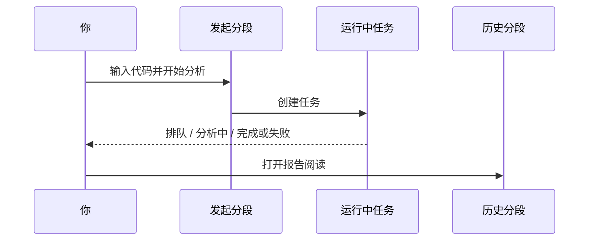

# 03 分析工作台

路径：导航 **研究 → 分析**（或命令面板搜索「分析」）。

这里是生成**个股研究报告**的主战场。一次任务通常只服务一只（或一批）你指定的股票代码。

> 💡 **和「大盘复盘」的区别**  
> - **分析工作台**：研究「某一只股票」  
> - **大盘复盘**：研究「整个市场今天怎么样」  
> 不要用大盘结论直接当个股买卖指令。

## 三个分段

| 分段 | 用途 | 什么时候点 |
| --- | --- | --- |
| **发起与批量** | 输入股票、选策略、提交任务 | 每次想产生新报告 |
| **运行中任务** | 进度、失败原因 | 提交后立刻看；卡住时看错误 |
| **历史与对比** | 打开旧报告、趋势对比、删除 | 读结果、对比「上次怎么说」 |

URL 可能带有 `segment`、`recordId` 等参数，用于恢复分段与报告（适合收藏某一份历史）。

## 适用场景

| 场景 | 建议做法 |
| --- | --- |
| 第一次试用 | 只分析 1 只熟悉的大票，用**新手模式**或 brief 报告 |
| 日常跟踪自选 | 对 3～10 只批量提交，在任务列表盯进度 |
| 深度研究 | 选特定策略 Skill，完成后用历史趋势对比 |
| 从截图 / 表格导入 | 用智能导入确认列表后再提交，避免手误代码 |

## 发起分析（逐步）

1. 在带推荐补全的股票搜索框输入代码或名称，例如 `600519`、`hk00700`、`AAPL`。
2. （可选）从自选股一键填入。  
3. （可选）选择**策略 Skill**（分析风格包）；不选则系统默认。  
4. 选择**分析阶段**：默认「自动」，也可为本次请求指定盘前、盘中或盘后。
5. （可选）切换**新手 / 专业模式**，或报告详细程度（brief / detailed）。
6. 点击开始分析。
7. 自动进入「运行中任务」，耐心等待。
8. 完成后打开历史报告；可按完成提示进入详情。

股票后缀示例、完整代码手动提交说明和分析阶段作用范围收在字段标题旁的帮助 tooltip 中；鼠标悬停或键盘聚焦帮助图标即可查看，不会再撑高发起区。

### 建议配置（界面侧）

| 项目 | 新手建议 | 说明 |
| --- | --- | --- |
| 模式 | 新手 | 更短结论、更保守风险表达 |
| 报告详细度 | brief（若可选） | 先读懂骨架，再切专业详情 |
| 策略 Skill | 先不选 | 减少变量，确认主链路可用 |
| 分析阶段 | 自动 | 保持原有行为，按市场与交易时段推断 |
| 一次提交数量 | 1～3 只 | 避免同时打满模型额度 |

> ⚠️ **关于费用与耗时**  
> 每跑一次分析都会调用大模型（LLM，Large Language Model，大型语言模型）并可能访问新闻接口。批量越多，耗时与费用通常越高。先小批量验证再放大。

### 批量与智能导入

- **批量**：多只股票会在任务列表里分别显示进度。  
- **智能导入**：支持图片截图、CSV / Excel、剪贴板识别；请先**核对识别出的代码**再提交。  
- 当前选择的分析阶段会一致应用到单股、批量、自选股、智能导入和重新分析；它只影响这一轮提交，不会改动系统设置。持仓页的一键分析有自己的同款阶段选择器。
- 导入失败时，检查文件是否过大、编码是否为 UTF-8/GBK、表头是否含「代码 / 名称」等列。

「发起与批量」会把股票与策略、模式与通知、批量操作分成三个操作区；
先从上到下确认，再提交，可避免把单股分析和批量导入混在一起。

### 代码格式（务必看一眼）

| 市场 | 正确示例 | 常见错误 |
| --- | --- | --- |
| A 股 | `600519`、`300750` | 写成公司全名却不配代码 |
| 港股 | `hk00700` | 漏掉 `hk` 前缀 |
| 美股 | `AAPL`、`BRK.B` | 大小写混乱（建议大写） |
| 日股 / 韩股 | `7203.T`、`005930.KS` | 漏交易所后缀 |

## 任务进度怎么读

| 状态 | 含义 | 你该做什么 |
| --- | --- | --- |
| 排队 | 还在等待执行 | 等待；避免重复猛点 |
| 分析中 | 正在拉行情 / 新闻 / 生成 | 可看阶段文案；保持页面或稍后再来 |
| 完成 | 报告已生成 | 去历史打开 |
| 失败 | 出错 | 阅读错误原因后再重试 |

- 「运行中任务」标签右侧只在存在任务时显示紧凑计数标记，不会扩大标签栏高度。
- 阶段选择包含 **自动、盘前、盘中、盘后**。默认「自动」与改动前行为兼容，会按市场和交易时段推断；手动选择只覆盖当前请求。
- 任务列表展示的是 **请求阶段**，用于确认你提交了「自动」还是某个手动阶段；报告页展示的是分析完成后采用的 **最终阶段**。两者用途不同，最终阶段标签以报告页为准。
- 「日线未完成」出现在盘中时很常见：当天 K 线还没收死，结论应更保守。

## 历史与对比

1. 打开某条历史记录查看完整报告 / Markdown。  
2. 使用「历史趋势」查看**同一只股票**多次结论是否摇摆。  
3. 多选后使用垃圾桶图标删除；删除仍需确认，且删除后不易恢复。
4. **大盘复盘历史**与个股历史是分开的，不要在个股列表里找复盘。

## 新手模式与专业模式

| 模式 | 体验 | 适合谁 |
| --- | --- | --- |
| **新手** | 更短结论、更保守风险表达、研究声明更醒目 | 第一次用、只想抓主结论 |
| **专业** | 完整字段、趋势、更多细节入口 | 已熟悉字段、需要证据链 |

模式偏好通常保存在本机浏览器；登出不一定清除该偏好。

## 使用案例

**案例 A：只验证系统是否可用**  
输入 `600519` → 不选策略 → 新手模式 → 开始 → 完成后只读「结论 + 风险」两段。

**案例 B：对比两次观点**  
同一天或隔几天再跑一次同一代码 → 历史趋势里看操作建议是否从「观望」变成「买入」等 → 结合大盘环境自己判断，而不是自动跟。

**案例 C：从持仓跳转**  
在持仓页先选择分析阶段，再对某标的「一键分析」→ 仍会进入本工作台任务流 → 在任务列表核对请求阶段，并以报告页最终阶段为准。

## 从报告继续问股

报告页若提供「问股」入口，进入后会尽量携带当前标的上下文。详见 [05 问股对话](05-agent-chat.md)。

## 相关

- [08 阅读报告](08-reading-reports.md)
- [04 大盘复盘](04-market-review.md)
- [10 设置](10-settings.md)

上一篇：[02 首页](02-home.md) · 下一篇：[04 大盘复盘](04-market-review.md)
