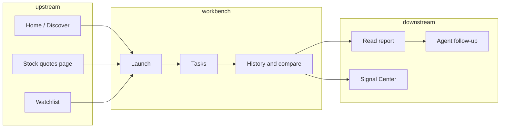
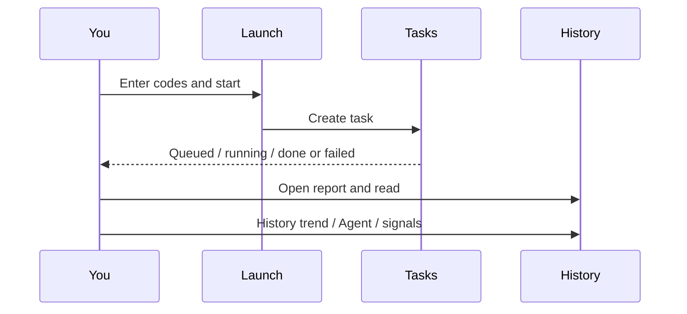
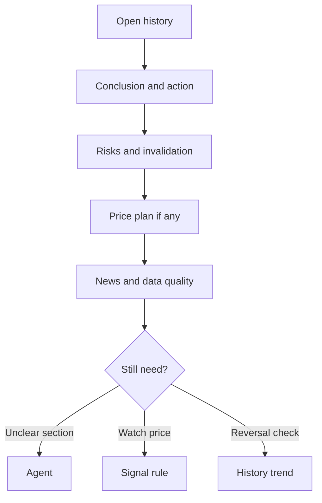

# 03 Analysis Workbench

## What you will learn

1. How the Workbench differs from Market review, Discover, and Agent chat  
2. How to run the full path: Launch → Tasks → History, including useful URL parameters  
3. How to enter A-share / HK / US codes correctly, plus batch and smart import  
4. How Skill, brief/detailed, and Beginner mode affect output and cost  
5. How to use Run flow for troubleshooting, history trend for longitudinal review, and a quota-aware research rhythm  

> 📘 **One-liner**  
> The Analysis Workbench is the **main place to generate single-stock AI research reports**: you submit codes, the system fetches market and news context, and a large model writes output you can reread, compare, and optionally turn into signals.

> 💡 **How it differs from nearby pages**  
> | Page | Research unit | Typical question |  
> | --- | --- | --- |  
> | **Analysis Workbench** | One stock (or a batch you chose) | What is the evidence and risk for this name? |  
> | **Market review** | Whole market | What is the market tone today? |  
> | **Discover** | Candidate shortlist | Which codes are worth Workbench time? |  
> | **Agent chat** | Multi-turn follow-up | What does this report section mean? |  
> A strong index does **not** mean your single name is strong. Treat the **single-stock report** as the source of truth for that name.

> ⚠️ **Research only**  
> Reports are for study and research — **not investment advice**. Each run typically consumes model quota (and may call news or other APIs). Start small, then scale.

---

## 1. Mental map



Short daily path:

```text
Clarify the question → run once → wait on Tasks → read History in order → optional Agent or rule
```

---

## 2. Entry and URLs

> 🧭 **Entry**

| Method | Path / action |
| --- | --- |
| Primary nav | **Research** → **Analysis Workbench** |
| Command palette | `Cmd/Ctrl+K` → try keywords such as “analysis” or “workbench” |
| Address bar | `/research/analysis` |
| From Home | **Start analysis** when focus is empty (or related todos) |
| From stock page | **Analyze** on `/stocks/{code}` (often pre-fills the code) |

### 2.1 Bookmarkable query parameters

| Parameter | Meaning | Example |
| --- | --- | --- |
| `segment=launch` | Launch analysis (often the default) | `/research/analysis` |
| `segment=tasks` | In-progress tasks | `…?segment=tasks` |
| `segment=history` | History and compare | `…?segment=history` |
| `recordId=` | Open one history report | `…?segment=history&recordId=42` |
| `stock=` | Pre-fill symbol | `…?stock=600519` |
| `runFlow=task` + `runFlowTaskId=` | Open task Run flow (advanced) | Task troubleshooting |
| `runFlow=history` + `runFlowRecordId=` | Open history Run flow (advanced) | Review failed stages |

> ✅ **Recommended**  
> Bookmark a frequently read report with `segment=history&recordId=…`. Bookmark a launch page with `stock=` when you re-run the same name often.  
> ❌ **Avoid**  
> Bookmarking one-off Run flow task IDs—links may stop being useful after the task ends.

---

## 3. Three segments

> 🖼️ **Figure placeholder** · `assets/analysis-workbench-three-segments-en.png`  
> **Capture**: Workbench segment control: Launch / Tasks / History.  
> **Notes**: URL /research/analysis; English UI; Launch selected.  
> **Status**: pending — see [assets/PLACEHOLDERS.md](assets/PLACEHOLDERS.md)

Daily habit: **Launch → Tasks → History**.

| Segment | What you do | When |
| --- | --- | --- |
| **Launch** | Enter codes, choose Skill/density, submit | You want a new report |
| **Tasks** | Watch queue / running / fail; optional Run flow | Right after submit; when stuck |
| **History** | Open reports, compare trend, delete | After results exist; weekend review |



> 💡 **Tip**  
> After a successful submit, the UI typically switches to **Tasks**. That is expected navigation, not a lost form.

---

## 4. Launch tutorial

> 🖼️ **Figure placeholder** · `assets/analysis-workbench-launch-form-en.png`  
> **Capture**: Launch form: symbol input (e.g. 600519), Skill, brief/beginner, Start analysis.  
> **Notes**: No real API keys.  
> **Status**: pending — see [assets/PLACEHOLDERS.md](assets/PLACEHOLDERS.md)

### 4.1 First analysis: one symbol only

1. Open **Launch** (`segment=launch`).  
2. Enter a code (see §5), e.g. `600519`.  
3. Leave **Skill** empty—fewer variables for first success.  
4. Prefer **Beginner** and/or **brief** when offered.  
5. Click **Start analysis**.  
6. On **Tasks**, wait; do **not** click Start repeatedly.  
7. When complete, **View report** or open History.  
8. Read in the order in [08 Reading reports](08-reading-reports_EN.md): conclusion → risks → levels → news.

> ✅ **Recommended**  
> Week one: one familiar symbol + brief + default Skill. Only after that path is stable should you batch.  
> ❌ **Avoid**  
> First run as detailed + many symbols + frequent Skill switches.

### 4.2 Pre-submit checklist (~30 seconds)

| Check | Pass criteria |
| --- | --- |
| Model | Saved in Settings and **test connection** succeeded |
| Code | Format correct; autocomplete name matches intent |
| Density | You know whether you chose brief or detailed |
| Skill | Default, or one Skill you understand |
| Batch size | Beginner: 1; later: start at 3–10 |
| Duplicate | Same symbol already run today without a new question? |

---

## 5. Symbol formats

When unsure, use input **autocomplete**, or open the [stock workspace](13-stock-details_EN.md) and confirm name vs price.

| Market | Preferred form | Examples | Common mistakes |
| --- | --- | --- | --- |
| A-shares | 6-digit code | `600519`, `300750`, `000001` | Company name only; dropped leading zeros |
| Hong Kong | Prefer `hk` + code (padding as shown in UI) | `hk00700` (other forms such as `00700` / `00700.HK` may normalize—trust the normalized result) | Unrecognized format; wrong underlying |
| US | Uppercase ticker | `AAPL`, `MSFT`, `BRK.B` | Chaotic casing; wrong period in class shares |
| Japan etc. | Code + exchange suffix | `7203.T` | Missing suffix |
| Korea etc. | Code + suffix | `005930.KS` | Missing suffix or wrong padding |

> ⚠️ **Note**  
> Batch failures often come from HK codes that are not recognized as intended. Confirm autocomplete names and scan comma-separated lists before submit.

### 5.1 Mixed-market batch example

```text
Correct: 600519,hk00700,AAPL
Risky:   600519,00700,aapl   (HK may lack prefix; US preferably uppercased)
```

---

## 6. Batch analysis

Use batch only after model test, watchlist stability, and a successful single-name run.

### 6.1 Recommended steps

1. Fill from watchlist or paste comma-separated codes.  
2. Confirm Beginner/professional, brief/detailed, and Skill apply to the **whole** batch.  
3. Submit and watch Tasks for per-row success/failure.  
4. **Partial failure is common**—re-run only failed names.  
5. In History, deep-read holdings or highest-priority names first.

### 6.2 Size guidance

| Stage | Suggested batch | Why |
| --- | --- | --- |
| First success | 1 | Validate the pipeline |
| Daily maintenance | 3–10 | Readable and cost-controlled |
| Weekend deep dive | Split by quota | Avoid one total failure |
| Hundreds | Usually not via Web click | Expensive and unreadable; consider scripts/schedule (advanced) |

> ❌ **Avoid**  
> Running detailed on an entire watchlist “just to refresh.” Signal Center fills with noise and you will not finish reading.

---

## 7. Smart import

When the UI offers **image / CSV / Excel / clipboard** import:

1. Choose file or paste content.  
2. **Human-review** detections: high confidence may stay selected; medium/low needs your confirmation.  
3. Remove false positives (dates, row numbers mistaken for codes).  
4. Merge into the pending list.  
5. Prefer brief for the first batch.

| Symptom | Likely cause | Action |
| --- | --- | --- |
| Empty detection | Blurry image / non-table screenshot | Clearer image or CSV |
| Garbled text | Encoding not UTF-8/GBK | Re-save encoding |
| Wrong columns | No “code”-like header | Fix header or map column |
| File rejected | Too large | Split file |
| Noise codes | OCR misread | Uncheck manually |

> ✅ **Recommended**  
> Import → review → keep high confidence → brief batch → re-run failures alone.  
> ❌ **Avoid**  
> Select-all and submit without reading detections.

---

## 8. Strategy Skills

> 📘 **Concept**  
> A **Skill** is a style pack that shifts evidence emphasis (trend, quality, events, etc.—**as listed in the product**). It changes angle and narrative weight. It is **not** a profit switch and does not remove risk.

| Choice | Fit | Note |
| --- | --- | --- |
| None (default) | First success, baseline | Fewest variables |
| One you understand | Clear research lens | You should be able to explain what it prioritizes |
| Frequent switching | — | **Avoid**; longitudinal compare becomes noisy |

> ✅ **Recommended**  
> Same symbol: default baseline → one understood Skill for contrast → then **freeze** for a while so history trend stays meaningful.

---

## 9. Beginner mode and brief / detailed

| Option | Feel / cost | Fit |
| --- | --- | --- |
| Beginner | Shorter, more conservative, fewer fields | First read, key points only |
| Professional | Fuller structure and context | Evidence check, quality, degradation |
| brief | Shorter report, usually cheaper | Daily use, batch skeleton |
| detailed | Longer, more quota | Heavy holdings, event days, weekend depth |

The same analysis record can **look denser or thinner** under different display modes; underlying conclusions are typically the same. If Beginner feels thin, switch professional view or open full Markdown—it is not necessarily “analysis incomplete.”

> 💡 **Tip**  
> Quota-friendly pattern: **brief skeleton → Agent on 1–2 holes → detailed only if still needed**.

---

## 10. Tasks and Run flow

> 🖼️ **Figure placeholder** · `assets/analysis-workbench-task-running-en.png`  
> **Capture**: Task list with at least one queued or running row.  
> **Notes**: Demo data; readable status.  
> **Status**: pending — see [assets/PLACEHOLDERS.md](assets/PLACEHOLDERS.md)

| State | Meaning | Your action |
| --- | --- | --- |
| Queued | Waiting its turn | Wait; avoid duplicate submit |
| Running | Fetch + model | Optional Run flow if stuck |
| Completed | Report ready | Open report |
| Failed | Error mid-flight | Read error text → Settings / data / network |
| Empty list | No active tasks | Return to Launch |

### 10.1 Run flow

> 📘 **Concept**  
> **Run flow** breaks one job into stages (quotes, news, body generation, …) for transparency and debugging. Ignore it when runs succeed; open it when a job spins or you need to explain a bottleneck.

Typical open paths: task-row panel, or advanced URL with `runFlow=task` and `runFlowTaskId=…`.

### 10.2 Failure order (keep fixed)

1. Read the **full error text**.  
2. 401 / balance / API key → [Settings](10-settings_EN.md) test model connection and quota.  
3. Timeout / network / connection refused → confirm backend and network; retry **once**.  
4. Data source / quotes / news → check data sources; accept technical-only degradation when needed.  
5. One symbol fails while batch peers succeed → check that code’s format and existence.  
6. Still failing → keep error + task info for diagnosis; do not burn quota with rapid retries.

---

## 11. History and compare

> 🖼️ **Figure placeholder** · `assets/analysis-workbench-history-en.png`  
> **Capture**: History list plus summary / open report.  
> **Notes**: One demo record; 600519 or AAPL.  
> **Status**: pending — see [assets/PLACEHOLDERS.md](assets/PLACEHOLDERS.md)

After completion, reports appear under **History**:

1. Select a row in the list.  
2. Read the summary; open full Markdown when needed.  
3. Use **history trend** on the same symbol to see whether conclusions reverse across runs.  
4. Multi-delete only when sure—**usually irreversible**.  
5. For follow-up, **Continue in chat** ([05](05-agent-chat_EN.md)).  
6. For price watching, create a Signal Center rule or manual signal ([06](06-signals_EN.md)).

Bookmark with `segment=history&recordId=…`. Reading order: [08](08-reading-reports_EN.md).



---

## 12. Cost and mindset

| Behavior | Cost / noise | Guidance |
| --- | --- | --- |
| brief + one symbol | Low | Default start |
| detailed + one symbol | Medium–high | Heavy position / event day |
| brief + small batch | Medium | Weekend maintenance |
| detailed + large batch | Very high | Split carefully |
| Same-day meaningless re-runs | Waste + signal noise | Read first |
| Long chat rewriting whole chapters | Often expensive | Point questions only |

```text
Clarify question → run once → read carefully → optional Agent → then detailed or Skill change if needed
```

---

## 13. Use cases

**A — First report ever** — model + watchlist ready → one familiar code → Beginner + brief → read action + top risks.  
**B — Weekend batch of 8** — verify formats → brief + default Skill → re-run failures → deep-read top 3 holdings → one price rule if needed.  
**C — Task failed** — model/401 → test connection; timeout → backend/network once; data → data-source keys.  
**D — From quotes page** — Analyze on `/stocks/AAPL` carries the code.  
**E — Longitudinal check** — last 3 history rows + history trend before another detailed run.  
**F — Smart import** — human review → high confidence only → brief batch.  
**G — Skill A/B** — default baseline, then one understood Skill; freeze for a period.  
**H — Mixed markets** — `600519,hk00700,AAPL` and confirm autocomplete names.  
**I — Run flow stuck on news** — open stages → fix news source → re-run failed names only.  
**J — From Discover** — shortlist 5 → brief batch → detailed or rules only for 1–2 keepers.

More funnel recipes: [11](11-daily-workflows_EN.md).

---

## 14. FAQ

**Q1: After Start, the page jumps—did submit fail?**  
Usually it moved to **Tasks**. Check task status there.

**Q2: Task stays queued?**  
Other jobs may hold the queue, or the backend is busy. Wait one cycle; confirm you did not re-submit. If stuck long-term, check backend and scheduling.

**Q3: History missing a just-finished report?**  
Refresh History; check filters; confirm the task truly completed.

**Q4: HK symbols often fail?**  
Prefer `hk00700`-style input and confirm autocomplete name matches the intended listing. Other formats may normalize—trust the normalized result shown in the UI.

**Q5: Is Beginner the same as brief?**  
No. Beginner/professional mainly affect **presentation**; brief/detailed mainly affect **generation density and cost**. They can combine.

**Q6: Can deleted history be restored?**  
Typically **no**. Confirm before delete.

**Q7: Must I open Run flow?**  
No. Use it when stuck or failed.

**Q8: Do Workbench and Market review share one history pile?**  
Product types typically separate single-stock analysis from `market_review`. Do not treat index narrative as a single-name action label.

---

## 15. Self-check

### Before run

- [ ] Model saved and connection test green  
- [ ] Code format correct (HK: prefer `hk…`)  
- [ ] brief/detailed and Beginner mode intentional  
- [ ] Skill default or understood  
- [ ] Batch size controlled; partial failure acceptable  

### After run

- [ ] Success/failure confirmed per task  
- [ ] Failures: error text read; re-run decision made  
- [ ] Highest-priority report: conclusion and risks read  
- [ ] Watch conditions noted or turned into rules  
- [ ] No meaningless same-day re-run for “comfort”  

### Weekend

- [ ] History trend on heavy holdings for conclusion reversals  
- [ ] Careful cleanup of true noise history  
- [ ] Quota spent mainly on reports you can finish reading  

---

## 16. Glossary

| Term | Meaning |
| --- | --- |
| Analysis Workbench | Main single-stock report page (`/research/analysis`) |
| segment | Launch / tasks / history work areas |
| Skill | Optional analysis style pack |
| Run flow | Stage log for one task |
| recordId | History report id in the URL |
| brief / detailed | Generation density |
| Beginner / professional | Display density and tone |
| Batch | Multi-symbol submit |
| History trend | Longitudinal compare on one symbol |
| Smart import | Codes from image/table/clipboard |

---

## 17. Related

- [08 Reading reports](08-reading-reports_EN.md) — fixed reading order  
- [05 Agent chat](05-agent-chat_EN.md) — point follow-ups after the report  
- [06 Signal Center](06-signals_EN.md) — structured conditions and alerts  
- [04 Market review](04-market-review_EN.md) — market tone, not a stock ticket  
- [13 Stock workspace](13-stock-details_EN.md) — quotes and jump to Analyze  
- [12 Discover](12-discover_EN.md) — candidates before Workbench  
- [10 Settings](10-settings_EN.md) — models, data sources, quota  
- [11 Daily workflows](11-daily-workflows_EN.md) — end-to-end recipes  

Prev: [02 Home](02-home_EN.md) · Next: [04 Market review](04-market-review_EN.md)
