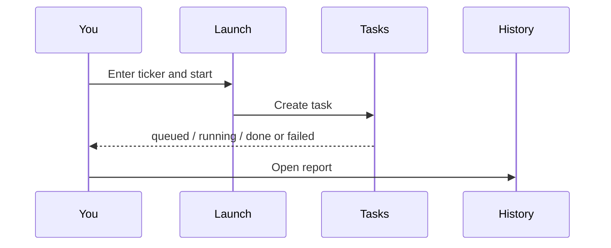

# 03 Analysis workbench

Path: **Research → Analysis** (or search “analysis” in the command palette).

This is where **single-stock research reports** are produced. A task targets one ticker (or a batch you submit).

> 💡 **Vs Market review**  
> - **Workbench**: one symbol  
> - **Market review**: whole-market session summary  
> Do not treat market review as a single-name order ticket.

## Three segments

| Segment | Purpose | When |
| --- | --- | --- |
| **Launch & batch** | Enter tickers, optional skill, submit | Every new report |
| **Running tasks** | Progress and errors | Right after submit |
| **History & compare** | Open reports, trends, delete | Reading and comparison |

URL params such as `segment` and `recordId` restore context (useful bookmarks).

## Scenarios

| Scenario | Suggestion |
| --- | --- |
| First trial | One liquid name; Beginner mode or brief report |
| Daily watchlist | Batch 3–10 names; watch the task list |
| Deep dive | Pick a Skill; compare history trends |
| Import from image/CSV | Confirm parsed tickers before submit |

## Start an analysis

1. Enter a code (`600519`, `hk00700`, `AAPL`, …).  
2. Optionally pick from the watchlist.  
3. Optionally choose a **Skill** (style pack); omit for default.  
4. Choose an **Analysis phase**: Auto by default, or Premarket, Intraday, or Postmarket for this request.
5. Optionally set **Beginner / Professional** or brief/detailed.
6. Start.
7. Watch **Running tasks**.
8. Open History when complete.

### Recommended UI settings

| Item | Beginner pick | Why |
| --- | --- | --- |
| Mode | Beginner | Shorter conclusion, conservative risk tone |
| Detail | brief if available | Learn the skeleton first |
| Skill | none | Fewer variables |
| Analysis phase | Auto | Preserves the existing market/session inference behavior |
| Batch size | 1–3 | Cost and rate limits |

> ⚠️ **Cost & time**  
> Each run calls an LLM (large language model) and may call news APIs. Larger batches cost more.

The selected phase applies consistently to single-symbol, batch, watchlist, smart-import, and reanalysis submissions. It is a per-request override and does not change system settings. One-click analysis in Portfolio has its own equivalent phase selector.

### Ticker formats

| Market | Examples | Common mistake |
| --- | --- | --- |
| A-share | `600519` | Company name without code |
| Hong Kong | `hk00700` | Missing `hk` |
| US | `AAPL`, `BRK.B` | Odd casing |
| JP / KR | `7203.T`, `005930.KS` | Missing suffix |

## Task states

| State | Meaning | Action |
| --- | --- | --- |
| Queued | Waiting | Wait; avoid spam clicks |
| Running | Fetching / generating | Read stage text |
| Completed | Report ready | Open History |
| Failed | Error | Read the reason, then retry |

The selector offers **Auto, Premarket, Intraday, and Postmarket**. Auto is the default and preserves the pre-existing market/session inference behavior; a manual choice overrides only the current request.

The task list shows the **requested phase**, so you can confirm whether Auto or an explicit phase was submitted. The report page shows the **final phase** used after analysis and remains authoritative. These are intentionally distinct.

## History & compare

1. Open a record for full Markdown/report UI.  
2. Use history trend for the **same** symbol.  
3. Multi-delete requires confirmation.  
4. Market-review history is separate from single-stock history.

## Beginner vs Professional

| Mode | Experience |
| --- | --- |
| Beginner | Compact conclusion, conservative risk, clear research disclaimer |
| Professional | Full fields and deeper evidence |

Preference is usually local to the browser/client.

## Examples

- **Smoke test**: `600519`, no skill, Beginner → read conclusion + risk only.  
- **Compare views**: run again later → history trend for suggestion changes.  
- **From Portfolio**: choose a phase before one-click analysis; the job still lands in this task flow, where the requested phase is visible and the report remains authoritative for the final phase.

Continue in chat from a report when the entry exists — see [05 Agent chat](05-agent-chat_EN.md).

Previous: [02 Home](02-home_EN.md) · Next: [04 Market review](04-market-review_EN.md)
