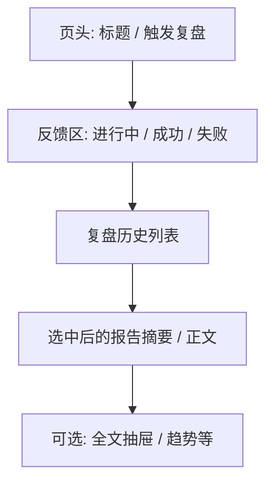

# 04 大盘复盘

## 页面入口与操作路径

| 方式 | 具体路径 |
| --- | --- |
| 主导航 | **研究** → **大盘复盘** |
| 命令面板 | `Cmd/Ctrl + K`，搜索「大盘」或「复盘」 |
| 直链路由 | `/research/market` |
| 一键触发深链 | `/research/market?action=run`（部分首页待办 / 自动化入口会带此参数，进入后自动尝试触发） |
| 旧习惯 | 不要在个股历史列表里找大盘报告；复盘历史只在本页 |

页面标题以界面为准（常见为「大盘复盘」；英文界面为 **Market review**）。

大盘复盘回答的是「**整个市场今天 / 这一阶段怎么样**」，不是「某一只股票该不该买」。请与个股报告分开阅读，避免把指数情绪直接当成个股买卖指令。

> 💡 **和「分析工作台」的区别**  
> - **分析工作台**（`/research/analysis`）：研究某一只股票  
> - **大盘复盘**（`/research/market`）：研究市场整体（指数、涨跌家数、板块、情绪等）  
> - **发现**（`/research/discover`）：选股 / 筛选实验入口（另页；本分册不展开）

> ⚠️ **研究免责**  
> 复盘内容仅供学习与研究，**不构成投资建议**。

## 适用场景

| 场景 | 建议做法 |
| --- | --- |
| 收盘后做日度回顾 | 触发一次复盘，读指数与板块，再决定明天盯哪些方向 |
| 盘中想感受温度 | 可以触发，但必须注意「日线可能未完成」类提示 |
| 已经有历史复盘 | 优先打开历史，不必为了「再看一遍」重复触发 |
| 与自选结合 | 复盘找主线 → 回分析工作台研究具体标的 |
| 从首页待办点进来 | 若 URL 带 `action=run`，先确认是否真要再跑一遍，避免误触发 |

## 页面结构（你看到的区块）

| 区域 | 作用 | 小白怎么记 |
| --- | --- | --- |
| **触发复盘** | 提交一次市场级任务 | 「重新算今天的市场温度」 |
| **任务反馈** | 提交中、进行中、完成、超时、失败 | 「跑完没有」 |
| **复盘历史** | 历史记录列表；可多选删除 | 「以前的市场日记」 |
| **报告区** | 选中一条后的摘要 / Markdown 正文 | 「正文」 |
| **运行流（若打开）** | 单次任务内部阶段快照 | 「黑盒拆步骤」（进阶） |

## 操作步骤：触发一次复盘

1. 进入 **研究 → 大盘复盘**（`/research/market`）。  
2. 点击 **触发复盘**（按钮文案以界面为准）。  
3. 观察反馈区状态：  
   - **已提交 / 进行中**：耐心等待，不要连点多次。  
   - **完成**：历史列表应出现或刷新出新记录。  
   - **失败 / 超时**：阅读错误文案（模型 Key、网络、数据源等），到 [10 设置](10-settings.md) 排查后再试。  
4. 在 **大盘复盘历史** 中点开最新一条。  
5. 先读摘要，再打开全文（若提供 Markdown 抽屉）。  
6. 需要研究具体股票时：命令面板搜代码，或导航到 **研究 → 分析工作台**。

### 深链 `?action=run` 说明

- 部分入口会带上 `action=run`，页面加载后**自动尝试触发**一次复盘。  
- 参数被消费后，地址栏通常会清理掉，避免刷新时无限重复触发。  
- 若你只是「想看历史」，请用干净 URL：`/research/market`，不要手动加 `action=run`。

## 报告里常见内容

| 区块 | 你在看什么 | 常见误读 |
| --- | --- | --- |
| 主要指数 | 上证 / 深证 / 创业板等涨跌（随市场配置变化） | 指数涨 ≠ 你的持仓涨 |
| 市场概况 / 广度 | 上涨 / 下跌家数、涨停跌停等 | 家数多也不等于主线可持续 |
| 板块或概念 | 领涨 / 领跌方向 | 今日领涨不保证明日延续 |
| 风险与计划类摘要 | 情绪、注意点、次日观察框架 | 不是仓位指令 |
| 数据质量提示 | 降级、延迟、盘中未完成 | 提示越多，结论应越保守 |

## 术语表

| 术语 | 一句话解释 |
| --- | --- |
| **大盘复盘** | 对**市场整体**的一次 AI 摘要任务，不是个股买卖单 |
| **广度（Breadth）** | 上涨家数 vs 下跌家数等，反映赚钱效应是否扩散 |
| **板块轮动** | 资金在不同主题间切换 |
| **日线未完成** | 盘中 K 线尚未收死，结论权重应降低 |
| **Market Light / 红绿灯** | 部分版本用结构化红黄绿表达市场温度（进阶；以界面是否展示为准） |
| **运行流（Run Flow）** | 单次任务内部阶段记录，用于诊断卡在哪一步 |
| **recordId** | 历史记录 ID；选中报告时可能出现在 URL 查询参数中，便于收藏某一条复盘 |

## 建议配置与阅读纪律

| 项目 | 建议 |
| --- | --- |
| 触发时机 | 优先**盘后**；盘中仅作温度计 |
| 阅读顺序 | 指数 → 广度 → 板块 → 风险 / 数据质量 |
| 下一步 | 用复盘缩小关注面，再回 [03 分析工作台](03-analysis-workbench.md) |
| 模型 | 与个股分析共用主分析模型；未配置模型时任务会失败 |
| 通知 | 若配置了推送，完成时可能发通知；是否发送以 [10 设置](10-settings.md) 为准 |

> ⚠️ **不要用大盘结论直接下个股单**  
> 指数强不代表你的持仓股强；板块热不代表每个成分股都值得追。个股仍要看自身报告与风险。

## 使用案例

**案例 A：收盘后 10 分钟工作流**  
1. 打开 `/research/market`，触发复盘。  
2. 只记三件事：主线板块、市场广度一句话、两条风险。  
3. 从自选里挑最多 2 只相关标的，去分析工作台或问股。  
4. 若已有持仓，再到 [07 持仓 / 组合](07-portfolio.md) 看集中度是否踩在主线上。

**案例 B：盘中误读纠正**  
1. 盘中触发后看到「大涨叙事」。  
2. 报告或反馈中提示日线未完成 / 数据质量降级。  
3. 把结论权重降低：只当温度计，等收盘再决定是否加仓研究。

**案例 C：只读历史、不重复触发**  
1. 进入干净 URL `/research/market`。  
2. 在历史中打开昨日 / 上周复盘。  
3. 对比板块是否切换；无需每天为「再看一眼」重新跑任务（省额度）。

**案例 D：任务失败**  
1. 反馈区显示失败。  
2. 常见原因：未配置模型 Key、网络超时、数据源异常。  
3. 到 **设置 → AI 与模型** 测试连接；到 **数据源** 确认行情可用。  
4. 修好后**只触发一次**，在历史中确认新记录出现。

## 历史管理

| 操作 | 说明 |
| --- | --- |
| 打开 | 点击历史条目加载报告 |
| 多选删除 | 清理不再需要的复盘；删除不可恢复，请确认 |
| 加载更多 | 历史过长时分页 / 继续加载 |
| 与个股历史 | **分开存放**；个股列表默认不是大盘入口 |

## 与其他模块的关系

| 模块 | 关系 |
| --- | --- |
| 分析工作台 | 复盘定方向 → 个股深挖 |
| 信号中心 | 部分市场级 / 告警相关信号可能标注来源含 market_review（以实际数据为准） |
| 设置 | 模型、数据源、通知决定复盘能否跑通与是否推送 |
| 发现页 | 同属「研究」分组，但是选股实验，不是复盘 |

## 相关

- [03 分析工作台](03-analysis-workbench.md)
- [01 壳层](01-shell.md)（命令面板与导航）
- [08 阅读报告](08-reading-reports.md)（个股阅读顺序；大盘报告结构不同）
- [11 日常工作流](11-daily-workflows.md)

上一篇：[03 分析工作台](03-analysis-workbench.md) · 下一篇：[05 问股对话](05-agent-chat.md)
