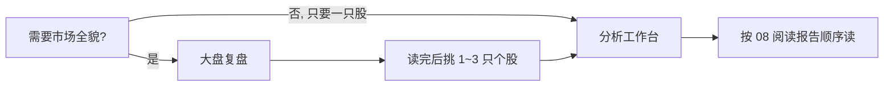

# 04 大盘复盘

路径：导航 **研究 → 大盘复盘**（或命令面板搜索「复盘」「大盘」）。

大盘复盘回答的是：**「今天（或某一交易日）整个市场大概发生了什么？」**  
它**不是**某一只股票的买卖操作单。

> 💡 **和「个股分析」一句话区分**  
> - **大盘复盘**：指数、涨跌家数、板块、情绪与风险提示  
> - **个股分析**（[03 分析工作台](03-analysis-workbench.md)）：单只代码的结论、价位与风险  
> 读完大盘再决定「今天要不要深挖哪几只个股」，比直接拿大盘结论当买卖指令更稳妥。

## 适用场景

| 场景 | 是否适合用大盘复盘 | 说明 |
| --- | --- | --- |
| 收盘后想快速了解全天氛围 | ✅ 很适合 | **盘后**语义最完整 |
| 盘中想看「现在市场热不热」 | ⚠️ 可用但要保守 | 注意「日线可能未完成」 |
| 只想知道某只股票买不买 | ❌ 不够 | 请用个股分析 + [08 阅读报告](08-reading-reports.md) |
| 已经有一份复盘，只想再读一遍 | ✅ | 打开**历史**，不必重复触发 |

## 与个股分析的对比

| 维度 | 大盘复盘 | 个股分析 |
| --- | --- | --- |
| 对象 | 市场整体（如 A 股盘面） | 一只（或一批）股票代码 |
| 典型输出 | 指数、广度、板块、线索与风险 | 操作建议、支撑压力、个股风险 |
| 历史存放 | 复盘历史列表 | 分析工作台「历史」分段 |
| 使用频率建议 | 每日 0～1 次即可 | 按你跟踪的标的按需 |

## 操作步骤

1. 进入 **研究 → 大盘复盘**。  
2. 点击 **触发复盘**（按钮文案以界面为准，可能是「开始复盘」「Run review」等）。  
3. 等待任务变为**完成**；若失败，先读错误提示再重试（常见与模型额度、网络有关）。  
4. 在**复盘历史**中打开报告阅读。  
5. 之后若只是「再看一遍」，直接从历史打开，**无需为了重读而重复触发**。

### 建议配置（界面侧）

| 项目 | 建议 | 原因 |
| --- | --- | --- |
| 触发时机 | 优先**收盘后** | 全日行情更完整，表述不易误导 |
| 盘中是否触发 | 可以，但结论当「过程快照」 | 日线可能仍是 **partial（未完成）** |
| 重复触发 | 无新信息时不要连点 | 每次都会消耗模型与数据资源 |
| 模型 | 与个股分析共用已测通的渠道即可 | 先保证 [小白安装](../beginner-client-setup.md) 里模型可用 |

> ⚠️ **费用提醒**  
> 复盘与个股分析一样会调用大模型（LLM）。同一天多次无差别重跑，通常只增加费用，不提高信息质量。

## 报告里常见内容（怎么读）

建议阅读顺序（比从上到下乱扫更高效）：

| 顺序 | 内容块 | 你在找什么 |
| --- | --- | --- |
| 1 | 主要指数涨跌 | 今天整体偏强还是偏弱 |
| 2 | 上涨 / 下跌家数等**市场广度** | 是少数权重在涨，还是多数股票参与 |
| 3 | 板块或概念表现 | 资金更关注哪些主题 |
| 4 | 线索 / 机会摘要 | 仅作研究线索，不是个股下单指令 |
| 5 | 风险提示与计划类摘要 | 明天或下一阶段要警惕什么 |

### 术语速查

| 术语 | 白话解释 |
| --- | --- |
| **指数** | 一篮子股票的综合表现（如沪深 300），代表「市场温度计」之一 |
| **市场广度（Breadth）** | 上涨家数、下跌家数等，用来看赚钱效应是否普遍 |
| **板块 / 概念** | 按行业或题材归类的一组股票的整体表现 |
| **线索** | 复盘里提到的可继续研究的方向，需回到个股与原始信息验证 |
| **盘前 / 盘中 / 盘后** | 交易日不同时段；盘后更适合写「全日」结论 |

## 阅读纪律

- **盘后**更适合完整复盘语义。  
- **盘中**触发时，看到「日线可能未完成」类提示，不要把未收盘行情当成全日定论。  
- 不要把「某板块强」直接翻译成「板块里每一只都该买」。  
- 个股历史列表**默认不是**大盘复盘入口；复盘有自己的历史。  
- 输出仅供学习与研究，**不构成投资建议**。

## 使用案例

**案例 A：收盘后 5 分钟扫市场**  
1. 触发一次复盘（若今日尚未跑过）。  
2. 只读：指数方向 → 涨跌家数 → 最强 / 最弱板块 → 风险提示。  
3. 从中选出 1～2 个仍持有或关心的方向，回到分析工作台看对应个股最新报告。

**案例 B：盘中好奇点了复盘**  
1. 报告若标注盘中或数据未完成，把结论当作「进行中快照」。  
2. 收盘后若需要正式记录，可再跑一次或等系统任务，以盘后版本为准。  
3. 不根据盘中复盘的一句话立刻做大额交易决策。

**案例 C：只想重读昨天的复盘**  
打开复盘**历史** → 选对应日期 → 阅读。不要再次点击触发。

## 常见问题

**复盘和首页的「大盘」卡片有什么关系？**  
首页可能展示摘要入口；完整触发与历史仍以本页为准。

**为什么和别人的复盘结论不一样？**  
数据源、模型、触发时刻（盘中 vs 盘后）不同，结论可能不同。以证据与时间戳为准。

**失败了怎么办？**  
读任务错误：模型 Key、额度、网络。修好后重试一次即可。

## 相关

- [03 分析工作台](03-analysis-workbench.md)
- [08 阅读报告](08-reading-reports.md)（个股；与本页互补）
- [11 日常工作流](11-daily-workflows.md)

上一篇：[03 分析工作台](03-analysis-workbench.md) · 下一篇：[05 问股对话](05-agent-chat.md)
