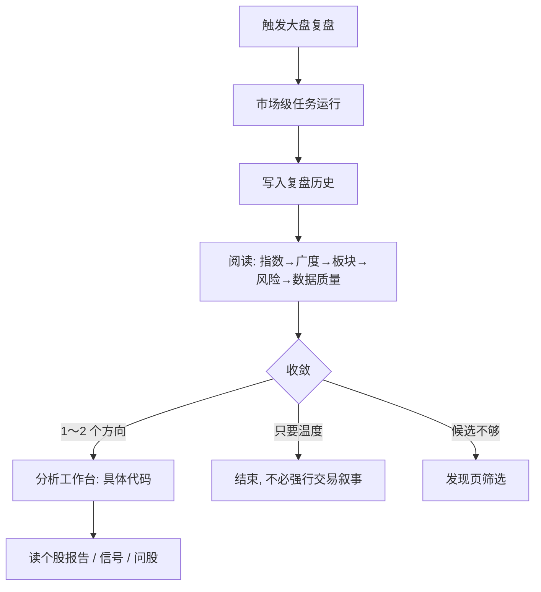
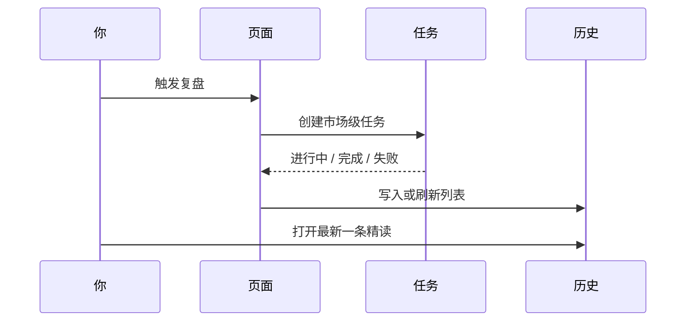
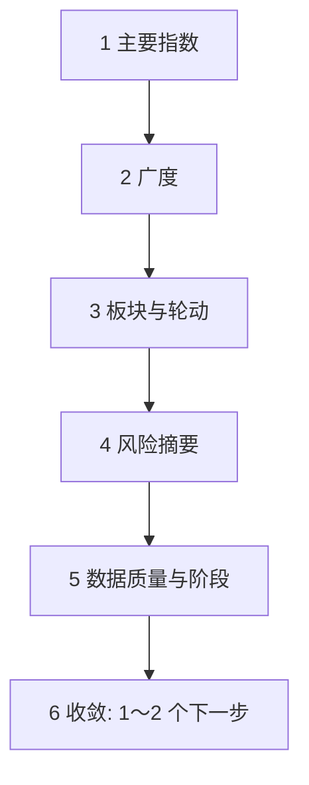

# 04 大盘复盘

## 本章你会学会

1. 用一句话分清：大盘复盘回答「市场气质」，不回答「某只股票该不该买」  
2. 从导航、命令面板、深链安全地进入页面，并避免误触发 `action=run`  
3. 按收盘后推荐流程完成一次复盘，并按固定顺序阅读报告块  
4. 理解广度、板块轮动、日线未完成、数据质量等关键概念  
5. 把复盘结论收敛成「1～2 个方向 → 回工作台做个股」，而不是把题材叙事直接当成重仓依据  

> 📘 **一句话定位**  
> 大盘复盘是 **市场级日记**：帮你快速建立「今天（或这一阶段）整体氛围」的上下文，再决定把研究精力投向哪些方向。

> 💡 **和相邻能力的差别**  
> | 能力 | 研究单位 | 典型产出 |  
> | --- | --- | --- |  
> | **大盘复盘** | 整个市场 | 指数/广度/板块/风险叙事 |  
> | **分析工作台** | 单只股票 | 个股研究报告 |  
> | **发现** | 筛选条件 | 候选代码列表 |  
> | **信号中心** | 结构化建议/规则 | 可筛选记录与提醒 |  
> 指数强，不代表你手里的票一定强；领涨板块里，也不是每一只都值得追。

> ⚠️ **研究声明**  
> 复盘内容仅供研究学习，**不构成投资建议**。盘中未完成日线时，请自动给结论打折。

---

## 1. 脑中地图：复盘在研究链中的位置



记住这条纪律：

```text
复盘定「战场地图」→ 工作台打「具体点位研究」→ 信号管「后续提醒」
```

---

## 2. 入口与地址

> 🧭 **入口**

| 方式 | 路径 / 操作 |
| --- | --- |
| 主导航 | **研究** → **大盘复盘** |
| 地址栏 | `/research/market` |
| 命令面板 | `Cmd/Ctrl + K`，搜「大盘」「复盘」 |
| 首页相关入口 | 晨报 / 待办等可能链到复盘（以界面为准） |
| 一键触发深链 | `/research/market?action=run`（部分首页待办会带；进入后可能 **自动跑一次**） |

### 2.1 关于 `action=run`

| 场景 | 建议 URL |
| --- | --- |
| 只想翻历史、对照昨天与今天 | `/research/market`（干净地址） |
| 明确要立刻新跑一轮 | `/research/market?action=run` 或页内 **触发复盘** |
| 收藏长期书签 | **不要**默认带 `action=run`，以免每次打开都误触发 |

> ⚠️ **注意**  
> 每次触发通常都会消耗模型额度（并依赖行情等数据源）。「再看一眼」优先打开历史，而不是下意识重跑。

---

## 3. 适合什么时候用

| 场景 | 建议 | 心态 |
| --- | --- | --- |
| 收盘后 10 分钟 | 跑一次，记下主线板块与两条风险 | 标准用法 |
| 盘中想摸温度 | 可以跑，但必须正视「日线未完成」 | 当温度计，不当发令枪 |
| 已有新鲜历史 | 优先打开历史对比 | 省额度 |
| 和自选结合 | 复盘找方向 → 回工作台研究具体代码 | 收敛，不发散 |
| 重大外部事件日 | 可跑，但更要读风险与数据质量 | 叙事越热闹越要看证据缺口 |
| 纯个股问题 | 直接工作台 | 不必强行先复盘 |

> ✅ **推荐做法**  
> 收盘后固定：触发（或读已有）→ 记 3 行笔记（主线 / 风险 / 明天观察）→ 最多 2 只相关票进工作台。  
> ❌ **不推荐**  
> 盘中看到大涨叙事就立刻对领涨板批量 detailed 全分析。

---

## 4. 页面上你会看到什么

> 🖼️ **配图占位** · `assets/market-review-trigger-zh.png`  
> **应配内容**：大盘复盘页：触发复盘按钮 + 历史列表区域（可为空）。  
> **拍摄要点**：使用干净 `/research/market`；避免误带 action=run 自动触发。  
> **状态**：待补图（清单：[assets/PLACEHOLDERS.md](assets/PLACEHOLDERS.md)）

| 区域 | 作用 | 使用提示 |
| --- | --- | --- |
| **触发复盘** 按钮 | 提交一次市场级任务 | 文案以界面为准；避免连点 |
| **反馈区** | 提交中 / 进行中 / 完成 / 失败 / 超时 | 失败时读错误原文 |
| **复盘历史** | 以前的市场日记 | 可多选删除；删除通常不可恢复 |
| **报告区** | 选中一条后的摘要与正文 | 按 §6 顺序读 |
| **运行流**（可选） | 任务内部阶段 | 卡顿/失败时再开 |



---

## 5. 操作步骤

### 5.1 收盘后推荐流程（请尽量固定）

1. 进入大盘复盘页（干净地址即可）。  
2. 点 **触发复盘**（若首页待办已带 `action=run` 且已自动开始，则等结果即可）。  
3. 等待完成；失败时按 §8 排障。  
4. 在历史中打开最新一条。  
5. 按顺序读：指数 → 广度 → 板块 → 风险 → 数据质量。  
6. 写下三行笔记（见 §5.3）。  
7. 最多挑 1～2 个方向，回 [分析工作台](03-analysis-workbench.md) 做个股。  
8. 若需要盯市场级条件，再到 [信号中心](06-signals.md) 看是否有市场类规则可用（进阶）。

### 5.2 只读历史（零额度对照）

1. 打开 `/research/market`（不要带 `action=run`）。  
2. 选中昨天与今天（或最近两条）。  
3. 对比：主线板块是否切换、广度是否恶化、风险措辞是否升级。  
4. 若差异不大，不必为了「心理安慰」再跑一轮。

### 5.3 三行笔记模板（可复制）

```text
主线：……（1 个板块/风格即可）
风险：① …… ② ……
下一步：只研究 …… 与 ……（最多 2 个代码或主题）
```

> 💡 **提示**  
> 复盘的价值往往在「收敛注意力」，不在「生成更长的市场散文」。

---

## 6. 报告里常见块：怎么读才不慌

| 区块 | 你在看什么 | 容易误读成 | 更稳的读法 |
| --- | --- | --- | --- |
| 主要指数 | 大盘方向与幅度 | 「指数上涨就应重仓」 | 只当背景板 |
| 广度 | 涨跌家数、赚钱效应是否扩散 | 「今天强 = 明天一定强」 | 涨指数但广度差要警惕 |
| 板块 / 概念 | 谁领涨领跌、是否轮动 | 「领涨板里每只都能追」 | 主题 → 再选具体代码研究 |
| 风险摘要 | 要注意什么 | 「官方下单指令」 | 逐条变成观察清单 |
| 数据质量 / 阶段 | 是否降级、是否盘中、数据是否完整 | 忽略后过度自信 | 有降级就降低结论权重 |
| 情绪 / 资金（若有） | 冷热与拥挤线索 | 当作精确仓位公式 | 当旁证，不当唯一依据 |



### 6.1 「日线未完成」为什么是头等大事

> 📘 **概念**  
> **日线未完成** 表示今天的日 K 还没收盘钉死。此时基于全日结构的表述天然不稳：尾盘可能反转叙事。

盘中使用建议：

- 把复盘当 **温度计**；  
- 不把盘中结论写成「今日最终定性」；  
- 重要决策类研究（若你仍要做）至少等到收盘后再用工作台补一刀个股证据。

---

## 7. 和大盘相关的常见误区

| 误区 | 为什么有问题 | 更稳的替代 |
| --- | --- | --- |
| 指数大涨就对持仓不经验证就乐观 | 个股可能逆势 | 回个股报告与持仓页对照 |
| 领涨板块全员分析 | 贵、吵、读不完 | 每主题最多 1～2 只 |
| 每天重跑只为「刷新感」 | 浪费额度 | 历史对比优先 |
| 忽略数据质量 | 在降级数据上过度自信 | 先读质量提示 |
| 把复盘当买卖点 | 粒度不对 | 复盘定方向感，交易研究回个股 |

> ❌ **不推荐**  
> 复盘里出现强叙事 → 立刻全市场网格规则 + 大批量 detailed。  
> ✅ **推荐做法**  
> 复盘 → 两行风险 → 两只个股 brief → 必要时再问股或建一条价格规则。

---

## 8. 失败、超时与排障

| 线索 | 优先检查 | 下一步 |
| --- | --- | --- |
| 模型 / 401 / 余额 | [设置](10-settings.md) 模型接入 | 测试连接、查额度 |
| 超时 / 网络 | 后端进程、本机网络 | 恢复后只触发 **一次** |
| 数据源 / 行情 | 设置中数据源状态与 Key | 修源后重试；接受降级时读质量说明 |
| 长时间「进行中」 | 运行流阶段 | 定位卡在取数还是生成 |
| 历史空白 | 是否从未成功完成 | 先让一次任务真正完成 |

> ⚠️ **注意**  
> 失败时连点「触发复盘」通常只会制造更多失败任务与费用。先读错误，再修配置，再触发一次。

---

## 9. 使用案例

### 案例 A：收盘后极简流程

触发 → 只记「主线板块 + 两条风险」→ 自选里最多 2 只相关票去做个股分析。

### 案例 B：盘中别冲动

盘中触发看到大涨叙事 → 发现未完成日线/降级提示 → 只当温度计，等收盘再决定是否加码研究。

### 案例 C：只读历史省额度

打开干净 URL → 对比昨天与今天的板块是否切换 → 差异不大则不重跑。

### 案例 D：失败了

错误指向模型 → 设置里测连接；指向数据 → 查数据源；修好后只触发一次。

### 案例 E：复盘后进入发现

复盘指出某主题热 → 去 [发现](12-discover.md) 用条件收窄候选 → 再进工作台，而不是对着板块名词空想代码。

### 案例 F：持仓对照

复盘显示广度恶化、防守占优 → 打开 [持仓](07-portfolio.md) 看集中度与异常 → 对重仓股回读最近个股报告的风险段，而不是只盯指数点位。

### 案例 G：事件日

出现重大政策/地缘叙事 → 复盘重点读风险与数据质量 → 个股只研究你本来就关注的标的 → 避免「全市场追新闻」。

### 案例 H：运行流定位卡点

任务超时 → 打开运行流 → 看到卡在行情聚合 → 修数据源 → 成功后把该次报告与上一交易日对比板块是否突变。

---

## 10. 常见问题（FAQ）

**Q1：大盘复盘能告诉我某只股票买卖点吗？**  
不能替代个股报告。它提供市场上下文；具体标的请用分析工作台。

**Q2：为什么我一进页面就自动跑起来了？**  
可能 URL 带有 `action=run`。只读请用 `/research/market`。

**Q3：历史里的复盘和首页晨报是一回事吗？**  
可能同源或相关，但页面职责不同：复盘页是完整市场日记工作区；首页偏摘要与入口。以各页实际展示为准。

**Q4：删除历史复盘会影响个股报告吗？**  
一般按记录类型分离；删除前仍建议确认选中的是市场复盘而非误选其他记录。删除通常不可恢复。

**Q5：盘中和收盘后结论冲突怎么办？**  
优先采信 **收盘后** 完整日线语境下的版本，并把盘中版当作过程快照。

**Q6：需要每天都跑吗？**  
不是。有稳定阅读节奏时，可用「隔日跑 + 日间只读历史」降低费用。

---

## 11. 自检清单

### 触发前

- [ ] 模型可用（测试连接通过）  
- [ ] 明确是「新跑」还是「只读历史」  
- [ ] 若只读，URL 未带 `action=run`  
- [ ] 知道自己处于盘中还是收盘后  

### 阅读时

- [ ] 按指数 → 广度 → 板块 → 风险 → 数据质量顺序读完  
- [ ] 单独记下两条风险  
- [ ] 没有把指数涨跌直接翻译成重仓或清仓指令  
- [ ] 数据质量/未完成日线已被纳入信任度  

### 阅读后

- [ ] 下一步研究目标 ≤ 2 个方向或代码  
- [ ] 需要个股证据的已进入工作台，而不是停在市场叙事  
- [ ] 没有对全板块做无差别 detailed 轰炸  

---

## 12. 术语（白话）

| 术语 | 含义 |
| --- | --- |
| 大盘复盘 | 市场级 AI/研究日记页面（`/research/market`） |
| 广度 | 上涨家数与下跌家数等，反映赚钱效应是否扩散 |
| 板块轮动 | 资金在不同主题间切换 |
| 日线未完成 | 当日 K 线尚未收盘确认 |
| 数据质量 | 是否降级、缺失、延迟等诚信度提示 |
| 运行流 | 任务卡在哪一步的阶段拆解 |
| recordId | 某条历史复盘的编号 |
| `action=run` | 进入页面时请求自动触发一次复盘 |

---

## 13. 相关阅读

- [03 分析工作台](03-analysis-workbench.md) — 复盘之后的个股研究  
- [08 阅读报告](08-reading-reports.md) — 个股报告阅读顺序（与大盘块不同）  
- [12 发现](12-discover.md) — 从主题到候选代码  
- [06 信号中心](06-signals.md) — 提醒与结构化建议  
- [07 持仓](07-portfolio.md) — 用持仓现实对照市场叙事  
- [11 日常工作流](11-daily-workflows.md) — 收盘后 5 分钟等菜谱  
- [10 设置](10-settings.md) — 模型与数据源  

上一篇：[03 分析工作台](03-analysis-workbench.md) · 下一篇：[05 问股对话](05-agent-chat.md)
