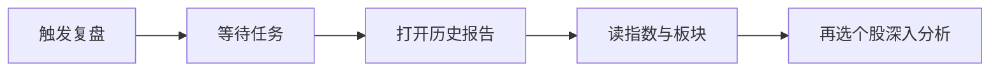

# 04 大盘复盘

路径：导航 **研究 → 大盘复盘**。

大盘复盘回答的是「**整个市场今天 / 这一阶段怎么样**」，不是「某一只股票该不该买」。请与个股报告分开阅读，避免把指数情绪直接当成个股买卖指令。

> 💡 **和「分析工作台」的区别**  
> - **分析工作台**：研究某一只股票  
> - **大盘复盘**：研究市场整体（指数、涨跌家数、板块、情绪等）

## 适用场景

| 场景 | 建议做法 |
| --- | --- |
| 收盘后做日度回顾 | 触发一次复盘，读指数与板块，再决定明天盯哪些方向 |
| 盘中想感受温度 | 可以触发，但必须注意「日线可能未完成」类提示 |
| 已经有历史复盘 | 优先打开历史，不必为了「再看一遍」重复触发 |
| 与自选结合 | 复盘找主线 → 回分析工作台研究具体标的 |

## 操作步骤

1. 进入大盘复盘页。  
2. 点击 **触发复盘**（按钮文案以界面为准）。  
3. 等待任务状态变为完成；失败时阅读错误提示（模型、网络、数据源等）。  
4. 在复盘历史中打开报告阅读。  
5. 需要时用命令面板或导航跳回个股分析。

## 报告里常见内容

| 区块 | 你在看什么 |
| --- | --- |
| 主要指数 | 上证 / 深证 / 创业板等涨跌（随市场配置变化） |
| 市场概况 | 上涨 / 下跌家数、涨停跌停等广度信息 |
| 板块或概念 | 领涨 / 领跌方向，当作「线索」而非名单保证 |
| 风险与计划类摘要 | 情绪、注意点、次日观察框架 |

### 术语

| 术语 | 解释 |
| --- | --- |
| **广度（Breadth）** | 上涨家数 vs 下跌家数等，反映赚钱效应是否扩散 |
| **板块轮动** | 资金在不同主题间切换；今日领涨不代表明日延续 |
| **日线未完成** | 盘中 K 线尚未收死，结论应更保守 |
| **Market Light / 红绿灯** | 部分版本用结构化红黄绿表达市场温度（进阶） |

## 建议配置与阅读纪律

| 项目 | 建议 |
| --- | --- |
| 触发时机 | 优先**盘后**；盘中仅作温度计 |
| 阅读顺序 | 指数 → 广度 → 板块 → 风险提示 |
| 下一步 | 用复盘结论缩小关注面，再回 [03 分析工作台](03-analysis-workbench.md) |

> ⚠️ **不要用大盘结论直接下个股单**  
> 指数强不代表你的持仓股强；板块热不代表每个成分股都值得追。个股仍要看自身报告与风险。

## 使用案例

**案例 A：收盘后 10 分钟**  
触发复盘 → 只记「领涨板块 + 两条风险」→ 从自选里挑最多 2 只相关标的去做个股分析或问股。

**案例 B：盘中误读**  
盘中触发后看到大涨叙事 → 发现提示日线未完成 → 把结论权重降低，等收盘再决定是否加仓研究。

**案例 C：历史里找上下文**  
不必每天重复触发；在历史中打开昨日复盘，对比今日板块是否切换。

## 与个股历史的边界

- 个股历史列表**默认不是**大盘复盘入口。  
- 复盘历史与个股报告列表分开存放，避免找错。

## 相关

- [03 分析工作台](03-analysis-workbench.md)
- [08 阅读报告](08-reading-reports.md)（个股阅读顺序）
- [11 日常工作流](11-daily-workflows.md)

上一篇：[03 分析工作台](03-analysis-workbench.md) · 下一篇：[05 问股对话](05-agent-chat.md)
