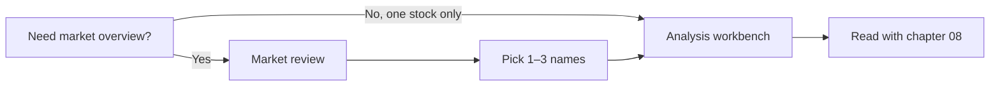

# 04 Market review

Path: **Research → Market review** (or search “review” / “market” in the command palette).

Market review answers: **“What roughly happened in the whole market for this session?”**  
It is **not** a single-stock buy/sell ticket.

> 💡 **One-line contrast**  
> - **Market review**: indices, breadth, sectors, mood and risks  
> - **Single-stock analysis** ([03 Analysis workbench](03-analysis-workbench_EN.md)): one ticker’s action, levels, and stock-specific risk  
> Use the review to decide *which few names* deserve a deep dive — not as an order list.

## When to use it

| Scenario | Fit | Note |
| --- | --- | --- |
| After the close, quick full-day picture | ✅ Best | **Post-market** language is most complete |
| Intraday “is the tape hot?” | ⚠️ OK, stay conservative | Watch for incomplete daily bar warnings |
| Only care about one symbol | ❌ Not enough | Use workbench + [08 Reading reports](08-reading-reports_EN.md) |
| Re-read an existing review | ✅ | Open **history**; do not re-run just to read |

## Vs single-stock analysis

| Dimension | Market review | Single-stock analysis |
| --- | --- | --- |
| Object | Whole market (e.g. A-share session) | One (or a batch of) ticker(s) |
| Typical output | Indices, breadth, sectors, clues and risks | Action, support/resistance, stock risks |
| History | Review history list | Workbench **History** segment |
| Suggested frequency | About 0–1× per day | As needed for your names |

## Steps

1. Open **Research → Market review**.  
2. Click **Run review** (label may vary: “触发复盘”, “Start review”, …).  
3. Wait for **completed**; on failure, read the error before retrying (often model quota or network).  
4. Open the report from **review history**.  
5. To re-read later, open history again — **do not re-trigger only to re-read**.

### Recommended practice

| Item | Suggestion | Why |
| --- | --- | --- |
| Timing | Prefer **after the close** | Fuller session, fewer misleading absolutes |
| Intraday runs | Allowed as a **snapshot** | Daily bar may still be **partial** |
| Repeat runs | Avoid same-day spam | Each run costs model / data usage |
| Model | Same tested channel as single-stock runs | Install/setup first if needed |

> ⚠️ **Cost**  
> Reviews call an LLM like single-stock runs. Re-running without new information rarely improves quality.

## What is usually in the report

| Order | Block | You are looking for |
| --- | --- | --- |
| 1 | Major indices | Overall lean up or down |
| 2 | Breadth (advancers / decliners when available) | Broad participation or narrow leadership |
| 3 | Sector / theme performance | Where attention clustered |
| 4 | Clues / opportunity notes | Research leads only — not order tickets |
| 5 | Risks and planning-style notes | What to watch next |

### Glossary

| Term | Plain meaning |
| --- | --- |
| **Index** | Basket-level “thermometer” for the market |
| **Breadth** | How many names participate (e.g. up vs down counts) |
| **Sector / theme** | Grouped performance by industry or narrative |
| **Clue** | A lead to research further on single names and primary sources |
| **Pre / in / post session** | Time of day; post-session fits full-day wording best |

## Reading discipline

- **Post-market** fits full-session review language best.  
- **Intraday** runs may warn that the daily bar is incomplete — do not treat partial data as the official close.  
- “Sector strong” ≠ “every name in the sector is a buy”.  
- Stock history is **not** the primary market-review archive.  
- Research only; **not investment advice**.

## Examples

**A. Five-minute post-close scan**  
Run once if needed → indices → breadth → strongest/weakest sectors → risks → optionally open 1–2 single-stock reports.

**B. Curious intraday click**  
Treat as a snapshot if phase/quality is partial → prefer a post-close version for a formal note → do not size large trades from one intraday sentence.

**C. Re-read yesterday**  
Open **history** only; do not click Run again.

## FAQ

**Relation to Home “market” cards?**  
Home may show a summary entry; full run and history live on this page.

**Why does my review differ from someone else’s?**  
Sources, model, and trigger time (intraday vs post) differ. Prefer evidence and timestamps.

**Run failed?**  
Check model key, quota, and network; fix once and retry.

## Related

- [03 Analysis workbench](03-analysis-workbench_EN.md)
- [08 Reading reports](08-reading-reports_EN.md)
- [11 Daily workflows](11-daily-workflows_EN.md)

Previous: [03 Analysis workbench](03-analysis-workbench_EN.md) · Next: [05 Agent chat](05-agent-chat_EN.md)
