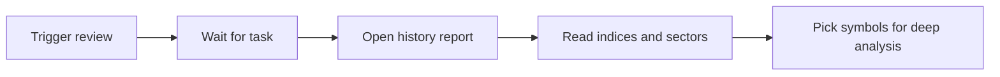

# 04 Market review

Path: **Research → Market review**.

Market review answers “**how is the whole market doing**”, not “should I buy this one stock”. Read it separately from single-stock reports so index mood is not mistaken for a trade ticket.

> 💡 **Versus the analysis workbench**  
> - **Workbench**: one symbol  
> - **Market review**: indices, breadth, sectors, session mood

## When to use it

| Scenario | Suggested approach |
| --- | --- |
| After the close | Trigger once; read indices and sectors; pick focus areas for tomorrow |
| Intraday temperature check | Allowed, but respect “daily bar may be partial” warnings |
| History already exists | Open history instead of re-triggering just to reread |
| With a watchlist | Review finds themes → workbench researches names |

## Steps

1. Open Market review.  
2. Click **Run review** (label may vary).  
3. Wait for completion; on failure, read the error (model, network, data).  
4. Open the report from history.  
5. Jump back to single-stock analysis when you have a focus list.

## What the report usually contains

| Block | What you are looking at |
| --- | --- |
| Major indices | Benchmark moves for the configured markets |
| Market overview | Up/down counts, limit-up/down style breadth |
| Sectors / themes | Leaders and laggards as **clues**, not guarantees |
| Risk / plan summary | Tone, cautions, next-session framing |

### Glossary

| Term | Meaning |
| --- | --- |
| **Breadth** | How widely gains/losses spread across names |
| **Sector rotation** | Capital shifting across themes; today ≠ tomorrow |
| **Partial daily bar** | Intraday candle not finalized — stay conservative |
| **Market light** | Optional structured red/yellow/green temperature (advanced) |

## Reading discipline

| Item | Suggestion |
| --- | --- |
| Timing | Prefer **after the close**; treat intraday as a thermometer |
| Order | Indices → breadth → sectors → risks |
| Next step | Narrow attention, then use [03 Analysis workbench](03-analysis-workbench_EN.md) |

> ⚠️ **Do not trade single names off index headlines alone**  
> A strong index does not imply every holding is strong; a hot sector does not validate every constituent.

## Use cases

**A — Ten minutes after the close**  
Trigger → note leading sector + two risks → pick at most two related watchlist names for single-stock work.

**B — Intraday misread**  
Strong narrative appears → see partial-bar warning → lower weight until the session settles.

**C — Context from history**  
Open yesterday’s review instead of re-running; compare whether leadership rotated.

## Boundary with single-stock history

- The single-stock history list is **not** the market-review entry.  
- Review history is stored separately so the two do not mix.

## Related

- [03 Analysis workbench](03-analysis-workbench_EN.md)
- [08 Reading reports](08-reading-reports_EN.md)
- [11 Daily workflows](11-daily-workflows_EN.md)

Previous: [03 Analysis workbench](03-analysis-workbench_EN.md) · Next: [05 Agent chat](05-agent-chat_EN.md)
