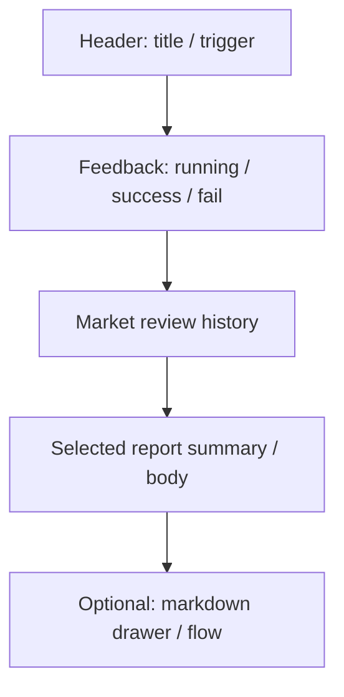

# 04 Market review

## Entry points and paths

| Method | Path |
| --- | --- |
| Primary nav | **Research** → **Market review** |
| Command palette | `Cmd/Ctrl + K`, search “market” or “review” |
| Canonical route | `/research/market` |
| Auto-run deep link | `/research/market?action=run` (some Home todos use this; page may auto-trigger once) |
| Do not | Look for market reviews inside single-stock history lists |

Market review answers “**how is the whole market today / this phase**”, not “should I buy this one stock”.

> 💡 **vs Analysis Workbench**  
> - **Workbench** (`/research/analysis`): one stock  
> - **Market review** (`/research/market`): indices, breadth, sectors, sentiment  
> - **Discover** (`/research/discover`): screening experiments (separate page; not covered here)

> ⚠️ Research only — **not investment advice**.

## When to use

| Scenario | Suggested approach |
| --- | --- |
| After the close | Run once; note leaders and risks; pick 1–2 names to study |
| Intraday temperature | OK, but respect “incomplete daily bar” warnings |
| Already have history | Open history first; do not re-run just to re-read |
| With watchlist | Review → narrow themes → Workbench on specific codes |
| Home deep link with `action=run` | Confirm you really want another run |

## Page layout

| Area | Role |
| --- | --- |
| **Trigger review** | Submit a market-level job |
| **Feedback** | Submitted / in progress / done / timeout / failed |
| **History** | Past reviews; multi-select delete |
| **Report pane** | Summary / markdown for the selected row |
| **Run flow** | Stage snapshot for diagnostics (advanced) |

## Steps: run a review

1. Open **Research → Market review** (`/research/market`).  
2. Click **Trigger** (label as in UI).  
3. Watch feedback — avoid double-click spam.  
4. Open the newest history row.  
5. Read summary, then full text if offered.  
6. Jump to **Analysis Workbench** for single names.

### About `?action=run`

- Some entry points auto-trigger once on load.  
- The query is usually consumed/cleared so refresh does not loop.  
- To **only browse history**, use clean `/research/market`.

## Common report blocks

| Block | What you learn | Common misread |
| --- | --- | --- |
| Major indices | Market direction | Index up ≠ your holdings up |
| Breadth | Advancers / decliners | Breadth ≠ durable leadership |
| Sectors / themes | Leaders / laggards | Today’s leader may rotate tomorrow |
| Risk notes | Caution framework | Not a position-size order |
| Data quality | Degradation / incomplete bar | More warnings → more caution |

## Glossary

| Term | Plain meaning |
| --- | --- |
| **Market review** | Market-wide AI summary job |
| **Breadth** | How widely gains/losses spread |
| **Rotation** | Capital shifting across themes |
| **Incomplete daily bar** | Intraday candle not final |
| **Market light** | Optional structured risk/temperature label |
| **Run flow** | Per-task stage diagnostics |
| **recordId** | History id; may appear in URL for bookmarking |

## Reading discipline

| Item | Guidance |
| --- | --- |
| Timing | Prefer **after close** |
| Order | Indices → breadth → sectors → risks / quality |
| Next step | Narrow focus, then [03 Analysis Workbench](03-analysis-workbench_EN.md) |
| Models | Shares primary analysis model; missing keys fail the job |

> ⚠️ Do not trade single names from market narrative alone.

## Use cases

**A — 10 minutes after close**  
Trigger → note sector + breadth + two risks → analyze at most two watchlist names.

**B — Intraday misread**  
Big bullish narrative + incomplete-bar warning → treat as thermometer only.

**C — History only**  
Open clean URL → compare yesterday’s sectors → skip re-run to save quota.

**D — Failure**  
Read error → **Settings → AI & Models** / data sources → fix → trigger **once**.

## History management

Open rows, multi-select delete (irreversible), load more. Market history is **separate** from single-stock history.

## Related modules

Workbench for names; Signal Center may show `market_review` sources; Settings for model/data/notify; Discover is a sibling Research page.

## Related

- [03 Analysis Workbench](03-analysis-workbench_EN.md)
- [01 Shell](01-shell_EN.md)
- [08 Reading reports](08-reading-reports_EN.md)
- [11 Daily workflows](11-daily-workflows_EN.md)

Prev: [03 Analysis Workbench](03-analysis-workbench_EN.md) · Next: [05 Agent chat](05-agent-chat_EN.md)
