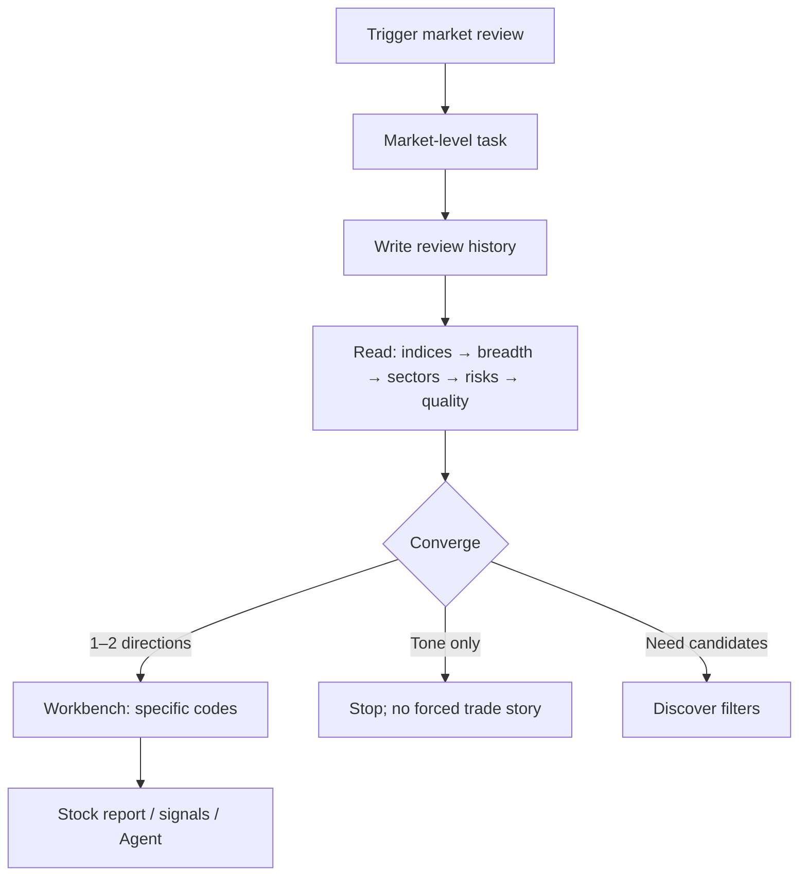
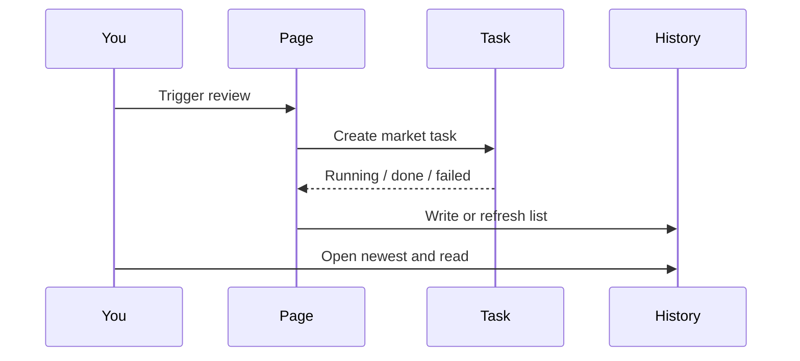
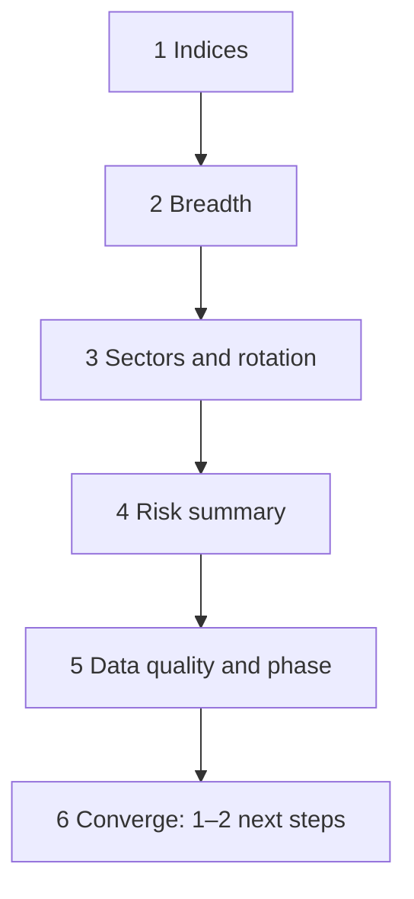

# 04 Market review

## What you will learn

1. One sentence boundary: market review answers **market tone**, not “should I buy this stock?”  
2. How to open the page safely, including when to avoid `action=run`  
3. A fixed after-close flow and a stable reading order for report blocks  
4. Breadth, sector rotation, incomplete daily bars, and data-quality concepts  
5. How to converge review into **1–2 research directions → Workbench**, instead of treating theme narrative as position sizing  

> 📘 **One-liner**  
> Market review is a **market-level diary**: it builds context for “how the market feels today (or this stage),” so you can place research attention deliberately.

> 💡 **Compared with nearby capabilities**  
> | Capability | Unit | Typical output |  
> | --- | --- | --- |  
> | **Market review** | Whole market | Indices / breadth / sectors / risk narrative |  
> | **Analysis Workbench** | One stock | Single-name research report |  
> | **Discover** | Filters | Candidate codes |  
> | **Signal Center** | Structured suggestions / rules | Filterable records and alerts |  
> A strong index does not guarantee your holding is strong; a hot sector does not make every name chaseable.

> ⚠️ **Research only**  
> Review content is for study — **not investment advice**. During the session, when the daily bar is incomplete, automatically discount assertive claims.

---

## 1. Mental map



Discipline line:

```text
Review draws the map → Workbench studies points → Signals handle later reminders
```

---

## 2. Entry and URLs

> 🧭 **Entry**

| Method | Path / action |
| --- | --- |
| Primary nav | **Research** → **Market review** |
| Address bar | `/research/market` |
| Command palette | `Cmd/Ctrl+K` → try “market” / “review” |
| Home-related links | Morning brief / todos may deep-link (as shown in the UI) |
| Auto-run deep link | `/research/market?action=run` (may **start a run on open**) |

### 2.1 About `action=run`

| Scenario | Suggested URL |
| --- | --- |
| History only, compare yesterday vs today | `/research/market` (clean) |
| Intentionally start a new run | `?action=run` or in-page **Trigger review** |
| Long-lived bookmark | **Do not** keep `action=run` by default |

> ⚠️ **Note**  
> Each trigger typically costs model quota and depends on market data. Prefer history when you only need another look.

---

## 3. When to use it

| Situation | Guidance | Mindset |
| --- | --- | --- |
| ~10 minutes after the close | Run once; note main themes + two risks | Standard use |
| Intraday temperature | Allowed, but respect incomplete daily bars | Thermometer, not orders |
| Fresh history already exists | Open history first | Save quota |
| Combined with watchlist | Map → Workbench on concrete codes | Converge, do not scatter |
| Major external event day | Run, but emphasize risks and data quality | Narrative ≠ complete evidence |
| Pure single-name question | Go Workbench directly | Review not required |

> ✅ **Recommended**  
> After the close: trigger (or open existing) → three-line notes (main theme / risks / next observation) → at most two related names on Workbench.  
> ❌ **Avoid**  
> Intraday hot narrative → full detailed batch on every leader.

---

## 4. What you see on the page

> 🖼️ **Figure placeholder** · `assets/market-review-trigger-en.png`  
> **Capture**: Market review page: run control + history area.  
> **Notes**: Clean /research/market; English UI.  
> **Status**: pending — see [assets/PLACEHOLDERS.md](assets/PLACEHOLDERS.md)

| Area | Role | Tip |
| --- | --- | --- |
| **Trigger review** | Submit one market-level task | Avoid multi-click |
| **Feedback** | Submitting / running / done / failed / timeout | Read error text on failure |
| **Review history** | Prior market diaries | Multi-delete is typically irreversible |
| **Report area** | Summary and body for the selected row | Read with §6 order |
| **Run flow** (optional) | Stage breakdown | Open when stuck or failed |



---

## 5. Operating steps

### 5.1 After-close recommended flow

1. Open Market review (clean URL is fine).  
2. Click **Trigger review** (or wait if `action=run` already started).  
3. Wait for completion; on failure use §8.  
4. Open the newest history row.  
5. Read: indices → breadth → sectors → risks → data quality.  
6. Write three-line notes (§5.3).  
7. At most 1–2 directions → [Analysis Workbench](03-analysis-workbench_EN.md).  
8. Optional advanced: market-level conditions in [Signal Center](06-signals_EN.md) if available.

### 5.2 History-only (zero new quota for compare)

1. Open `/research/market` without `action=run`.  
2. Select yesterday and today (or the latest two).  
3. Compare: theme switch, breadth deterioration, risk language upgrade.  
4. If differences are small, skip a comfort re-run.

### 5.3 Three-line note template

```text
Main theme: … (one sector/style)
Risks: ① … ② …
Next: research only … and … (at most 2 codes or themes)
```

> 💡 **Tip**  
> Value is usually **attention convergence**, not a longer market essay.

---

## 6. How to read report blocks

| Block | What you learn | Easy misread | Safer read |
| --- | --- | --- | --- |
| Major indices | Direction and magnitude | “Index up → full size” | Background only |
| Breadth | Up/down counts; whether gains spread | “Strong today → strong tomorrow” | Strong index + weak breadth is a warning |
| Sectors / concepts | Leaders, laggards, rotation | “Every name in the hot board is chaseable” | Theme → then pick concrete codes |
| Risk summary | What to watch | “Official trade tickets” | Convert into observation list |
| Data quality / phase | Degradation, incomplete session, missing data | Ignore and over-trust | Discount conclusions when degraded |
| Sentiment / flows (if any) | Heat and crowding clues | Exact position formula | Secondary evidence only |



### 6.1 Incomplete daily bar

> 📘 **Concept**  
> **Incomplete daily bar** means today’s daily candle is not closed. Full-session structure language is unstable; the close can reverse the story.

Intraday use:

- Treat review as a **thermometer**  
- Do not write “final daily verdict” from an open bar  
- Important single-name work should wait for after-close context when possible

---

## 7. Common mistakes

| Mistake | Why it fails | Better alternative |
| --- | --- | --- |
| Index rally → automatic optimism on holdings | Names can diverge | Cross-check stock report + Portfolio |
| Analyze every leader in a hot sector | Expensive and unreadable | At most 1–2 names per theme |
| Daily re-run for freshness only | Quota waste | History compare first |
| Ignoring data quality | False confidence on degraded inputs | Read quality flags first |
| Using review as entry/exit | Wrong granularity | Review for map; tickets need single-name work |

> ❌ **Avoid**  
> Strong narrative → market-wide rule grid + large detailed batch.  
> ✅ **Recommended**  
> Review → two risks → two brief single-name runs → optional Agent or one price rule.

---

## 8. Failures, timeouts, troubleshooting

| Clue | Check first | Next |
| --- | --- | --- |
| Model / 401 / balance | [Settings](10-settings_EN.md) model access | Test connection, check quota |
| Timeout / network | Backend process, local network | After recovery, trigger **once** |
| Data source / quotes | Data-source status and keys | Retry; accept degradation with quality notes |
| Long “running” | Run flow stages | Stuck on fetch vs generation |
| Empty history | No successful completion yet | Get one task truly finished first |

> ⚠️ **Note**  
> Multi-clicking Trigger after failure usually multiplies failed jobs and cost. Read the error, fix config, then trigger once.

---

## 9. Use cases

**A — Minimal after-close** — trigger → main theme + two risks → at most two related Workbench names.  
**B — Intraday restraint** — hot narrative + incomplete bar / degradation → thermometer only; decide after the close.  
**C — History to save quota** — clean URL → compare themes; no re-run if similar.  
**D — Failure** — model → test connection; data → data sources; then one re-trigger.  
**E — Review → Discover** — theme heat → [Discover](12-discover_EN.md) filters → Workbench, not guess codes from a label.  
**F — Holdings cross-check** — weak breadth → [Portfolio](07-portfolio_EN.md) concentration → re-read heavy-name risks, not only the index level.  
**G — Event day** — prioritize risks and quality; research only names you already track.  
**H — Run flow bottleneck** — timeout → stage on quote aggregate → fix source → compare with prior session.

---

## 10. FAQ

**Q1: Can market review give single-name entry/exit?**  
No. It supplies market context. Use Analysis Workbench for a specific symbol.

**Q2: Why did a run start as soon as I opened the page?**  
URL likely includes `action=run`. For read-only, use `/research/market`.

**Q3: Is history the same as Home morning brief?**  
They may share sources, but roles differ: this page is the full market diary workspace; Home is summary and entry. Trust each page’s presentation.

**Q4: Does deleting review history delete stock reports?**  
Types are typically separated; still confirm selection before delete. Deletion is usually irreversible.

**Q5: Intraday and after-close conclusions conflict—which wins?**  
Prefer **after-close** full daily context; treat the intraday version as a process snapshot.

**Q6: Must I run every day?**  
No. A stable rhythm can be “every other day run + history on off days” to control cost.

---

## 11. Self-check

### Before trigger

- [ ] Model usable (connection test green)  
- [ ] New run vs history-only is intentional  
- [ ] Read-only URL has no `action=run`  
- [ ] You know whether the session is open or closed  

### While reading

- [ ] Order completed: indices → breadth → sectors → risks → quality  
- [ ] Two risks written down  
- [ ] Index move not translated into full-size or flat orders  
- [ ] Quality / incomplete bar folded into trust  

### After reading

- [ ] Next research targets ≤ 2 directions or codes  
- [ ] Single-name evidence went to Workbench, not stopped at narrative  
- [ ] No indiscriminate detailed batch on whole sectors  

---

## 12. Glossary

| Term | Meaning |
| --- | --- |
| Market review | Market-level research diary (`/research/market`) |
| Breadth | Up/down counts; how widely gains/losses spread |
| Sector rotation | Capital shifting across themes |
| Incomplete daily bar | Today’s daily candle not yet closed |
| Data quality | Degradation, missing, delay honesty flags |
| Run flow | Stage breakdown of a task |
| recordId | History review id |
| `action=run` | Request auto-trigger on page open |

---

## 13. Related

- [03 Analysis Workbench](03-analysis-workbench_EN.md) — single-name research after the map  
- [08 Reading reports](08-reading-reports_EN.md) — single-name reading order (different blocks)  
- [12 Discover](12-discover_EN.md) — theme → candidates  
- [06 Signal Center](06-signals_EN.md) — reminders and structured suggestions  
- [07 Portfolio](07-portfolio_EN.md) — holdings reality vs market narrative  
- [11 Daily workflows](11-daily-workflows_EN.md) — after-close recipes  
- [10 Settings](10-settings_EN.md) — models and data sources  

Prev: [03 Analysis Workbench](03-analysis-workbench_EN.md) · Next: [05 Agent chat](05-agent-chat_EN.md)
