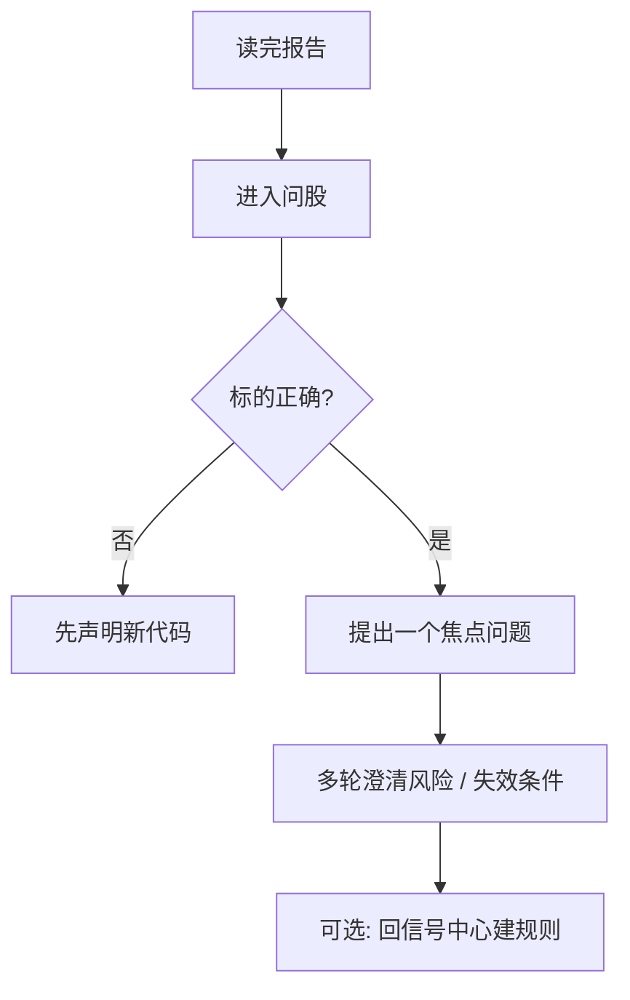

# 05 问股对话

路径：导航中的 **问股 / 对话**，或从个股报告进入「继续问股」。

问股是**多轮、带上下文**的追问入口。它适合在已经有一份报告之后，把「某一段看不懂 / 想对比 / 想问失效条件」说清楚；**不能替代**分析工作台的首次完整报告。

> 💡 **和「分析工作台」的分工**  
> - **工作台**：产出结构化报告 + 历史记录 + 可提取的信号  
> - **问股**：在报告（或指定标的）上继续聊细节  
> 先报告、后追问，结论通常更稳。

## 适用场景

| 场景 | 建议问法 |
| --- | --- |
| 报告写了观望，想知道观察点 | 「如果收盘站上 XX 价，观察条件应如何调整？」 |
| 看不懂支撑 / 压力 | 「用更白话解释当前支撑与压力，并给出失效条件」 |
| 想对比两只股票 | 明确写「对比 600519 和 300750，只谈估值与趋势差异」 |
| 从报告页点进来 | 先确认顶栏标的是否正确，再提问 |
| 想换股继续聊 | 先说新代码，再问问题，避免串股 |

## 基本用法（逐步）

1. 确认当前标的（从报告进入时通常已带上；不确定就在问题里写代码）。  
2. 用自然语言提问，例如支撑位、是否继续持有、主要风险、失效条件。  
3. 可多轮追问；每一轮尽量只推进一个焦点。  
4. 换股时**明确说出新代码或名称**。  
5. 需要时使用导出或发送到通知渠道（若界面提供）。

## 策略 Skill（可选）

| 项目 | 说明 |
| --- | --- |
| 是什么 | 分析风格包（趋势、成长、事件、质量等，以产品列表为准） |
| 不选会怎样 | 使用系统默认策略 |
| 新手建议 | 第一次追问先不选，减少变量 |

> ⚠️ **策略不是「稳赚开关」**  
> 换策略只会改变提问侧重点与证据偏好，不会消除市场风险。

## 建议配置与习惯

| 习惯 | 原因 |
| --- | --- |
| 一次聚焦一只股票 | 结论更稳定，减少串股 |
| 对比时写「对比 / vs」并列出代码 | 降低模型把两只股票混在一起的概率 |
| 先问「失效条件」再问「能不能买」 | 研究纪律：先知道错了怎么办 |
| 长对话留意用量 | 问股通常比单次报告更耗模型额度；设置里可看用量看板 |

### 提问模板（可直接复制改）

| 目的 | 示例 |
| --- | --- |
| 澄清风险 | 「列出当前报告里最重要的 3 个风险，并说明各自可能的失效信号」 |
| 价位计划 | 「若逻辑成立，观察的支撑与压力大概在哪？并说明依据是技术位还是事件」 |
| 阶段敏感 | 「若当前仍是盘中且日线未完成，结论应如何保守表述？」 |
| 对比 | 「对比 AAPL 与 MSFT 近阶段趋势差异，不要给出仓位指令」 |

## 使用案例

**案例 A：报告后追问失效条件**  
1. 在历史报告页点「继续问股」。  
2. 问：「请用条目列出本建议的失效条件；若收盘跌破哪一价位应重新评估？」  
3. 把有用的价位记到信号中心规则（可选）。

**案例 B：避免串股**  
错误：「那另一只呢？」  
更好：「请切换到 300750，只讨论它的估值与负债风险，不要混入 600519。」

**案例 C：额度紧张时**  
先在工作台用 **brief / 新手模式** 出短报告 → 只对 1～2 个不懂的段落问股 → 避免从零开始长聊。

## 与信号、持仓的关系

- 问股对话**可以**产生来源为 agent 的决策信号（以实际版本为准），但不保证每一句闲聊都入库。  
- 持仓页的「一键分析」仍走工作台任务流；问股是分析之后的补充。

## 相关

- [03 分析工作台](03-analysis-workbench.md)
- [08 阅读报告](08-reading-reports.md)
- [06 信号中心](06-signals.md)
- [10 设置](10-settings.md)（模型与用量）

上一篇：[04 大盘复盘](04-market-review.md) · 下一篇：[06 信号中心](06-signals.md)
