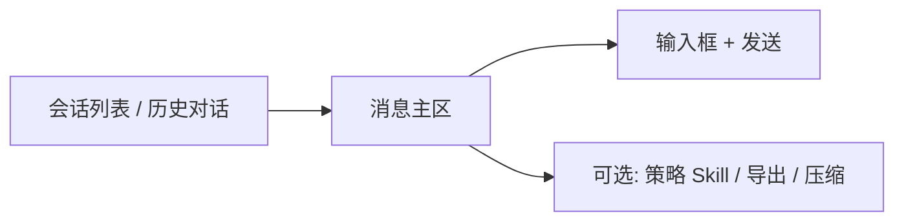

# 05 问股对话（Agent）

## 页面入口与操作路径

| 方式 | 具体路径 |
| --- | --- |
| 主导航 | 侧栏 **Agent**（中文界面导航文案多为 **Agent**；页面标题常见 **问股**） |
| 命令面板 | `Cmd/Ctrl + K`，搜索「问股」「Agent」「对话」 |
| 直链路由 | `/chat` |
| 从报告进入 | 个股报告 / 历史详情中的 **继续问股**（会带上当前标的上下文） |
| 导航角标 | 侧栏 Agent 可能显示「完成度 / 待办」类角标（引导完善能力；以界面为准） |

问股是**多轮、带上下文**的追问入口。适合在已经有一份报告之后，把「某一段看不懂 / 想对比 / 想问失效条件」说清楚；**不能替代**分析工作台的首次完整报告。

> 💡 **和「分析工作台」的分工**  
> - **工作台**（`/research/analysis`）：产出结构化报告 + 历史记录 + 可提取的信号  
> - **问股**（`/chat`）：在报告（或指定标的）上继续聊细节  
> 先报告、后追问，结论通常更稳。

> ⚠️ **研究免责**  
> 对话输出仅供学习与研究，**不构成投资建议**。不要把闲聊语气当成下单指令。

## 适用场景

| 场景 | 建议问法 / 路径 |
| --- | --- |
| 报告写了观望，想知道观察点 | 从报告点「继续问股」→「如果收盘站上 XX 价，观察条件应如何调整？」 |
| 看不懂支撑 / 压力 | 「用更白话解释当前支撑与压力，并给出失效条件」 |
| 想对比两只股票 | 明确写「对比 600519 和 300750，只谈估值与趋势差异」 |
| 从报告页点进来 | 先确认会话 / 顶栏标的是否正确，再提问 |
| 想换股继续聊 | 先说新代码，再问问题，避免串股 |
| 长会话 token 吃紧 | 打开上下文压缩相关开关（若界面提供），或新开会话 |

## 页面结构

| 区域 | 作用 | 小白怎么记 |
| --- | --- | --- |
| **历史对话** | 过往会话列表；可删除 | 「聊天记录」 |
| **空状态** | 引导示例问法 | 可直接改示例里的代码 |
| **消息流** | 你与 Agent 的多轮内容 | 「正文」 |
| **输入区** | 自然语言提问 | 尽量一次一个焦点 |
| **上下文压缩（可选）** | 长会话节省 token | 改完注意是否提示「未保存」 |

## 基本用法（逐步）

1. 打开 **Agent / 问股**（`/chat`），或从报告点 **继续问股**。  
2. **确认当前标的**：从报告进入时通常已带上；不确定就在问题里写代码（如 `600519`、`hk00700`、`AAPL`）。  
3. 用自然语言提问，例如支撑位、是否继续观察、主要风险、失效条件。  
4. 多轮追问时，每一轮尽量只推进一个焦点。  
5. 换股时**明确说出新代码或名称**，不要只说「那另一只呢」。  
6. 需要时使用导出或发送到通知渠道（若界面提供）。  
7. 无用会话可在历史中删除，避免列表过长。

### 空状态示例（可直接改）

界面可能提示类似：

- 「分析 600519」  
- 「茅台现在能买吗」  

更稳妥的研究问法是改成：**风险 + 失效条件 + 观察价位**，而不是索要「保证收益」。

## 策略 Skill（可选）

| 项目 | 说明 |
| --- | --- |
| 是什么 | 分析风格包（趋势、成长、事件、质量等，以产品列表为准） |
| 不选会怎样 | 使用系统默认策略 |
| 新手建议 | 第一次追问先不选，减少变量 |
| 与工作台关系 | 工作台发起分析时也可选策略；两边列表同源时文案应一致 |

> ⚠️ **策略不是「稳赚开关」**  
> 换策略只会改变提问侧重点与证据偏好，不会消除市场风险。

## 建议配置与习惯

| 习惯 | 原因 |
| --- | --- |
| 一次聚焦一只股票 | 结论更稳定，减少串股 |
| 对比时写「对比 / vs」并列出代码 | 降低模型把两只股票混在一起的概率 |
| 先问「失效条件」再问「能不能买」 | 研究纪律：先知道错了怎么办 |
| 长对话留意用量 | 问股通常比单次报告更耗额度；**设置 → 用量与成本** 可观察 |
| 模型未配置 | 对话会失败；先到 **设置 → AI 与模型** 配好并测试连接 |
| 本地 CLI 后端限制 | 部分本地生成后端**不支持**问股工具调用；界面会提示生成后端状态 |

### 提问模板（可直接复制改）

| 目的 | 示例 |
| --- | --- |
| 澄清风险 | 「列出当前报告里最重要的 3 个风险，并说明各自可能的失效信号」 |
| 价位计划 | 「若逻辑成立，观察的支撑与压力大概在哪？并说明依据是技术位还是事件」 |
| 阶段敏感 | 「若当前仍是盘中且日线未完成，结论应如何保守表述？」 |
| 对比 | 「对比 AAPL 与 MSFT 近阶段趋势差异，不要给出仓位指令」 |
| 与持仓结合 | 「我已持有 600519，请只讨论加仓/减仓的**观察条件**，不要替我决定仓位比例」 |

## 术语表

| 术语 | 解释 |
| --- | --- |
| **问股 / Agent** | 多轮对话入口；导航标签可能是 Agent，页面标题可能是问股 |
| **会话（Session）** | 一组连续多轮消息；可新建、切换、删除 |
| **上下文** | 模型能「记得」的前文；过长会增加 token 与费用 |
| **上下文压缩** | 长会话下压缩历史以节省 token（若开启，注意保存状态） |
| **策略 / Skill** | 可选分析风格包 |
| **工具调用** | Agent 拉取行情、新闻等实时能力；依赖可用后端与网络 |
| **来源 agent 的信号** | 部分对话结论可能沉淀为 Decision Signal（不保证每句都入库） |

## 使用案例

**案例 A：报告后追问失效条件**  
1. 在分析工作台历史中打开报告。  
2. 点 **继续问股**，确认标的正确。  
3. 问：「请用条目列出本建议的失效条件；若收盘跌破哪一价位应重新评估？」  
4. 把有用的价位记到 [06 信号中心](06-signals.md) 的规则（可选）。

**案例 B：避免串股**  
- 错误：「那另一只呢？」  
- 更好：「请切换到 300750，只讨论它的估值与负债风险，不要混入 600519。」

**案例 C：额度紧张时**  
1. 工作台用 **brief / 新手模式** 出短报告。  
2. 只对 1～2 个不懂的段落问股。  
3. 避免从零开始长聊「帮我全面分析市场」。

**案例 D：对话失败**  
1. 看到操作失败提示。  
2. 检查：模型 Key、问股是否要求工具调用而后端不支持、网络。  
3. 到设置查看 **生成后端状态** / **任务路由**；修好后新开一句简短问题验证。

## 与信号、持仓、工作台的关系

| 模块 | 关系 |
| --- | --- |
| 分析工作台 | 主报告产线；问股是补充 |
| 信号中心 | 可能出现 `source_type = agent` 的信号；不保证每句闲聊都生成 |
| 持仓 / 组合 | 持仓行「一键分析」仍走工作台；问股是分析之后的补充 |
| 设置 | 模型接入、任务路由、对话上下文、用量看板 |

## 相关

- [03 分析工作台](03-analysis-workbench.md)
- [08 阅读报告](08-reading-reports.md)
- [06 信号中心](06-signals.md)
- [10 设置](10-settings.md)

## 深度：会话与消息操作

| 操作 | 界面能力 | 注意 |
| --- | --- | --- |
| 新建对话 | **新对话** | 换主题时新建，避免串上下文 |
| 历史会话列表 | 左侧/抽屉 | 可删除整段会话 |
| 发送 | 输入框 + **发送** | 发送中有 generating/processing 态 |
| 停止 | **停止**（若生成中） | 停止后以已生成部分为准 |
| 删除单条 | 消息级删除 | 不可恢复 |
| 导出消息 / 会话 | **导出** | 用于存档研究笔记 |
| 通知推送 | **通知** 类按钮 | 依赖设置里通知渠道；失败看提示 |
| 自选 | 对话中 **加入/移出自选** | 与设置自选列表同步 |
| 策略区 | 展开/收起策略 | 可选 Skill / 通用分析 |
| 生成分析 | **生成分析** 类 | 可能触发更完整分析链路（耗额度） |
| 思考过程 | thinking 折叠区 | 推理展示，不等于下单依据 |
| 上下文压缩 | 开关 + 保存 | 注意「未保存」提示 |

## 深度：连接与异常态

| 状态文案方向 | 含义 | 处理 |
| --- | --- | --- |
| connecting / 连接中 | 建立会话通道 | 等待 |
| sendFailure | 发送失败 | 查模型、网络、后端 |
| notifyFailed | 推送失败 | 设置 → 通知测试 |
| followUpLoading | 追问上下文加载 | 等完成再发下一问 |
| contextCompressionSaveFailed | 压缩设置没存上 | 重试保存 |

## 深度：推荐提问工作流（逐步）

1. 工作台出报告并读完结论+风险。  
2. 点继续问股，确认标的。  
3. 第一问只问失效条件。  
4. 第二问只问价位依据（技术 vs 事件）。  
5. 需要时导出会话或建信号规则。  
6. 换股：**新对话** 或明确声明新代码。

## 深度使用案例

**案例：长会话省 token**  
开启上下文压缩 → 保存成功 → 继续追问细节；若回答开始「忘」前文，新开会话并粘贴关键结论摘要。

**案例：把对话结论落到可跟踪资产**  
问清失效价 → 信号中心手工创建信号或建价格规则 → 持仓页稍后对照。

上一篇：[04 大盘复盘](04-market-review.md) · 下一篇：[06 信号中心](06-signals.md)
