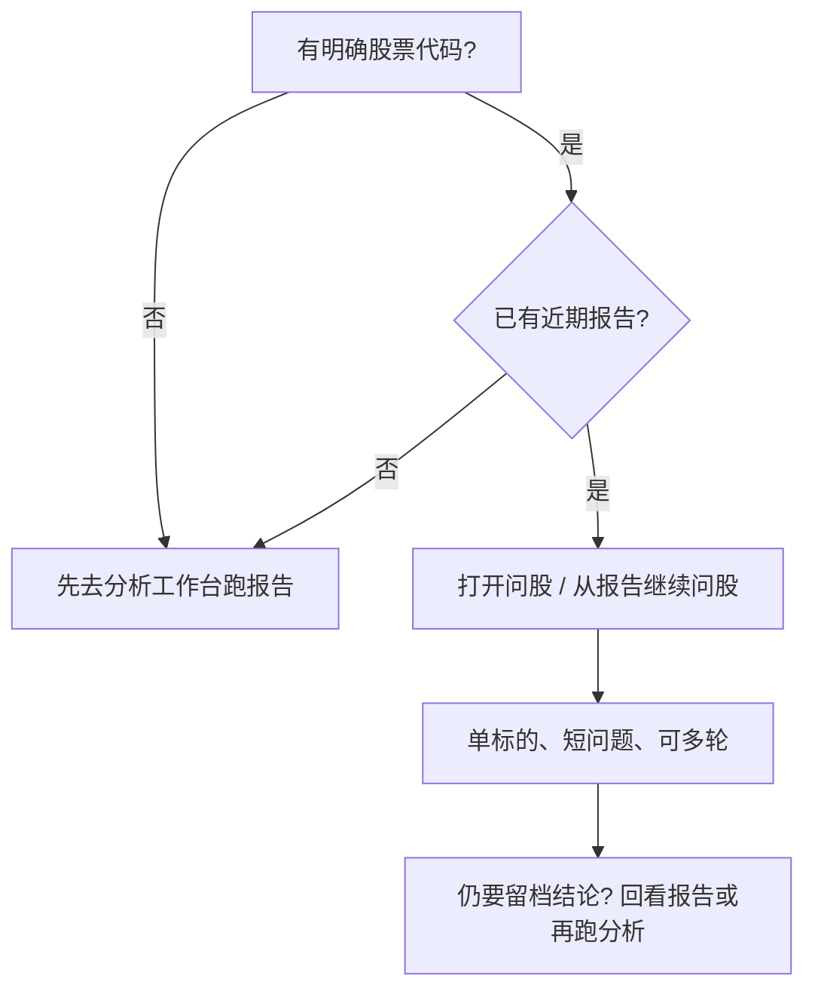

# 05 问股对话

路径：导航中的 **问股 / 对话**（文案以界面为准），或从个股报告页进入 **继续问股**。

问股是**多轮对话**：在你已经有一份分析报告（或至少明确一只股票）的基础上，用自然语言追问细节。它**不能完全代替**分析工作台的第一次完整报告。

> 💡 **一句话定位**  
> 工作台 = 交一份结构化试卷；问股 = 拿着试卷找老师追问「这句话是什么意思 / 错了怎么看」。

## 适用场景

| 场景 | 是否适合问股 | 说明 |
| --- | --- | --- |
| 刚读完报告，不懂「支撑 / 观望」 | ✅ | 针对**当前标的**追问 |
| 想确认「什么条件算逻辑失效」 | ✅ | 比重复点「开始分析」更省、更聚焦 |
| 还没有任何报告、也说不清代码 | ⚠️ 勉强 | 先做 [03 分析工作台](03-analysis-workbench.md) 更稳 |
| 想让系统自动替你下单 | ❌ | 产品不提供自动交易；输出仅供研究 |
| 一次对比很多只、问题很散 | ⚠️ | 容易串股；拆成多轮或写清「对比 A 和 B」 |

## 与分析工作台的关系

| 维度 | 分析工作台 | 问股对话 |
| --- | --- | --- |
| 产物 | 结构化报告 + 历史记录 | 对话消息流 |
| 适合 | 首次全面扫描、留档、信号提取 | 报告后的澄清、假设、观察点 |
| 上下文 | 按任务生成完整上下文包 | 尽量携带当前标的；换股需你说清 |
| 费用直觉 | 一次分析一块「完整作业」 | 多轮累计，长聊更耗额度 |

## 基本用法（逐步）

1. **确认当前标的**  
   - 从报告点「继续问股」时，通常已带上代码。  
   - 从导航直接进入时，先看界面上的当前股票；不对就改，或在问题里写明代码。
2. **用自然语言提问**（见下方示例句式）。  
3. **多轮追问**时，尽量承接上一句，不要每句换一个新主题。  
4. **换股**时明确写出新代码或规范名称（如 `改为问 300750`）。  
5. 若界面提供**导出**或**发送到通知渠道**，按需使用；不是必做步骤。

### 建议配置 / 习惯

| 项目 | 建议 | 原因 |
| --- | --- | --- |
| 进入方式 | 优先从**报告页**进入 | 上下文更不容易丢 |
| 策略 Skill | 新手可先不选 | 减少变量；与报告策略一致更易理解 |
| 单次问题长度 | 一两句说清 | 过长易跑题 |
| 一轮对话焦点 | 固定一只股票 | 降低串股 |
| 额度 | 设置中可查看用量看板 | 问股比「只读旧报告」更耗模型 |

> ⚠️ **费用与隐私**  
> 每一轮回复通常都会调用大模型（LLM）。不要把 API Key、账户密码、完整券商对账单贴进对话框。

## 策略（Skill）怎么选

| 情况 | 建议 |
| --- | --- |
| 第一次用问股 | **不选**，用默认 |
| 报告生成时选过某策略 | 对话侧尽量与之一致（若列表有同名） |
| 想换一种分析风格追问 | 明确说「请按更偏风险的角度」或在界面重选策略 |

策略名称以产品列表为准（趋势、成长、事件等会随版本增减）。不选 ≠ 没有策略，而是走系统默认。

## 推荐提问句式（可直接改代码使用）

| 你想弄清什么 | 示例问法 |
| --- | --- |
| 结论含义 | `600519 这份报告里的「观望」主要基于什么？` |
| 价位 | `若股价回到报告中的支撑附近，需要再观察哪些条件？` |
| 失效条件 | `什么样的收盘或消息出现，这份偏多逻辑应视为失效？` |
| 风险 | `当前最需要警惕的三個风险点是什么？请简要列出。` |
| 对比 | `对比 600519 和 000858，在趋势强度上报告更偏向谁？请分点说明。` |
| 阶段 | `现在是盘中且日线未完成，对结论应打几折理解？` |

> 💡 **少问这类问题**  
> - 「保证我赚钱吗？」→ 系统不能保证收益。  
> - 「帮我自动买入」→ 无自动下单。  
> - 只丢一个指标名当股票代码（如单独发 `MACD`）→ 容易被当成错误标的。

## 防串股与防跑题

| 做法 | 说明 |
| --- | --- |
| 每条关键问题带代码 | 例如句首写 `AAPL：` |
| 对比时写「对比 / vs」 | 减少模型把两只股的论据搅在一起 |
| 换股开新话题时重申代码 | 不要默认它还记得上一只 |
| 一次只改一个假设 | 例如先只问「若跌破支撑」，再问新闻 |

## 使用案例

**案例 A：报告读完仍懵**  
1. 在历史报告页点「继续问股」。  
2. 问：`请用三句话解释当前操作建议，并列出两个主要风险。`  
3. 再追问：`若我已有仓位，观察持有与减仓的分界可以怎么理解？`（仍是研究讨论，不是指令。）

**案例 B：担心串股**  
1. 先问完 `hk00700` 的失效条件。  
2. 下一句明确：`接下来只讨论 AAPL，不要混用腾讯的结论。`  
3. 再提出关于 `AAPL` 的问题。

**案例 C：还没有报告就打开了问股**  
1. 在问题里写清代码。  
2. 若回答明显缺少行情或过于空泛，回到分析工作台先生成报告，再继续问股。

## 常见问题

**答非所问或在讲另一只股票？**  
在下一句重申代码，或新开对话；对比时写明两只代码。

**和报告结论不一致？**  
对话是即时生成，可能与已落库报告有偏差。以**已保存报告**和原始数据为准做研究，重要结论可再跑一次分析留档。

**能代替回测吗？**  
不能。历史建议表现请看 [09 回测](09-backtest.md) 与信号中心再评估。

**要不要每问一句就导出？**  
一般不必。需要分享或留存关键答复时再导出。

## 相关

- [03 分析工作台](03-analysis-workbench.md)
- [08 阅读报告](08-reading-reports.md)
- [06 信号中心](06-signals.md)
- [10 设置](10-settings.md)（用量与模型）

上一篇：[04 大盘复盘](04-market-review.md) · 下一篇：[06 信号中心](06-signals.md)
