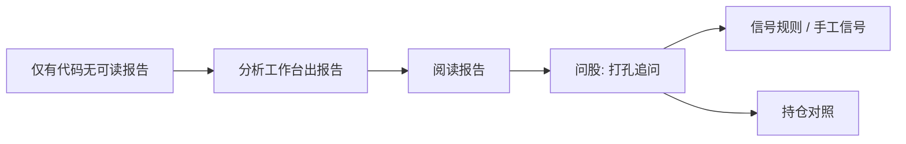
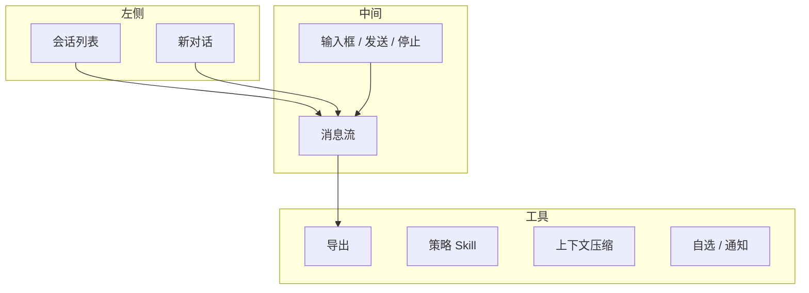
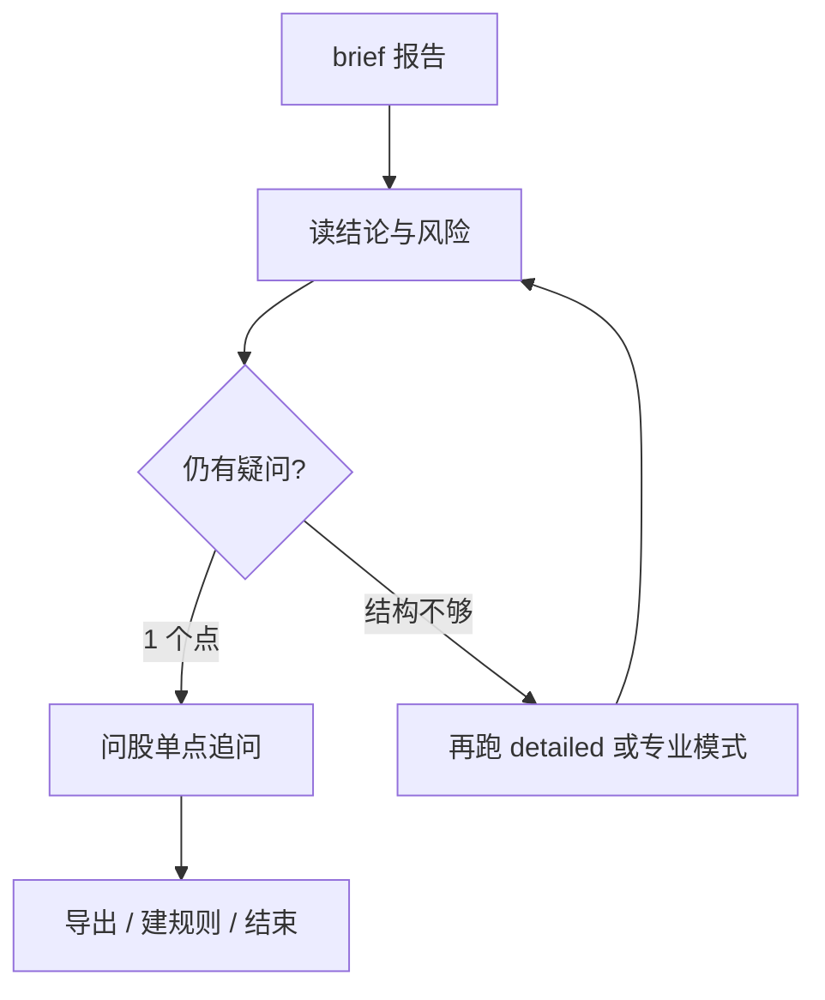

# 05 问股对话（Agent）

## 本章你会学会

1. 把问股定位成 **报告之后的多轮研究助手**，而不是「保证赚钱的黑箱」  
2. 从侧栏 Agent、`/chat`、报告上的继续问股等入口正确进入并带上上下文  
3. 用可检验的问题结构提问，避免串股、闲聊式下单语气  
4. 使用会话管理、导出、策略 Skill、上下文压缩等页面能力  
5. 在连接失败、工具不可用、额度压力下按清单自救  

> 📘 **一句话定位**  
> 问股页是一个 **可以多轮聊天** 的研究助手：最适合在已有报告或明确标的上，把没看懂的段落、失效条件、对比维度慢慢聊清楚。

> 💡 **和工作台怎么分工？**  
> | | **分析工作台** | **问股** |  
> | --- | --- | --- |  
> | 产出 | 结构化报告、历史记录、可提取信号 | 多轮解释、对比、补充提问 |  
> | 节奏 | 一次提交，等待完整成文 | 短问短答，可连续追问 |  
> | 更稳顺序 | **先报告** | **后追问** |  
> 侧栏上你可能看到 **Agent**；进到页面后标题常常是 **问股**。同一个入口，别被文案绕晕。

> ⚠️ **研究声明**  
> 对话内容只供研究学习，**不构成投资建议**。闲聊语气、口语化「能买吗」不等于下单指令；仓位与交易由你自己决定。

---

## 1. 脑中地图：问股该接在哪一环



> ✅ **推荐做法**  
> 先 brief/完整报告建立骨架，再对 **1～2 个不懂的点** 问股。  
> ❌ **不推荐**  
> 从零对模型说「全面分析并告诉我能否重仓」——费额度、结论不稳、难以复盘。

---

## 2. 入口与地址

> 🧭 **入口**

| 方式 | 说明 |
| --- | --- |
| 侧栏 **Agent** | 最直接 |
| 地址 `/chat` | 可收藏 |
| 报告上的 **继续问股** | 通常带上当前股票上下文，**推荐** |
| 命令面板 | 搜「问股」「Agent」「对话」 |
| 信号/其他页跳转 | 部分入口会带代码上下文（以界面为准） |

### 2.1 会话相关 URL（若界面支持）

| 形态 | 含义 |
| --- | --- |
| `/chat` | 默认进入问股 |
| `/chat?session=…` | 打开某一历史会话（若产品提供 session 参数） |

> 💡 **提示**  
> 从报告点「继续问股」通常比在空会话里从零描述背景更稳：上下文更干净，也少打字。

---

## 3. 第一次聊天：请这样开始

1. **确认当前聊的是哪只股票**。从报告点进来一般已经对了；不确定就在问题里写代码，例如「只讨论 600519」。  
2. **第一问只问一件事**，例如失效条件，而不是「全面分析 + 仓位 + 目标价 + 消息面」。  
3. 等回复结束后，再问第二问（价位依据、主要风险、与另一只的差异等）。  
4. **换股票时**：要么 **新开对话**，要么清楚写「请切换到 300750，不要混入上一只」。  
5. 有用的结论，可以导出，或去信号中心做成规则/手工信号。  
6. 若发现模型开始「忘」前文或串题，立刻新开会话并粘贴三行摘要。

### 3.1 空状态示例句：改成更研究向

界面可能提示类似「分析 600519」「茅台现在能买吗」。更稳妥的改法是：

| 空状态/直觉问法 | 更稳的研究向问法 |
| --- | --- |
| 「能买吗？」 | 「请列出当前建议的失效条件，用条目说明。」 |
| 「目标价多少？」 | 「若报告提到价位，请区分支撑/压力/止损，并说明依据是技术位还是事件。」 |
| 「给我个仓位」 | 「不要给出仓位比例，只讨论加仓或减仓前应观察的条件。」 |
| 「全面分析」 | 「请用三条概括核心结论与主要风险，不要重写全部技术指标。」 |

> ✅ **推荐做法**  
> 问题里显式写：**标的代码 + 只要什么 + 不要什么**。  
> ❌ **不推荐**  
> 「那另一只呢？」「顺便也看看吧」——串股高发区。

---

## 4. 页面区域与操作

> 🖼️ **配图占位** · `assets/agent-chat-empty-zh.png`  
> **应配内容**：问股/Agent 页：会话区、输入框、（若有）当前标的或策略入口。  
> **拍摄要点**：侧栏显示 Agent 时与页内标题以界面为准；无真实持仓隐私。  
> **状态**：待补图（清单：[assets/PLACEHOLDERS.md](assets/PLACEHOLDERS.md)）

| 区域 / 操作 | 它在帮你做什么 | 使用小贴士 |
| --- | --- | --- |
| 历史对话列表 | 保存过往会话 | 定期删掉无用会话，列表更清爽 |
| 新对话 | 干净的上下文 | 换主题、换股票时用它 |
| 输入框 + 发送 | 提问 | 发送中请稍等，避免连点 |
| 停止 | 中断生成 | 已生成部分可能仍保留 |
| 删除消息 / 删除会话 | 清理 | 一般不可恢复 |
| 导出 | 保存研究笔记 | 适合周末整理为 Markdown |
| 通知 | 把内容推到渠道 | 需先在设置配好通知 |
| 加入/移出自选 | 同步自选列表 | 和设置里的自选是一套 |
| 策略展开/收起 | 选择 Skill 风格 | 新手可先不选 |
| 生成分析 | 更重的分析路径 | 更耗额度，想清楚再用 |
| 思考过程 | 展示推理片段 | 当参考，不当圣旨 |
| 上下文压缩 | 长会话省 token | 改完看是否「未保存」 |
| 深度研究等面板（若有） | 更重的研究流程 | 与轻量追问区分开，按需使用 |



---

## 5. 策略 Skill：要选吗？

> 📘 **概念**  
> 问股中的 **策略 / Skill** 与工作台类似：改变提问与证据的侧重点（趋势、质量、事件等，**以列表为准**）。它仍然 **不是** 稳赚开关。

| 场景 | 建议 |
| --- | --- |
| 第一次追问报告 | **不选**，减少变量 |
| 明确想用某种风格解读 | 选一个你理解的 |
| 已在对比两种风格 | 分会话进行，避免同一会话来回切 |

> ⚠️ **注意**  
> 工作台用策略 A 出的报告，问股又切到策略 B，差异可能来自风格而非行情。对比时请在问题里写明你在做什么。

---

## 6. 提问模式库（可直接改代码复用）

### 6.1 失效条件

```text
请只讨论 {代码}。
用条目列出当前建议的失效条件；
若收盘跌破或升破某一价位应重新评估，请写明，并说明依据来自报告还是一般技术假设。
不要给出仓位比例。
```

### 6.2 三分钟版

```text
请用三条概括 {代码} 报告里的核心结论与主要风险，
不要重写技术指标全文。
```

### 6.3 价位依据

```text
针对 {代码}，请解释支撑/压力/止损（若有）分别依赖什么证据：
技术位、成交密集区、事件还是其他；缺失的请标明「报告未给出」。
```

### 6.4 已持仓：只要观察框架

```text
我已持有 {代码}。
请只讨论加仓或减仓前应观察的条件与失效信号，
不要替我决定仓位比例，不要使用下单口吻。
```

### 6.5 两标的对比

```text
对比 {代码A} 与 {代码B} 近阶段趋势与风险差异：
请分条列出各自主要风险与观察点；
不要给出仓位指令，不要合并成「选一个买」。
```

### 6.6 事件时间线

```text
若上下文提到并购/减持/财报/监管，请整理时间线：
已发生 / 待发生 / 仍不确定。
对不确定项标明信息缺口。
```

### 6.7 从信号回来确认

```text
只讨论 {代码}。
请确认此前失效条件是否仍逻辑自洽；
若市场已变化，请列出需要更新的观察点。
不要重写整份报告。
```

更多可复制问法也可对照 [11 日常工作流](11-daily-workflows.md)。

---

## 7. 连接失败、发不出去时

请先别怀疑「是不是我问得不对」。按下面顺序检查：

1. **设置 → 模型**：是否保存成功、测试连接是否通过、额度是否耗尽。  
2. **生成后端 / 任务路由**：问股是否需要工具调用，而当前后端是 **仅本地 CLI、不支持工具**——到设置查看相关提示。  
3. **网络与后端服务**是否在运行（桌面/自托管场景尤甚）。  
4. **通知失败**：只影响推送，不等于对话本身失败；去设置做测试推送。  
5. **上下文过长或异常**：新开对话，粘贴三行摘要再问。  
6. **浏览器扩展/广告拦截**：若仅问股页异常，可尝试无扩展窗口。

| 现象 | 更可能的原因 | 动作 |
| --- | --- | --- |
| 完全发不出 | 模型未配置/后端挂了 | 设置测连接；查服务 |
| 能回但无实时行情 | 工具调用不可用 | 查生成后端与工具支持 |
| 回复明显串股 | 同会话切换标的不清 | 新开对话并写清代码 |
| 越聊越废话 | 上下文膨胀 | 压缩或新开 + 摘要 |
| 通知没收到 | 渠道配置 | 与对话成功与否解耦排查 |

---

## 8. 省额度的聊法

问股往往比「再跑一整份 detailed 报告」更灵活，但 **长会话也会吃 token**。

| 做法 | 效果 |
| --- | --- |
| 先工作台 brief，再只追问 1～2 点 | 费用可控、结构清晰 |
| 开启上下文压缩（若有）并确认保存 | 降低长会话成本 |
| 模型「忘」前文时新开对话 | 避免无效拉扯 |
| 禁止「请重写整章技术分析」 | 减少重复生成 |
| 导出关键结论后删会话 | 列表清爽、少误点旧上下文 |
| 生成分析类重路径慎用 | 想清楚再点 |

> ✅ **推荐做法：单点追问**  
> 工作台用 brief 生成报告骨架 → 问股每次只追问一个具体点（如失效条件或关键价位）→ 确有需要再跑 detailed。  
> ❌ **不推荐**  
> 让对话反复重写报告中已读过的整章内容。



---

## 9. 使用案例

### 案例 A：报告看完，只卡在失效条件

从历史报告点继续问股 →  
「请用条目列出本建议的失效条件；若收盘跌破哪一价位应重新评估？」→  
把关键价位记到信号规则（可选）。

### 案例 B：差点串股

不推荐：「那另一只呢？」  
推荐：「请切换到 300750，只讨论估值与负债风险，不要混入 600519。」  
更好：直接 **新开对话**。

### 案例 C：想对比两只美股

「对比 AAPL 与 MSFT 近阶段趋势差异，列出各自主要风险，不要给出仓位指令。」

### 案例 D：我已持仓，只想要观察框架

「我已持有 600519。请只讨论加仓或减仓前应观察的条件，不要替我决定仓位比例。」

### 案例 E：报告太长，只要「三分钟版」

「请用三条概括 600519 报告里的核心结论与主要风险，不要重写技术指标全文。」

### 案例 F：事件驱动，只想理时间线

「若上下文提到并购/减持/财报，请整理时间线：已发生 / 待发生 / 仍不确定。」

### 案例 G：从信号点回来继续聊

信号流打开某条 → 继续问股（或手动带上代码）→ 只追问失效条件是否仍成立。  
适合盘中被规则叫醒后的快速确认。

### 案例 H：省额度的单点追问聊法

工作台 brief 出骨架 → 问股每次只追问一个具体点 → 需要全文时再开一次 detailed，而不是让对话重写整章。

### 案例 I：导出周末笔记

对重仓股完成 3～5 轮高质量追问 → 导出 Markdown → 删除过程中的试错会话 → 把失效价位抄进信号规则。

### 案例 J：工具不可用时的降级

设置提示当前后端不支持工具 → 提问改为「仅基于已给报告上下文解释」，不要求实时盘口；需要新鲜行情时改回支持工具的后端或先跑工作台。

---

## 10. 常见问题（FAQ）

**Q1：问股能替代分析工作台吗？**  
不建议。工作台负责结构化报告与历史记录；问股负责解释与追问。更稳妥的顺序是：**先报告，后追问**。

**Q2：为什么它好像记得上一只股票？**  
同一会话会保留上下文。换标的请新开对话或显式声明切换。

**Q3：思考过程是否等于最终结论？**  
不是。思考片段可能不完整或被截断，请以最终回复与来源报告为准。

**Q4：导出后原会话还在吗？**  
导出通常是下载副本，不等于删除会话；删除需单独操作。

**Q5：对话里的方向性措辞会自动变成信号吗？**  
不保证每句都入库。部分结论可能沉淀为来源 `agent` 的信号，但应以信号中心实际列表为准；需要结构化记录时可 **手工创建信号**。

**Q6：可以同时开很多会话吗？**  
可以，但列表会乱。建议按标的或按主题命名/整理，并定期清理。

**Q7：停止生成后还能继续问吗？**  
可以继续发新问题；已生成的半段内容可能仍显示，注意别把它当成完整结论。

---

## 11. 自检清单

### 提问前

- [ ] 已尽量先读过相关报告或明确只有轻量问题  
- [ ] 问题中写清代码  
- [ ] 一问一事，并写了「不要仓位指令」等边界（如需要）  
- [ ] 换股票时已新开对话或显式切换  

### 会话中

- [ ] 没有连点发送  
- [ ] 发现串股立即纠正  
- [ ] 长会话已考虑压缩或新开  
- [ ] 没有要求模型重复整章已读内容  

### 会话后

- [ ] 关键结论已导出或记入规则/笔记  
- [ ] 无用会话已清理  
- [ ] 若需新鲜完整研究，回到工作台而不是无限聊  

---

## 12. 术语（白话）

| 术语 | 含义 |
| --- | --- |
| 问股 / Agent | 多轮研究对话页（`/chat`） |
| 会话 Session | 一组连续多轮聊天 |
| 上下文 | 模型暂时「记得」的前文 |
| 上下文压缩 | 压缩历史以省 token |
| 工具调用 | 去拉行情/新闻等实时能力 |
| 策略 Skill | 可选的对话/分析风格包 |
| 生成分析 | 更重、更耗额度的分析路径（若提供） |
| 来源 agent 的信号 | 有些对话结论可能沉淀进信号中心（不保证每句都入库） |
| 继续问股 | 从报告带着上下文进入对话的入口 |

---

## 13. 相关阅读

- [03 分析工作台](03-analysis-workbench.md) — 先产出结构化报告  
- [08 阅读报告](08-reading-reports.md) — 追问前先抓结论与风险  
- [06 信号中心](06-signals.md) — 把失效条件变成提醒  
- [07 持仓](07-portfolio.md) — 观察框架对照真实仓位  
- [10 设置](10-settings.md) — 模型、生成后端、通知  
- [11 日常工作流](11-daily-workflows.md) — 问法菜谱与一日节奏  

上一篇：[04 大盘复盘](04-market-review.md) · 下一篇：[06 信号中心](06-signals.md)
