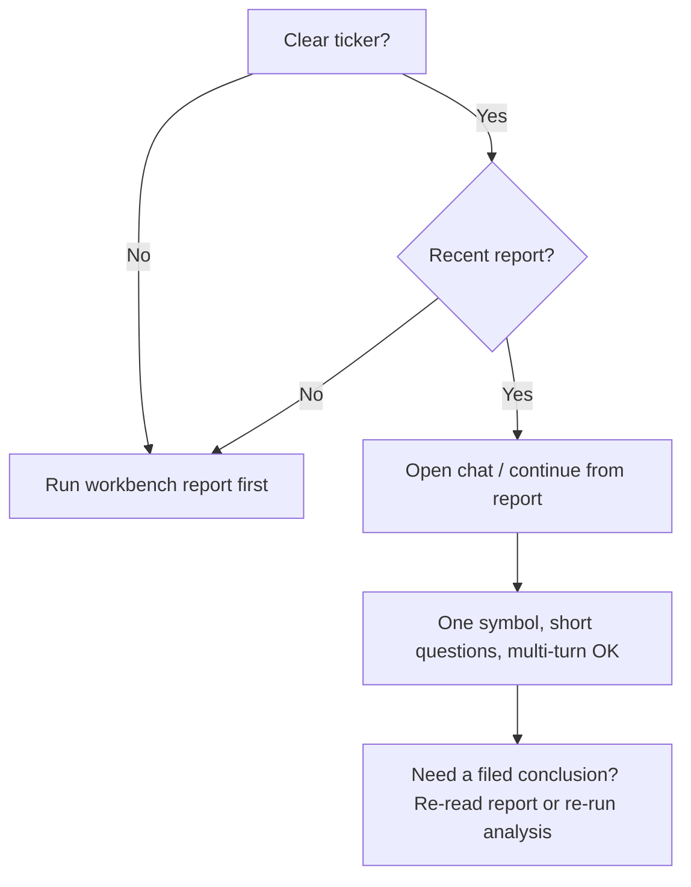

# 05 Agent chat

Path: **Chat / Ask** (follow live labels), or **Continue in chat** from a stock report.

Agent chat is **multi-turn Q&A** on top of a report (or at least a clear ticker). It does **not** fully replace the first structured run on the analysis workbench.

> 💡 **One-line framing**  
> Workbench = hand in a structured paper; Chat = ask the teacher what a sentence means and what would invalidate it.

## When to use it

| Scenario | Fit | Note |
| --- | --- | --- |
| Finished a report; unclear on “watch” / support | ✅ | Follow up on the **current** symbol |
| Want explicit invalidation conditions | ✅ | Often better than re-running full analysis |
| No report and no clear ticker | ⚠️ Weak | Prefer [03 Analysis workbench](03-analysis-workbench_EN.md) first |
| Expect automatic order placement | ❌ | No auto-trading; research only |
| Many tickers, scattered questions | ⚠️ | Easy to mix symbols; split turns or write “compare A vs B” |

## Versus the analysis workbench

| Dimension | Workbench | Agent chat |
| --- | --- | --- |
| Output | Structured report + history | Message thread |
| Best for | First full pass, archive, signal extraction | Clarification, scenarios, observation points |
| Context | Built per analysis task | Tries to carry the active symbol; you must restate on switch |
| Cost intuition | One full assignment | Multi-turn usage adds up |

## Basics (step by step)

1. **Confirm the active symbol** — carried from “Continue in chat” when possible; otherwise set it or write the code in the question.  
2. **Ask in natural language** (see prompt patterns below).  
3. **Multi-turn**: stay on one theme before jumping.  
4. **Switching symbols**: state the new code explicitly (e.g. “now only discuss AAPL”).  
5. **Export / notify** only if the UI offers it and you need it.

### Recommended habits

| Item | Suggestion | Why |
| --- | --- | --- |
| Entry | Prefer **from a report** | Stronger context |
| Strategy / Skill | Beginners can leave default | Fewer variables |
| Question length | One or two clear sentences | Long prompts drift |
| Focus | One symbol per stretch | Less mixing |
| Budget | Check usage under Settings | Chat costs more than re-reading a saved report |

> ⚠️ **Cost and privacy**  
> Each turn typically calls an LLM. Never paste API keys, passwords, or full broker statements into the chat box.

## Strategies (Skills)

| Situation | Suggestion |
| --- | --- |
| First time in chat | Leave **default** |
| Report used a named skill | Match it in chat when the list allows |
| Want a different lens | Say so in text or re-select in UI |

Names (trend, growth, event, …) follow the product list and may change. “No selection” means system default, not “no analysis style”.

## Prompt patterns (edit the ticker)

| Goal | Example |
| --- | --- |
| Explain the action | `For 600519, explain the “watch” suggestion in three sentences.` |
| Levels | `If price returns near the report support, what else should I observe?` |
| Invalidation | `What close or headline would invalidate a constructive read here?` |
| Risk | `List the top three risks briefly.` |
| Compare | `Compare 600519 and 000858 on trend strength; bullet points only.` |
| Phase | `It is intraday with a partial daily bar—how cautiously should I treat the lean?` |

> 💡 **Avoid**  
> - “Guarantee profits?” → not possible.  
> - “Buy automatically for me.” → not supported.  
> - Sending only an indicator name as if it were a ticker (e.g. bare `MACD`).

## Anti-mix rules

| Practice | Why |
| --- | --- |
| Put the code in key questions | Anchors the model |
| Write “compare / vs” for two names | Separates evidence |
| Restate the ticker after a switch | Do not assume memory |
| Change one assumption at a time | Cleaner answers |

## Examples

**A. Report finished, still confused**  
Continue from the report → ask for a three-sentence action summary plus two risks → follow up on hold-vs-reduce *observation* framing (research, not orders).

**B. Preventing mix-ups**  
Finish `hk00700` invalidation questions → next message: “From now only AAPL; ignore Tencent conclusions.” → ask about `AAPL`.

**C. Opened chat with no report**  
State the code clearly → if answers feel empty, run a workbench report first, then continue in chat.

## FAQ

**Wrong stock or off-topic?**  
Restate the code or start a fresh thread; name both tickers when comparing.

**Disagrees with the saved report?**  
Chat is live generation; prefer the **stored report** and primary data for archival research. Re-run analysis when you need a new filed version.

**Replace backtest?**  
No. Use [09 Backtest](09-backtest_EN.md) and Signal center outcomes.

**Export every reply?**  
Usually unnecessary; export when you need to keep or share a key answer.

## Related

- [03 Analysis workbench](03-analysis-workbench_EN.md)
- [08 Reading reports](08-reading-reports_EN.md)
- [06 Signal center](06-signals_EN.md)
- [10 Settings](10-settings_EN.md)

Previous: [04 Market review](04-market-review_EN.md) · Next: [06 Signal center](06-signals_EN.md)
