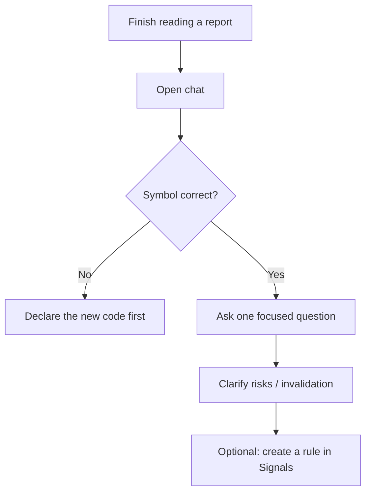

# 05 Agent chat

Path: **Chat / Ask**, or **Continue in chat** from a stock report.

Chat is a **multi-turn, context-aware** follow-up surface. It shines after you already have a report and need to clarify a section, compare names, or pin down invalidation conditions. It is **not** a full replacement for the first structured report from the analysis workbench.

> 💡 **Workbench vs chat**  
> - **Workbench**: structured report + history + extractable signals  
> - **Chat**: deeper Q&A on top of a report (or a declared symbol)  
> Prefer report first, then follow-up questions.

## When to use it

| Scenario | Suggested ask |
| --- | --- |
| Report says watch; you want levels | “If close holds above XX, how should watch conditions change?” |
| Support / resistance is unclear | “Explain support and resistance in plain language and list invalidation” |
| Compare two names | “Compare 600519 vs 300750 on valuation and trend only” |
| Entered from a report | Confirm the header symbol, then ask |
| Switching symbols | State the new code before the question |

## Basics (step by step)

1. Confirm the active symbol (usually carried from a report; otherwise write the code in the question).  
2. Ask in natural language: levels, hold framing, main risks, invalidation.  
3. Multi-turn is fine; keep one focus per turn.  
4. When switching symbols, **name the new code clearly**.  
5. Export or send to a notification channel when the UI offers it.

## Strategies / Skills (optional)

| Item | Note |
| --- | --- |
| What it is | An analysis style pack (trend, growth, event-driven, quality, … as listed) |
| If omitted | System default applies |
| Beginner tip | Skip the first time to reduce variables |

> ⚠️ **A strategy is not a profit switch**  
> It changes emphasis and evidence preference; it does not remove market risk.

## Habits that help

| Habit | Why |
| --- | --- |
| One symbol per focus session | More stable answers |
| Write “compare / vs” with codes | Fewer mixed-up names |
| Ask invalidation before “should I buy” | Research discipline |
| Watch usage on long threads | Chat often costs more than one report |

### Prompt templates

| Goal | Example |
| --- | --- |
| Risk | “List the three most important risks and a possible invalidation signal for each” |
| Levels | “Where are support and resistance roughly, and is the basis technical or event-driven?” |
| Session awareness | “If the daily bar is still partial, how should the conclusion stay conservative?” |
| Comparison | “Compare AAPL and MSFT recent trend differences; no position sizing” |

## Use cases

**A — Invalidation after a report**  
Open **Continue in chat** → ask for bullet invalidation conditions → optionally mirror a price level into a Signal rule.

**B — Avoid mixed symbols**  
Bad: “What about the other one?”  
Better: “Switch to 300750 only; discuss valuation and leverage risk; do not mix 600519.”

**C — Tight model budget**  
Use brief / beginner mode on the workbench first → chat only about 1–2 unclear paragraphs.

## Related

- [03 Analysis workbench](03-analysis-workbench_EN.md)
- [08 Reading reports](08-reading-reports_EN.md)
- [06 Signal center](06-signals_EN.md)
- [10 Settings](10-settings_EN.md)

Previous: [04 Market review](04-market-review_EN.md) · Next: [06 Signal center](06-signals_EN.md)
