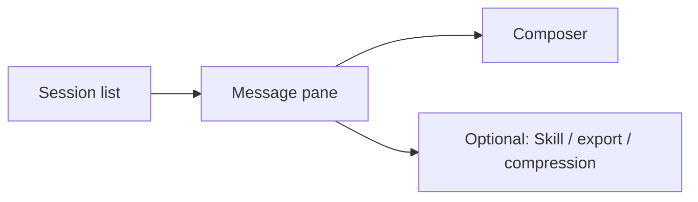

# 05 Agent chat (Ask stock)

## Entry points and paths

| Method | Path |
| --- | --- |
| Primary nav | Sidebar **Agent** (page title often **Ask stock** / chat) |
| Command palette | Search “chat”, “agent”, “ask” |
| Canonical route | `/chat` |
| From a report | **Continue in chat** (carries symbol context) |
| Nav badge | Optional completion / onboarding badge on Agent |

Agent chat is **multi-turn**. It is best **after** a full Workbench report — not a substitute for the first structured report.

> 💡 **Division of labor**  
> - **Workbench** (`/research/analysis`): structured report + history + extractable signals  
> - **Chat** (`/chat`): follow-ups on a name or report  

> ⚠️ Research only — **not investment advice**.

## When to use

| Scenario | Suggested approach |
| --- | --- |
| Report says “watch” | From report → ask observation / invalidation conditions |
| Support / resistance jargon | Ask for plain language + invalidation |
| Compare two names | Explicit “compare CODE1 vs CODE2 …” |
| Wrong symbol context | State the new code before the question |
| Long session cost | Context compression (if available) or new session |

## Layout

| Area | Role |
| --- | --- |
| **History** | Past sessions; delete clutter |
| **Empty state** | Example prompts |
| **Messages** | Multi-turn thread |
| **Composer** | One focus per turn |
| **Context compression** | Save tokens on long threads (watch unsaved hints) |

## Steps

1. Open **Agent** (`/chat`) or **Continue in chat** from a report.  
2. Confirm the **symbol** (type codes if unsure: `600519`, `hk00700`, `AAPL`).  
3. Ask in natural language (risks, levels, invalidation).  
4. One focus per turn.  
5. On symbol switch, **name the new code** explicitly.  
6. Export / notify if offered.  
7. Delete useless sessions.

Prefer research-style questions (risks + invalidation) over “guarantee me returns”.

## Strategy Skills (optional)

| Item | Note |
| --- | --- |
| What | Style packs (trend, quality, event, … as listed) |
| Default | System default if none selected |
| Beginners | Skip first; reduce variables |

> ⚠️ Skills change emphasis — they do not remove market risk.

## Habits

| Habit | Why |
| --- | --- |
| One stock per thread focus | Less mix-ups |
| Write “compare / vs” + codes | Clearer model targeting |
| Invalidation before “can I buy” | Research discipline |
| Watch usage | Chat can cost more than one brief report |
| Configure models first | Missing keys fail chat |
| Local CLI backends | Often **no** tool-calling for Agent; UI backend status warns |

### Prompt templates

| Goal | Example |
| --- | --- |
| Risks | “List the top 3 risks and each invalidation signal.” |
| Levels | “Where are support/resistance and is the basis technical or event-driven?” |
| Phase | “If the daily bar is incomplete, restate the conclusion conservatively.” |
| Compare | “Compare AAPL vs MSFT trend differences; no position sizes.” |
| Holdings | “I already hold 600519; discuss only observation conditions for add/reduce.” |

## Glossary

| Term | Meaning |
| --- | --- |
| **Agent / Ask stock** | Multi-turn chat entry |
| **Session** | One continuous thread |
| **Context** | Prior turns the model can see |
| **Context compression** | Shrink history to save tokens |
| **Skill** | Optional analysis style pack |
| **Tool calling** | Live data tools; needs capable backend |
| **Agent-sourced signal** | Some chats may create Decision Signals (not guaranteed per message) |

## Use cases

**A — Invalidation after a report**  
Open report → Continue in chat → list invalidation prices → optional rule in Signal Center.

**B — Avoid symbol mix-ups**  
Bad: “What about the other one?”  
Better: “Switch to 300750 only; do not mix 600519.”

**C — Tight quota**  
Brief/beginner Workbench report → chat only on 1–2 unclear sections.

**D — Failure**  
Check model keys, tool-capable backend, network → Settings AI / task routing → short retry.

## Related modules

Workbench is primary; Signal Center may show `agent` sources; Portfolio “analyze” still uses Workbench; Settings for models and usage.

## Related

- [03 Analysis Workbench](03-analysis-workbench_EN.md)
- [08 Reading reports](08-reading-reports_EN.md)
- [06 Signal Center](06-signals_EN.md)
- [10 Settings](10-settings_EN.md)

Prev: [04 Market review](04-market-review_EN.md) · Next: [06 Signal Center](06-signals_EN.md)
