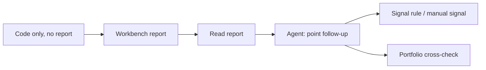
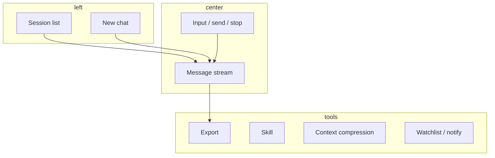
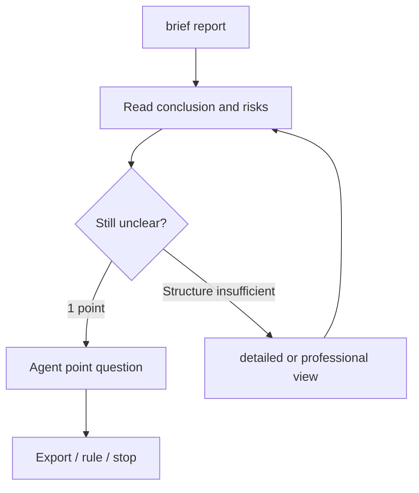

# 05 Agent chat

## What you will learn

1. Position chat as a **multi-turn research assistant after the report**, not a black box that promises returns  
2. Enter from sidebar Agent, `/chat`, or **Continue in chat** with the right context  
3. Ask verifiable, research-shaped questions; avoid symbol mix-ups and order-ticket tone  
4. Use sessions, export, Skills, and context compression as shown in the UI  
5. Self-recover when send fails, tools are unavailable, or quota pressure rises  

> 📘 **One-liner**  
> Agent chat is a **multi-turn research conversation**: best used when you already have a report (or a clear symbol) and need to clarify a section, invalidation, or comparison carefully.

> 💡 **Division of labor with Workbench**  
> | | **Analysis Workbench** | **Agent chat** |  
> | --- | --- | --- |  
> | Output | Structured report, history, extractable signals | Multi-turn explanation, compare, follow-up |  
> | Rhythm | One submit, wait for full write-up | Short Q&A, continuous follow-up |  
> | Safer order | **Report first** | **Questions second** |  
> Sidebar may say **Agent**; the page title often says **Ask stock**. Same entry.

> ⚠️ **Research only**  
> Conversation content is for study — **not investment advice**. Casual “can I buy?” language is not an order ticket. Position size and execution remain yours.

---

## 1. Mental map



> ✅ **Recommended**  
> Build a brief/full report skeleton first, then Agent on **1–2 unclear points**.  
> ❌ **Avoid**  
> From zero: “full analysis and tell me whether to go heavy”—expensive, unstable, hard to review.

---

## 2. Entry and URLs

> 🧭 **Entry**

| Method | Notes |
| --- | --- |
| Sidebar **Agent** | Most direct |
| URL `/chat` | Bookmarkable |
| Report **Continue in chat** | Typically carries symbol context — **preferred** |
| Command palette | Try “chat”, “Agent”, “ask stock” |
| Signal / other jumps | Some carry code context (as shown in the UI) |

### 2.1 Session-related URL (if supported)

| Form | Meaning |
| --- | --- |
| `/chat` | Default Agent entry |
| `/chat?session=…` | Open a prior session when the product exposes session ids |

> 💡 **Tip**  
> **Continue in chat** from a report is usually more stable than describing background from an empty session.

---

## 3. First conversation

1. Confirm **which symbol** you are discussing. From a report, it is typically pre-set; otherwise write the code explicitly (e.g. “discuss only 600519”).  
2. First question = **one topic** (often invalidation), not “full analysis + size + target + news”.  
3. Wait for the reply, then ask the next focused question.  
4. Changing symbols: **new conversation**, or clearly write “switch to 300750 only; do not mix the previous name”.  
5. Export useful conclusions, or turn levels into Signal Center rules/manual signals.  
6. If the model mixes topics or “forgets,” start a new session and paste a three-line summary.

### 3.1 Rewrite empty-state intuition into research prompts

| Intuitive ask | More stable research ask |
| --- | --- |
| “Can I buy?” | “List current invalidation conditions as bullets.” |
| “What’s the target?” | “If the report has levels, separate support/resistance/stop and state whether they are technical or event-based.” |
| “Give me a position size” | “Do not give position percentages; discuss conditions to observe before add/reduce.” |
| “Full analysis” | “Three bullets: core thesis and main risks; do not rewrite all indicators.” |

> ✅ **Recommended**  
> State **code + what you want + what you do not want**.  
> ❌ **Avoid**  
> “What about the other one?” / “check that too”—high mix-up risk.

---

## 4. Page areas and actions

> 🖼️ **Figure placeholder** · `assets/agent-chat-empty-en.png`  
> **Capture**: Agent/chat page: conversation area + input; optional symbol context.  
> **Notes**: English UI; no private holdings.  
> **Status**: pending — see [assets/PLACEHOLDERS.md](assets/PLACEHOLDERS.md)

| Area / action | Job | Tip |
| --- | --- | --- |
| Session list | Past conversations | Delete unused sessions periodically |
| New chat | Clean context | Use when theme or symbol changes |
| Input + send | Ask | Wait while generating; avoid multi-click |
| Stop | Interrupt generation | Partial text may remain |
| Delete message / session | Cleanup | Typically irreversible |
| Export | Research notes | Good weekend Markdown archive |
| Notify | Push content to channels | Requires configured channels in Settings |
| Watchlist add/remove | Sync watchlist | Same list as Settings |
| Skill expand/collapse | Style pack | Beginners may leave empty |
| Generate analysis | Heavier path | Higher cost; use deliberately |
| Thinking block | Intermediate reasoning snippets | Reference only, not final authority |
| Context compression | Save tokens on long threads | Check unsaved state after change |
| Deep-research panels (if any) | Heavier research flow | Separate from light follow-ups |



---

## 5. Skills

> 📘 **Concept**  
> Chat **Skills** are similar to Workbench style packs: they shift emphasis (trend, quality, events, … as listed). They are still **not** profit switches.

| Scenario | Guidance |
| --- | --- |
| First follow-up after a report | **None**—fewer variables |
| Clear style needed | One Skill you understand |
| Comparing two styles | Separate sessions; avoid switching mid-thread |

> ⚠️ **Note**  
> Workbench with Skill A + chat with Skill B can create differences from **style**, not market change. State your experiment in the question when comparing.

---

## 6. Prompt patterns (adapt the code)

### 6.1 Invalidation

```text
Discuss only {code}.
List invalidation conditions as bullets.
If a close through a price should force re-evaluation, state the level and whether it comes from the report or a general technical assumption.
Do not give position sizes.
```

### 6.2 Three-minute digest

```text
Three bullets summarizing core thesis and main risks for {code} from the report.
Do not rewrite the full indicator section.
```

### 6.3 Level rationale

```text
For {code}, explain support / resistance / stop (if any) and the evidence each relies on
(technical level, volume cluster, event, or other). Mark missing items as "not in report."
```

### 6.4 Already holding: observation only

```text
I already hold {code}.
Discuss only conditions to observe before add/reduce and invalidation signals.
Do not decide position size for me and do not use order-ticket language.
```

### 6.5 Two-symbol compare

```text
Compare {codeA} and {codeB} recent trend and risk differences.
List main risks and observation points per name.
No position instructions; do not collapse into "pick one to buy."
```

### 6.6 Event timeline

```text
If context mentions M&A / stake sales / earnings / regulation, build a timeline:
happened / pending / still uncertain.
Mark information gaps on uncertain items.
```

### 6.7 After a signal alert

```text
Discuss only {code}.
Confirm whether prior invalidation logic still holds.
If the market changed, list observation points to update.
Do not rewrite the entire report.
```

More copy-ready patterns: [11 Daily workflows](11-daily-workflows_EN.md).

---

## 7. When send fails

Do not assume the question is “wrong.” Check in order:

1. **Settings → Models**: saved, connection test green, quota available.  
2. **Generation backend / task routing**: Agent may need tool calling; a **local CLI-only** backend may not support tools—read Settings hints.  
3. **Network and backend service** running (especially desktop / self-host).  
4. **Notify failure** ≠ chat failure—test push separately.  
5. **Context too long or corrupted**: new chat + three-line summary.  
6. **Browser extensions / blockers**: try a clean window if only this page fails.

| Symptom | Likely cause | Action |
| --- | --- | --- |
| Cannot send at all | Model missing / backend down | Test connection; check service |
| Replies but no live quotes | Tools unavailable | Check generation backend and tool support |
| Obvious symbol mix-up | Unclear switch in same session | New chat + explicit code |
| Increasing fluff | Context bloat | Compress or new chat + summary |
| Notify missing | Channel config | Debug separately from chat success |

---

## 8. Quota-aware chat

Chat is more flexible than another full detailed report, but **long threads also burn tokens**.

| Practice | Effect |
| --- | --- |
| Workbench brief first; 1–2 chat points | Cost controlled, structure clear |
| Context compression (if available) + save | Lower long-thread cost |
| New session when the model forgets | Avoid useless thrash |
| Ban “rewrite the whole technical chapter” | Less duplicate generation |
| Export key conclusions, then prune sessions | Cleaner list, less wrong context |
| Heavy “generate analysis” sparingly | Deliberate use only |

> ✅ **Recommended: point follow-up**  
> Brief report → one concrete Agent question per turn (invalidation or levels) → detailed only if still needed.  
> ❌ **Avoid**  
> Asking chat to rewrite chapters you already read.



---

## 9. Use cases

**A — Stuck only on invalidation** — Continue in chat from history → bullet invalidation → optional price rule.  
**B — Avoid mix-up** — Prefer new chat over “what about the other one?”; if same session, “switch to 300750 only.”  
**C — Compare two US names** — “Compare AAPL vs MSFT trends and risks; no position instructions.”  
**D — Already holding** — observation conditions only; no sizing orders.  
**E — Three-minute digest** — three bullets thesis + risks; no indicator dump.  
**F — Event timeline** — happened / pending / uncertain.  
**G — After a signal wake-up** — confirm invalidation still holds; no full rewrite.  
**H — Quota-friendly path** — brief skeleton → one hole per turn → detailed only once if needed.  
**I — Weekend export** — 3–5 high-quality turns → export Markdown → delete trial sessions → copy levels into rules.  
**J — Tools unavailable** — ask “based only on provided report context”; get fresh quotes via tool-capable backend or Workbench first.

---

## 10. FAQ

**Q1: Can chat replace Workbench?**  
Not recommended. Workbench owns structured reports and history; chat owns explanation. Safer order: **report first, then questions**.

**Q2: Why does it still talk about the previous stock?**  
Same session keeps context. New conversation or explicit switch.

**Q3: Is the thinking block the final answer?**  
No. Snippets may be incomplete. Prefer the final reply and source report.

**Q4: Does export delete the session?**  
Export is typically a download copy; delete is a separate action.

**Q5: Do chat phrases automatically become signals?**  
Not guaranteed. Some conclusions may land as source `agent` signals—trust the Signal Center list. Use **manual create** for structured notes you own.

**Q6: Many parallel sessions?**  
Possible, but lists get noisy. Organize by symbol/theme and prune.

**Q7: After Stop, can I keep asking?**  
Yes. Treat partial text as incomplete until a full answer lands.

---

## 11. Self-check

### Before asking

- [ ] Related report read, or the question is intentionally light  
- [ ] Code explicit in the question  
- [ ] One topic; boundaries like “no position sizing” when needed  
- [ ] Symbol change → new chat or explicit switch  

### During session

- [ ] No multi-click send  
- [ ] Mix-ups corrected immediately  
- [ ] Long thread: compression or new session considered  
- [ ] No request to rewrite whole already-read chapters  

### After session

- [ ] Key conclusions exported or logged into rules/notes  
- [ ] Unused sessions cleaned  
- [ ] Fresh full research returns to Workbench, not endless chat  

---

## 12. Glossary

| Term | Meaning |
| --- | --- |
| Agent / Ask stock | Multi-turn research chat (`/chat`) |
| Session | One continuous multi-turn thread |
| Context | Prior turns the model temporarily retains |
| Context compression | Shrink history to save tokens |
| Tool calling | Live quotes/news and similar capabilities |
| Skill | Optional chat/analysis style pack |
| Generate analysis | Heavier, costlier path when offered |
| Source `agent` signal | Some chat conclusions may land in Signal Center (not guaranteed) |
| Continue in chat | Entry from a report with context |

---

## 13. Related

- [03 Analysis Workbench](03-analysis-workbench_EN.md) — structured report first  
- [08 Reading reports](08-reading-reports_EN.md) — grab conclusion and risks before follow-up  
- [06 Signal Center](06-signals_EN.md) — turn invalidation into reminders  
- [07 Portfolio](07-portfolio_EN.md) — observation frame vs real size  
- [10 Settings](10-settings_EN.md) — models, generation backend, notifications  
- [11 Daily workflows](11-daily-workflows_EN.md) — prompt recipes and day rhythms  

Prev: [04 Market review](04-market-review_EN.md) · Next: [06 Signal Center](06-signals_EN.md)
