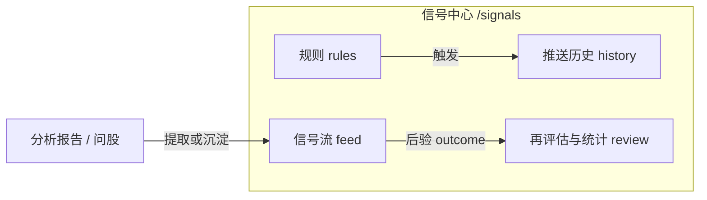

# 06 信号中心

## 页面入口与操作路径

信号中心**不在**主导航的五个一级入口里（首页 / 研究 / 组合 / Agent / 设置）。请用下列方式进入：

| 方式 | 具体路径 |
| --- | --- |
| 通知铃 | 顶栏通知铃 → 某条信号 / 「查看全部」→ `/signals` |
| 命令面板 | `Cmd/Ctrl + K`，搜索「信号」「信号中心」 |
| 直链 | `/signals` |
| 持仓联动 | 持仓页最新 AI 建议卡片 / 链接（常带 `scope=holdings` 或股票上下文） |
| 深链示例 | 见下表 |
| 旧书签 | `/decision-signals`、`/alerts` 会自动映射到对应 Tab，收藏一般不用改 |

### 常用查询参数（可收藏）

| URL 示例 | 含义 |
| --- | --- |
| `/signals` | 默认信号中心 |
| `/signals?tab=feed` | **信号流** |
| `/signals?tab=rules` | **规则** |
| `/signals?tab=rules&createRule=1` | 规则 Tab 并尝试打开新建规则 |
| `/signals?tab=history` | **推送历史**（默认触发记录） |
| `/signals?tab=history&history=notifications` | 推送历史中的通知视角 |
| `/signals?tab=history&trigger=9` | 打开某条触发详情（ID 以实际为准） |
| `/signals?tab=review` | **再评估与统计** |
| `/signals?scope=all` / `holdings` / `watchlist` | 信号范围：全部 / 持仓 / 自选 |
| `/signals?stock=600519` | 带当前股票上下文（最新信号、时间线等） |

信号中心把「分析报告里的建议」沉淀成可查询、可筛选、可反馈、可后验评估的 **Decision Signal（决策信号）**。它是报告之上的结构化索引，**不是自动下单系统**。

> 💡 **这一章解决什么**  
> 信号从哪来、怎么筛、怎么关、四个 Tab 分别干什么、为什么铃铛有时是空的。

> ⚠️ **Decision Signal ≠ 下单指令**  
> 系统**不会**替你下单或调仓。输出仅供研究，**不构成投资建议**。

## 适用场景

| 场景 | 建议路径 |
| --- | --- |
| 刚跑完第一批分析 | `/signals?tab=feed`，状态先看 **active** |
| 想盯某只股票到价 | `/signals?tab=rules&createRule=1`，先试运行再启用 |
| 怀疑通知没发出 | `/signals?tab=history` 看各渠道结果 |
| 想知道历史建议准不准 | `/signals?tab=review` 显式跑后验（样本够再看） |
| 从通知铃点进来 | 深链落到详情 → 读完再决定关闭 / 反馈 |
| 只看持仓相关建议 | `scope=holdings` |

## 四个 Tab 一览

| Tab（界面文案） | URL `tab=` | 作用 | 小白怎么记 |
| --- | --- | --- | --- |
| **信号流** | `feed` | 浏览结构化 AI 建议 | 「建议池」 |
| **规则** | `rules` | 价格 / 涨跌幅 / 指标 / 持仓风险等告警 | 「到价提醒」 |
| **推送历史** | `history` | 规则触发与通知渠道结果 | 「到底有没有发出去」 |
| **再评估与统计** | `review` | 后验引擎与表现统计 | 「事后算分」 |

### 信号流内部视图（进阶）

信号流内还可能切换 **列表 / 最新 / 时间线 / 统计** 等子视图（实现细节以界面为准；部分由 `view=` 等参数控制）。新手先用默认列表即可。

## 信号流：怎么用

### 建议配置（界面侧）

| 项目 | 新手建议 | 说明 |
| --- | --- | --- |
| 状态筛选 | 先只看 **进行中 / active** | 终态之后再翻 |
| 范围 | 有持仓用 **持仓**；否则 **全部** 或 **自选** | 推送历史与部分统计常为**全局**口径 |
| 一次操作 | 先读详情，再关闭 / 反馈 | 不要一上来批量作废 |
| 当前股票 | 顶部选股后再看「最新」与时间线 | 未选股时相关区块会提示引导 |

### 操作步骤

1. 打开 `/signals`（命令面板或通知铃）。  
2. 确认 Tab 为 **信号流**。  
3. 筛选：市场、代码、**动作**、阶段、来源、状态等。  
4. 范围：全部 / 持仓 / 自选。  
5. 打开 **信号详情**，重点看：  
   - **动作（action）**  
   - **置信度（confidence）** 0～1  
   - **期限（horizon）** 如 1d、3d、5d、swing  
   - **价位计划**：入场区间、止损、目标（可能残缺）  
   - **观察 / 失效条件**  
   - **风险摘要、来源报告、决策风格 profile**  
6. 状态变更：关闭、作废、归档等；**终态一般不能直接改回 active**。  
7. 反馈：**有用 / 无用**。  
8. 可选：**手工创建决策信号**（来源固定为手动，不会伪装成分析 / Agent / 告警）。  
9. 可选：**从此信号创建规则**（跳到规则 Tab 并预填）。

### 空状态含义

| 提示 | 通常原因 | 下一步 |
| --- | --- | --- |
| 暂无决策信号 | 还没成功跑完个股分析，或报告未提取出结构化建议 | 去 [03 分析工作台](03-analysis-workbench.md) 跑 1 只 |
| 暂无最新有效信号 | 该股没有 active，或已过期 | 换股 / 放宽状态 / 重新分析 |
| 铃铛为空 | 无新信号且无告警触发 | 正常；先完成分析或建规则 |

## 告警规则

1. 打开 **规则** Tab（`tab=rules`）。  
2. **新建规则**（或 `createRule=1`）。  
3. 选择类型（以界面选项为准），例如：  
   - 价格突破（上破 / 下破）  
   - 涨跌幅达到某百分比  
   - 成交量放大  
   - 均线 / RSI / MACD 等日线技术条件  
   - 持仓止损接近、集中度、回撤等（需已有持仓）  
   - 大盘状态类（进阶）  
4. 设定标的范围（单标的 / 自选 / 持仓等）。  
5. 保存并**启用**。  
6. 若有 **试运行（dry-run）**，先测再长期启用。  
7. 关注**冷却**状态，避免同一条件反复打扰。

### 建议配置

| 项目 | 新手建议 |
| --- | --- |
| 第一条规则 | 单只熟悉股票 + 简单价格条件 |
| 通知渠道 | 先在设置里只开一个你每天会看的渠道 |
| 冷却 | 不要设成 0 |

> 💡 **空规则列表很正常**  
> 系统不会在你没建规则时「自动瞎推」。想盯盘，请主动建至少一条规则。

## 推送历史

| 子视图 | 含义 |
| --- | --- |
| 触发记录（默认） | 规则是否触发、触发对象与时间 |
| 通知视角 | 各渠道投递成功 / 失败（`history=notifications`） |

失败时优先读错误提示（Token 过期、Webhook 无效等），到 [10 设置](10-settings.md) 的 **通知** 做测试推送，而不是反复改同一条规则参数。

## 再评估与统计

| 能力 | 说明 |
| --- | --- |
| **运行后验** | 按安全默认参数补算 active 信号中缺失 / 可重试的 outcome；**不会**默认重算全部或强行覆盖 |
| **表现统计** | 命中 / 未命中 / 无法评估等；默认排除已归档；**全局已复盘口径**，不等于当前列表可见条数 |
| **决策风格重评估** | 对有来源报告的信号生成预览并可保存为新信号；缺报告或风控阻断时会提示 |

> ⚠️ **样本少时不要迷信百分比**  
> 先看样本数，再看胜率。过新信号可能仍在冷却窗口。

## 术语表

| 术语 | 一句话解释 |
| --- | --- |
| **Decision Signal** | 可查询的结构化建议资产 |
| **action（动作）** | buy / add / hold / reduce / sell / watch / avoid / alert 等方向标签 |
| **active** | 仍有效 |
| **expired / invalidated / closed / archived** | 过期、被取代、人工关闭、归档等终态 |
| **horizon（期限）** | 建议时间尺度 |
| **confidence** | 置信度；低则更宜当线索 |
| **invalidation** | 逻辑被打破时应重估的条件 |
| **source_type** | analysis / agent / alert / manual / market_review 等 |
| **decision_profile** | conservative / balanced / aggressive 等决策风格 |
| **scope** | 全部 / 持仓 / 自选过滤 |
| **outcome / 后验** | 事后比对价格路径与建议方向的结果 |
| **dry-run** | 试运行，不产生真实打扰或正式写入（以具体按钮为准） |

## 使用案例

**案例 A：分析后第一次看信号**  
1. 工作台对 `600519` 跑完报告。  
2. 打开 `/signals?tab=feed`，状态选 active。  
3. 打开详情，只读「动作 + 风险 + 失效条件」。  
4. 不符预期 → 反馈「无用」或关闭，**不要**强迫自己执行。

**案例 B：设置到价提醒**  
1. `/signals?tab=rules&createRule=1`。  
2. 价格上破某观察位 → dry-run → 启用。  
3. 触发后看 `tab=history` 是否成功。  
4. 回到信号流结合最新报告再决策。

**案例 C：铃铛是空的**  
从未成功分析、也没建规则 → 铃铛为空是正常现象。先完成 [03](03-analysis-workbench.md) 第一份报告。

**案例 D：统计是全局的**  
你在信号流筛了「持仓」，但 **再评估与统计** 仍显示全局已复盘 outcome——这是设计口径，不是 bug。页面上会有「全局」类说明。

**案例 E：手工补录信号**  
研究笔记想结构化入库 → **创建信号** → 来源固定为手动 → 填写代码、市场、动作与可选价位计划 → 预览后提交。

## 与持仓、报告、问股的关系

| 模块 | 关系 |
| --- | --- |
| 分析报告 | 多数信号从报告提取；报告仍是完整叙述 |
| 持仓 / 组合 | `scope=holdings`；持仓行异步显示最新 active |
| 问股 | 可能产生 `agent` 来源信号 |
| 设置 · 通知 | 渠道与频控决定「推得出去吗」 |
| 回测页 | 批量历史表现；与本页 outcome 引擎互补，见 [09](09-backtest.md) |

## 相关

- [08 阅读报告](08-reading-reports.md)
- [07 持仓](07-portfolio.md)
- [09 回测](09-backtest.md)
- [10 设置](10-settings.md)
- 字段契约：[DecisionSignal 专题](../decision-signals.md)、[告警](../alerts.md)

## 深度：信号流筛选与视图

### 常用筛选维度

| 维度 | 含义 | 新手默认 |
| --- | --- | --- |
| 状态 status | active / closed / archived / expired / invalidated… | 先 active |
| 动作 action | 八态方向 | 全部，再收窄 |
| 市场 market | cn/hk/us… | 你交易的市场 |
| 来源 source_type | analysis / agent / alert / manual / market_review… | 全部 |
| 范围 scope | all / holdings / watchlist | 有持仓用 holdings |
| 股票 stock | 顶部当前股票上下文 | 看时间线前先选股 |

### 信号流子能力（进阶）

| 能力 | 说明 |
| --- | --- |
| 列表 | 默认卡片/行浏览 |
| 最新 | 当前股票的最新 active |
| 时间线 | 单股历史轨迹；范围 30d/90d/180d；可截断到最近 100 条 |
| 统计条 | 与 review 全局统计区分口径 |

时间线操作：选股 → 设范围与状态（仅有效 / 全部历史）→ **查询时间线**。

### 状态变更确认

关闭 / 归档等通常有确认框（`confirmStatusTitle` 等）。**终态不可随意回到 active**——需要新分析产生新信号。

### 手工创建信号字段（摘要）

| 分组 | 字段示例 |
| --- | --- |
| 基础 | 代码、名称、市场、动作、时间 |
| 计划 | 入场上下沿、止损、目标、置信度 |
| 说明 | 证据、理由、失效说明 |
| 约束 | 来源固定 manual；可能触发去重或使相反 active 失效 |

## 深度：规则 Tab 与告警工作区

规则在信号中心 **规则** Tab，底层是 Alerts 工作区能力：

| 步骤 | 细节 |
| --- | --- |
| 新建 | `createRule=1` 或按钮 |
| 类型 | 价格、涨跌幅、量能、指标、持仓风险、大盘状态等（以选项为准） |
| 范围 | 单标的 / 自选 / 持仓 |
| 启用 | 保存后显式启用 |
| 冷却 | 触发后一段时间内不重复吵 |
| 试运行 | 有则先 dry-run |
| 从信号创建 | 信号详情带出标的与上下文 |

推送历史：

| 子视图 | URL 提示 |
| --- | --- |
| 触发 | `tab=history` |
| 通知投递 | `tab=history&history=notifications` |
| 某条触发 | `trigger=<id>` |

## 深度：再评估与后验引擎

| 操作 | 行为（安全默认） |
| --- | --- |
| 运行后验 | 主要补算 active 中缺失/可重试；不默认全量强盖 |
| 结果摘要 | 评估/新建/更新/跳过计数 |
| 表现统计 | hit / miss / unable；**全局已复盘**口径提示 |
| 风格重评估 | 选 profile → 预览 → 可持久化为新信号；缺来源报告会 unsupported；风控可阻断 |

## 深度使用案例

**案例：持仓股只看风险向信号**  
`scope=holdings` + action 含 reduce/sell/alert → 逐条读失效条件 → 回组合页对数量。

**案例：规则响了但手机没消息**  
history 触发成功？notifications 渠道失败？→ 设置测试推送 → 修 Token → 再看冷却是否挡住。

上一篇：[05 问股对话](05-agent-chat.md) · 下一篇：[07 持仓](07-portfolio.md)
