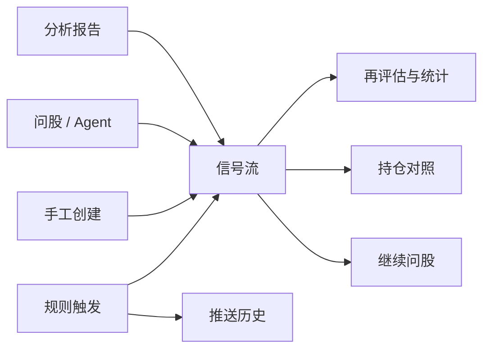
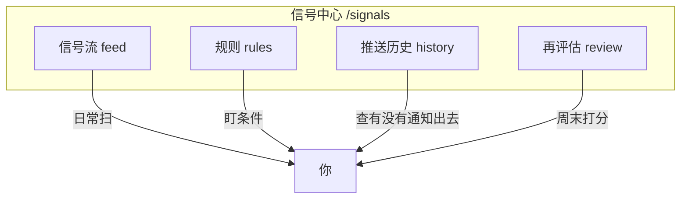
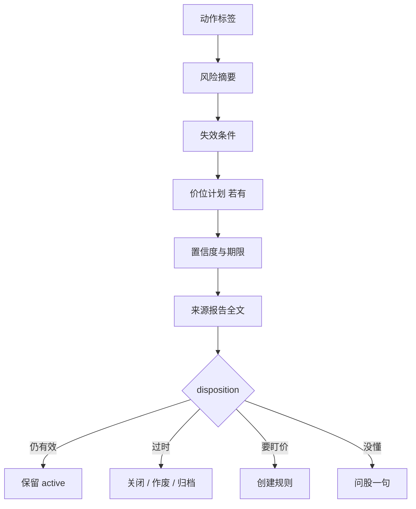
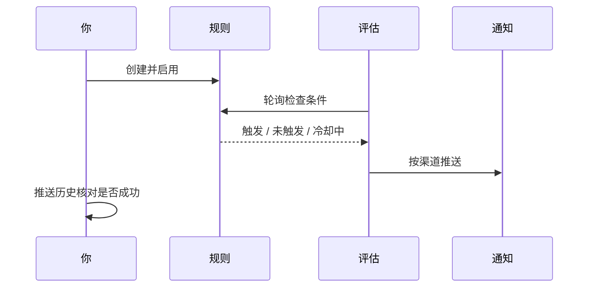
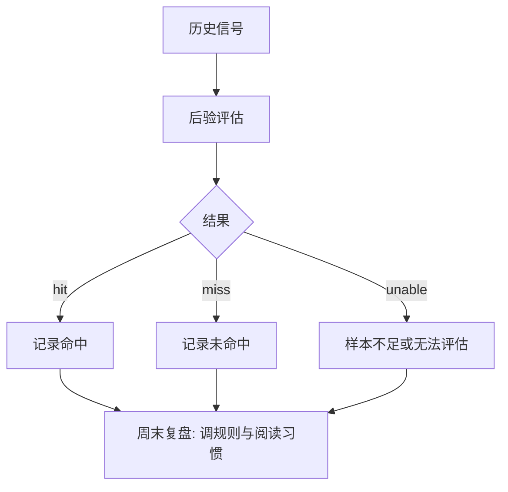

# 06 信号中心

## 本章你会学会

1. 理解信号是 **研究笔记 + 结构化标签**，不是自动下单系统  
2. 在侧栏没有「信号」一级菜单时，用铃铛、命令面板、URL 稳定进入  
3. 掌握四个 Tab：信号流、规则、推送历史、再评估与统计  
4. 会读动作/风险/失效条件，会手工建信号，会建价格类规则并做试运行  
5. 在「通知未送达」、推送过频、周末复盘等场景按清单处理  

> 📘 **一句话定位**  
> 跑完分析后，报告往往很长，不必每天重读全文。信号中心把关键的 **方向性建议** 整理成可筛选、可关闭、可事后评估的记录；也可配置 **到价提醒**，减少长时间盯盘的负担。

关键边界请先记住：

- 信号是 **研究笔记 + 结构化标签**，不是自动交易执行器。  
- 系统 **不会** 替你买入或卖出。  
- 铃铛有时是空的——如果还没成功分析、也没建告警规则，**空是正常的**。

> ⚠️ **研究声明**  
> 所有信号内容仅供学习研究，**不构成投资建议**。关闭一条信号、忽略一条提醒，都是合理的研究决策。

---

## 1. 脑中地图：信号从哪来、到哪去

四个 Tab 可按职责分开理解：

---

## 2. 重要：侧栏可能找不到「信号」

信号中心 **不在** 五个一级导航（首页 / 研究 / 组合 / Agent / 设置）里。

> 🧭 **入口**

| 方式 | 怎么做 |
| --- | --- |
| 通知铃 | 顶栏铃铛 → 「查看全部」或点某条通知 |
| 命令面板 | `Cmd/Ctrl + K`，搜「信号」「信号中心」 |
| 地址栏 | `/signals` |
| 首页 | 点「今日焦点」里的某一行 |
| 持仓页 | 从 AI 建议相关入口跳转（常带持仓范围） |
| 个股/信号详情 | 「从此信号创建规则」等深链 |

### 2.1 常用深链（建议收藏）

| 链接 | 打开什么 |
| --- | --- |
| `/signals?tab=feed` | 信号流（默认也可省略 tab） |
| `/signals?tab=rules` | 规则 |
| `/signals?tab=rules&createRule=1` | 规则并尝试打开新建 |
| `/signals?tab=history` | 推送历史（触发记录） |
| `/signals?tab=history&history=notifications` | 推送历史中的通知侧视图 |
| `/signals?tab=review` | 再评估与统计 |
| `/signals?scope=holdings` | 只看持仓相关 |
| `/signals?scope=watchlist` | 只看自选相关 |
| `/signals?scope=all` | 全部范围 |
| `/signals?stock=600519` | 带上某只股票上下文 |

旧地址 `/decision-signals`、`/alerts` 一般会自动跳到信号中心，老书签通常还能用。

> 💡 **提示**  
> 页面上的 **范围** 过滤器对应 URL 参数 `scope`（如持仓 `holdings`）；**Tab** 对应 `tab`。可组合使用，例如先选持仓范围再打开规则 Tab。筛选是否跨 Tab 联动以当前界面为准。

---

## 3. 四个 Tab 总览

> 🖼️ **配图占位** · `assets/signals-tabs-empty-zh.png`  
> **应配内容**：信号中心：四个 Tab（信号流/规则/推送历史/再评估）+ 信号流空状态或少量演示行。  
> **拍摄要点**：主内容区全貌；侧栏可不入镜。  
> **状态**：待补图（清单：[assets/PLACEHOLDERS.md](assets/PLACEHOLDERS.md)）

| Tab | 路由提示 | 职责 | 什么时候去 |
| --- | --- | --- | --- |
| **信号流** | `tab=feed` | 浏览、筛选、关闭、反馈 | 每天扫一眼 |
| **规则** | `tab=rules` | 到价/涨跌/指标/持仓/大盘等提醒 | 想盯条件时 |
| **推送历史** | `tab=history` | 查触发与通知是否真正发出 | 手机没响时 |
| **再评估与统计** | `tab=review` | 事后验证方向、看 hit/miss | 周末复盘时 |

---

## 4. 信号流：日常最常用的 Tab

### 4.1 建议的首次筛选

1. 状态先只看 **进行中 / active**（还有效的）。  
2. 若你记了持仓，范围选 **持仓**（`scope=holdings`）；否则 **自选** 或 **全部**。  
3. 先不要批量作废——先点进详情读完，再决定关不关。  
4. 来源筛选（若有）：`analysis` / `agent` / `alert` / `market_review` / `manual` 等，用来分辨「谁写的笔记」。

| 范围 scope | 含义 | 适合 |
| --- | --- | --- |
| `all` | 全部 | 广度浏览 |
| `holdings` | 持仓相关 | 日常风控向 |
| `watchlist` | 自选相关 | 观察池维护 |

### 4.2 打开一条详情时的阅读顺序

不用把所有字段背下来。按这个顺序就很够用：

1. **动作（action）**：偏多、观望、减仓……是方向标签。  
2. **风险摘要**：最坏可能发生什么。  
3. **失效条件（invalidation）**：什么情况下这套逻辑该作废。  
4. **观察条件（watch conditions）**（若有）：还在观察什么。  
5. **价位计划**（若有）：入场区间、支撑、压力、止损、目标——可能残缺，残缺时不要脑补。  
6. **置信度 / 期限（confidence / horizon）**：模型有多「敢说」、大概看多长。  
7. **计划质量（plan quality）**：complete / partial / minimal 等——越残缺越要回读原报告。  
8. **来源报告**：点回去读完整叙事。  
9. **状态**：active 还是已结束。

> ✅ **推荐做法**  
> 每天信号流只回答三个问题：还有哪些 active？风险是否变了？有没有触发失效？  
> ❌ **不推荐**  
> 把置信度高低直接当成「对错概率」或仓位比例。

### 4.3 关闭、作废、归档、反馈

| 操作 | 含义（白话） | 注意 |
| --- | --- | --- |
| 关闭 / closed | 你主动结束跟踪 | 确认框请读完 |
| 作废 / invalidated | 逻辑被打破或你判定无效 | 很多终态不能一键改回 active |
| 归档 / archived | 收起来备查 | 与「还在跟」区分 |
| 过期 / expired | 时间到了 | 系统或策略到期 |
| 有用 / 无用反馈 | 阅读标记 + 统计素材 | 建议诚实点，服务未来的自己 |

### 4.4 列表空空的？

| 提示方向 | 常见原因 | 下一步 |
| --- | --- | --- |
| 暂无决策信号 | 还没成功分析，或报告没提出结构化建议 | 去 [分析工作台](03-analysis-workbench.md) 跑 1 只 |
| 该股暂无最新有效信号 | 没有 active，或已过期 | 重新分析，或放宽状态筛选 |
| 铃铛为空 | 既没有新信号，也没有告警触发 | 正常；先完成分析或建规则 |
| 持仓 scope 为空 | 未录入持仓，或持仓标的无信号 | 检查 [持仓](07-portfolio.md) 或改 scope |

### 4.5 手工创建信号

如果你做了独立研究，想把结论结构化存下来：

1. 点 **创建信号**（文案以界面为准）。  
2. 填写代码、市场、动作；可选入场区间、止损、目标、置信度、期限等。  
3. 注意：来源会固定为 **手动（manual）**，不会伪装成「分析生成」。  
4. 预览满意后提交。若命中去重，系统可能提示已有相同信号。  
5. 需要提醒时，再从该信号 **创建规则**，而不是只写在便签里。

> 📘 **概念**  
> **Decision Signal（决策信号）** 是一条可查询的结构化研究记录：带动作、风险、失效、可选价位与来源。它记录的是「研究时点的标签」，不是账户成交。

---

## 5. 规则：让系统在条件满足时提醒你

> 🖼️ **配图占位** · `assets/signals-rules-create-zh.png`  
> **应配内容**：规则 Tab：新建规则表单或创建流程（价格条件示例即可）。  
> **拍摄要点**：可用 createRule 深链；草稿未保存亦可。  
> **状态**：待补图（清单：[assets/PLACEHOLDERS.md](assets/PLACEHOLDERS.md)）

规则 Tab 解决的是：「不必长时间盯盘，到价时再提醒我。」

### 5.1 新建一条简单价格规则（新手默认）

1. 打开 `/signals?tab=rules&createRule=1`，或点新建。  
2. 类型先选最容易懂的 **价格突破（price_cross）**：上破 / 下破。  
3. 标的先写 **一只你熟悉的股票**，目标范围先用单标的，不要一上来「全市场」。  
4. 填价格阈值与严重级别（info / warning / critical）。  
5. 若有 **试运行 / dry-run**，先跑一次看观察值是否合理。  
6. **保存并启用**。  
7. 通知渠道请先保证设置里 **至少有一个能测通** 的渠道（见 [10 设置](10-settings.md)）。

### 5.2 规则类型一览（以界面选项为准）

| 类型（内部名） | 界面常见名 | 白话 |
| --- | --- | --- |
| `price_cross` | 价格突破 | 上破/下破某价 |
| `price_change_percent` | 涨跌幅 | 阶段涨跌超过阈值 |
| `volume_spike` | 成交量放大 | 量能异常放大 |
| `ma_price_cross` | 价格均线穿越 | 价格与均线关系 |
| `rsi_threshold` | RSI 阈值 | RSI 高/低区 |
| `macd_cross` | MACD 金叉/死叉 | 快慢线交叉 |
| `kdj_cross` | KDJ 金叉/死叉 | KDJ 交叉 |
| `cci_threshold` | CCI 阈值 | CCI 阈值 |
| `portfolio_stop_loss` | 组合止损 | 持仓止损相关 |
| `portfolio_concentration` | 组合集中度 | 是否过于集中 |
| `portfolio_drawdown` | 组合回撤 | 回撤超限 |
| `portfolio_price_stale` | 组合价格状态 | 价格陈旧等 |
| `market_light_status` | 大盘红绿灯状态 | 市场状态提醒 |
| `market_light_score_drop` | 大盘红绿灯分数下降 | 分数下滑提醒 |

> ✅ **推荐做法**  
> 只选你能解释给自己听的类型。  
> ❌ **不推荐**  
> 为了「高级」一次建满指标网格，然后被通知淹没。

### 5.3 目标范围（target scope）

| 范围 | 含义 | 新手建议 |
| --- | --- | --- |
| 单标的 `single_symbol` | 一只股票 | **默认从这里开始** |
| 自选 `watchlist` | 观察池批量 | 池子小再考虑 |
| 持仓 `portfolio_holdings` | 持仓维度 | 适合风控类规则 |
| 账户 `portfolio_account` | 账户级 | 进阶 |
| 市场 `market` | 市场级 | 与大盘类规则相关 |

### 5.4 冷却、启停与噪声控制

| 概念 | 白话 | 建议 |
| --- | --- | --- |
| 启用 / 停用 | 是否参与后台评估 | 噪音大时先停用不忙删 |
| 冷却时间 | 触发后一段时间内不再烦人 | **不要设成 0** 还全市场扫描 |
| 试运行 dry-run | 先看算不算触发，不急着正式打扰 | 新建后先试 |
| 严重级别 | 提醒权重 | critical 留给真正关键条件 |
| 删除规则 | 去掉规则定义 | 一般 **不删** 已有触发历史 |

> ⚠️ **注意**  
> 规则列表为空是正常的：未创建规则时，通常不会产生规则类推送。  
> 可以从某条信号点 **从此信号创建规则**，少填一些字段。

### 5.5 使用规则时的分层策略

| 层级 | 做什么 | 不做 |
| --- | --- | --- |
| 浏览层 | 信号流用自选/全部扫研究笔记 | 不要求每条都建规则 |
| 告警层 | 规则只盯持仓 Top 或极关键价位 | 不为宽自选做细网格 |
| 复盘层 | 周末看触发是否有价值 | 不因漏一次通知就删光重来 |

---

## 6. 推送历史：手机没响时来这里

> 🖼️ **配图占位** · `assets/signals-delivery-history-zh.png`  
> **应配内容**：推送历史 Tab：触发记录或通知侧视图（可为空表）。  
> **拍摄要点**：能看出 history Tab；无真实手机号/Token。  
> **状态**：待补图（清单：[assets/PLACEHOLDERS.md](assets/PLACEHOLDERS.md)）

当规则触发或通知发出后，历史 Tab 帮你回答两个问题：

1. **触发了没有？**（规则侧，`history=triggers` 一类视图）  
2. **各个渠道成功了没有？**（通知侧，可能在 `history=notifications`）

### 6.1 排查顺序（请固定）

1. 打开 `/signals?tab=history`，看是否有触发记录。  
2. 若有触发、渠道失败：去 [设置](10-settings.md) 做 **测试推送**，检查 Token/Webhook 是否过期。  
3. 若测试成功但实际没响：看冷却是否激活、规则是否启用、scope/标的是否选错、静默时段是否命中。  
4. 若完全无触发：条件是否从未满足、评估任务是否在跑、dry-run 时是否以为会推正式通知。  
5. 修完后 **等下一次真实触发** 验证；不要删建十遍规则碰运气。

| 现象 | 优先怀疑 | 动作 |
| --- | --- | --- |
| 历史无记录 | 未触发 / 未启用 | 查规则开关与条件 |
| 有触发无通知 | 渠道配置 | 测试推送 |
| 通知重复轰炸 | 冷却过短 / 条件持续满足 | 加冷却、收窄标的 |
| 只有部分渠道失败 | 单一渠道凭证 | 逐个修，不必全盘否定规则 |

---

## 7. 再评估与统计：周末给自己打分

这个 Tab 用来做 **事后验证**：过去的 active 建议，方向后来大概对不对。

### 7.1 使用心态

- 样本很少时，胜率数字 **几乎没有意义**。  
- 过新的信号可能还在冷却/观察窗口，暂时算不了。  
- 统计常常是 **全局已复盘** 口径：你在信号流里筛了「持仓」，统计数字也不一定跟着变——页面若写了「全局」，请相信它，不是 bug。  
- hit / miss / unable（或 neutral）描述的是评估结果，不是道德审判。

### 7.2 常见操作

| 操作 | 说明 |
| --- | --- |
| 运行后验 | 按安全默认补算缺失/可重试结果，一般不会在无必要时空跑全量重算 |
| 看 hit / miss / unable | 命中、未命中、无法评估 |
| 反馈汇总 | 你标过的有用/无用 |
| 决策风格重评估（若有） | 对有来源报告的信号换风格预览；可能被风控阻断或因缺报告而不可用 |

> ✅ **推荐做法**  
> 周末：看 miss 里有没有「当时失效条件其实已出现但你没关信号」——改进的是流程，不是情绪。  
> ❌ **不推荐**  
> 因为短期胜率不好看就清空一切历史、或反过来把 hit 当成未来保证。

---

## 8. 字段与状态速查

### 8.1 状态

| 状态 | 含义 |
| --- | --- |
| `active` | 还有效，默认日常关注 |
| `expired` | 过期 |
| `invalidated` | 逻辑作废 |
| `closed` | 关闭 |
| `archived` | 归档 |

### 8.2 来源类型

| sourceType | 白话 |
| --- | --- |
| `analysis` | 来自分析报告 |
| `agent` | 来自问股等对话沉淀（不保证每句都有） |
| `alert` | 与告警/规则相关 |
| `market_review` | 与大盘复盘相关 |
| `manual` | 你手工创建 |

### 8.3 期限 horizon（示例）

`intraday`、`1d`、`3d`、`5d`、`10d`、`swing`、`long` 等——表示研究视野的大致长度，不是承诺到期必兑现。

### 8.4 计划质量 plan quality

| 值 | 白话 |
| --- | --- |
| `complete` | 价位/条件较完整 |
| `partial` | 部分字段有 |
| `minimal` | 很瘦，更要回读报告 |
| `unknown` | 未知/未标注 |

更完整的字段契约见仓库文档 [DecisionSignal 专题](../decision-signals.md)（偏技术，可选）。

---

## 9. 使用案例

### 案例 A：第一份报告跑完后

「我分析完 600519 了，然后呢？」  
→ 打开信号流，状态选 active，找到这只票，只读动作、风险、失效条件。若完全不符合你的判断，点「无用」或关闭即可，**不必强迫自己执行**。

### 案例 B：我想在 1800 元附近被提醒

→ 规则 → 价格突破 → 试运行 → 启用。触发后先看推送历史是否成功，再决定要不要打开最新报告。

### 案例 C：我明明开了 Telegram，怎么没消息？

→ 推送历史看渠道错误 → 设置里测试推送 → 修好后再等下一次触发。不要先把规则删了重建十遍。

### 案例 D：我只想看持仓的风险向建议

→ `scope=holdings`，动作筛减仓/卖出/提醒类（以界面选项为准），逐条读失效条件，再回 [持仓页](07-portfolio.md) 对数量。

### 案例 E：规则太多，推送过于频繁

先停用一半规则 → 检查冷却/静默时段 → 只保留持仓相关 1～3 条 → 推送历史确认噪声下降。  
宁可少而准，不要「全市场价格网格」。

### 案例 F：周末给自己的信号打分

再评估 Tab → 看 hit/miss/unable → 对明显离谱的标「无用」或关闭 → 回设置只微调策略，不靠删库重来。

### 案例 G：从通知铃一条钻到底

铃铛点某条 → 落地信号或报告 → 决定：关闭 / 建更严规则 / 问股一句。避免铃铛点开又不知所措。

### 案例 H：自选很宽，但规则只盯重仓

信号流可以用自选 scope 浏览；**规则**只给持仓 Top 建。浏览与告警分层，是省打扰的关键。

### 案例 I：手工记录独立研究

你在外部做了笔记 → 手工创建 manual 信号 → 填失效条件 → 再派生一条价格规则。来源诚实，日后统计才干净。

### 案例 J：大盘红绿灯类规则

在已理解大盘复盘语境后，为市场状态建 `market_light_*` 类规则 → dry-run → 小严重级别起步 → 避免与十几个个股规则同时 critical 轰炸。

自动化与反模式亦见 [11 日常工作流](11-daily-workflows.md)。

---

## 10. 常见问题（FAQ）

**Q1：为什么侧栏没有信号？**  
产品把信号中心放在铃铛/命令面板/深链体系里，而不是五大一级导航。用 §2 的入口即可。

**Q2：信号会自动下单吗？**  
不会。没有任何信号 Tab 替代你的交易执行。

**Q3：active 很多是不是系统坏了？**  
更常见是：批量分析后结构化建议变多，或你很少关闭过时信号。学会关闭/归档是日常卫生。

**Q4：规则启用了但从未触发？**  
可能是条件严格、标的停牌/无行情、评估周期未到、或你理解的「突破」与参数方向不一致。先 dry-run。

**Q5：删除规则会删掉历史吗？**  
一般删除规则 **不会** 删除已有触发历史；以界面确认文案为准。

**Q6：再评估的胜率能指导仓位吗？**  
不能简单等同。样本、市场阶段、信号质量都会扭曲数字。它服务于 **复盘研究方法**，不是凯利公式输入。

**Q7：旧书签 `/alerts` 还能用吗？**  
通常会重定向到信号中心；若失效，改收藏 `/signals`。

**Q8：置信度 0.9 是不是十拿九稳？**  
不是。置信度是模型表达的「敢说程度」标签，不是事后正确率承诺。

---

## 11. 自检清单

### 每日（约 5 分钟）

- [ ] 打开信号流，状态以 active 为主  
- [ ] 范围优先持仓或自选，而不是无过滤全部噪声  
- [ ] 逐条扫动作 / 风险 / 失效，不深读全部长文  
- [ ] 过时信号关闭或反馈  
- [ ] 铃铛有红点时能钻到详情并做出 disposition  

### 新建规则时

- [ ] 通知渠道已测试通过  
- [ ] 类型是自己能解释的  
- [ ] 目标范围尽量窄  
- [ ] 已 dry-run  
- [ ] 冷却不是 0（除非你非常清楚后果）  
- [ ] 启用后知道去哪里看推送历史  

### 周末

- [ ] 再评估看 hit/miss/unable 与反馈  
- [ ] 停用噪声规则，而不是只加新规则  
- [ ] 重仓相关信号与持仓数量仍对得上认知  
- [ ] 需要方法论调整时改阅读/规则习惯，而不是清空数据发泄  

---

## 12. 术语（白话）

| 术语 | 含义 |
| --- | --- |
| 信号中心 | `/signals` 统一工作区 |
| Decision Signal | 可查询的一条结构化建议记录 |
| active | 还有效 |
| closed / archived / expired / invalidated | 各种结束态 |
| action | 方向标签（买/加/持/观/减/卖/回避等，以产品枚举为准） |
| horizon | 大概看多长 |
| confidence | 置信度：越高越「敢说」，不代表越正确 |
| invalidation | 逻辑被打破的条件 |
| plan quality | 价位/计划字段完整度 |
| scope | 全部 / 持仓 / 自选 |
| 规则 Rule | 条件满足时提醒你的告警定义 |
| dry-run | 先试跑，不急着正式打扰你 |
| 冷却 cooldown | 触发后的静默间隔 |
| 推送历史 | 触发与通知投递记录 |
| outcome / 后验 | 事后对照价格路径算分 |
| sourceType | 信号来源类型 |

---

## 13. 相关阅读

- [08 阅读报告](08-reading-reports.md) — 从信号跳回全文时的读法  
- [03 分析工作台](03-analysis-workbench.md) — 信号的主要上游  
- [05 问股对话](05-agent-chat.md) — 失效条件说不清时的追问  
- [07 持仓](07-portfolio.md) — 持仓 scope 与风控对照  
- [09 回测](09-backtest.md) — 另一类事后验证视角  
- [10 设置](10-settings.md) — 通知渠道与测试推送  
- [04 大盘复盘](04-market-review.md) — 市场上下文  
- [11 日常工作流](11-daily-workflows.md) — 盯盘链与反模式  
- [DecisionSignal 专题](../decision-signals.md) — 字段级技术契约（可选）  

上一篇：[05 问股对话](05-agent-chat.md) · 下一篇：[07 持仓](07-portfolio.md)
