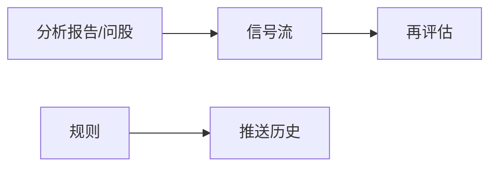

# 06 信号中心

跑完分析后，报告很长，你不可能每天把所有长文重读一遍。信号中心的作用，就是把报告里比较关键的 **方向性建议**，整理成一条条可以筛选、可以关闭、可以事后打分的记录。

- 信号是 **研究笔记 + 结构化标签**，不是自动下单系统。  
- 系统 **不会** 替你买入或卖出。  
- 铃铛有时是空的——如果你还没跑过分析、也没建告警规则，空是正常的。

> ⚠️ 所有信号内容仅供学习研究，**不构成投资建议**。

---

## 重要：侧栏可能找不到「信号」

信号中心 **不在** 五个一级导航（首页 / 研究 / 组合 / Agent / 设置）里。请用下面任一方式进入：

| 方式 | 怎么做 |
| --- | --- |
| 通知铃 | 顶栏铃铛 → 「查看全部」或点某条通知 |
| 命令面板 | `Cmd/Ctrl + K`，搜「信号」「信号中心」 |
| 地址栏 | `/signals` |
| 首页 | 点「今日焦点」里的某一行 |
| 持仓页 | 从 AI 建议相关入口跳转（常带持仓范围） |

常用深链（可以收藏）：

| 链接 | 打开什么 |
| --- | --- |
| `/signals?tab=feed` | 信号流 |
| `/signals?tab=rules` | 规则 |
| `/signals?tab=rules&createRule=1` | 规则并尝试新建 |
| `/signals?tab=history` | 推送历史 |
| `/signals?tab=review` | 再评估与统计 |
| `/signals?scope=holdings` | 只看持仓相关 |
| `/signals?stock=600519` | 带上某只股票上下文 |

旧地址 `/decision-signals`、`/alerts` 一般会自动跳过来，老书签通常还能用。

---

## 四个 Tab，各管一件事

你可以把它想成四个抽屉：

| Tab 名称 | 职责 | 什么时候去 |
| --- | --- | --- |
| **信号流** | 浏览、筛选、关闭、反馈建议 | 每天扫一眼 |
| **规则** | 设置「到价/涨跌/指标」等提醒 | 想盯盘时 |
| **推送历史** | 查「到底有没有通知出去」 | 手机没响时 |
| **再评估与统计** | 事后算算方向准不准 | 周末复盘时 |

---

## 信号流：日常最常用的抽屉

### 建议你怎么设筛选

第一次打开时，推荐：

1. 状态先只看 **进行中 / active**（还有效的）。  
2. 若你记了持仓，范围选 **持仓**；否则选 **全部** 或 **自选**。  
3. 先不要批量作废——先点进详情读完，再决定关不关。

### 打开一条详情时，优先看什么

不用把所有字段背下来。按这个顺序就很够用：

1. **动作（action）**：偏多、观望、减仓……是方向标签。  
2. **风险摘要**：最坏可能发生什么。  
3. **失效条件**：什么情况下这套逻辑该作废。  
4. **价位计划**（若有）：支撑、压力、止损、目标——可能残缺，残缺时不要脑补。  
5. **置信度 / 期限**：模型有多「敢说」、大概看多长。  
6. **来源报告**：点回去读完整叙事。

### 关闭、作废、归档、反馈

- 当你认为这条建议过时了，可以 **关闭 / 作废 / 归档**（具体按钮以界面为准）。  
- 系统通常会弹出确认框：请看清楚，**很多终态不能一键改回 active**。  
- **有用 / 无用** 反馈：帮助你日后看统计，也可以当作自己的阅读标记。

### 列表空空的？

| 提示方向 | 常见原因 | 下一步 |
| --- | --- | --- |
| 暂无决策信号 | 还没成功分析，或报告没提出结构化建议 | 去分析工作台跑 1 只 |
| 该股暂无最新有效信号 | 没有 active，或已过期 | 重新分析，或放宽状态筛选 |
| 铃铛为空 | 既没有新信号，也没有告警触发 | 正常；先完成分析或建规则 |

### 想自己记一条建议？——手工创建

如果你做了独立研究，想把结论结构化存下来：

1. 点 **创建信号**（文案以界面为准）。  
2. 填写代码、市场、动作；可选入场区间、止损、目标、置信度。  
3. 注意：来源会固定为 **手动**，不会伪装成「分析生成」。  
4. 预览满意后提交。若命中去重，系统可能提示已有相同信号。

---

## 规则：让系统在条件满足时提醒你

规则 Tab 解决的是：「别盯盘盯到眼瞎，到价叫我一声。」

### 新建一条简单规则

1. 打开 `/signals?tab=rules&createRule=1`，或点新建。  
2. 类型先选最容易懂的 **价格突破**（上破/下破，以选项为准）。  
3. 标的先写 **一只你熟悉的股票**，不要一上来「全市场」。  
4. 若有 **试运行 / dry-run**，先跑一次看观察值是否合理。  
5. **保存并启用**。  
6. 通知渠道请先保证设置里 **至少有一个能测通** 的渠道（见 [10 设置](10-settings.md)）。

### 使用规则时的温和建议

- **冷却时间** 不要设成 0：否则条件一直满足时，你会收到风暴般的提醒。  
- 规则列表为空是正常的：系统不会在你没建规则时随便推送。  
- 可以从某条信号点 **从此信号创建规则**，少填一些字段。

规则类型还可能包括：涨跌幅、放量、均线/RSI/MACD、持仓风险、大盘状态等——以你界面上的选项为准。选你能解释给自己听的类型，比选「最高级」更重要。

---

## 推送历史：手机没响时来这里

当规则触发或通知发出后，历史 Tab 帮你回答两个问题：

1. **触发了没有？**（规则侧）  
2. **各个渠道成功了没有？**（通知侧，可能在 `history=notifications`）

排查顺序建议：

1. 历史里是否有触发记录。  
2. 若有触发、渠道失败：去设置做 **测试推送**，检查 Token/Webhook 是否过期。  
3. 若测试成功但实际没响：看冷却、范围是否选错、规则是否其实没启用。

---

## 再评估与统计：周末给自己打分，而不是打脸

这个 Tab 用来做 **事后验证**：过去的 active 建议，方向后来大概对不对。

使用心态很重要：

- 样本很少时，胜率数字 **几乎没有意义**。  
- 过新的信号可能还在冷却窗口，暂时算不了。  
- 统计常常是 **全局已复盘** 口径：你在信号流里筛了「持仓」，统计数字也不一定跟着变——页面若写了「全局」，请相信它，不是 bug。

常见操作：

| 操作 | 说明 |
| --- | --- |
| 运行后验 | 按安全默认补算缺失/可重试结果，一般不会无脑重算全部 |
| 看 hit / miss / unable | 命中、未命中、无法评估 |
| 决策风格重评估 | 对有来源报告的信号换风格预览；可能被风控阻断或因缺报告而不可用 |

---

## 使用案例

### 案例 A：第一份报告跑完后

「我分析完 600519 了，然后呢？」  
→ 打开信号流，状态选 active，找到这只票，只读动作、风险、失效条件。若完全不符合你的判断，点「无用」或关闭即可，**不必强迫自己执行**。

### 案例 B：我想在 1800 元附近被提醒

→ 规则 → 价格条件 → 试运行 → 启用。触发后先看推送历史是否成功，再决定要不要打开最新报告。

### 案例 C：我明明开了 Telegram，怎么没消息？

→ 推送历史看渠道错误 → 设置里测试推送 → 修好后再等下一次触发。不要先把规则删了重建十遍。

### 案例 D：我只想看持仓的风险向建议

→ `scope=holdings`，动作筛减仓/卖出/提醒类（以界面选项为准），逐条读失效条件，再回 [持仓页](07-portfolio.md) 对数量。

---

## 术语（白话）

| 术语 | 含义 |
| --- | --- |
| Decision Signal | 可查询的一条结构化建议记录 |
| active | 还有效 |
| closed / archived / expired / invalidated | 各种「结束态」 |
| action | 方向标签（买/加/持/观/减/卖/回避等） |
| horizon | 大概看多长（日内、几天、波段…） |
| confidence | 置信度：越高越「敢说」，不代表越正确 |
| invalidation | 逻辑被打破的条件 |
| scope | 全部 / 持仓 / 自选 |
| dry-run | 先试跑，不急着正式打扰你 |
| outcome / 后验 | 事后对照价格路径算分 |

更完整的字段契约见仓库文档 [DecisionSignal 专题](../decision-signals.md)（偏技术，可选）。

---

## 相关阅读

- [08 阅读报告](08-reading-reports.md)  
- [07 持仓](07-portfolio.md)  
- [09 回测](09-backtest.md)  
- [10 设置](10-settings.md)（通知渠道）  
- [03 分析工作台](03-analysis-workbench.md)  

上一篇：[05 问股对话](05-agent-chat.md) · 下一篇：[07 持仓](07-portfolio.md)
