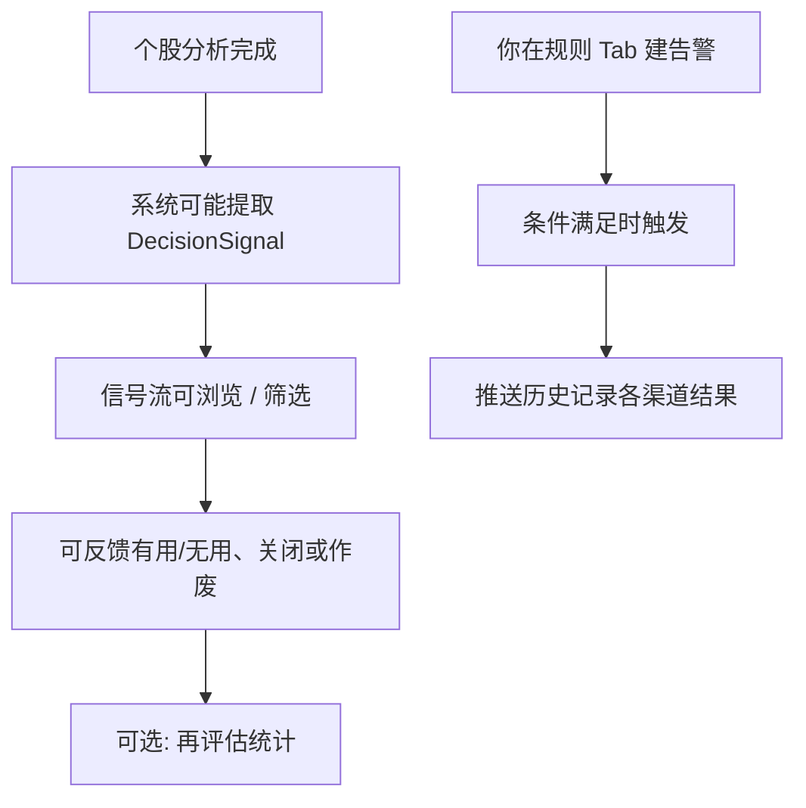

# 06 信号中心

路径：导航 **信号**（常见路由 `/signals`）。

信号中心把两件事放在同一入口里：

1. **决策信号（Decision Signal）**：从分析报告等来源提炼出的、可筛选、可反馈的「建议记录」。  
2. **告警规则（Alert Rule）**：你自己设的条件（价格、涨跌幅等），触发后尝试推送通知。

> 💡 **最重要的一句话**  
> 信号是**可追踪的研究记录**，**不是**自动下单指令。看到「买入」标签，也不等于系统已替你成交。

更完整的字段与 API 契约见专题文档 [DecisionSignal 决策信号](../decision-signals.md)（偏开发 / 进阶）；本章只讲**界面怎么用**。

## 适用场景

| 场景 | 去哪个 Tab | 说明 |
| --- | --- | --- |
| 看最近 AI 还在生效的建议 | **信号流** | 默认关注 `active`（进行中） |
| 价格到某价想被提醒 | **规则** | 自己建规则并启用 |
| 怀疑通知没发出去 | **推送历史** | 看各渠道尝试结果 |
| 想回顾历史建议准不准 | **再评估 / 统计** | 需显式点运行，不是自动天天全量重算 |
| 只想读某一份完整报告 | 分析工作台历史 | 信号中心是索引，不替代全文报告 |

## 四个 Tab 一览

| Tab | 作用 | 小白先做什么 |
| --- | --- | --- |
| **信号流** | 浏览结构化 AI 建议 | 只看 active，打开 1～2 条详情 |
| **规则** | 管理价格、涨跌幅、指标等告警 | 先建一条简单价格规则试跑 |
| **推送历史** | 触发后的通知尝试记录 | 排查「为什么手机没响」 |
| **再评估 / 统计** | 后验评估与汇总 | 有一定历史样本后再用 |

## 信号 vs 告警（容易混）

| 概念 | 从哪来 | 你主要做什么 |
| --- | --- | --- |
| **决策信号** | 多为分析 / Agent 等自动提炼；也可手工创建 | 浏览、筛选、读详情、反馈、改状态 |
| **告警规则** | 你配置的条件 | 新建、启用、看冷却、查推送历史 |
| **通知** | 规则触发或系统推送尝试 | 在推送历史看成功 / 失败 |

顶栏**通知铃**点进去，常常深链到本页某条信号或告警相关视图（见 [01 壳层](01-shell.md)）。

## 信号流怎么用

1. 打开信号中心，确认在 **信号流** Tab。  
2. 默认关注 **进行中（active）** 信号；空列表时先对自选跑一轮 [03 分析](03-analysis-workbench.md)。  
3. 用筛选：市场、代码、动作、阶段、来源等（以界面为准）。  
4. 若有 **范围（scope）** 控件：全部 / 持仓 / 自选。注意：推送历史与部分统计可能仍是**全局**口径，不随 scope 变。  
5. 打开**详情**：看置信度、期限、价位计划、观察条件、风险、来源报告等。  
6. 可将信号标为关闭、作废或归档；**终态一般不能直接改回 active**。  
7. 可对单条点「有用 / 无用」，帮助你自己复盘，不是给券商的下单回执。

### 详情里常见字段（白话）

| 字段 / 概念 | 含义 |
| --- | --- |
| **action（动作）** | 结构化方向：买 / 加 / 持 / 观 / 减 / 卖 / 回避 / 告警等（界面显示翻译后的标签） |
| **confidence（置信度）** | 模型或规则给出的信心程度，不是胜率承诺 |
| **horizon（期限）** | 建议关注的时间尺度（如日内、数日、波段） |
| **entry / stop / target** | 参考入场区间、止损、目标思路；需结合报告与自身风险 |
| **invalidation（失效条件）** | 什么情况下这套逻辑应视为不再成立 |
| **watch_conditions（观察条件）** | 继续跟踪时要盯的条件 |
| **status** | `active` 进行中；`expired` 过期；`invalidated` 作废；`closed` / `archived` 关闭或归档 |
| **source（来源）** | 来自分析、Agent、告警、手工等 |

> ⚠️ **列表动作 vs 完整报告**  
> 列表上的短标签便于扫描；下决策前仍应打开**来源报告**或按 [08 阅读报告](08-reading-reports.md) 读全文。

### 页面上的「当前股票」

部分版本在信号页提供**当前股票**主路径（与高级列表筛选分开）：

- 选定股票后，可看该股 latest active 与时间线。  
- 只改输入框草稿、不提交，通常不会乱触发查询。  
- 时间线有条数上限时，界面会提示「仅展示最近 N 条」，可缩小时间范围。

## 告警规则怎么用

1. 打开 **规则** Tab → 新建规则。  
2. 选择类型（以界面选项为准），例如：  
   - 价格突破 / 跌破  
   - 涨跌幅  
   - 放量、均线 / RSI / MACD 等指标类  
   - 持仓风险、大盘状态等  
3. 设定**标的范围**（单票、自选、持仓等，以选项为准）→ 保存并**启用**。  
4. 若提供 **试运行（dry-run）**，先试再长期启用。  
5. 注意**冷却（cooldown）**提示，避免同一条件短时间反复推送打扰你。

### 建议配置（新手）

| 项目 | 建议 |
| --- | --- |
| 第一条规则 | 单只熟悉股票 + 简单价格条件 |
| 通知渠道 | 先只开一个你能及时看到的渠道（见 [10 设置](10-settings.md)） |
| 阈值 | 冷却保持默认或略长，避免刷屏 |
| 与信号的关系 | 告警是「到价喊你」；决策信号是「分析后的建议索引」——可同时用，但别混成一回事 |

## 推送历史与再评估

| 功能 | 用途 | 注意 |
| --- | --- | --- |
| **推送历史** | 确认是否真正尝试发送、各渠道成功或失败 | 失败时查渠道配置与网络，而不是只重跑分析 |
| **再评估 / 统计** | 对历史信号做后验评估与汇总 | 需按页面提示**显式触发**；默认参数通常偏安全（如只补算部分 active） |
| **运行后验** | 可能二次确认后执行 | 不要在不理解参数时反复「强制全量」 |

> 💡 **统计数字怎么读**  
> 「已复盘样本为 0」时出现空状态是正常的：没有后验结果就没有可展示的胜率类指标。样本少时不要过度解读百分比。

## 使用案例

**案例 A：信号流是空的**  
1. 确认至少成功完成过个股分析。  
2. 筛选是否误设成冷门状态或错误市场。  
3. 对自选跑一轮分析后再回信号流看 `active`。

**案例 B：到价提醒**  
1. 规则 Tab 新建：某代码价格上破某价。  
2. 启用前确认通知渠道已在设置中测通。  
3. 触发后到推送历史核对是否发送成功。

**案例 C：看懂一条买入信号**  
1. 打开详情读 action、风险、失效条件。  
2. 点来源报告，按第 08 章顺序读。  
3. 用问股追问观察点（可选）。  
4. 自行决定是否交易；需要盯盘再配规则。

## 常见问题

**信号中心一直是空的？**  
需要先有成功分析且系统提取了信号；极旧历史不一定回填。先跑自选分析。

**为什么有的建议消失了？**  
可能过期、被相反信号作废、或被标记关闭 / 归档。到筛选里查看非 active 状态。

**手工「创建信号」是什么？**  
部分版本支持手工录入研究记录（来源为 manual），**不会**伪装成分析或告警自动产物。仍不是下单。

**再评估会改历史行情吗？**  
后验是评估记录，不替你改券商持仓；具体引擎能力见专题文档。界面操作以显式确认的参数为准。

## 相关

- [03 分析工作台](03-analysis-workbench.md)
- [08 阅读报告](08-reading-reports.md)
- [07 持仓](07-portfolio.md)（持仓页也可能展示 latest 信号摘要）
- [决策信号专题](../decision-signals.md)
- [告警说明](../alerts.md)

上一篇：[05 问股对话](05-agent-chat.md) · 下一篇：[07 持仓](07-portfolio.md)
