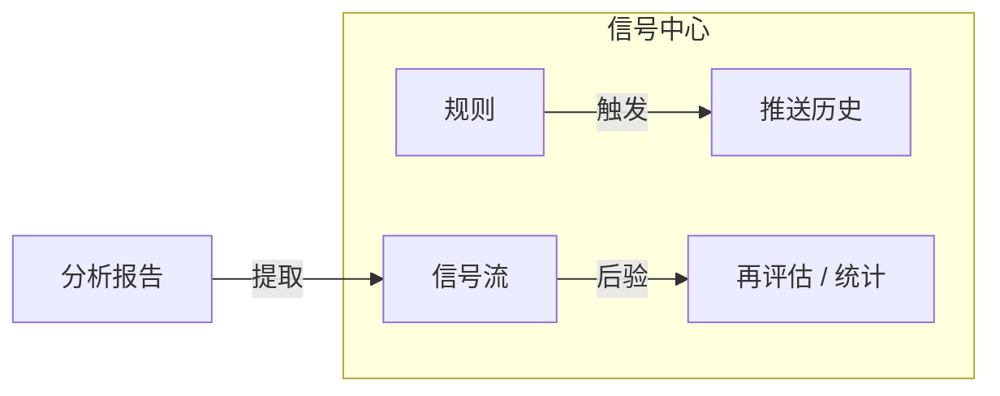

# 06 信号中心

路径：导航 **信号**（常见路由 `/signals`）。

信号中心把「分析报告里的建议」沉淀成可查询、可筛选、可反馈、可后验评估的 **Decision Signal（决策信号）**。它是报告之上的结构化索引，**不是自动下单系统**。

> 💡 **这一章解决什么**  
> 帮你搞清楚：信号从哪来、怎么筛、怎么关、规则和推送历史分别干什么，以及为什么铃铛有时是空的。

## 适用场景

| 场景 | 建议做法 |
| --- | --- |
| 刚跑完第一批分析 | 打开「信号流」，默认看 `active`（仍有效）的条目 |
| 想盯某只股票到价 | 到「规则」新建价格突破规则，先试运行再启用 |
| 怀疑通知没发出 | 到「推送历史」看各渠道成功 / 失败 |
| 想知道历史建议准不准 | 到「再评估 / 统计」显式跑后验（样本够再看） |
| 从通知铃点进来 | 深链会落到某条信号详情，看完再决定是否关闭 |

## 四个 Tab 一览

| Tab | 作用 | 小白怎么记 |
| --- | --- | --- |
| **信号流** | 浏览结构化 AI 建议（买/加/持/观/减/卖/回避等） | 「建议池」 |
| **规则** | 管理价格、涨跌幅、量能、指标、持仓风险等告警 | 「到价提醒」 |
| **推送历史** | 规则触发后各通知渠道的尝试结果 | 「到底有没有发出去」 |
| **再评估 / 统计** | 对历史信号做方向后验与汇总 | 「事后算分」 |

旧链接 `/decision-signals`、`/alerts` 会自动映射到对应 Tab，收藏不用改。

## 信号流：怎么用

### 建议配置（界面侧）

| 项目 | 新手建议 | 说明 |
| --- | --- | --- |
| 状态筛选 | 先只看 `active` | 终态（已关闭 / 已作废 / 已归档）可之后再翻 |
| 范围 | 有持仓时用「持仓」；否则「全部」或「自选」 | 推送历史与部分统计常保持全局口径 |
| 一次操作 | 先读详情，再决定关闭 / 反馈 | 不要一上来批量作废 |

### 操作步骤

1. 默认关注 **进行中（active）** 信号。  
2. 可按市场、代码、动作（action）、阶段、来源等筛选。  
3. 范围控件（若有）可在全部 / 持仓 / 自选之间切换。  
4. 打开详情，重点看：  
   - **动作（action）**：八态方向（buy / add / hold / reduce / sell / watch / avoid / alert）  
   - **置信度（confidence）**：0～1，越高表示模型越「敢说」  
   - **期限（horizon）**：如 1d、3d、5d、swing 等  
   - **价位计划**：入场区间、止损、目标价（可能只有部分）  
   - **观察条件 / 失效条件**：什么情况下建议作废  
   - **风险摘要与来源报告**  
5. 可将信号标记为关闭、作废或归档；**终态一般不能直接改回 active**。  
6. 可对单条反馈「有用 / 无用」，帮助后续统计。

> ⚠️ **术语：Decision Signal ≠ 下单指令**  
> 信号只记录建议、证据摘要、风险与生命周期。系统**不会**替你下单或调仓。是否交易、仓位多大，由你自己决定。

### 字段 / 术语速查

| 术语 | 一句话解释 |
| --- | --- |
| **action（动作）** | 结构化方向标签，比纯文字「操作建议」更适合筛选与回测 |
| **active** | 当前仍视为有效的信号 |
| **expired / invalidated / closed / archived** | 过期、被新相反信号取代、人工关闭、归档等终态 |
| **horizon（期限）** | 建议大致适用的时间尺度（日内 / 数日 / 波段等） |
| **confidence** | 置信度；低置信时更宜当作线索而非执行依据 |
| **invalidation（失效条件）** | 逻辑被打破时应重新评估的条件 |
| **source_type** | 来源：analysis（分析）、agent（问股）、alert（告警）、manual（手工）等 |
| **decision_profile** | 决策风格：conservative / balanced / aggressive（进阶） |

## 告警规则

1. 在 **规则** Tab 新建规则。  
2. 选择类型（以界面选项为准），例如：  
   - 价格突破（上破 / 下破）  
   - 涨跌幅达到某百分比  
   - 成交量放大  
   - 均线 / RSI / MACD 等日线技术条件  
   - 持仓止损接近、集中度、回撤等（需已有持仓）  
   - 大盘红绿灯状态（进阶）  
3. 设定标的范围（单标的 / 自选 / 持仓等）并保存、启用。  
4. 若有 **试运行（dry-run）**，先测再长期启用。  
5. 注意冷却状态，避免同一条件反复打扰。

### 建议配置

| 项目 | 新手建议 |
| --- | --- |
| 第一条规则 | 单只熟悉股票 + 简单价格条件 |
| 通知渠道 | 先只开一个你每天会看的渠道 |
| 冷却 | 不要设成 0；给自己留消化时间 |

> 💡 **空规则列表很正常**  
> 系统不会在你没建规则时「自动瞎推」。想盯盘，请主动建至少一条规则。

## 推送历史与再评估

- **推送历史**：确认是否真正发出、各渠道结果如何；失败时看错误提示，而不是反复改规则。  
- **再评估**：需按页面提示**显式触发**，用于回顾历史信号表现；样本过少时指标没有统计意义。

## 使用案例

**案例 A：分析后第一次看信号**  
1. 在分析工作台对 `600519` 跑完报告。  
2. 打开信号中心 → 信号流 → 状态选 active。  
3. 找到该股条目，打开详情，只读「动作 + 风险 + 失效条件」。  
4. 若与你的判断不符，可反馈「无用」或关闭，而不是强迫自己执行。

**案例 B：设置到价提醒**  
1. 规则 → 新建 → 价格上破某压力位附近。  
2. 先 dry-run，确认观察值合理。  
3. 启用后，触发时看推送历史是否成功。  
4. 触发后回到信号流，结合最新报告再决定是否行动。

**案例 C：铃铛是空的**  
若从未成功跑过个股分析、也没建告警规则，铃铛为空是正常现象。先完成 [03 分析工作台](03-analysis-workbench.md) 的第一份报告。

## 与持仓、报告的关系

| 模块 | 关系 |
| --- | --- |
| 分析报告 | 多数信号从报告中提取；报告仍是完整叙述 |
| 持仓 | 可按「持仓」范围过滤信号；持仓页也会异步显示最新 active 信号 |
| 问股 | 问股也可能产生来源为 agent 的信号（以实际版本为准） |

## 相关

- [08 阅读报告](08-reading-reports.md)
- [07 持仓](07-portfolio.md)
- [10 设置](10-settings.md)（通知渠道）
- 进阶字段契约：[DecisionSignal 专题](../decision-signals.md)

上一篇：[05 问股对话](05-agent-chat.md) · 下一篇：[07 持仓](07-portfolio.md)
