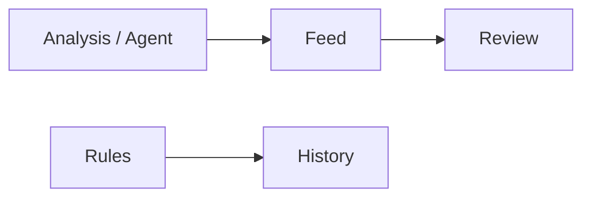

# 06 Signal Center: turn advice into something you can revisit

After analysis, full reports are long. You will not re-read every essay every day. Signal Center stores the important **directional suggestions** as filterable rows you can close, feedback, and score later.

Please set expectations kindly:

- Signals are **research notes with structure**, not an auto-broker.  
- The product **does not** place trades for you.  
- An empty notification bell is normal if you never analyzed and never created rules.

> Research only — **not investment advice**.

---

## Not in the primary sidebar

Signal Center is **not** one of the five primary domains (Home / Research / Portfolio / Agent / Settings). Open it via:

| Way | How |
| --- | --- |
| Notification bell | Top bell → “View all” or a single notification |
| Command palette | `Cmd/Ctrl + K`, search “signal” |
| URL | `/signals` |
| Home | Click a Today focus row |
| Portfolio | AI-suggestion entry (often with holdings scope) |

### Deep links (bookmarkable)

| Link | Opens |
| --- | --- |
| `/signals?tab=feed` | Feed |
| `/signals?tab=rules` | Rules |
| `/signals?tab=rules&createRule=1` | Rules and start create |
| `/signals?tab=history` | Delivery / trigger history |
| `/signals?tab=review` | Review and stats |
| `/signals?scope=holdings` | Holdings-related only |
| `/signals?stock=600519` | Stock context for one code |
| `/signals?tab=history&history=notifications` | Notification delivery sub-view when offered |
| `/signals?tab=history&trigger=<id>` | Focus one trigger id when offered |

Legacy `/decision-signals` and `/alerts` usually redirect. Old bookmarks often still work.

---

## Four tabs, four jobs

| Tab | Job | When |
| --- | --- | --- |
| **Feed** | Browse / filter / close / feedback | Daily glance |
| **Rules** | Price and condition alerts | You want pings |
| **History** | Did notify fire? | Phone silent |
| **Review & stats** | Post-hoc scorecard | Weekend |

---

## Feed: daily drawer

**Beginner filters**

1. Status: **active** only at first.  
2. Scope: **holdings** if you bookkeep; otherwise all or watchlist.  
3. Read a detail before bulk-close.

**In a detail, read in this order:** action → risks → invalidation → plan prices (may be partial) → confidence / horizon → source report.

Closing / archiving usually confirms; terminal states often cannot return to active. Useful / not-useful feedback helps later stats and your own memory.

### Empty states

| Hint | Common cause | Next step |
| --- | --- | --- |
| No decision signals | No successful analysis yet, or no structured advice extracted | Run one symbol on the Workbench |
| No active signal for this stock | Expired or closed only | Re-analyze or widen status filters |
| Empty bell | No new signals and no rule fires | Normal; analyze first or create a rule |

**Manual create** stores your own structured note with source fixed as **manual** (not disguised as analysis-generated).

---

## Rules: gentle alerting

1. Open `/signals?tab=rules&createRule=1` or use New.  
2. Prefer a simple **price break** first.  
3. Target **one familiar symbol**, not “whole market”.  
4. **Dry-run** when offered.  
5. Save and enable.  
6. Ensure **one** notification channel tests green in Settings first.

Keep cooldowns sane (zero cooldown + always-true conditions → spam). Empty rule lists are fine—the product will not invent alerts. Create-from-signal saves typing. Other rule types (percent move, volume, indicators, portfolio risk, market status) follow the live option list.

---

## Delivery history

Answer two questions:

1. Did the rule fire?  
2. Did each channel succeed? (may use `history=notifications`)

Triage order: history for a trigger → Settings **test push** if channel failed → only then recreate rules. Check cooldown and enablement before deleting and remaking ten times.

---

## Review & stats

Weekend honesty tool, not a face-slap machine.

- Few samples → ignore flashy win rates.  
- New rows may still be in a **cooling window**.  
- Stats are often **global reviewed** even if the feed filter is holdings—believe the on-page “global” note.

Run outcomes with safe defaults; hit / miss / unable buckets; style reassess may need a source report or may be risk-blocked.

---

## Use cases

**A — After first report** — active feed → read action / risk / invalidation → feedback if it is not for you.  
**B — Ping near a level** — price rule → dry-run → enable → verify history on fire.  
**C — Telegram silent** — history channel errors → Settings test → fix token.  
**D — Holdings risk only** — `scope=holdings` + defensive actions → cross-check [Portfolio](07-portfolio_EN.md).

---

## Glossary

| Term | Meaning |
| --- | --- |
| Decision Signal | Structured, queryable advice record |
| active | Still in force |
| closed / archived / expired / invalidated | Terminal-style end states |
| action | Direction label (buy / add / hold / watch / reduce / sell / avoid, as listed) |
| horizon | Rough time horizon |
| confidence | How bold the model is — not guaranteed correctness |
| invalidation | When the thesis is broken |
| scope | all / holdings / watchlist |
| dry-run | Trial evaluation without full noise |
| outcome | Post-hoc score against price path |

Field contracts (optional, technical): [decision-signals.md](../decision-signals.md).

---

## Related

- [08 Reading reports](08-reading-reports_EN.md)  
- [07 Portfolio](07-portfolio_EN.md)  
- [09 Backtest](09-backtest_EN.md)  
- [10 Settings](10-settings_EN.md)  

Previous: [05 Agent chat](05-agent-chat_EN.md) · Next: [07 Portfolio](07-portfolio_EN.md)
