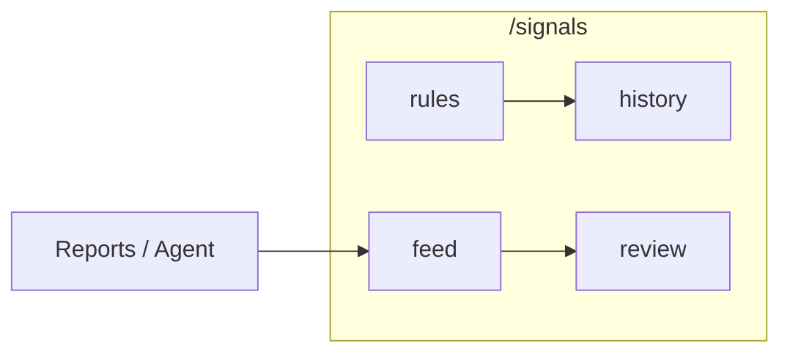

# 06 Signal Center

## Entry points and paths

Signal Center is **not** one of the five primary sidebar items (Home / Research / Portfolio / Agent / Settings). Use:

| Method | Path |
| --- | --- |
| Notification bell | Bell → item or “View all” → `/signals` |
| Command palette | Search “signal” / “Signal Center” |
| Direct URL | `/signals` |
| Portfolio links | Often `scope=holdings` or stock context |
| Legacy bookmarks | `/decision-signals`, `/alerts` map into tabs |

### Useful query params

| Example | Meaning |
| --- | --- |
| `/signals` | Default |
| `/signals?tab=feed` | **Feed** |
| `/signals?tab=rules` | **Rules** |
| `/signals?tab=rules&createRule=1` | Rules + open create |
| `/signals?tab=history` | **Delivery history** (triggers) |
| `/signals?tab=history&history=notifications` | Notification delivery view |
| `/signals?tab=history&trigger=9` | Trigger detail |
| `/signals?tab=review` | **Review & stats** |
| `/signals?scope=all` / `holdings` / `watchlist` | Scope filter |
| `/signals?stock=600519` | Stock context (latest / timeline) |

A **Decision Signal** is a structured, filterable suggestion derived mainly from reports. It is **not** an order router.

> ⚠️ Not investment advice. The product **does not** place trades for you.

## When to use

| Scenario | Path |
| --- | --- |
| After first analyses | `tab=feed`, status **active** |
| Price alerts | `tab=rules&createRule=1` |
| “Did notify fire?” | `tab=history` |
| Scorecard | `tab=review` (enough samples) |
| From the bell | Read detail → close / feedback |
| Holdings only | `scope=holdings` |

## Four tabs

| Tab (UI) | `tab=` | Role |
| --- | --- | --- |
| **Feed** | `feed` | Structured suggestions |
| **Rules** | `rules` | Price / change / indicator / portfolio risk alerts |
| **History** | `history` | Triggers and channel delivery |
| **Review & stats** | `review` | Outcome engine and stats |

Feed may offer sub-views (list / latest / timeline / stats). Beginners can stay on the default list.

## Feed workflow

| Setting | Beginner default |
| --- | --- |
| Status | **active** first |
| Scope | **holdings** if you bookkeep; else all / watchlist |
| Actions | Read detail before close / feedback |
| Stock context | Select a symbol for latest + timeline blocks |

### Steps

1. Open `/signals`.  
2. Tab **Feed**.  
3. Filter market, symbol, **action**, phase, source, status.  
4. Scope: all / holdings / watchlist.  
5. Open **details**: action, confidence (0–1), horizon, plan prices, invalidation, risks, source report, profile.  
6. Status: close / invalidate / archive — **terminal states usually cannot return to active**.  
7. Feedback: useful / not useful.  
8. Optional: **manual create** (source fixed as manual).  
9. Optional: **create rule from signal**.

### Empty states

| Message | Typical cause | Next |
| --- | --- | --- |
| No signals | No successful stock analysis yet | [03 Workbench](03-analysis-workbench_EN.md) |
| No latest active | None for this symbol | Re-analyze or widen status |
| Empty bell | No new signals/alerts | Normal until you run analysis or rules |

## Rules

1. Tab **Rules**.  
2. Create rule (or `createRule=1`).  
3. Choose type (price break, % move, volume, MA/RSI/MACD, portfolio risk, market state, … as listed).  
4. Scope symbols.  
5. Save and **enable**.  
6. Prefer **dry-run** when offered.  
7. Respect **cooldown**.

Empty rule lists are normal — the product does not invent alerts for you.

## Delivery history

| View | Meaning |
| --- | --- |
| Triggers (default) | Whether rules fired |
| Notifications | Per-channel success/failure |

On failure, fix channels in [10 Settings](10-settings_EN.md) with a test push before retuning rules endlessly.

## Review & stats

| Capability | Note |
| --- | --- |
| **Run outcomes** | Safe defaults: active only, fill missing/retryable, no mass force-overwrite |
| **Stats** | Hit / miss / n/a; often **global reviewed** scope — not “rows currently visible in feed” |
| **Style reassess** | Preview/save needs source report; may be risk-blocked |

Few samples → ignore flashy percentages.

## Glossary

| Term | Meaning |
| --- | --- |
| **Decision Signal** | Queryable structured suggestion |
| **action** | buy / add / hold / reduce / sell / watch / avoid / alert … |
| **active** | Still live |
| **expired / invalidated / closed / archived** | Terminal-ish states |
| **horizon** | Time scale of the suggestion |
| **confidence** | 0–1 model boldness |
| **invalidation** | When the thesis breaks |
| **source_type** | analysis / agent / alert / manual / market_review … |
| **decision_profile** | conservative / balanced / aggressive … |
| **scope** | all / holdings / watchlist |
| **outcome** | Post-hoc evaluation |
| **dry-run** | Trial without full side effects (per control) |

## Use cases

**A — First look after analysis**  
Analyze `600519` → feed active → read action + risk + invalidation → feedback if wrong for you.

**B — Price alert**  
Create rule → dry-run → enable → history on fire → re-read report before acting.

**C — Empty bell**  
No analysis, no rules → empty is expected.

**D — Global stats**  
Feed filtered to holdings but review stats stay global — by design when labeled so.

**E — Manual signal**  
Create signal → source manual → fill code/market/action → submit.

## Related modules

Reports extract most signals; Portfolio shows async latest active; Agent may create agent-sourced rows; Settings owns channels; Backtest is a sibling scorecard ([09](09-backtest_EN.md)).

## Related

- [08 Reading reports](08-reading-reports_EN.md)
- [07 Portfolio](07-portfolio_EN.md)
- [09 Backtest](09-backtest_EN.md)
- [10 Settings](10-settings_EN.md)
- [DecisionSignal docs](../decision-signals.md), [Alerts](../alerts.md)

Prev: [05 Agent chat](05-agent-chat_EN.md) · Next: [07 Portfolio](07-portfolio_EN.md)
