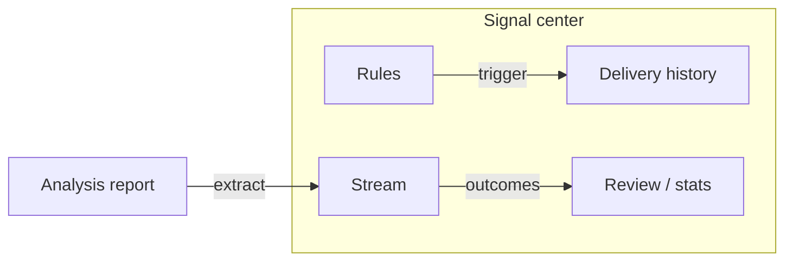

# 06 Signal center

Path: **Signals** (often `/signals`).

The signal center turns suggestions from analysis reports into queryable, filterable, feedback-ready **Decision Signals**. They are a structured index on top of reports — **not an auto-trading system**.

> 💡 **What this chapter solves**  
> Where signals come from, how to filter them, how to close them, what Rules and Delivery history are for, and why the notification bell can be empty.

## When to use it

| Scenario | Suggested approach |
| --- | --- |
| Just finished first analyses | Open **Stream**, focus on `active` items |
| Want a price alert | Create a price-cross rule under **Rules**; dry-run before enabling |
| Suspect a notification failed | Check **Delivery history** per channel |
| Want historical hit rate | Use **Review / stats** with enough samples |
| Opened from the notification bell | You land on a detail row — read, then close or keep |

## Four tabs

| Tab | Purpose | Plain meaning |
| --- | --- | --- |
| **Stream** | Browse structured AI suggestions | “Advice pool” |
| **Rules** | Price, percent, volume, indicator, portfolio-risk alerts | “Remind me when…” |
| **Delivery history** | Channel attempt results after a trigger | “Did it actually send?” |
| **Review / stats** | Post-hoc direction evaluation | “Scorecard later” |

Legacy paths `/decision-signals` and `/alerts` map into these tabs.

## Signal stream

### Recommended UI settings for beginners

| Item | Suggestion | Why |
| --- | --- | --- |
| Status | Start with `active` only | Terminal states can wait |
| Scope | Holdings if you bookkeep; else All / Watchlist | Delivery history may stay global |
| Actions | Read detail before bulk close | Avoid accidental mass invalidation |

### Steps

1. Default focus: **active** signals.  
2. Filter by market, symbol, action, phase, source, and related fields.  
3. Scope controls (when present) switch All / Holdings / Watchlist.  
4. Open detail and prioritise:  
   - **action** — eight-way direction (`buy` / `add` / `hold` / `reduce` / `sell` / `watch` / `avoid` / `alert`)  
   - **confidence** — 0–1  
   - **horizon** — e.g. `1d`, `3d`, `5d`, `swing`  
   - price plan (entry band, stop-loss, target — may be partial)  
   - watch / invalidation conditions  
   - risk summary and source report  
5. Mark closed, invalidated, or archived; terminal states usually cannot return to active.  
6. Optionally mark useful / not useful.

> ⚠️ **Decision Signal ≠ order ticket**  
> Signals record advice, evidence summaries, risk, and lifecycle. The product does **not** place trades for you.

### Glossary

| Term | Plain meaning |
| --- | --- |
| **action** | Structured direction label (better for filters and backtests than free text alone) |
| **active** | Still considered in force |
| **expired / invalidated / closed / archived** | Terminal or inactive states |
| **horizon** | Rough time scale the suggestion is about |
| **confidence** | Model confidence; low values are clues, not mandates |
| **invalidation** | Conditions under which the thesis should be revisited |
| **source_type** | `analysis`, `agent`, `alert`, `manual`, … |
| **decision_profile** | Style: conservative / balanced / aggressive (advanced) |

## Alert rules

1. Create a rule under **Rules**.  
2. Choose a type (as listed in the UI): price cross, percent move, volume spike, daily indicators (MA / RSI / MACD, …), portfolio risk, market-light status, and others when available.  
3. Set target scope, save, and enable.  
4. Prefer **dry-run** before long-running enablement.  
5. Respect cooldown indicators to avoid spam.

### Beginner defaults

| Item | Suggestion |
| --- | --- |
| First rule | One familiar symbol + simple price condition |
| Channels | One channel you actually read daily |
| Cooldown | Do not set to zero |

> 💡 **Empty rule list is normal**  
> Nothing is “auto-pushed” until you create rules.

## Delivery history and review

- **Delivery history** shows whether sends were attempted and channel outcomes.  
- **Outcome review** is explicitly triggered from the UI; thin samples are not meaningful scorecards.

## Use cases

**A — First look after analysis**  
Run `AAPL` on the workbench → Signals → Stream → `active` → open detail → read action + risk + invalidation only.

**B — Price alert**  
Rules → price above a resistance zone → dry-run → enable → verify Delivery history on trigger.

**C — Empty bell**  
No successful single-stock analysis and no rules yet → empty bell is expected. Finish [03 Analysis workbench](03-analysis-workbench_EN.md) first.

## Related

- [08 Reading reports](08-reading-reports_EN.md)
- [07 Portfolio](07-portfolio_EN.md)
- [10 Settings](10-settings_EN.md)
- Advanced contract: [Decision signals](../decision-signals.md) (Chinese technical doc)

Previous: [05 Agent chat](05-agent-chat_EN.md) · Next: [07 Portfolio](07-portfolio_EN.md)
